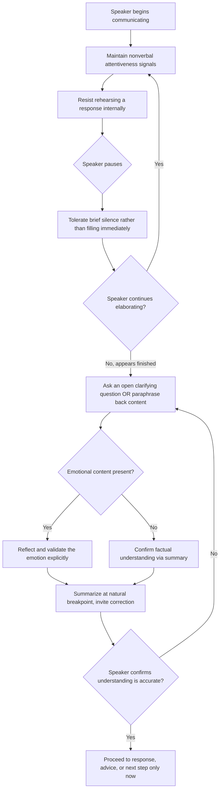

## Active and Empathetic Listening Techniques

### Overview

Active and empathetic listening are structured techniques for receiving and processing another person's communication with full attention and genuine understanding, as distinct from passive hearing or "listening" that is actually spent formulating a response. In executive and rhetorical contexts, listening is not a passive counterpart to speaking but an active communicative skill in its own right — one that shapes negotiation outcomes, conflict resolution, team trust, and leadership credibility as much as any speaking or writing technique covered elsewhere in this curriculum.

---

### Core Distinction: Active Listening vs. Empathetic Listening

While often used together, these represent related but distinct skill sets:

| Dimension | Active Listening | Empathetic Listening |
| --- | --- | --- |
| Primary focus | Accurate comprehension of content and intent | Emotional attunement and validation |
| Core technique | Paraphrasing, clarifying questions, summarizing | Reflecting feelings, withholding judgment, validating experience |
| Typical use case | Problem-solving, negotiation, technical discussions | Conflict resolution, performance conversations, personal disclosure |
| Risk if overused alone | Can feel clinical or transactional without emotional attunement | Can feel unfocused or fail to extract needed information without structure |

Effective listeners combine both, calibrating the balance to the situation — a technical status update calls for more active-listening structure, while a conflict or personal disclosure calls for more empathetic-listening attunement.

---

### Core Technique: Paraphrasing and Reflective Restatement

Restating the speaker's message in the listener's own words, offered back to the speaker for confirmation or correction. This serves two functions simultaneously: verifying the listener's understanding is accurate, and signaling to the speaker that they have been heard.

**Example**

> Speaker: "I feel like every time I raise a concern in the team meeting, it just gets waved off and we move on to the next agenda item."
>
> Reflective restatement: "It sounds like you're feeling unheard when you bring up concerns — like they're acknowledged but not actually addressed. Is that right?"

**Distinction from mere repetition**: effective paraphrasing rephrases in different words and captures underlying meaning or emotion, rather than simply repeating the speaker's own phrasing back verbatim, which can feel mechanical or insincere.

---

### Core Technique: Clarifying Questions

Open-ended questions that invite elaboration rather than closed yes/no questions that can prematurely narrow or redirect the conversation. Clarifying questions serve to deepen understanding before responding, rather than moving quickly to advice, judgment, or rebuttal.

**Example**

- Closed (narrows prematurely): "Are you upset about the deadline?"
- Open (invites elaboration): "What's been the most frustrating part of this project for you?"

---

### Core Technique: Withholding Premature Judgment or Advice

A common failure in listening, particularly for leaders accustomed to problem-solving, is moving immediately to advice or solutions before the speaker has finished expressing the full scope of their concern. Premature advice-giving can signal that the listener is more interested in resolving the conversation than genuinely understanding it, and can cause the speaker to feel dismissed even when the advice offered is substantively sound.

**Practical technique**: deliberately delaying any solution-oriented response until the speaker has been invited to fully elaborate — sometimes through an explicit check-in ("Is there more you want to share before I respond?") rather than assuming the first pause is an invitation to advise.

---

### Core Technique: Reflecting Emotion, Not Just Content

Empathetic listening specifically attends to and names the emotional content of a message, not only its factual content — validating the feeling itself as legitimate, independent of whether the listener agrees with the speaker's factual interpretation of events.

**Example**

> Speaker: "I've worked overtime for three weeks straight and nobody even acknowledged it."
>
> Content-only response (incomplete): "Okay, I'll look into adjusting the workload."
>
> Emotion-reflecting response: "That sounds exhausting, and it makes sense you'd feel frustrated if that effort went unnoticed. Let's look at the workload together."

**Important distinction**: reflecting and validating an emotion is not the same as agreeing with every factual claim or conclusion the speaker draws from that emotion — a listener can validate that frustration is a legitimate and understandable response while still exploring the situation's facts separately.

---

### Core Technique: Nonverbal Attentiveness Signals

Listening is communicated partly through nonverbal cues that signal engagement, independent of verbal responses:

- Sustained, natural eye contact (calibrated to cultural context)
- Open posture (uncrossed arms, facing the speaker)
- Minimal encouragers ("mm-hmm," slight nodding) that signal continued attention without interrupting
- Avoiding distraction behaviors (checking phone, looking away, multitasking) that signal divided attention regardless of verbal engagement

---

### Core Technique: Summarizing at Natural Breakpoints

Periodically offering a brief summary of what has been understood so far, particularly in longer or more complex conversations, both confirms accurate understanding and gives the speaker an opportunity to correct any misunderstanding before the conversation proceeds further.

**Example**

> "Let me make sure I've got this right — the main issues are the deadline pressure, feeling like your input isn't being incorporated, and uncertainty about the project's priority relative to other work. Did I miss anything?"

---

### Core Technique: The Listening-Silence Discipline

Comfortable tolerance of brief silences after a speaker pauses, rather than immediately filling the gap, often allows the speaker to continue elaborating on something they were still processing or hesitant to share. Premature filling of silence can cut off content the speaker was working up to saying.

This mirrors, in a listening context, the silence-tolerance principle covered in impromptu-speaking composure techniques — but here it applies to holding space for the *other* person to continue, rather than the listener's own delivery.

---

### Common Barriers to Effective Listening

| Barrier | Description | Correction |
| --- | --- | --- |
| Rehearsing a response while the speaker talks | Listener's attention shifts from understanding to formulating rebuttal/reply | Deliberately delay response formulation until speaker finishes |
| Selective listening (filtering for confirming information) | Listener hears only what confirms existing views, missing disconfirming detail | Actively listen for points that challenge or complicate the initial impression |
| Emotional reactivity | Listener's own emotional response to content interferes with accurate reception | Use brief internal pause/breathing before responding to charged content |
| Assumption of understanding without verification | Listener believes they understood without checking, leading to miscommunication | Use paraphrasing and summarizing to verify understanding explicitly |
| Solving instead of understanding | Listener jumps to advice before fully understanding the concern | Withhold advice until the speaker has been invited to fully elaborate |

---

### Listening Technique Application Flow

---

### Executive Communication Application

- **Performance and difficult conversations**: empathetic listening (reflecting emotion, withholding premature judgment) is critical to maintaining trust when delivering or receiving sensitive feedback
- **Negotiation and stakeholder management**: active listening (paraphrasing, clarifying questions) surfaces underlying interests (see stakeholder alignment techniques) that stated positions alone would not reveal
- **Team and direct-report relationships**: consistent listening discipline, more than any single formal communication, shapes perceived leadership trustworthiness over time
- **Crisis and conflict de-escalation**: silence tolerance and emotion-reflection are often more effective at reducing tension than immediate problem-solving or defensive responses
- Effectiveness depends on genuine attentional discipline and calibration to context (technical vs. emotional conversations); outcomes may vary by relationship, cultural context, and the listener's consistency of practice over time.

---

**Related Topics**

- Identifying underlying interests vs. stated positions (stakeholder alignment)
- Silence discipline in hostile question management (the speaking-side counterpart)
- Nonverbal communication and composure signals
- Conflict resolution and difficult conversation frameworks
- Feedback delivery techniques in leadership communication
- Cultural variation in listening norms (eye contact, silence tolerance, directness)