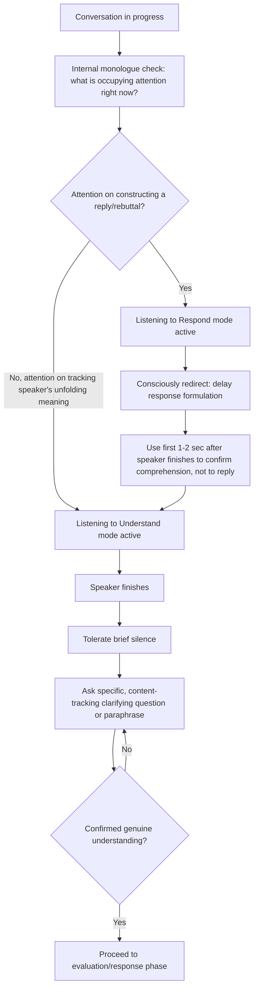

## Listening to Understand Versus Listening to Respond

### Overview

This distinction identifies two fundamentally different cognitive modes a listener can occupy during any conversation: listening to understand (fully processing the speaker's meaning, context, and intent before formulating any reaction) versus listening to respond (dividing attention between receiving the speaker's message and constructing a reply, rebuttal, or solution before the speaker has finished). The distinction matters because these two modes are neurologically and attentionally close to mutually exclusive — the cognitive resources spent rehearsing a response are resources not available for accurately processing what is still being said, producing systematically degraded comprehension even when the listener believes they are fully attentive.

---

### Core Principle: The Two Modes Are Not Simply a Matter of Effort

Listening to respond is not merely "lower-effort" listening — it can involve significant cognitive activity, just directed at response construction rather than comprehension. A listener in this mode may be highly engaged, yet still miss significant portions of what is said, because attention has bifurcated between reception and generation. This makes the failure mode subtle: the listener often does not experience themselves as failing to listen, since they are cognitively active throughout.

---

### Diagnostic Signals: Which Mode Is Occurring

| Signal | Listening to Understand | Listening to Respond |
| --- | --- | --- |
| Response timing | Brief pause after speaker finishes, response reflects full content | Response begins almost immediately, sometimes overlapping speaker's final words |
| Content of response | Addresses the speaker's actual stated concern, including nuance | Addresses a partial or generic version of the concern, often the first point raised |
| Follow-up questions | Naturally arise from genuine curiosity about unclear points | Rare; listener proceeds to their prepared response regardless of ambiguity |
| Response to being interrupted mid-thought | Notices and can recover the interrupted point | May not notice the interruption disrupted the speaker's intended point |
| Emotional attunement | Reflects or acknowledges emotional content alongside factual content | Focuses on factual/actionable content, often missing emotional subtext entirely |

---

### Core Technique: The Internal Monologue Check

A practical self-diagnostic: during a conversation, briefly notice what is occupying internal attention. If the internal monologue is largely occupied with "here's what I'm going to say next" or "here's why they're wrong about X," listening-to-respond mode is likely active. If internal attention is occupied with genuinely following and processing the speaker's unfolding meaning, listening-to-understand mode is more likely active.

This self-check is most useful when practiced as an ongoing habit rather than a one-time technique, since the shift between modes can happen unconsciously and repeatedly within a single conversation.

---

### Core Technique: Delaying Response Formulation Deliberately

A structural technique for shifting from listening-to-respond toward listening-to-understand: deliberately postponing any response construction until after the speaker has fully finished, including tolerating a brief silence after they stop speaking before beginning to formulate a reply (rather than using the speaker's final sentences as the cue to begin composing).

**Practical marker**: using the first 1–2 seconds after the speaker finishes speaking exclusively to confirm internally "did I fully understand that?" before shifting attention to "what should I say?"

---

### Core Technique: Distinguishing Generative Silence From Awkward Silence

A common obstacle to adopting listening-to-understand is discomfort with the brief silence that naturally follows genuine comprehension-first listening (since response formulation has been deliberately delayed rather than run in parallel). Reframing this silence as a signal of genuine listening — rather than an awkward gap to be filled quickly — is often necessary to sustain the practice, since many conversational norms implicitly reward quick response timing as a proxy for engagement.

---

### Core Technique: Question-Driven Comprehension Checking

Rather than treating silence alone as sufficient evidence of understanding, listening-to-understand mode is often reinforced through active comprehension-checking — asking a clarifying or elaborating question that could only be generated by someone who was tracking the speaker's specific meaning, rather than a generic follow-up applicable to almost any statement.

**Example**

- Generic follow-up (consistent with listening-to-respond): "Okay, so what do you want me to do about it?"
- Specific follow-up (consistent with listening-to-understand): "You mentioned this has happened in the last three sprint reviews specifically — is that timing significant, or has it actually been going on longer?"

---

### Why Listening to Respond Is the Cognitive Default Under Certain Conditions

Several common conditions tend to push listeners toward the respond-mode default, even among generally skilled communicators:

- **Time pressure**: a perceived need to reply quickly encourages parallel response-drafting during reception
- **High-stakes or adversarial contexts**: perceived need to defend a position activates rebuttal-construction rather than comprehension
- **Status or expertise asymmetry**: a listener who considers themselves more expert than the speaker may unconsciously shift to evaluative/corrective listening rather than open comprehension
- **Familiarity assumption**: believing a topic or person's likely point is already known can cause premature response formulation before the actual, possibly different, point is fully stated

[Inference] These contributing conditions are widely discussed in communication and psychology literature on listening behavior; their relative influence varies by individual and context and is not precisely quantifiable here.

---

### Core Technique: Reserving Evaluation for After Full Comprehension

Listening-to-understand does not require withholding all critical judgment indefinitely — it requires sequencing judgment *after* comprehension is complete, rather than running evaluation and judgment in parallel with reception (which is functionally identical to listening-to-respond, since evaluative judgment typically generates a reactive response in progress).

**Practical technique**: consciously separating the conversation into two phases even when not explicitly stated aloud — an understanding phase (paraphrase, clarify, confirm) followed distinctly by an evaluation/response phase — rather than merging them.

---

### Common Failure Patterns

| Failure Pattern | Consequence | Correction |
| --- | --- | --- |
| Beginning to speak before the speaker fully finishes | Speaker's final point is missed or cut off | Practice deliberate pause tolerance before responding |
| Responding to a generic or partial version of the concern | Speaker feels misunderstood even if a substantive-sounding response is given | Use specific, content-tracking follow-up questions to verify genuine comprehension |
| Treating post-speech silence as awkward and filling it reflexively | Comprehension-first listening is abandoned in favor of quick response cues | Reframe brief silence as evidence of genuine processing, not a gap to avoid |
| Merging evaluation and reception into one continuous process | Functionally equivalent to listening-to-respond even if response is delayed slightly | Explicitly sequence understanding before evaluation |
| Assuming familiarity with the likely point before it's fully stated | Premature response formulation misses genuine, possibly unexpected nuance | Suspend the "I already know what they'll say" assumption until they finish |

---

### Mode-Shift Diagnostic Flow

---

### Executive Communication Application

- **One-on-ones and performance conversations**: consistently listening to understand, rather than to respond, is strongly associated with perceived trustworthiness and psychological safety in leadership relationships
- **Negotiation and conflict situations**: listening-to-respond mode is a common failure under adversarial pressure, causing negotiators to miss genuine shifts in the other party's position while focused on rebuttal
- **Cross-functional meetings**: status or expertise asymmetries (e.g., a senior leader listening to a junior team member) are a common trigger for premature evaluative listening; deliberate correction improves the quality of information reaching leadership
- **Crisis and high-stakes conversations**: time pressure strongly pushes toward listening-to-respond by default, making deliberate comprehension-first discipline especially valuable and especially difficult in these contexts
- Effectiveness of this distinction depends on individual self-awareness and consistent practice; the shift between modes can be subtle and difficult to notice in real time, and outcomes may vary by context and relationship.

---

**Related Topics**

- Active and empathetic listening techniques as the applied skill set built on this distinction
- Silence discipline and tolerance in both listening and speaking contexts
- Identifying underlying interests vs. stated positions in negotiation
- Psychological safety and trust-building in leadership communication
- Cognitive load and attention allocation in dual-task processing
- Managing hostile or unexpected questions (adversarial-context listening challenges)