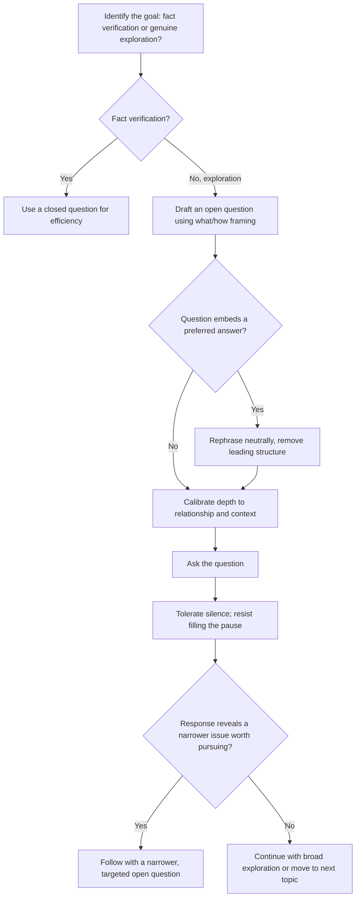

## Asking Powerful, Open-Ended Questions

### Overview

Powerful, open-ended questions are questions deliberately constructed to invite genuine reflection, elaboration, and disclosure, rather than confirming an assumption, narrowing toward a predetermined answer, or eliciting a simple factual response. This is a distinct rhetorical and dialogic skill from listening technique itself — it concerns what the questioner actively contributes to shape the depth and direction of a conversation, commonly emphasized in executive coaching, facilitation, negotiation, and leadership development contexts.

---

### Core Distinction: Open-Ended vs. Closed Questions

| Dimension | Closed Question | Open-Ended Question |
| --- | --- | --- |
| Structure | Typically answerable with yes/no or a single fact | Requires elaboration, reasoning, or reflection |
| Example | "Are you happy with the new process?" | "What's your experience been with the new process?" |
| Effect on conversation | Narrows quickly, can feel like an interrogation if repeated | Opens space for the respondent to shape the answer's direction |
| Appropriate use | Confirming specific facts, verifying details | Exploring understanding, motivation, or unstated concerns |

Closed questions are not inherently wrong — they are the correct tool for verifying specific facts efficiently. The skill lies in recognizing when the goal is genuine exploration (requiring open questions) versus specific confirmation (where closed questions are appropriate and more efficient).

---

### Core Technique: The "What" and "How" Preference Over "Why"

Open-ended questions beginning with "what" or "how" tend to invite descriptive, exploratory elaboration, while "why" questions — despite also being grammatically open-ended — can trigger defensiveness, since "why" often implicitly requests justification for a decision or action, which the respondent may interpret as an implicit challenge.

**Example**

- More likely to trigger defensiveness: "Why did you approach it that way?"
- Less likely to trigger defensiveness, same underlying inquiry: "What led you to approach it that way?" or "How did you land on that approach?"

[Inference] This "why" vs. "what/how" distinction is a commonly taught principle in coaching and facilitation training; the degree of defensiveness triggered varies by relationship, tone, and cultural context rather than being a fixed linguistic rule.

---

### Core Technique: Questions That Widen Before They Narrow

A structured questioning sequence — often used in coaching and consulting — begins with broad, open exploratory questions before narrowing toward specific, actionable ones. Narrowing too early risks anchoring the conversation on the first specific issue raised, at the expense of surfacing a more significant underlying concern that a broader opening question might have revealed.

**Example sequence**

1. Wide: "What's been on your mind about this project lately?"
2. Narrower: "You mentioned the timeline a few times — what specifically about it concerns you?"
3. Narrowest/actionable: "If we moved the deadline by two weeks, would that address the concern?"

---

### Core Technique: Avoiding Leading Questions

A leading question embeds the questioner's preferred answer within its structure, which can produce a response that reflects social pressure to agree rather than the respondent's genuine view — undermining the purpose of asking in the first place.

**Example**

- Leading (embeds the desired answer): "Don't you think this approach makes the most sense?"
- Neutral, open: "What do you think of this approach?"

---

### Core Technique: The Powerful Question as a Perspective-Shift Tool

Beyond simple information-gathering, certain open-ended questions are specifically designed to shift a respondent's frame of reference — surfacing assumptions, reframing a problem, or prompting reflection the respondent had not previously articulated. These are frequently used in executive coaching and facilitation.

**Examples of perspective-shifting questions**:

- "What would need to be true for this to work?"
- "What's the cost of not addressing this?"
- "If you were advising someone else in this exact situation, what would you tell them?"
- "What assumption are we making here that might not be true?"

These questions function rhetorically similar to Socratic questioning — prompting the respondent to generate their own insight through structured inquiry, rather than being told a conclusion directly, which often produces greater buy-in and retention than a directly stated observation would.

---

### Core Technique: Silence After Asking (Question-Delivery Pairing)

A powerful open-ended question is frequently undermined if the questioner fills the silence that follows it before the respondent has had time to genuinely reflect — particularly for questions that require more processing time than a simple factual question would. This connects directly to the silence-tolerance principle covered in listening technique: the question's power depends on the questioner's willingness to hold space for a considered answer rather than rescuing an uncomfortable pause with a follow-up or self-answer.

---

### Core Technique: Calibrating Question Depth to Relationship and Context

Not every context calls for maximally open, reflective questioning — depth and openness should be calibrated to psychological safety, time available, and the relationship's existing trust level.

| Context | Appropriate Question Depth |
| --- | --- |
| First meeting with a new stakeholder | Moderate openness; avoid overly personal or challenging questions before trust is established |
| Established trusted relationship (direct report, close colleague) | Higher openness; deeper perspective-shifting questions are more likely to land well |
| Time-constrained status update | Narrower, more targeted open questions ("what's blocking progress?") rather than broad exploratory ones |
| Coaching or development conversation | Maximum openness; explicitly designed space for reflection |

---

### Common Failure Patterns

| Failure Pattern | Consequence | Correction |
| --- | --- | --- |
| Closed questions used for exploration | Conversation narrows prematurely, misses underlying concerns | Use "what" or "how" open questions when genuine exploration is the goal |
| Overuse of "why" questions | Triggers defensiveness, respondent feels challenged rather than invited to reflect | Reframe as "what led to..." or "how did..." |
| Leading questions embedding the desired answer | Response reflects social pressure rather than genuine view | Rephrase neutrally, removing the embedded preference |
| Narrowing too quickly | Misses a more significant issue a broader question might have surfaced | Sequence from wide to narrow deliberately |
| Filling silence immediately after asking | Respondent doesn't have time to reflect; shallow or rushed answer results | Practice deliberate silence tolerance after asking |
| Mismatched depth for the relationship/context | Overly personal question in low-trust context feels intrusive; overly shallow question in a coaching context wastes the opportunity | Calibrate question depth to trust level and context |

---

### Question-Crafting Workflow

---

### Executive Communication Application

- **Coaching and development conversations**: perspective-shifting open questions are a core technique for developing direct reports' own problem-solving capacity rather than simply providing answers
- **Negotiation and stakeholder discovery**: open, "what/how"-framed questions surface underlying interests (see stakeholder alignment) more effectively than closed or leading questions
- **Board and leadership discussions**: well-calibrated open questions from a facilitator or chair can surface genuine disagreement or concern that might otherwise remain unstated in a status-report-style meeting
- **Conflict resolution**: neutral, non-leading open questions reduce defensiveness and create space for a fuller account of each party's perspective before problem-solving begins
- Effectiveness depends on genuine curiosity (rather than questions used performatively), appropriate calibration to trust level, and willingness to tolerate silence after asking; outcomes may vary by relationship, context, and cultural norms around directness.

---

**Related Topics**

- Active and empathetic listening techniques as the receiving-side counterpart to powerful questioning
- Listening to understand versus listening to respond
- Identifying underlying interests vs. stated positions in negotiation and stakeholder alignment
- Socratic questioning and classical dialectical method
- Executive coaching frameworks and facilitation technique
- Psychological safety and trust-building in leadership conversations