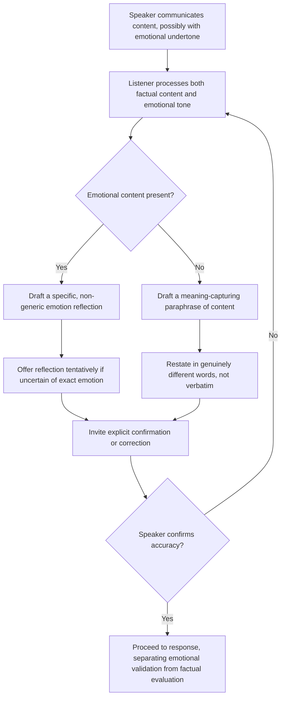

## Paraphrasing and Reflective Listening

### Overview

Paraphrasing and reflective listening are core dialogic techniques in which a listener restates the speaker's message — its content, its underlying meaning, or its emotional tone — back to the speaker, in the listener's own words, before proceeding further in the conversation. Though often treated as a single skill, paraphrasing and reflective listening represent related but distinct techniques with different primary targets: paraphrasing focuses on accurately restating content and meaning, while reflective listening focuses more specifically on naming and validating emotional experience. Both serve the dual function of verifying comprehension and signaling genuine attention to the speaker.

---

### Core Distinction: Paraphrasing vs. Reflective Listening

| Dimension | Paraphrasing | Reflective Listening |
| --- | --- | --- |
| Primary target | Factual content and stated meaning | Emotional tone and underlying feeling |
| Typical trigger phrase | "So what you're saying is..." | "It sounds like you're feeling..." |
| Function | Confirms accurate comprehension of information | Validates the legitimacy of an emotional experience |
| Risk if used alone | Can feel clinical, misses emotional subtext | Can feel presumptuous if emotion is misnamed or absent |

In practice, skilled listeners often combine both within a single response, reflecting emotional content alongside restating the factual substance.

---

### Core Technique: Restating in the Listener's Own Words

Effective paraphrasing requires genuine rephrasing rather than verbatim repetition of the speaker's own words. Rephrasing in different language demonstrates that the listener has processed and internalized the meaning, not simply retained the sounds; verbatim repetition can feel mechanical, parroting, or even subtly mocking.

**Example**

> Speaker: "I keep getting pulled into last-minute requests that blow up my whole week."
>
> Weak (verbatim repetition): "So you keep getting pulled into last-minute requests that blow up your whole week."
>
> Strong (genuine paraphrase): "It sounds like unplanned, urgent asks are consistently derailing the work you'd actually planned to do."

---

### Core Technique: Capturing Underlying Meaning, Not Just Literal Content

Effective paraphrasing goes beyond restating literal facts to capture the implied significance or conclusion the speaker is communicating, which is often not stated explicitly in a single sentence but built across several.

**Example**

> Speaker: "The client called twice this week asking about the timeline. Last month it was just once. And now they're cc'ing their VP."
>
> Literal restatement (misses the point): "The client called you twice this week and cc'd their VP."
>
> Meaning-capturing paraphrase: "It sounds like you're picking up on escalating concern from the client — like this might be building toward a bigger issue if it's not addressed soon."

---

### Core Technique: The Confirmation Loop

Paraphrasing should be explicitly offered back to the speaker for confirmation or correction, rather than stated as a settled conclusion — this preserves the speaker's authority over their own meaning and allows misunderstanding to be caught immediately rather than compounding through the rest of the conversation.

**Example — explicit confirmation invitation**

> "Let me check I've got this right: the core issue isn't the workload itself, but the lack of notice before it lands on you. Is that accurate, or am I missing something?"

---

### Core Technique: Reflecting Emotion With Precision, Not Generic Labels

Reflective listening is more effective when the named emotion is specific rather than generic — "frustrated" and "overwhelmed" and "disrespected" are meaningfully different experiences, even if they might superficially co-occur, and naming the wrong one can feel like being misunderstood rather than heard.

**Example**

- Generic (imprecise): "That sounds frustrating."
- More precise, based on context: "It sounds like you're feeling disrespected — like your time isn't being valued by whoever keeps making these last-minute asks."

**Practical technique**: when uncertain which specific emotion is present, reflective listening can be offered tentatively rather than asserted confidently — e.g., "It sounds like there might be some frustration there, or maybe something more like feeling disrespected — what's it feel like for you?" — which invites the speaker to correct or refine the reflection.

---

### Core Technique: Reflecting Without Necessarily Agreeing

A frequently misunderstood aspect of reflective listening: validating that an emotion is legitimate and understandable is distinct from agreeing with every factual conclusion or interpretation the speaker has drawn. A listener can reflect "that sounds genuinely frustrating" while still holding a different view on, for example, whether the other party in a dispute acted in bad faith — the emotional reflection and the factual/interpretive evaluation are separable.

---

### Core Technique: Paraphrasing to De-escalate Conflict

In adversarial or tense conversations, paraphrasing the other party's position back to them — accurately and without editorializing — before responding is a well-documented technique for reducing defensiveness, since it demonstrates the listener genuinely engaged with the position rather than dismissing it prematurely. This is distinct from agreement; a listener can accurately paraphrase a position they ultimately intend to disagree with.

**Example**

> "Before I respond, let me make sure I understand your position: you're saying the delay isn't just inconvenient, it's actually going to cost you the contract with your downstream client. Is that the core concern?"

This step, performed before any rebuttal or counter-argument, often reduces the emotional intensity of the ensuing exchange, since the other party has confirmation their position was heard accurately.

---

### Common Pitfalls in Paraphrasing and Reflective Listening

| Pitfall | Consequence | Correction |
| --- | --- | --- |
| Verbatim repetition instead of genuine rephrasing | Feels mechanical or insincere | Restate meaning in genuinely different words |
| Missing the underlying point across multiple statements | Paraphrase feels accurate but shallow, misses the real concern | Listen for cumulative meaning, not just the most recent sentence |
| Stating the paraphrase as a settled fact rather than inviting correction | Speaker's authority over their own meaning is undermined | Frame paraphrase as a check, inviting confirmation or correction |
| Naming the wrong emotion confidently | Speaker feels misunderstood rather than heard | Offer emotional reflections tentatively when uncertain |
| Treating emotional validation as agreement with all facts/conclusions | Listener feels pressured to agree with everything to avoid seeming dismissive | Separate emotional validation from factual/interpretive evaluation explicitly |
| Skipping paraphrase entirely in tense conversations | Missed de-escalation opportunity; defensiveness escalates | Paraphrase the other party's position before responding, even in disagreement |

---

### Paraphrasing and Reflection Workflow

---

### Executive Communication Application

- **Performance and difficult conversations**: precise emotional reflection, paired with clear separation from factual agreement, allows leaders to validate a direct report's experience without necessarily conceding every point of interpretation
- **Negotiation and conflict de-escalation**: paraphrasing the other party's position before responding is a standard technique for reducing adversarial tension and demonstrating genuine engagement
- **Cross-functional stakeholder conversations**: meaning-capturing paraphrase (rather than literal restatement) often surfaces the actual underlying concern behind a stated complaint, informing more effective resolution
- **One-on-ones and coaching**: the confirmation loop builds trust over time by consistently demonstrating that the listener's understanding is checked rather than assumed
- Effectiveness depends on genuine attentiveness and willingness to be corrected when a paraphrase or emotional reflection misses the mark; outcomes may vary by relationship, emotional intensity, and cultural context around directness in naming feelings.

---

**Related Topics**

- Active and empathetic listening techniques as the broader skill category this technique belongs to
- Listening to understand versus listening to respond
- Asking powerful, open-ended questions as a complementary dialogic technique
- Conflict de-escalation and difficult conversation frameworks
- Identifying underlying interests vs. stated positions in negotiation
- Nonverbal attentiveness signals supporting reflective listening