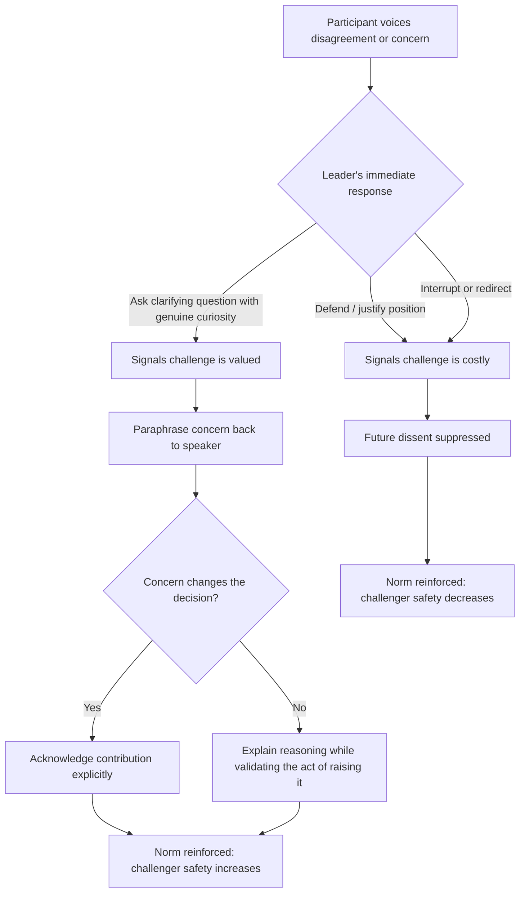

## Creating Psychological Safety in Dialogue

### Definition and Conceptual Foundation

Psychological safety in dialogue refers to a shared belief that a communicative space is safe for interpersonal risk-taking — voicing disagreement, admitting error, asking questions, or proposing unconventional ideas without fear of humiliation, retaliation, or reputational damage. The construct originates from organizational behavior research (notably Amy Edmondson's team-level studies) but applies directly to dyadic and group dialogue in executive and rhetorical contexts. In dialogic communication theory, psychological safety is the precondition that allows genuine dialogue (as opposed to debate or discussion) to occur, since dialogue requires participants to suspend certainty and expose provisional thinking.

Psychological safety is distinct from:

- **Comfort** — safety permits productive discomfort (challenge, disagreement); it does not eliminate it.
- **Trust** — trust is typically dyadic and accumulates over time; psychological safety is a property of the group climate at a given moment and can shift rapidly.
- **Permissiveness** — safety does not mean an absence of standards, accountability, or critique.

### Theoretical Grounding in Dialogic Communication

Dialogic theory (drawing on Martin Buber's I-Thou relation and Mikhail Bakhtin's dialogism) treats communication as a mutual, co-constructed process rather than a transmission of fixed messages. Within this frame, psychological safety functions as the enabling condition for:

- **Genuine reciprocity** — each party treats the other as a subject with legitimate perspective, not an object to be persuaded or managed.
- **Suspension** — participants hold their own assumptions provisionally, visible for inspection, rather than defending them as fixed positions.
- **Emergence** — meaning is produced collaboratively during the exchange, rather than one party depositing predetermined conclusions into the other.

Without psychological safety, exchanges collapse into what William Isaacs calls "skilled discussion" or debate: participants defend positions, listen to rebut, and withhold uncertainty to protect face.

### Core Components

**Key Points**

- **Inclusion safety**: participants feel their presence and identity are accepted.
- **Learner safety**: participants feel free to ask questions, experiment, and make mistakes.
- **Contributor safety**: participants feel free to offer ideas and input.
- **Challenger safety**: participants feel free to question the status quo, including the leader's position, without retribution.

These four levels (adapted from Timothy Clark's stage model) are cumulative — challenger safety, the level most relevant to executive dialogue and dissent, cannot be reliably established without the prior three.

### Mechanisms Executives Use to Build Psychological Safety

**Framing moves**

- Naming the exchange explicitly as exploratory ("I want to think out loud here, not decide") to lower the stakes of any single utterance.
- Reframing failure or disagreement as informative data rather than a threat to competence or authority.

**Listening behaviors**

- Sustained, non-interrupting attention signals that the speaker's contribution will be received before it is evaluated.
- Paraphrasing and reflecting content back before responding, which demonstrates comprehension prior to judgment.
- Withholding the urge to immediately solve or correct, which preserves the speaker's sense of ownership over the issue.

**Vulnerability modeling**

- Leaders who disclose their own uncertainty, mistakes, or incomplete knowledge first lower the perceived risk for others (a reciprocity effect well documented in group communication research).
- This must be calibrated: excessive or performative vulnerability can undermine perceived competence, so disclosure should be proportionate and purposeful.

**Structural interventions**

- Explicit turn-taking protocols (e.g., round-robin input) that prevent dominance by high-status voices.
- Anonymous or written input channels prior to open discussion, reducing the social cost of dissenting first.
- Separating idea generation from evaluation in time, so early contributions are not immediately judged.

**Response to dissent or error**

- Responding to disagreement with curiosity ("say more about that") rather than justification or counter-argument signals that challenge is welcome.
- Publicly and proportionately acknowledging when a challenge changed a decision, reinforcing that the behavior was rewarded.

### The Role of the Amygdala and Threat Response

[Inference] Executive communication training frequently draws on the concept that perceived social threat (status loss, exclusion, incompetence exposure) activates a physiological threat response that narrows cognitive bandwidth and suppresses openness — this is a widely cited but simplified extension of neuroscience findings (e.g., David Rock's SCARF model: Status, Certainty, Autonomy, Relatedness, Fairness) rather than a precise clinical claim. Practically, this means communicative moves that protect a listener's sense of status, predictability, autonomy, relational belonging, and fairness reduce defensive reactivity and increase the likelihood of open dialogue.

### Illustration: Safety-Building Cycle in Dialogue

(svg_diagram)

<svg xmlns="http://www.w3.org/2000/svg" viewBox="0 0 760 460" font-family="Helvetica, Arial, sans-serif">
<text x="380" y="30" text-anchor="middle" font-size="18" font-weight="bold" fill="#1a1a1a">Psychological Safety Cycle in Dialogue (svg_diagram)</text>
<circle cx="380" cy="240" r="150" fill="none" stroke="#c9c9c9" stroke-width="2" stroke-dasharray="4,4" />

<rect x="300" y="70" width="160" height="60" rx="10" fill="#2f6f4f" />
<text x="380" y="95" text-anchor="middle" font-size="13" fill="white" font-weight="bold">1. Leader Signals</text>
<text x="380" y="113" text-anchor="middle" font-size="12" fill="white">Openness / Vulnerability</text>

<rect x="530" y="180" width="170" height="60" rx="10" fill="#2f6f4f" />
<text x="615" y="205" text-anchor="middle" font-size="13" fill="white" font-weight="bold">2. Participant Takes</text>
<text x="615" y="223" text-anchor="middle" font-size="12" fill="white">Interpersonal Risk</text>

<rect x="480" y="330" width="170" height="60" rx="10" fill="#2f6f4f" />
<text x="565" y="355" text-anchor="middle" font-size="13" fill="white" font-weight="bold">3. Contribution Met</text>
<text x="565" y="373" text-anchor="middle" font-size="12" fill="white">with Curiosity, Not Judgment</text>

<rect x="110" y="330" width="170" height="60" rx="10" fill="#2f6f4f" />
<text x="195" y="355" text-anchor="middle" font-size="13" fill="white" font-weight="bold">4. Risk Reinforced</text>
<text x="195" y="373" text-anchor="middle" font-size="12" fill="white">as Safe and Valuable</text>

<rect x="60" y="180" width="170" height="60" rx="10" fill="#2f6f4f" />
<text x="145" y="205" text-anchor="middle" font-size="13" fill="white" font-weight="bold">5. Group Norm Shifts</text>
<text x="145" y="223" text-anchor="middle" font-size="12" fill="white">Toward Greater Candor</text>

<path d="M460,110 Q560,140 585,180" fill="none" stroke="#555" stroke-width="2" marker-end="url(#arrow)" />
<path d="M610,240 Q600,300 570,330" fill="none" stroke="#555" stroke-width="2" marker-end="url(#arrow)" />
<path d="M480,370 Q380,410 285,365" fill="none" stroke="#555" stroke-width="2" marker-end="url(#arrow)" />
<path d="M170,330 Q130,280 140,240" fill="none" stroke="#555" stroke-width="2" marker-end="url(#arrow)" />
<path d="M170,180 Q230,120 300,100" fill="none" stroke="#555" stroke-width="2" marker-end="url(#arrow)" />

<text x="380" y="245" text-anchor="middle" font-size="12" fill="#888" font-style="italic">reinforcing</text>

<text x="380" y="262" text-anchor="middle" font-size="12" fill="#888" font-style="italic">loop</text>

</svg>

### Illustration: Decision Flow for Responding to Dissent

### Practical Techniques for Executive Dialogue

**Example**

A senior leader opens a strategy review with: "I'm not confident this roadmap is right — I'd rather hear where it breaks now than after we've committed budget. Please poke holes." This single framing move performs three safety functions simultaneously: it models vulnerability (leader admits uncertainty), it explicitly authorizes challenger behavior, and it reframes critique as a contribution to shared goals rather than an attack on the leader's competence.

**Contrast — a safety-eroding version**: "This roadmap is final, but I want your buy-in." This framing signals that dissent is procedurally unwelcome even while inviting input, producing what is sometimes called "contrived participation" — the appearance of dialogue without its substance.

Additional techniques:

- **Naming the ground rules aloud** before high-stakes dialogue (e.g., "no idea gets shot down in the first pass").
- **Using tentative language** ("one option might be...") rather than declarative certainty when soliciting input, which lowers the perceived cost of disagreement.
- **Separating person from position** explicitly in language ("the plan has a gap" rather than "you missed something").
- **Closing the loop publicly** on how input was used, even when it was not adopted, to sustain the perception that contribution is heard.

### Common Failure Modes

- **False urgency**: compressing timelines to foreclose genuine dialogue while claiming to have consulted stakeholders.
- **Punishing the messenger**: even subtle non-verbal cues (sighing, curt tone) after a challenge can undo weeks of safety-building.
- **Asymmetric safety**: safety extended to agreement but withdrawn upon disagreement, which participants detect quickly and calibrate future behavior against.
- **Safety theater**: inviting input through formal channels (surveys, town halls) without visible behavioral change afterward, which erodes credibility of future invitations.

### Measurement and Diagnostic Indicators

[Inference] Because psychological safety is a perceptual and self-reported construct, it is typically assessed via survey instruments (e.g., adaptations of Edmondson's seven-item team psychological safety scale) rather than direct behavioral observation alone; scores should be interpreted as indicative rather than absolute, since they are sensitive to survey framing, anonymity, and recency of events. Behavioral proxies commonly used in executive coaching include: frequency of unsolicited dissent in meetings, ratio of questions to statements from junior participants, and latency between an error occurring and it being surfaced to leadership.

### Relationship to Other Dialogic Skills

Psychological safety is a precondition for, rather than a substitute for:

- **Active listening** — safety makes disclosure more likely; listening skill determines whether that disclosure is well-received.
- **Perspective-taking** — safety lowers the barrier to expressing a differing perspective; perspective-taking is the cognitive skill of genuinely processing it.
- **Constructive conflict** — safety enables conflict to surface; structured conflict-resolution technique determines whether it resolves productively.

**Conclusion**

Psychological safety in dialogue is not an atmosphere of niceness but a structural precondition for candor, enabling participants to take the interpersonal risks that genuine dialogic exchange — as opposed to defensive debate — requires. In executive contexts, it is built through deliberate framing, modeled vulnerability, disciplined listening, and consistent, visible reinforcement of challenge and dissent, and it can be eroded rapidly by a single punitive response to bad news.

**Related Topics**

- Active and Reflective Listening Techniques
- The SCARF Model and Status-Based Threat Response
- Bakhtin's Dialogism and Polyphonic Communication
- Constructive Conflict and Structured Disagreement Protocols
- Amy Edmondson's Team Psychological Safety Framework
- Vulnerability-Based Leadership Communication
- Managing Dissent in High-Stakes Executive Meetings
- Feedback Framing and Face-Saving Communication Strategies