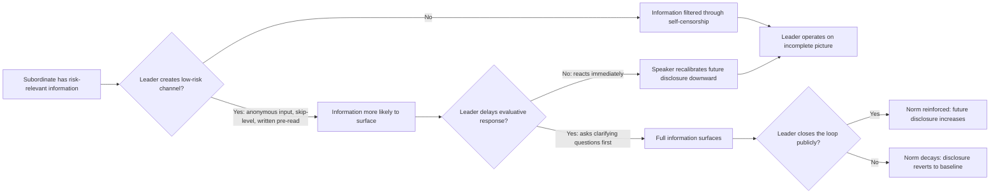

## Listening Across Hierarchy and Power Dynamics

### Definition and Scope

Listening across hierarchy and power dynamics refers to the deliberate communicative practices that compensate for the distortions power differentials introduce into upward, downward, and lateral listening within organizations. Power asymmetry systematically alters what is said, what is withheld, how it is interpreted, and how much cognitive effort a listener invests — in both directions. This topic addresses how executives listen more accurately to those with less positional power, and how subordinates can be heard more accurately by those above them, as well as the structural interventions that reduce distortion in both directions.

### Why Hierarchy Distorts Listening

**Upward distortion (subordinate → superior)**

- **Self-censorship**: employees systematically filter bad news, risk information, and dissent before it reaches senior leaders, a well-documented phenomenon sometimes called the "MUM effect" (keeping Mum about Undesirable Messages).
- **Impression management**: lower-power speakers calibrate messages to protect their standing, often overstating progress and understating problems.
- **Anticipatory compliance**: subordinates predict what a leader wants to hear and shape input accordingly before the leader has expressed a preference, collapsing genuine information diversity.

**Downward distortion (superior → subordinate)**

- **Reduced attentional investment**: research on power and cognition (notably work associated with Dacher Keltner and Adam Galinsky) suggests that holding power is associated with reduced perspective-taking and less careful attention to lower-status others' communication. [Inference] This is a documented pattern in social-psychological literature but individual variation is substantial, and the effect is sensitive to context and disposition rather than deterministic.
- **Premature closure**: leaders under time pressure often stop listening once they believe they have identified the issue, foreclosing information that would have altered their understanding.
- **Halo and status cues**: contributions from higher-status speakers are given more credence independent of content quality (a documented pattern in group decision-making research), meaning leaders may under-listen to technically correct input from junior or lower-status voices.

**Lateral distortion (peer ↔ peer across functional power)**

- Differences in resource control, proximity to executive sponsors, or perceived strategic importance create informal hierarchy even among nominal peers, producing similar filtering effects across departmental or functional lines.

### Theoretical Framing

This topic sits at the intersection of dialogic communication theory and power-in-communication research:

- **Muted Group Theory** (Shirley and Edwin Ardener, extended by Cheris Kramarae) explains how groups with less power develop communication strategies to operate within dominant discourse norms, meaning their most direct communication may not surface unless the listener actively creates space for it.
- **Structuration and power-knowledge** (drawing loosely on Foucauldian analysis) frames organizational hierarchy as continuously reproduced through communicative practice — meaning listening patterns do not merely reflect existing power structures but actively reinforce or can actively disrupt them.
- **Psychological safety** (see prior topic) is the necessary but not sufficient condition; even in safe climates, structural and cognitive biases in listening persist and require deliberate technique.

### Core Mechanisms and Techniques

**For listening upward-accurately (leaders listening to subordinates)**

**Key Points**

- **Active solicitation of dissent**: explicitly asking "what am I missing" or "what would make this fail" rather than "any questions," which places the burden of surfacing risk on the leader rather than the subordinate.
- **Slowing down interpretation**: deliberately delaying evaluative response to allow full information to surface before signaling agreement or disagreement.
- **Discounting status-based credibility bias**: consciously weighting the content of a contribution independent of the speaker's rank, sometimes operationalized through blind or anonymized input review.
- **Multiple, redundant channels**: creating both public and private, synchronous and asynchronous channels (skip-level meetings, anonymous surveys, written pre-reads) since employees may disclose differently depending on channel risk.
- **Closing the loop visibly**: demonstrating that lower-power input changed a decision, which reduces the self-censorship of future speakers by proving communicative risk was rewarded rather than ignored.

**For being heard accurately when speaking upward (subordinates communicating to leaders)**

- **Leading with the conclusion** (the "BLUF" — bottom line up front — convention common in executive communication) to reduce the risk that a busy or status-distracted listener disengages before the key point.
- **Framing risk in decision-relevant terms** (cost, timeline, exposure) rather than technical detail alone, since senior listeners often filter for decision relevance.
- **Naming the ask explicitly** ("I need a decision on X by Friday") rather than relying on the listener to infer required action from implicit cues.

**For lateral listening across informal power differentials**

- Explicitly surfacing and naming resource or access asymmetries before joint problem-solving, so that quieter or lower-influence peers are proactively invited into information-sharing rather than assumed to have equal access to speak.

### Illustration: Distortion Points in the Hierarchical Listening Channel

(svg_diagram)

<svg xmlns="http://www.w3.org/2000/svg" viewBox="0 0 780 420" font-family="Helvetica, Arial, sans-serif">
<text x="390" y="28" text-anchor="middle" font-size="18" font-weight="bold" fill="#1a1a1a">Distortion Points in Hierarchical Listening (svg_diagram)</text>

<rect x="30" y="160" width="140" height="70" rx="8" fill="#3a5a8c" />
<text x="100" y="190" text-anchor="middle" font-size="13" fill="white" font-weight="bold">Subordinate</text>
<text x="100" y="208" text-anchor="middle" font-size="12" fill="white">Original Message</text>

<rect x="210" y="100" width="150" height="60" rx="8" fill="#b3541e" />
<text x="285" y="123" text-anchor="middle" font-size="12" fill="white" font-weight="bold">Self-Censorship</text>
<text x="285" y="141" text-anchor="middle" font-size="11" fill="white">Impression Management</text>

<rect x="210" y="260" width="150" height="60" rx="8" fill="#b3541e" />
<text x="285" y="283" text-anchor="middle" font-size="12" fill="white" font-weight="bold">Anticipatory</text>
<text x="285" y="301" text-anchor="middle" font-size="11" fill="white">Compliance</text>

<rect x="410" y="180" width="140" height="70" rx="8" fill="#5b5b5b" />
<text x="480" y="210" text-anchor="middle" font-size="12" fill="white" font-weight="bold">Message-in-Transit</text>
<text x="480" y="228" text-anchor="middle" font-size="11" fill="white">(Now Altered)</text>

<rect x="590" y="100" width="150" height="60" rx="8" fill="#7a3b8c" />
<text x="665" y="123" text-anchor="middle" font-size="12" fill="white" font-weight="bold">Reduced Attentional</text>
<text x="665" y="141" text-anchor="middle" font-size="11" fill="white">Investment</text>

<rect x="590" y="260" width="150" height="60" rx="8" fill="#7a3b8c" />
<text x="665" y="283" text-anchor="middle" font-size="12" fill="white" font-weight="bold">Status-Based</text>
<text x="665" y="301" text-anchor="middle" font-size="11" fill="white">Credibility Bias</text>

<rect x="620" y="340" width="140" height="60" rx="8" fill="#3a5a8c" />
<text x="690" y="365" text-anchor="middle" font-size="12" fill="white" font-weight="bold">Leader's</text>
<text x="690" y="383" text-anchor="middle" font-size="11" fill="white">Received Understanding</text>
<path d="M170,185 Q190,150 210,130" fill="none" stroke="#555" stroke-width="2" marker-end="url(#arrow2)" />
<path d="M170,205 Q190,260 210,285" fill="none" stroke="#555" stroke-width="2" marker-end="url(#arrow2)" />
<path d="M360,130 Q390,160 410,195" fill="none" stroke="#555" stroke-width="2" marker-end="url(#arrow2)" />
<path d="M360,290 Q390,250 410,225" fill="none" stroke="#555" stroke-width="2" marker-end="url(#arrow2)" />
<path d="M550,205 Q570,160 590,135" fill="none" stroke="#555" stroke-width="2" marker-end="url(#arrow2)" />
<path d="M550,225 Q570,260 590,285" fill="none" stroke="#555" stroke-width="2" marker-end="url(#arrow2)" />
<path d="M690,160 Q700,250 700,340" fill="none" stroke="#555" stroke-width="2" marker-end="url(#arrow2)" />
<path d="M690,320 Q690,335 690,340" fill="none" stroke="#555" stroke-width="2" marker-end="url(#arrow2)" />
</svg>

### Illustration: Leader Intervention Points to Reduce Distortion

### Worked Example

**Example**

A VP notices a project status report shows "on track, minor risks" for three consecutive weeks, then the project misses its deadline by six weeks. A hierarchy-aware listening intervention would have included: (1) asking the project lead privately, outside the group status meeting, "what's the one thing you're not saying in the report," (2) cross-checking the report against a lower-power team member's independent account (e.g., an engineer rather than only the lead), and (3) explicitly rewarding a prior instance of early bad-news disclosure to establish that surfacing risk does not damage standing. The absence of these interventions allowed anticipatory compliance and self-censorship to compound undetected for weeks.

### Structural and Organizational Interventions

- **Skip-level meetings**: direct channels that bypass the immediate hierarchical layer most likely to filter information, used deliberately rather than incidentally.
- **360-degree feedback and upward reviews**: formal mechanisms that normalize subordinate-to-leader evaluative communication.
- **Anonymous or pseudonymous input systems**: reduce the perceived cost of disclosure at the expense of losing some contextual richness and accountability.
- **Rotating meeting facilitation and speaking order**: prevents default deference to the highest-status voice speaking first, which anchors subsequent contributions (a documented anchoring effect in group discussion).
- **Explicit devil's advocate or "red team" roles**: institutionalizes dissent as a sanctioned function rather than an individual risk.

### Common Failure Modes

- **Performative accessibility**: an "open door policy" that exists nominally but is not paired with active solicitation or follow-through, producing no actual increase in disclosure.
- **Mistaking silence for agreement**: absence of dissent in hierarchical settings is frequently a product of filtering, not genuine consensus, and should not be treated as confirmatory.
- **Over-correction toward populism**: uncritically deferring to lower-power voices to compensate for bias can itself distort decision quality; the goal is accurate listening, not inverted status weighting.
- **Channel fatigue**: proliferating feedback mechanisms without visible response leads to declining participation over time (a well-documented survey fatigue pattern).

### Relationship to Adjacent Dialogic Skills

Listening across hierarchy depends on but is distinct from:

- **Psychological safety** — safety is the emotional/climate precondition; hierarchy-aware listening technique is the active behavioral practice leaders must still perform even in nominally safe climates.
- **Active listening** — the core mechanics (attention, paraphrasing, delayed judgment) apply, but must be deliberately intensified to counteract the specific distortions power introduces.
- **Perspective-taking** — cognitively effortful perspective-taking is precisely what research suggests power tends to reduce, making it a trainable compensatory skill rather than a default disposition.

**Conclusion**

Hierarchy and power systematically distort both what is communicated and what is heard, independent of any individual's intent, through mechanisms operating on both the speaking and listening sides of the exchange. Listening accurately across these differentials requires deliberate structural and behavioral counter-measures — low-risk disclosure channels, delayed evaluation, status-independent weighting of content, and visible reinforcement of disclosure — rather than reliance on goodwill or an assumption of open communication alone.

**Related Topics**

- Creating Psychological Safety in Dialogue
- Muted Group Theory and Organizational Discourse
- The MUM Effect and Upward Communication Filtering
- Power, Cognition, and Perspective-Taking Research
- Skip-Level Communication and Structural Listening Interventions
- BLUF (Bottom Line Up Front) and Executive Message Design
- Status Anchoring and Group Decision-Making Bias
- Red Team / Devil's Advocate Roles in Organizational Dissent