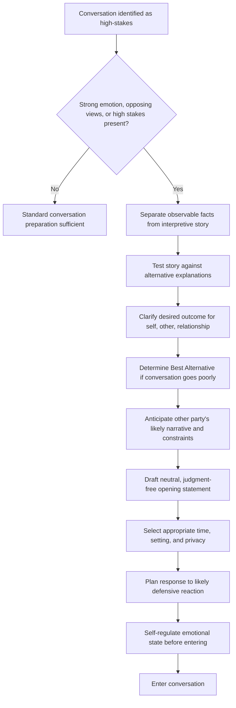

## Preparing for High-Stakes Conversations

### Definition and Scope

A high-stakes conversation is an exchange where the outcome carries significant consequence for relationships, resources, reputation, or organizational direction, and where at least one of the following is present: strong emotion, opposing views, or high stakes for the parties involved (the definitional criteria used in Kerry Patterson et al.'s *Crucial Conversations* framework). Preparation refers to the deliberate cognitive, emotional, and structural work done before entering such a conversation to increase the likelihood of a constructive outcome. Preparation is distinct from scripting — the goal is readiness and clarity of intent, not a rehearsed monologue that collapses under real-time deviation.

### Why Preparation Matters: The Physiology and Cognition of High Stakes

Under perceived threat — social, professional, or relational — the body's stress response (commonly summarized as the fight-flight-freeze response) narrows attentional bandwidth and biases toward defensive, self-protective communication patterns. [Inference] This physiological account is a widely used simplification in communication training derived from broader stress-response research rather than a claim specific to any single study; individual variation in threat sensitivity and recovery is substantial. Practically, this means that without preparation, high-stakes conversations are disproportionately likely to default to two unproductive patterns:

- **Silence** — withholding relevant meaning through understating, selectively sharing, or avoiding the topic entirely.
- **Violence** (in the rhetorical, not physical sense) — forcing meaning onto the conversation through controlling, labeling, or attacking.

Preparation exists to interrupt this default pattern by doing the emotional and cognitive work in advance, when bandwidth is not constrained by real-time threat response.

### Core Preparation Framework

**Key Points**

- **Clarify your own story first**: separate observable facts from the interpretive story built on top of them, since unexamined stories (assumptions about motive or character) are the primary driver of defensive emotion entering the conversation.
- **Identify what you really want**: for yourself, for the other person, and for the relationship — and explicitly check this against what you might be tempted to do instead under stress (win, punish, withdraw).
- **Determine your Best Alternative**: what happens, and what you will do, if the conversation does not go as hoped (adapted from negotiation theory's BATNA — Best Alternative to a Negotiated Agreement).
- **Anticipate the other party's perspective**: construct their likely narrative, constraints, and emotional stake before entering, without assuming it is identical to your own.
- **Decide on the opening move**: how the conversation will be framed in its first thirty seconds, since framing disproportionately shapes the trajectory of the entire exchange.

### The Fact–Story–Feeling Separation

A foundational preparation technique is disentangling three layers that are often fused in the mind before a difficult conversation:

1. **Facts**: observable, verifiable events (what was said, done, or measured — defensible to a neutral third party).

   2018 2. **Story**: the interpretation layered onto the facts (motive, character judgment, causal explanation) — this is where most preparation work is needed, since stories are frequently treated as facts without examination.
2. **Feelings**: the emotional response generated by the story, not directly by the facts themselves.

**Example**

Fact: "The report was submitted four days after the agreed deadline." Story: "She doesn't respect my time and doesn't take this project seriously." Feeling: anger, disrespect. Preparation involves testing the story against alternative explanations (workload conflict, unclear deadline communication, a personal circumstance) before entering the conversation, which changes both tone and opening framing even if the underlying issue still needs to be raised.

### Structural Preparation Techniques

**Content preparation**

- **State the issue in one neutral sentence** free of judgment-laden language, tested in advance for whether a reasonable third party would agree it is objective.
- **Prepare 2–3 supporting observations**, specific and behavioral rather than characterological (e.g., "missed three of the last four deadlines" rather than "unreliable").
- **Draft the opening line verbatim**, since the first sentence carries disproportionate weight in setting whether the listener enters defensively or openly.

**Process preparation**

- **Select time and setting deliberately**: private, unhurried, and free of an audience whose presence would raise the stakes of face-saving for either party.
- **Determine the decision-rights boundary in advance**: is this conversation informational, consultative, or does it involve an actual decision — ambiguity here is a common source of derailment.
- **Plan for likely reactions**, including at least one scenario where the other party becomes defensive or emotional, with a prepared de-escalation response rather than improvising under pressure.

**Emotional preparation**

- **Self-regulate before entering**: brief techniques (delaying the conversation, physical reset, articulating the goal aloud) to reduce the likelihood of entering in an already-activated threat state.
- **Identify your own trigger points**: specific phrases or reactions from the other party likely to provoke a defensive response, prepared for in advance rather than reacted to in the moment.

### Illustration: Preparation Sequence

(svg_diagram)

<svg xmlns="http://www.w3.org/2000/svg" viewBox="0 0 780 480" font-family="Helvetica, Arial, sans-serif">
<text x="390" y="28" text-anchor="middle" font-size="18" font-weight="bold" fill="#1a1a1a">Preparation Sequence for High-Stakes Conversations (svg_diagram)</text>
<rect x="40" y="60" width="700" height="60" rx="8" fill="#2f4f6f" />
<text x="390" y="85" text-anchor="middle" font-size="13" fill="white" font-weight="bold">1. Separate Facts from Story</text>
<text x="390" y="103" text-anchor="middle" font-size="11" fill="white">What is observable vs. what I am interpreting</text>
<rect x="40" y="140" width="700" height="60" rx="8" fill="#2f4f6f" />
<text x="390" y="165" text-anchor="middle" font-size="13" fill="white" font-weight="bold">2. Clarify What I Really Want</text>
<text x="390" y="183" text-anchor="middle" font-size="11" fill="white">For self, other person, and the relationship</text>
<rect x="40" y="220" width="700" height="60" rx="8" fill="#2f4f6f" />
<text x="390" y="245" text-anchor="middle" font-size="13" fill="white" font-weight="bold">3. Anticipate the Other Party's Story</text>
<text x="390" y="263" text-anchor="middle" font-size="11" fill="white">Likely perspective, constraints, and emotional stake</text>
<rect x="40" y="300" width="700" height="60" rx="8" fill="#2f4f6f" />
<text x="390" y="325" text-anchor="middle" font-size="13" fill="white" font-weight="bold">4. Draft Neutral Opening Statement</text>
<text x="390" y="343" text-anchor="middle" font-size="11" fill="white">One sentence, judgment-free, third-party defensible</text>
<rect x="40" y="380" width="700" height="60" rx="8" fill="#2f4f6f" />
<text x="390" y="405" text-anchor="middle" font-size="13" fill="white" font-weight="bold">5. Plan for Reaction and Self-Regulation</text>
<text x="390" y="423" text-anchor="middle" font-size="11" fill="white">Anticipated response, de-escalation move, own triggers</text>
<path d="M390,120 L390,140" stroke="#555" stroke-width="2" marker-end="url(#arrow3)" />
<path d="M390,200 L390,220" stroke="#555" stroke-width="2" marker-end="url(#arrow3)" />
<path d="M390,280 L390,300" stroke="#555" stroke-width="2" marker-end="url(#arrow3)" />
<path d="M390,360 L390,380" stroke="#555" stroke-width="2" marker-end="url(#arrow3)" />
</svg>

### Illustration: Preparation Decision Logic

### Common Preparation Failure Modes

- **Over-scripting**: preparing a monologue rather than an opening and a set of principles, which causes rigidity and derailment when the other party responds unpredictably.
- **Skipping the story-testing step**: entering with an unexamined negative interpretation of the other party's motive, which leaks into tone even when the words are carefully chosen.
- **Preparing content but not process**: having the right facts but no plan for time, setting, or emotional de-escalation, which allows a well-prepared message to fail on delivery conditions.
- **Confusing preparation with rehearsal of certainty**: preparing to persuade rather than preparing to understand, which undermines the dialogic quality of the exchange and increases the likelihood of a defensive reaction.
- **Neglecting the Best Alternative**: entering without clarity on what happens if the conversation fails, which increases anxiety and the temptation toward premature concession or unnecessary escalation.

### Relationship to Adjacent Skills

Preparation for high-stakes conversations depends on and feeds into other dialogic and rhetorical competencies:

- **Psychological safety** — preparation includes anticipating how to establish safety early, particularly by contrasting intent explicitly if the topic risks being misread as attack.
- **Active listening** — preparation should include planned space for genuine listening, not only planned talking points.
- **Framing and rhetorical structure** — the opening statement is itself a rhetorical artifact requiring the same precision as any executive messaging.

**Conclusion**

Preparation for high-stakes conversations is the deliberate, advance separation of fact from interpretation, clarification of genuine goals, and structural planning of setting and opening framing, undertaken specifically because real-time threat response degrades these same capacities once the conversation is underway. Effective preparation produces readiness and principled flexibility, not a fixed script, and directly determines whether the conversation defaults to silence, forced control, or genuine dialogue.

**Related Topics**

- Fact–Story–Feeling Separation Technique
- BATNA and Best Alternative Thinking in Difficult Conversations
- Creating Psychological Safety in Dialogue
- De-escalation Techniques in Real-Time Conflict
- Framing and Opening Statements in Executive Communication
- Crucial Conversations Framework (Patterson et al.)
- Managing Defensive Reactions During Dialogue
- Separating Intent from Impact in Feedback Conversations