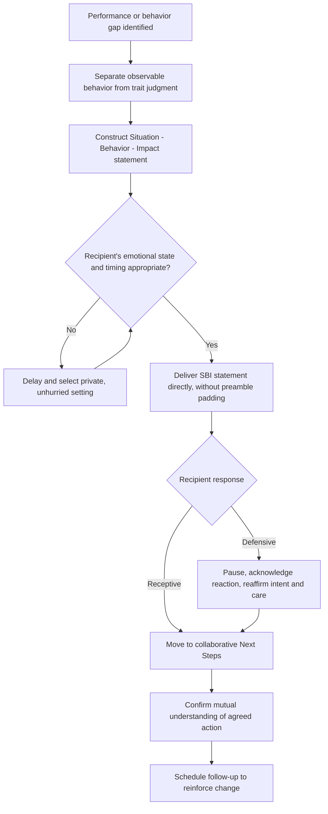

## Delivering Critical Feedback Constructively

### Definition and Scope

Constructive critical feedback is the deliberate communication of a performance, behavior, or judgment gap in a manner that preserves the recipient's dignity and motivation while maximizing the likelihood of accurate understanding and behavioral change. It is distinguished from both **destructive criticism** (feedback that damages self-concept without providing actionable direction) and **false positivity** (withholding accurate negative information to avoid discomfort, which deprives the recipient of information needed to improve). In executive contexts, the capacity to deliver critical feedback constructively is a core determinant of whether an organization develops a learning culture or a defensive, information-suppressing one.

### Theoretical Foundations

**Feedback intervention theory** (Kluger and DeNisi) establishes that feedback does not uniformly improve performance — a substantial proportion of studied feedback interventions produced no improvement or actual performance decline, primarily because feedback that shifts attention to the self (ego-level) rather than the task degrades performance, while task-level feedback tends to improve it. This is a central technical justification for behavior-specific, non-characterological feedback framing.

**Attribution theory** explains why feedback framed around stable, internal traits ("you're disorganized") provokes stronger defensiveness than feedback framed around specific, controllable behaviors ("the deliverable was submitted without the requested sections"), because trait-level attributions threaten global self-concept while behavior-level attributions leave the recipient's sense of competence largely intact and point toward a controllable fix.

**Face theory** (Erving Goffman, extended by Brown and Levinson's politeness theory) frames critical feedback as an inherent threat to the recipient's face (public self-image) and, in in-person delivery, to the deliverer's face as well. Constructive feedback technique is substantially the art of mitigating face threat without diluting the substantive content of the message.

### Core Structural Models

**The SBI Model (Situation–Behavior–Impact)**

- **Situation**: specify the concrete context (when, where) to ground the feedback in a shared, verifiable reference point.
- **Behavior**: describe the observable action, using neutral, non-judgmental, behavioral language rather than trait labels.
- **Impact**: state the concrete effect of the behavior — on the team, the output, the client, or the recipient's own goals.

**Example**

Weak: "You're not a team player." SBI version: "In yesterday's client call (Situation), you interrupted the client twice while they were describing their concern (Behavior). This meant we didn't get the full picture of their issue before proposing a solution, and the client repeated their concern with visible frustration (Impact)."

**The COIN Model (Context–Observation–Impact–Next Steps)**

An extension of SBI that adds a forward-looking action component, useful when feedback is intended to produce a specific behavioral commitment rather than only awareness.

**Radical Candor Framework (Kim Scott)**

Positions feedback along two axes — **Care Personally** and **Challenge Directly** — producing four quadrants:

- **Radical Candor**: high care, high challenge — the target zone.
- **Obnoxious Aggression**: high challenge, low care — criticism without regard for the recipient.
- **Ruinous Empathy**: high care, low challenge — withholding necessary criticism to avoid discomfort, the most common failure mode among conflict-averse managers.
- **Manipulative Insincerity**: low care, low challenge — dishonest or absent feedback, often politically motivated.

### Illustration: Radical Candor Quadrants

(svg_diagram)

<svg xmlns="http://www.w3.org/2000/svg" viewBox="0 0 620 620" font-family="Helvetica, Arial, sans-serif">
<text x="310" y="28" text-anchor="middle" font-size="18" font-weight="bold" fill="#1a1a1a">Radical Candor Framework (svg_diagram)</text>
<line x1="80" y1="500" x2="560" y2="500" stroke="#333" stroke-width="2" />
<line x1="80" y1="500" x2="80" y2="80" stroke="#333" stroke-width="2" />
<text x="320" y="540" text-anchor="middle" font-size="13" fill="#333">Challenge Directly →</text>
<text x="40" y="290" text-anchor="middle" font-size="13" fill="#333" transform="rotate(-90 40,290)">Care Personally →</text>
<rect x="80" y="80" width="240" height="210" fill="#e8f0e8" />
<text x="200" y="170" text-anchor="middle" font-size="13" font-weight="bold" fill="#2f6f4f">Ruinous Empathy</text>
<text x="200" y="190" text-anchor="middle" font-size="11" fill="#444">High care, low challenge</text>
<text x="200" y="208" text-anchor="middle" font-size="11" fill="#444">Withholds needed criticism</text>
<rect x="320" y="80" width="240" height="210" fill="#2f6f4f" />
<text x="440" y="170" text-anchor="middle" font-size="13" font-weight="bold" fill="white">Radical Candor</text>
<text x="440" y="190" text-anchor="middle" font-size="11" fill="white">High care, high challenge</text>
<text x="440" y="208" text-anchor="middle" font-size="11" fill="white">Target zone</text>
<rect x="80" y="290" width="240" height="210" fill="#c9c9c9" />
<text x="200" y="380" text-anchor="middle" font-size="13" font-weight="bold" fill="#333">Manipulative Insincerity</text>
<text x="200" y="400" text-anchor="middle" font-size="11" fill="#444">Low care, low challenge</text>
<text x="200" y="418" text-anchor="middle" font-size="11" fill="#444">Dishonest or absent feedback</text>
<rect x="320" y="290" width="240" height="210" fill="#b3541e" />
<text x="440" y="380" text-anchor="middle" font-size="13" font-weight="bold" fill="white">Obnoxious Aggression</text>
<text x="440" y="400" text-anchor="middle" font-size="11" fill="white">Low care, high challenge</text>
<text x="440" y="418" text-anchor="middle" font-size="11" fill="white">Criticism without regard</text>
</svg>

### Illustration: Feedback Delivery Decision Logic

### Delivery Techniques

**Key Points**

- **Lead with clarity, not cushioning**: excessive preamble ("I just want to say first that you're doing great, but...") often functions as a warning signal that erodes trust and can overshadow the substantive message (sometimes critiqued as the ineffective "feedback sandwich" when used formulaically).
- **State intent explicitly** when the topic carries risk of misinterpretation ("I'm raising this because I want you to succeed on the next project, not because of the last one").
- **Use behavior-specific language**: replace adjectives describing character ("careless," "lazy") with specific, observable actions.
- **Own the reaction, not just the message**: check in on how the feedback landed rather than delivering and immediately moving on, since comprehension and emotional processing are distinct.
- **Separate the conversation from the decision**: when feedback accompanies a consequence (e.g., a performance rating), be explicit about which is which, since conflating them can make either feel manipulative.

**Common failure modes**

- **Vagueness**: feedback that identifies a problem without specificity ("communication needs work") gives the recipient no actionable path to improvement.
- **Feedback sandwiching as formula**: mechanically bracketing criticism between compliments trains recipients to discount the positive framing as a warning cue, reducing the sandwich's protective function over repeated use.
- **Public delivery of individually-targeted criticism**: even mild critical feedback delivered in front of peers carries disproportionate face-threat and can produce disengagement rather than improvement.
- **Delayed feedback**: waiting until a formal review cycle to deliver feedback on an event long past reduces both its behavioral relevance and its perceived fairness.
- **Feedback as venting**: delivering criticism primarily to relieve the deliverer's own frustration rather than to support the recipient's improvement, often detectable in tone even when words are moderated.

### Calibration by Context

[Inference] The appropriate degree of directness and the specific framing conventions used for critical feedback vary meaningfully by organizational and national culture (e.g., documented contrasts between low-context and high-context communication norms in cross-cultural communication research); the frameworks above represent common conventions in Western, particularly U.S., executive coaching literature and should be adapted rather than applied uniformly across cultural contexts.

### Relationship to Adjacent Skills

- **Psychological safety** — a climate of safety increases the likelihood that critical feedback is received as intended rather than as a threat to be defended against.
- **Preparing for high-stakes conversations** — critical feedback delivery is frequently a high-stakes conversation subtype and benefits from the same fact–story–feeling preparation discipline.
- **Active listening** — delivering feedback constructively requires listening to the recipient's response, not only executing a prepared statement.

**Conclusion**

Delivering critical feedback constructively requires replacing vague or trait-based judgments with specific, behavior-level, impact-linked observations, delivered with explicit care and directness in balance, and followed by genuine engagement with the recipient's response rather than a one-way transmission. Structural models such as SBI and frameworks such as Radical Candor operationalize this balance, but their effectiveness depends on authentic intent and calibration to the recipient's context and culture rather than mechanical application.

**Related Topics**

- Situation–Behavior–Impact (SBI) Feedback Model
- Radical Candor Framework (Kim Scott)
- Feedback Intervention Theory (Kluger and DeNisi)
- Preparing for High-Stakes Conversations
- Creating Psychological Safety in Dialogue
- Attribution Theory and Defensive Communication
- Cross-Cultural Variation in Directness Norms
- Performance Review Design and Delivery