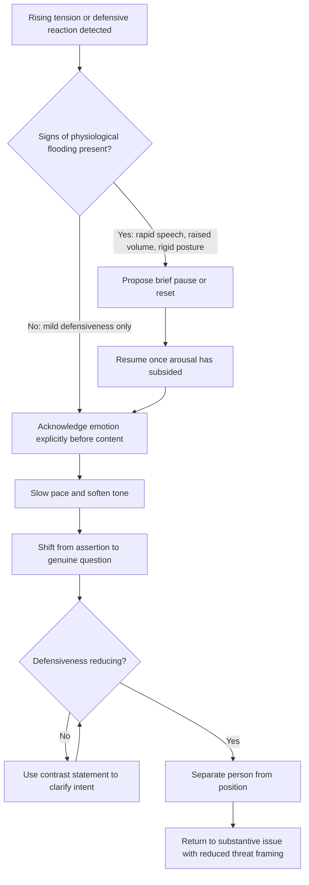

## De-Escalating Tension and Defensiveness

### Definition and Scope

De-escalation refers to the deliberate set of communicative techniques used to reduce rising emotional intensity, defensiveness, or conflict during an interaction, redirecting it away from a threat-response trajectory and back toward productive dialogue. Defensiveness specifically denotes a self-protective communicative posture — triggered by a perceived threat to identity, competence, or standing — that manifests as denial, counter-attack, withdrawal, or rationalization. De-escalation is a real-time, in-the-moment skill, distinct from preparation (which occurs beforehand) and from resolution (which addresses the underlying substantive issue); de-escalation's function is to restore the conditions under which resolution becomes possible.

### Theoretical Foundations

**Jack Gibb's Defensive vs. Supportive Communication Climates** (1961) remains a foundational framework, identifying six paired communicative behaviors that predictably provoke or reduce defensiveness:

| Defensive-Inducing | Supportive Alternative |
| --- | --- |
| Evaluation (judging) | Description (neutral observation) |
| Control (imposing outcome) | Problem Orientation (joint solving) |
| Strategy (hidden agenda) | Spontaneity (genuine, transparent) |
| Neutrality (clinical detachment) | Empathy (acknowledged concern) |
| Superiority (status assertion) | Equality (shared standing) |
| Certainty (dogmatism) | Provisionalism (open to revision) |

**The Physiology of Escalation**: Rising defensiveness is frequently accompanied by physiological arousal — elevated heart rate, narrowed attention, reduced access to complex reasoning — sometimes referenced in communication training as "flooding" (a term popularized by relationship researcher John Gottman in the context of marital conflict, extended informally to organizational settings). [Inference] The specific physiological thresholds and their organizational applicability are drawn from research conducted primarily in couples' contexts; the underlying arousal-reasoning tradeoff is broadly supported in stress research, but precise figures and timelines should be treated as illustrative rather than universally fixed.

**Attribution and threat appraisal**: defensiveness is frequently triggered less by the content of a message than by the listener's appraisal of intent — the same factual statement delivered with perceived hostility versus perceived goodwill produces markedly different defensive responses, underscoring that tone and framing carry as much de-escalatory weight as word choice.

### Core De-Escalation Techniques

**Key Points**

- **Slow the pace deliberately**: reducing speaking speed and inserting pauses interrupts escalatory momentum and signals the exchange is not a race toward a defensive exchange of blows.
- **Lower and soften vocal tone**: matching or slightly softening tone relative to an escalating counterpart (rather than matching their intensity) tends to invite reciprocal de-escalation, though this is context-dependent and can occasionally read as dismissive if overused.
- **Acknowledge the emotion explicitly before addressing content**: naming what is observed ("I can see this is frustrating") validates the emotional experience without conceding the substantive point, often reducing the urgency behind defensive behavior.
- **Ask, don't assert, when tension rises**: shifting from declarative statements to genuine questions reduces the perceived control-imposition that Gibb's framework identifies as defense-provoking.
- **Separate the person from the position explicitly**: reframing disagreement as being about the issue, not the individual's character, reduces identity-level threat.
- **Offer a pause or reset**: explicitly proposing a short break, when appropriate, allows physiological arousal to subside before continuing, rather than pushing through an escalated state.

### The "Contrast Statement" Technique

A specific de-escalation move (drawn from *Crucial Conversations* methodology) used when a message risks being misread as attack: stating what is **not** meant before stating what **is** meant. This directly addresses the appraisal-of-intent mechanism underlying defensiveness.

**Example**

"I don't want you to think I'm questioning your commitment to this project — that's not what this is about. What I do want to flag is a specific risk in the current timeline that I think we need to address together." The contrast statement removes the most threatening possible interpretation before the substantive content is delivered, reducing the likelihood that the listener processes the message defensively from the outset.

### Illustration: Escalation and De-Escalation Trajectory

(svg_diagram)

<svg xmlns="http://www.w3.org/2000/svg" viewBox="0 0 780 420" font-family="Helvetica, Arial, sans-serif">
<text x="390" y="28" text-anchor="middle" font-size="18" font-weight="bold" fill="#1a1a1a">Escalation vs. De-Escalation Trajectory (svg_diagram)</text>
<line x1="60" y1="360" x2="740" y2="360" stroke="#333" stroke-width="2" />
<line x1="60" y1="360" x2="60" y2="60" stroke="#333" stroke-width="2" />
<text x="400" y="395" text-anchor="middle" font-size="12" fill="#333">Time in Conversation →</text>
<text x="30" y="210" text-anchor="middle" font-size="12" fill="#333" transform="rotate(-90 30,210)">Emotional Intensity</text>

<path d="M80,320 C 200,280 300,180 420,90 S 650,50 720,40" fill="none" stroke="#b3541e" stroke-width="3" />
<text x="600" y="70" font-size="12" fill="#b3541e" font-weight="bold">No intervention (flooding)</text>

<path d="M80,320 C 200,280 300,180 340,150 C 400,180 480,260 560,290 S 680,310 720,315" fill="none" stroke="#2f6f4f" stroke-width="3" />
<text x="500" y="330" font-size="12" fill="#2f6f4f" font-weight="bold">With de-escalation intervention</text>
<circle cx="340" cy="150" r="6" fill="#333" />
<text x="340" y="130" text-anchor="middle" font-size="11" fill="#333">Intervention point</text>
<text x="340" y="115" text-anchor="middle" font-size="10" fill="#666">(pace, tone, acknowledgment)</text>
</svg>

### Illustration: Real-Time De-Escalation Decision Flow

### Common Failure Modes

- **Matching escalation**: responding to raised volume or intensity with equal or greater intensity, which reliably accelerates rather than reduces conflict.
- **Premature problem-solving**: attempting to resolve the substantive issue before emotional intensity has subsided, which is typically perceived as dismissive of the emotional experience and reignites defensiveness.
- **Over-apologizing or capitulating**: conceding substantive ground purely to reduce tension, which de-escalates the immediate moment at the cost of unresolved or resurfacing conflict later.
- **False empathy**: acknowledging emotion in words without genuine tone congruence, which is frequently detected and can increase distrust rather than reduce tension.
- **Silence misread as agreement**: withdrawing to avoid escalation without signaling why, which can be interpreted as dismissal or disengagement rather than a deliberate de-escalatory pause.

### Organizational and Executive Considerations

In executive settings, de-escalation carries additional complexity due to power asymmetry (see prior topic on hierarchy and power dynamics): a leader's attempt to de-escalate can be misread as either genuine or as a status-based demand for calm compliance, depending on delivery and prior relationship history. Leaders should be particularly attentive to whether their own de-escalation behaviors (e.g., proposing a pause) are received as collaborative or as an exercise of positional authority to end the conversation prematurely.

### Relationship to Adjacent Skills

- **Psychological safety** — climates with higher baseline safety experience less frequent and less intense escalation, reducing the demand on in-the-moment de-escalation technique.
- **Preparing for high-stakes conversations** — anticipating likely defensive reactions during preparation allows de-escalation responses to be planned rather than improvised.
- **Delivering critical feedback constructively** — feedback delivery is one of the most common triggers of defensiveness, making de-escalation technique a direct complement to feedback framing.

**Conclusion**

De-escalating tension and defensiveness requires real-time recognition of rising emotional intensity and deliberate, counter-intuitive responses — slowing rather than matching pace, acknowledging emotion before content, and clarifying intent through contrast statements — grounded in the understanding that defensiveness is primarily a response to perceived threat rather than to factual content itself. Effective de-escalation restores the conditions for productive dialogue without requiring premature concession on the underlying substantive issue.

**Related Topics**

- Jack Gibb's Defensive and Supportive Communication Climates
- Flooding and Physiological Arousal in Conflict (Gottman)
- Contrast Statements and Intent Clarification
- Preparing for High-Stakes Conversations
- Delivering Critical Feedback Constructively
- Listening Across Hierarchy and Power Dynamics
- Nonviolent Communication (NVC) Framework
- Conflict Resolution Styles (Thomas-Kilmann Model)