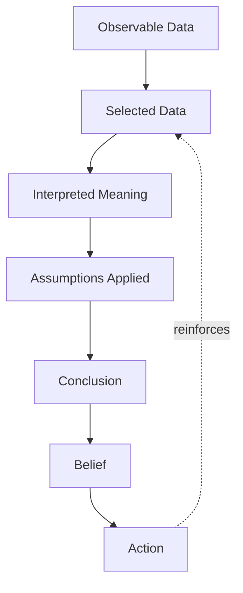

## Navigating Disagreement Without Damaging Relationships

### Overview

Navigating disagreement is the applied discipline of expressing dissent, contradicting a claim, or advocating for a competing position while preserving the working relationship, the other party's standing, and the possibility of future collaboration. In executive contexts, this skill sits at the intersection of rhetoric (how the disagreement is framed and delivered) and conflict management (how the interaction is structured and de-escalated). Poorly handled disagreement produces defensiveness, status threat, and relationship rupture; well-handled disagreement produces better decisions, mutual respect, and often strengthens trust because it demonstrates that candor is safe.

The core tension this topic addresses: most professional cultures reward two failure modes — conflict avoidance (agreement or silence to preserve harmony, at the cost of decision quality) and conflict escalation (blunt confrontation that wins the point but damages the relationship). The skill set here is the narrow, learnable path between them, often called "soft on the person, hard on the problem."

### Theoretical Foundations

**Face theory (Goffman; Brown & Levinson)**

Every person maintains "face" — a public self-image they want respected. Disagreement inherently threatens face because it implies the other person is wrong, uninformed, or mistaken. Two types of face are relevant:

- **Positive face**: the desire to be liked, approved of, and seen as competent.
- **Negative face**: the desire for autonomy — not to be imposed upon or controlled.

Disagreement language should be engineered to minimize face threat on both dimensions simultaneously — affirming competence while not dictating the other's conclusion.

**Psychological safety (Edmondson)**

Teams and dyads with high psychological safety treat disagreement as informational rather than threatening. The individual skill of navigating disagreement well is one of the primary *inputs* to psychological safety at scale: every well-handled disagreement is evidence to bystanders that dissent is safe here.

**The Ladder of Inference (Argyris)**

Disagreements often occur at the level of conclusions ("Your plan won't work") when the actual gap is in the data selected or the assumptions applied. Skilled disagreement descends the ladder — surfacing the observable data and assumptions beneath a conclusion — rather than trading conclusions.

**Nonviolent Communication (Rosenberg)**

A four-part structure — observation, feeling, need, request — separates factual description from evaluation, which reduces the perceived accusation embedded in disagreement.

### Diagnostic: Why Disagreements Damage Relationships

| Failure Mechanism | Description | Typical Trigger Phrase |
| --- | --- | --- |
| Attribution to character | Disagreement is framed as a statement about the person's competence or intent, not the idea | "You clearly didn't think this through" |
| Zero-sum framing | Disagreement is treated as a contest with a winner and loser | "Let's see whose numbers hold up" |
| Public exposure | Disagreement delivered in front of an audience, raising face-threat stakes | Contradicting someone in a meeting without a private channel first |
| Certainty mismatch | One party states a probabilistic judgment as absolute fact | "That will never work" vs. "I'm concerned that..." |
| Unacknowledged emotion | Legitimate frustration is suppressed until it leaks out as tone | Sarcasm, curtness, withdrawal |

### Core Framework: The DISAGREE Sequence

A structured sequence for executive-level disagreement:

1. **D — Delay judgment.** Pause before reacting; separate the urge to correct from the decision to speak.
2. **I — Inquire first.** Ask a clarifying question to test whether you're disagreeing with what they actually meant.
3. **S — State shared ground.** Name the goal or fact both parties already agree on.
4. **A — Attribute the claim, not the person.** Critique the argument, plan, or data — never the individual's intelligence or character.
5. **G — Give your view as provisional.** Frame your position with appropriate epistemic humility ("My read is..." not "The fact is...").
6. **R — Request, don't demand.** Propose the next step as an invitation to explore, not an instruction.
7. **E — Explain your reasoning, not just your conclusion.** Show the data/assumption chain so the other party can locate the actual point of divergence.
8. **E — Engage their response genuinely.** Treat their answer as new information that could change your position, not an obstacle to route around.

**Example**

Instead of:

> "That timeline is unrealistic. We're not going to hit Q3."

Apply the sequence:

> "Before I react — can I check what's baked into the Q3 estimate? [Inquire] I know we both want to ship before the client renewal window closes. [Shared ground] Looking at the QA backlog, my read is the timeline may be tight, not because of the team's effort, but because of the dependency on the vendor API. [Attribute to plan, provisional] Would it help to walk through the dependency chain together and see where the risk actually sits?" [Request, not demand]

### Technique 1: Separating Position from Interest (Principled Negotiation)

From the Harvard Negotiation Project (Fisher & Ury): most disagreements present as a clash of *positions* ("I want X," "I want Y") but are resolvable once the underlying *interests* are surfaced (why each party wants what they want).

**Procedure**

1. State the other party's position back to confirm understanding.
2. Ask "What would this get you?" or "What's the concern behind that?"
3. Identify your own interest explicitly, not just your position.
4. Search for options that satisfy both interests, even if neither original position survives.

**Example**

- Position clash: "We should launch in November" vs. "We should launch in January."
- Interests: November-camp cares about beating a competitor announcement; January-camp cares about not shipping with known defects.
- Reframe: "Is there a way to announce in November and ship the completed product in January?" — a staged launch satisfies both interests without either party "losing."

### Technique 2: The Ladder of Inference Descent

When a disagreement stalls at the conclusion level, descend explicitly:

**Application in conversation**: instead of arguing conclusion vs. conclusion ("It'll work" vs. "It won't"), ask: "What data are you weighting most heavily?" and "What assumption is doing the work in your conclusion?" Disagreements frequently dissolve once both parties discover they are working from different (and previously unstated) assumptions rather than a genuine values conflict.

### Technique 3: Calibrated Language and Epistemic Markers

Precision about certainty level reduces perceived threat and improves decision quality.

| Certainty Level | Recommended Framing | Avoid |
| --- | --- | --- |
| High confidence, verifiable fact | "The data shows X" | Hedging unnecessarily |
| Reasoned judgment, not verified | "My assessment is X, based on Y" | "X is true" |
| Intuition/pattern-matching | "My instinct says X, though I can't fully justify it yet" | Presenting a hunch as analysis |
| Genuine uncertainty | "I don't know, and I think that matters here" | False confidence to seem authoritative |

Chris Voss's "calibrated questions" (open-ended, "what" and "how" questions rather than "why") are a related device: "How would this plan handle a vendor delay?" invites problem-solving rather than triggering defensiveness, whereas "Why didn't you plan for a vendor delay?" implies fault.

### Technique 4: Public vs. Private Disagreement Protocol

**Key Points**

- Disagree with the *idea* in public; disagree with the *person's handling* in private.
- If you must contradict someone in a group setting, do so by adding information rather than negating their statement: "Building on that — one data point that might change the picture is..." rather than "That's wrong."
- If the disagreement involves feedback about how someone communicated (tone, process, behavior), move it to a 1:1 channel regardless of where the original friction occurred.
- Escalating a disagreement to a shared authority (a manager, a committee) should be a last resort disclosed to the other party first — never a surprise appeal.

### Technique 5: Managing the Emotional Layer

Disagreement carries physiological arousal (amygdala activation under perceived threat) that degrades reasoning if unmanaged.

**Regulation tactics**

- **Name it internally**: silently labeling your own reaction ("I'm feeling defensive right now") measurably reduces its intensity (affect labeling, Lieberman et al.).
- **Slow the pace**: deliberately lower speaking rate and pause length; fast exchanges escalate arousal in both parties.
- **Physical reset**: a brief pause ("Let me think about that for a second") is a legitimate and effective de-escalation tool, not a weakness.
- **Validate before countering**: explicitly acknowledging the legitimate part of the other person's view before introducing your disagreement (a technique sometimes called "steelmanning before rebuttal") lowers defensiveness because it signals the disagreement is selective, not total.

### Technique 6: The SBI-I Feedback Variant for Disagreement

Adapted from the Situation-Behavior-Impact model, extended with Inquiry:

1. **Situation**: Name the specific context, not a generalized pattern. "In yesterday's client call..."
2. **Behavior**: Describe the observable action, not your interpretation of motive. "...you presented the projections without flagging the confidence interval..."
3. **Impact**: State the effect on you, the team, or the outcome. "...which I think left the client with more certainty than we actually have."
4. **Inquiry**: Open it back to the other party. "What's your read on that?"

This structure works for disagreement (not just feedback) because it makes the claim falsifiable and locates it in a specific instance rather than a sweeping judgment, which is what triggers character-attribution defensiveness.

### Technique 7: Repair After Escalation

When a disagreement has already damaged the interaction, relationship repair follows a distinct sequence from the disagreement itself:

1. **Acknowledge the rupture explicitly**: "That got more heated than either of us wanted."
2. **Own your specific contribution**: name your own behavior, not a mutual "we both got heated" deflection, at least first.
3. **Reaffirm the relationship independent of the issue**: "I still think we're aligned on the goal here."
4. **Return to the substantive question with the DISAGREE sequence**, often after a time gap.

[Inference] The efficacy of same-day vs. delayed repair conversations is context- and relationship-dependent; some research on conflict in close relationships favors a short cooling-off period before repair, while high-stakes business decisions may require faster resolution regardless of emotional readiness.

### Anti-Patterns to Avoid

| Anti-Pattern | Why It Fails |
| --- | --- |
| "Devil's advocate" without disclosure | Erodes trust when the other party later learns the position wasn't genuinely held |
| False consensus ("I hear you, but...") | The "but" negates the acknowledgment; replace with "and" or restructure entirely |
| Sandwich technique (praise-criticize-praise) overuse | Recipients learn to discount the praise as a formality, degrading its future signal value |
| Silent disagreement followed by unilateral action | Produces the worst outcome: no relationship damage in the moment, but severe trust damage on discovery |
| Over-hedging to the point of unclear position | Excessive softening can make the actual disagreement illegible, defeating the purpose |

### Applying This in Executive Contexts

- **Upward disagreement** (to a superior): lead with the shared objective, use calibrated questions over direct contradiction, and offer the dissent as risk information rather than a verdict — "I want to flag a risk before we commit" carries the content of disagreement without the framing of insubordination.
- **Downward disagreement** (to a report): the face-threat asymmetry runs the other way — the person may not feel safe disagreeing back, so explicitly invite counter-argument ("Tell me where this reasoning is weak") to avoid manufacturing false agreement.
- **Peer disagreement**: the highest-leverage context for the DISAGREE sequence, since neither party has positional cover, and relationship capital is built or spent in real time.
- **Cross-functional/high-stakes disagreement** (e.g., legal vs. product, finance vs. engineering): frame around differing risk tolerances and incentive structures explicitly, since much of what looks like a values disagreement is actually a difference in what each function is measured on.

### Illustrative Model: Face-Threat vs. Information Value Trade-off

<svg xmlns="http://www.w3.org/2000/svg" viewBox="0 0 640 420">
<text x="320" y="28" text-anchor="middle" font-size="16" font-weight="bold" font-family="sans-serif">Disagreement Delivery Matrix (svg_diagram)</text>
<line x1="80" y1="360" x2="580" y2="360" stroke="black" stroke-width="2" />
<line x1="80" y1="360" x2="80" y2="60" stroke="black" stroke-width="2" />
<text x="330" y="400" text-anchor="middle" font-size="13" font-family="sans-serif">Face Threat (Low to High)</text>
<text x="30" y="210" text-anchor="middle" font-size="13" font-family="sans-serif" transform="rotate(-90 30 210)">Information Value (Low to High)</text>
<line x1="330" y1="60" x2="330" y2="360" stroke="#999" stroke-dasharray="4,4" />
<line x1="80" y1="210" x2="580" y2="210" stroke="#999" stroke-dasharray="4,4" />
<rect x="90" y="70" width="230" height="130" fill="#e8f4ea" stroke="#4a8" stroke-width="1.5" />
<text x="205" y="95" text-anchor="middle" font-size="12" font-weight="bold" font-family="sans-serif">Silent Compliance</text>
<text x="205" y="115" text-anchor="middle" font-size="11" font-family="sans-serif">Low threat, low value</text>
<text x="205" y="132" text-anchor="middle" font-size="11" font-family="sans-serif">Avoids friction,</text>
<text x="205" y="149" text-anchor="middle" font-size="11" font-family="sans-serif">withholds needed input</text>
<rect x="340" y="70" width="230" height="130" fill="#eaf1fb" stroke="#48a" stroke-width="1.5" />
<text x="455" y="95" text-anchor="middle" font-size="12" font-weight="bold" font-family="sans-serif">Blunt Confrontation</text>
<text x="455" y="115" text-anchor="middle" font-size="11" font-family="sans-serif">High threat, high value</text>
<text x="455" y="132" text-anchor="middle" font-size="11" font-family="sans-serif">Correct content,</text>
<text x="455" y="149" text-anchor="middle" font-size="11" font-family="sans-serif">damages relationship</text>
<rect x="90" y="220" width="230" height="130" fill="#f7f7e8" stroke="#aa4" stroke-width="1.5" />
<text x="205" y="245" text-anchor="middle" font-size="12" font-weight="bold" font-family="sans-serif">Vague Hedging</text>
<text x="205" y="265" text-anchor="middle" font-size="11" font-family="sans-serif">Low threat, low value</text>
<text x="205" y="282" text-anchor="middle" font-size="11" font-family="sans-serif">Comfortable but</text>
<text x="205" y="299" text-anchor="middle" font-size="11" font-family="sans-serif">fails to inform decision</text>
<rect x="340" y="220" width="230" height="130" fill="#fdeeea" stroke="#c73" stroke-width="2" />
<text x="455" y="245" text-anchor="middle" font-size="12" font-weight="bold" font-family="sans-serif">Calibrated Candor</text>
<text x="455" y="265" text-anchor="middle" font-size="11" font-family="sans-serif">Managed threat, high value</text>
<text x="455" y="282" text-anchor="middle" font-size="11" font-family="sans-serif">Target zone: DISAGREE</text>
<text x="455" y="299" text-anchor="middle" font-size="11" font-family="sans-serif">sequence outcome</text>
</svg>

### Common Pitfalls in Application

- Treating the framework as a script to be recited verbatim, which reads as manipulative when the other party recognizes the pattern.
- Using "I feel" statements to disguise a factual claim ("I feel like your data is wrong" is not a feeling, it's an assertion in disguise).
- Over-indexing on harmony to the point that real decision-relevant disagreement never surfaces — the goal is not to eliminate friction but to make disagreement *productive* rather than *destructive*.
- Assuming one conversational repair fixes a pattern of repeated disagreement failures; chronic relationship damage typically requires a explicit "reset" conversation about how the two parties disagree, not just resolving the current instance.

**Next Steps**

- Difficult Feedback Conversations (SBI Model in Depth)
- Managing Up: Disagreeing with Executive Decisions
- De-escalation Techniques in High-Stakes Meetings
- Cross-Cultural Variation in Directness and Face-Saving Norms
- Written Disagreement: Navigating Conflict in Email and Async Channels
- Facilitating Disagreement Between Two Other Parties (Mediator Role)
- Building Psychological Safety on Teams (Edmondson Framework)
- Negotiation Fundamentals: Interests vs. Positions