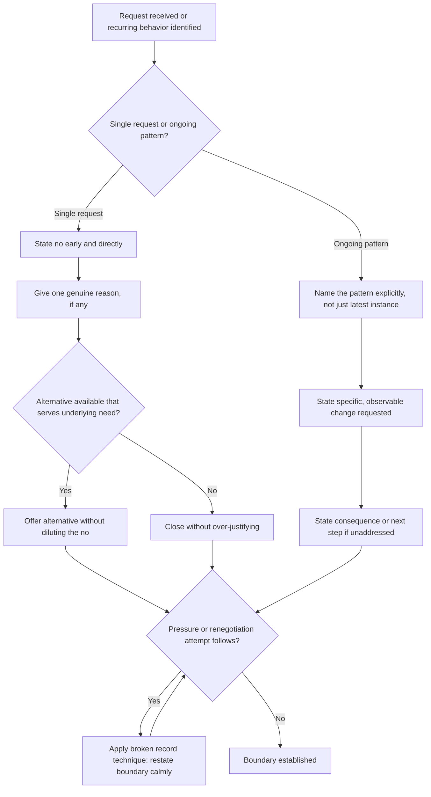

## Saying No and Setting Boundaries Clearly

### Definition and Scope

Saying no and setting boundaries clearly refers to the communicative competency of declining requests, limiting scope, or defining acceptable behavior in a manner that is direct, unambiguous, and minimally damaging to the relationship. A **boundary**, in this context, is an explicitly communicated limit on what one will do, accept, or tolerate, distinguished from an implicit expectation by the fact that it has been stated rather than merely assumed. In executive communication, the inability to say no clearly is a well-documented driver of overcommitment, diluted priorities, and erosion of credibility, since vague or hedged refusals are frequently reinterpreted by the requester as negotiable or as eventual compliance.

### Why Clear Refusal Is Difficult: The Communicative Tension

Saying no activates a specific rhetorical tension between two competing goals:

- **Face-threat to the requester**: a refusal inherently withholds something the other party wants, and politeness theory (Brown and Levinson) identifies this as a threat to the requester's "positive face" (desire for approval and validation).
- **Face-threat to the refuser**: simultaneously, saying no risks the refuser's own standing — as unhelpful, uncooperative, or difficult — creating pressure toward hedging, over-explaining, or false accommodation.

This dual face-threat explains the common pattern of **indirect refusal** (vague deferrals, non-committal language, disappearing rather than declining), which reduces short-term discomfort but frequently produces greater relational damage than a direct, well-framed no, because indirect refusal wastes the requester's time, invites repeated asks, and is often perceived as passive-aggressive or evasive once its pattern becomes apparent.

### Core Principles

**Key Points**

- **Directness without harshness**: an effective no is unambiguous in content but warm in delivery — clarity and kindness are not in tension, despite frequently being treated as such.
- **No justification inflation**: providing an excessive number of reasons for a refusal often signals uncertainty and invites the requester to counter each reason individually, weakening the boundary; one clear reason (or none) is typically more effective than five.
- **Separate the request from the requester**: declining a specific ask is not a rejection of the relationship or the person's standing, and this distinction should often be made explicit, particularly in high-power-distance contexts.
- **State the boundary before it is violated when possible**: proactive boundary-setting ("I'm not available for calls after 7pm") is generally less costly than reactive boundary enforcement after repeated violation, which tends to carry accumulated frustration into the message.

### Structural Techniques

**The Direct Decline with Brief Rationale**

State the no early in the sentence rather than burying it after extended preamble, paired with a single, genuine reason.

**Example**

Weak (buried, hedged): "So, this is a really interesting opportunity and I appreciate you thinking of me, and I know the team is stretched thin right now, and I've got a lot on my plate, so I'm not sure if I can really commit to this the way it deserves..." Clear: "I can't take this on right now — my current priorities don't leave room to do it well. I'd rather decline than deliver something half-committed."

**The "No, and" Alternative Offer**

Pairing a clear refusal with an alternative that still serves the underlying need, where appropriate, converts a pure rejection into a collaborative redirection — without diluting the clarity of the no itself.

**Example**

"I can't lead this project given my current commitments, and I don't want to be a bottleneck — I'd suggest [Name], who has bandwidth and relevant experience, or I'm glad to advise informally without taking ownership."

**The Broken Record Technique (for repeated pressure)**

When an initial clear no is met with renewed pressure or renegotiation attempts, calmly restating the same boundary without escalating justification prevents the boundary from eroding through attrition.

**Example**

Request repeated a second time → "As I mentioned, that's not something I can take on right now." Request repeated a third time → "My answer is still the same — I'm not able to."

### Boundary-Setting for Ongoing Behavior (Not Just Single Requests)

Distinct from declining a discrete request, boundary-setting for recurring behavior (e.g., being interrupted in meetings, receiving messages outside working hours, scope creep on a role) typically requires:

- **Naming the pattern explicitly**, not just the most recent instance, since addressing only the latest occurrence can appear as an isolated complaint rather than a boundary.
- **Stating the specific change requested**, in concrete and observable terms.
- **Stating the consequence or next step if the boundary is not respected**, calibrated to the relationship and stakes — this need not be punitive, but ambiguity about what happens next tends to weaken the boundary's credibility.

### Illustration: Boundary Communication Structure

(svg_diagram)

<svg xmlns="http://www.w3.org/2000/svg" viewBox="0 0 780 380" font-family="Helvetica, Arial, sans-serif">
<text x="390" y="28" text-anchor="middle" font-size="18" font-weight="bold" fill="#1a1a1a">Structure of a Clear Boundary Statement (svg_diagram)</text>
<rect x="40" y="70" width="700" height="60" rx="8" fill="#2f4f6f" />
<text x="390" y="95" text-anchor="middle" font-size="13" fill="white" font-weight="bold">1. State the Boundary or No — Early, Directly</text>
<text x="390" y="113" text-anchor="middle" font-size="11" fill="white">Not buried after extended preamble</text>
<rect x="40" y="150" width="700" height="60" rx="8" fill="#2f4f6f" />
<text x="390" y="175" text-anchor="middle" font-size="13" fill="white" font-weight="bold">2. Give One Genuine Reason (Optional)</text>
<text x="390" y="193" text-anchor="middle" font-size="11" fill="white">Avoid justification inflation</text>
<rect x="40" y="230" width="700" height="60" rx="8" fill="#2f4f6f" />
<text x="390" y="255" text-anchor="middle" font-size="13" fill="white" font-weight="bold">3. Offer Alternative If Appropriate</text>
<text x="390" y="273" text-anchor="middle" font-size="11" fill="white">Without diluting the clarity of the no</text>
<rect x="40" y="310" width="700" height="60" rx="8" fill="#2f4f6f" />
<text x="390" y="335" text-anchor="middle" font-size="13" fill="white" font-weight="bold">4. Hold the Boundary Under Pressure</text>
<text x="390" y="353" text-anchor="middle" font-size="11" fill="white">Broken record technique; no escalating justification</text>
<path d="M390,130 L390,150" stroke="#555" stroke-width="2" marker-end="url(#arrow4)" />
<path d="M390,210 L390,230" stroke="#555" stroke-width="2" marker-end="url(#arrow4)" />
<path d="M390,290 L390,310" stroke="#555" stroke-width="2" marker-end="url(#arrow4)" />
</svg>

### Illustration: Boundary-Setting Decision Flow

### Common Failure Modes

- **The vanishing no**: failing to respond rather than declining directly, which avoids momentary discomfort but frequently damages trust more than a direct refusal would.
- **Apology-heavy refusal**: excessive apologizing can undermine the legitimacy of the boundary and signal that it is open to negotiation.
- **Justification inflation**: stacking multiple reasons, which invites the requester to negotiate around whichever reason seems weakest.
- **Conditional boundaries**: framing a boundary as a suggestion ("I was kind of hoping we could maybe...") rather than a statement, which is frequently not received as a boundary at all.
- **Inconsistent enforcement**: stating a boundary once but not maintaining it under pressure, which trains others that the boundary is negotiable through persistence.
- **Boundary as punishment**: delivering a boundary with hostility accumulated from prior unaddressed violations, which conflates legitimate boundary-setting with retaliation and can damage the relationship more than the original issue.

### Power Dynamics Considerations

[Inference] The social cost and perceived legitimacy of saying no vary systematically with the relative power of the parties involved and with gender and cultural norms documented in organizational communication research — refusals from lower-power or marginalized speakers are frequently evaluated more harshly than functionally identical refusals from higher-power speakers, a pattern with reasonable empirical support though effect sizes vary by context and study. This asymmetry does not change the underlying technique but does mean lower-power speakers may need to invest more deliberately in framing (clear rationale, alternative offers) to have a direct no received as intended rather than as insubordination.

### Relationship to Adjacent Skills

- **Navigating disagreement without damaging relationships** — saying no is a specific instance of disagreement (with a request rather than a position) and shares the core technique of separating the person from the substance of the refusal.
- **Preparing for high-stakes conversations** — boundary conversations addressing recurring behavior often qualify as high-stakes and benefit from the same fact-story-feeling preparation.
- **Listening across hierarchy and power dynamics** — the power asymmetry considerations above directly inform how boundary-setting should be calibrated when directed upward versus downward in a hierarchy.

**Conclusion**

Saying no and setting boundaries clearly requires resolving the dual face-threat inherent in refusal through direct, minimally hedged language paired with warmth rather than excessive justification, and — for recurring behavior — through explicit naming of the pattern, the requested change, and the consequence of non-compliance. Clarity, delivered with genuine care, produces less relational damage over time than the indirect, hedged, or vanishing refusals it is often mistaken for protecting against.

**Related Topics**

- Politeness Theory and Face-Threatening Acts (Brown and Levinson)
- Navigating Disagreement Without Damaging Relationships
- Preparing for High-Stakes Conversations
- Listening Across Hierarchy and Power Dynamics
- Assertiveness vs. Aggression vs. Passivity in Communication
- Scope Creep and Role Boundary Management
- Gender and Power Asymmetries in Refusal Perception
- Priority Management and Saying No as a Leadership Discipline