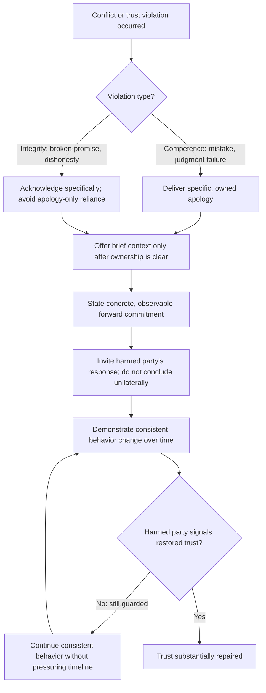

## Repairing Trust After Conflict

### Definition and Scope

Repairing trust after conflict refers to the deliberate, sustained communicative process by which parties restore reliability, credibility, and relational safety following a rupture — whether from a specific incident (a broken commitment, a damaging comment, a failure of judgment) or from accumulated relationship conflict. Trust repair is distinguished from conflict resolution: resolution addresses the substantive issue in dispute, while trust repair addresses the relational damage that occurred regardless of whether the substantive issue was resolved satisfactorily. It is possible to resolve a dispute's content while trust remains damaged, and conversely to repair trust despite an unresolved substantive disagreement (see the "agree to disagree" closure from the prior topic).

### Theoretical Foundations

**Trust as a multidimensional construct**: Organizational trust research (notably Mayer, Davis, and Schoorman's integrative model) decomposes trust into three components — **ability** (competence-based trust), **benevolence** (belief the other party has one's interests at heart), and **integrity** (belief the other party adheres to acceptable principles). Different conflicts damage different dimensions, and repair strategies must target the specific dimension damaged rather than applying a generic apology.

**Violation type and repair strategy fit**: research on trust repair (notably Kim, Ferrin, Cooper, and Dirks) distinguishes **competence-based violations** (a mistake, a failure of ability) from **integrity-based violations** (a betrayal, a broken promise, dishonesty), finding that the effective repair strategy differs by type — an apology (accepting responsibility) tends to repair competence-based trust violations more effectively than integrity-based ones, while for integrity violations, a denial or a reframing paired with consistent subsequent behavior tends to matter more than apology alone, since apology for an integrity breach can paradoxically reinforce the perception of untrustworthiness if not matched by demonstrated change.

**The negativity bias in trust dynamics**: trust is well documented to be asymmetric — it is built slowly through consistent positive interactions but can be damaged rapidly through a single violation, and repaired trust frequently remains more fragile and conditional than trust that was never broken. [Inference] The precise degree of this asymmetry and how fully repaired trust can approach its pre-violation baseline varies by relationship depth, violation severity, and individual differences, and should not be treated as a fixed, universal ratio despite its frequent informal citation as such.

### Core Repair Framework

**Key Points**

- **Acknowledge the specific harm, not a vague generality**: "I'm sorry if anyone was affected" is markedly less effective than naming the concrete action and its concrete impact, since vague acknowledgment can itself read as avoidance of full accountability.
- **Distinguish apology from justification**: an effective repair statement separates taking responsibility from explaining context; explaining too early or too prominently is frequently perceived as excuse-making, even when the explanation is factually accurate and relevant.
- **Demonstrate behavioral change, not only verbal commitment**: because integrity-based trust repair depends disproportionately on consistent subsequent behavior, verbal apology alone is typically insufficient and must be followed by observable change over time.
- **Allow the trust timeline to be led by the harmed party**, not the party seeking repair: pressuring quick forgiveness or an accelerated return to normalcy tends to be perceived as prioritizing the repairer's discomfort over genuine repair.

### The Anatomy of an Effective Repair Statement

1. **Specific acknowledgment**: naming precisely what happened and its impact, in the other party's terms where possible.
2. **Ownership without deflection**: avoiding conditional language ("if I did something wrong") or diffused responsibility ("mistakes were made").
3. **Brief, secondary context** (if relevant): offered only after ownership is unambiguous, and framed as context rather than excuse.
4. **Concrete forward commitment**: a specific, observable change rather than a general promise to "do better."
5. **Space for the other party's response**: an invitation to express the impact from their side, rather than treating the apology as concluding the exchange.

**Example**

Weak: "I'm sorry if my comments in the meeting came across badly — things were tense and I think everyone was a bit on edge." Strong: "In Tuesday's meeting, I dismissed your proposal in front of the team without hearing you out, and I said 'that won't work' before you'd finished explaining it. That undermined you publicly and wasn't fair, especially given the work you'd put in. Going forward, I'm going to let people finish their point before responding, and I'd like to revisit your proposal properly this week. How did that land for you?"

### Illustration: Trust Dimension and Repair Strategy Mapping

(svg_diagram)

<svg xmlns="http://www.w3.org/2000/svg" viewBox="0 0 780 380" font-family="Helvetica, Arial, sans-serif">
<text x="390" y="28" text-anchor="middle" font-size="18" font-weight="bold" fill="#1a1a1a">Violation Type and Repair Strategy Fit (svg_diagram)</text>
<rect x="60" y="70" width="300" height="110" rx="8" fill="#2f6f4f" />
<text x="210" y="100" text-anchor="middle" font-size="13" fill="white" font-weight="bold">Competence-Based Violation</text>
<text x="210" y="122" text-anchor="middle" font-size="11" fill="white">A mistake, a failure of ability</text>
<text x="210" y="142" text-anchor="middle" font-size="11" fill="white">or judgment</text>
<text x="210" y="164" text-anchor="middle" font-size="12" fill="#d4f0e0" font-weight="bold">→ Apology repairs effectively</text>
<rect x="420" y="70" width="300" height="110" rx="8" fill="#b3541e" />
<text x="570" y="100" text-anchor="middle" font-size="13" fill="white" font-weight="bold">Integrity-Based Violation</text>
<text x="570" y="122" text-anchor="middle" font-size="11" fill="white">A betrayal, dishonesty,</text>
<text x="570" y="142" text-anchor="middle" font-size="11" fill="white">a broken promise</text>
<text x="570" y="164" text-anchor="middle" font-size="12" fill="#fde3d0" font-weight="bold">→ Consistent behavior repairs effectively</text>
<rect x="60" y="230" width="660" height="120" rx="8" fill="#eef2f0" stroke="#2f6f4f" stroke-width="1.5" />
<text x="390" y="255" text-anchor="middle" font-size="13" font-weight="bold" fill="#333">Shared Repair Elements (Both Types)</text>
<text x="90" y="280" font-size="12" fill="#333">• Specific acknowledgment of harm, not vague generality</text>
<text x="90" y="300" font-size="12" fill="#333">• Ownership without deflection or conditional framing</text>
<text x="90" y="320" font-size="12" fill="#333">• Concrete forward commitment, observable over time</text>
<text x="90" y="340" font-size="12" fill="#333">• Timeline for restored trust led by the harmed party</text>
</svg>

### Illustration: Trust Repair Process Flow

### Repair at the Team or Organizational Level

When conflict and trust damage extend beyond a dyad (e.g., a leadership decision that damaged team trust broadly), additional considerations apply:

- **Public acknowledgment matched to public harm**: a violation that occurred visibly generally requires a repair statement made with comparable visibility, since private repair alone leaves the broader group's trust unaddressed.
- **Consistency across repeated instances**: repairing trust after a pattern (rather than a single incident) requires demonstrating change across multiple observable instances before broad trust is plausibly restored, and premature claims of change can themselves become a new integrity violation if not sustained.
- **Third-party or structural repair mechanisms**: in some cases, particularly after significant organizational trust damage, structural changes (revised decision processes, added oversight, external facilitation) carry more credibility than verbal commitment alone, since they represent a costlier and thus more credible signal of genuine change.

### Common Failure Modes

- **The non-apology apology**: conditional or passive framing ("mistakes were made," "if anyone felt hurt") that avoids clear ownership and is frequently perceived as more damaging than no apology at all.
- **Over-explaining before owning**: leading with context or justification, which reads as minimizing responsibility even when the intent is genuinely explanatory.
- **Rushing the timeline**: expecting or requesting immediate forgiveness or a return to prior relational closeness, which can retraumatize the harmed party and signal that their experience is secondary to the repairer's comfort.
- **Apology substituting for behavior change**: treating the apology itself as the completion of repair rather than its beginning, particularly damaging for integrity-based violations where subsequent behavior is the primary evidence trust warrants restoration.
- **Repeated apology without changed pattern**: apologizing sincerely but failing to change the underlying behavior, which over successive cycles causes apologies themselves to lose credibility.

### Relationship to Adjacent Skills

- **Navigating disagreement without damaging relationships** — trust repair is frequently required when disagreement has already spilled over into relationship conflict, representing a later-stage intervention than the preventive techniques in that topic.
- **De-escalating tension and defensiveness** — trust repair conversations often begin from a state of residual tension requiring de-escalation before repair work can proceed productively.
- **Delivering critical feedback constructively** — repair conversations frequently involve receiving, not only delivering, critical feedback about the impact of one's own actions, requiring the same non-defensive listening posture.
- **Creating psychological safety in dialogue** — successful trust repair at the individual level contributes to and depends on broader group-level psychological safety.

**Conclusion**

Repairing trust after conflict requires accurately diagnosing whether the violation was competence-based or integrity-based, since the two require materially different repair strategies — apology-centered for the former, consistent demonstrated behavior for the latter — and in both cases requires specific, unhedged acknowledgment of harm followed by concrete forward commitment rather than vague reassurance. Trust, once damaged, is repaired gradually and is led by the harmed party's timeline rather than the repairer's urgency, with apology functioning as the necessary beginning of the process rather than its conclusion.

**Related Topics**

- Mayer-Davis-Schoorman Trust Model (Ability, Benevolence, Integrity)
- Competence vs. Integrity-Based Trust Violations (Kim, Ferrin, Cooper, Dirks)
- Navigating Disagreement Without Damaging Relationships
- De-Escalating Tension and Defensiveness
- Creating Psychological Safety in Dialogue
- Organizational Apology and Accountability Communication
- Structural Trust Repair Mechanisms (Process and Oversight Change)
- Trust Asymmetry and the Negativity Bias in Relationships