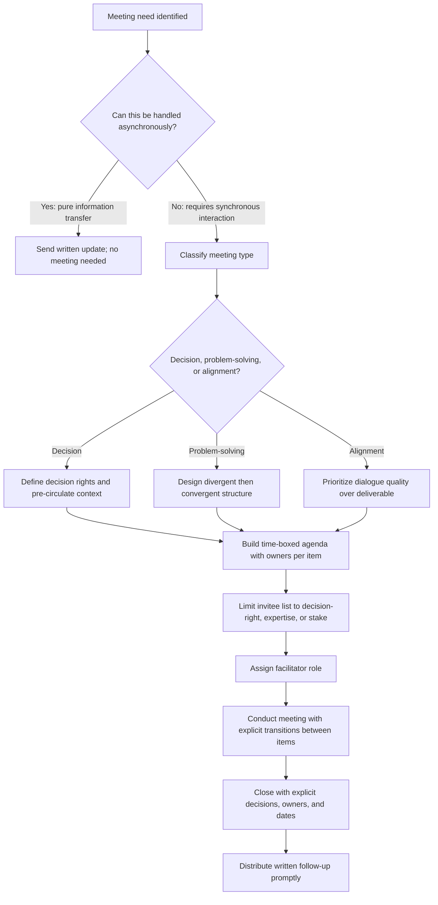

## Structuring Meetings for Clarity and Purpose

### Definition and Scope

Structuring meetings for clarity and purpose refers to the deliberate design of a meeting's objective, agenda, participant composition, and process architecture such that the meeting reliably produces its intended outcome — a decision, alignment, information transfer, or creative output — rather than defaulting to unfocused discussion. Meeting structure is a rhetorical and organizational design discipline: it determines, in advance, what kind of communication the meeting is meant to produce and shapes the environment to make that outcome likely, rather than leaving outcome to the emergent dynamics of whoever speaks most.

### Why Structure Matters: The Cost of Unstructured Meetings

Organizational research on meeting effectiveness consistently identifies unclear purpose, absent agendas, and unclear decision rights as primary drivers of perceived meeting waste, one of the most commonly cited productivity complaints in executive and knowledge-work settings. Unstructured meetings tend to produce several predictable failure patterns: convergence on the most vocal or highest-status participant's view regardless of merit (a groupthink-adjacent dynamic), unclear ownership of resulting action items, and the same decision being re-litigated in a subsequent meeting because the first meeting never actually reached closure.

### The Foundational Question: What Type of Meeting Is This?

**Key Points**

Before any agenda is built, the meeting's fundamental purpose should be classified, since structure appropriate to one type actively undermines another:

- **Decision meetings**: exist to reach and commit to a specific decision; require pre-circulated context, clear decision rights, and an explicit close (what was decided, by whom, effective when).
- **Information-sharing meetings**: exist to transfer knowledge to a group synchronously; frequently the least necessary meeting type, since asynchronous formats (written updates, recorded briefings) often serve this purpose more efficiently, and this type should be actively minimized.
- **Problem-solving / brainstorming meetings**: exist to generate options or diagnose an issue collaboratively; require divergent-then-convergent structure and explicit protection against premature evaluation of ideas.
- **Relationship / alignment meetings**: exist to build shared understanding, trust, or cross-functional coordination rather than to produce a discrete deliverable; require different success criteria (quality of dialogue) than decision meetings (quality of outcome).

Conflating these types — most commonly, treating a decision meeting as if it were an open-ended discussion — is among the most common structural failures in executive meeting practice.

### Core Structural Components

**Pre-Meeting Design**

- **A single, explicit purpose statement**: stated as an outcome ("decide whether to proceed with Vendor A") rather than a topic ("vendor discussion"), since topic-framed purposes invite open-ended discussion rather than closure.
- **Pre-circulated materials**: context, data, or proposals distributed in advance so meeting time is spent on discussion and decision rather than initial information absorption — a practice associated with markedly more efficient use of synchronous time in executive settings.
- **Deliberate invitee list**: attendance limited to those with a genuine decision-right, relevant expertise, or direct stake, since each additional attendee increases coordination cost and can dilute accountability (the diffusion-of-responsibility effect in group decision-making).
- **Explicit decision rights stated in advance**: clarity on who has final authority (a single decision-maker, a defined voting body, group consensus) prevents the common failure of a meeting appearing to reach agreement that is later overridden unilaterally.

**In-Meeting Structure**

- **Time-boxed agenda items**, each with an explicit owner and a stated objective (inform, discuss, decide).
- **Explicit transitions between agenda items**, verbally marking closure of one topic before opening the next, which prevents the common drift of unresolved tangents consuming disproportionate time.
- **A designated facilitator role**, distinct from the primary content contributor where possible, responsible for time, participation balance, and staying on the stated objective.

**Closure and Follow-Through**

- **Explicit restatement of decisions made and actions assigned**, with named owners and dates, at the meeting's close rather than left implicit.
- **Written follow-up distributed promptly**, functioning as the durable record against which accountability is later measured.

### Illustration: Meeting Type to Structure Mapping

(svg_diagram)

<svg xmlns="http://www.w3.org/2000/svg" viewBox="0 0 780 420" font-family="Helvetica, Arial, sans-serif">
<text x="390" y="28" text-anchor="middle" font-size="18" font-weight="bold" fill="#1a1a1a">Meeting Type and Structural Requirements (svg_diagram)</text>
<rect x="40" y="60" width="340" height="90" rx="8" fill="#2f4f6f" />
<text x="210" y="85" text-anchor="middle" font-size="13" fill="white" font-weight="bold">Decision Meeting</text>
<text x="210" y="105" text-anchor="middle" font-size="11" fill="white">Pre-circulated context, clear decision</text>
<text x="210" y="122" text-anchor="middle" font-size="11" fill="white">rights, explicit close</text>
<rect x="400" y="60" width="340" height="90" rx="8" fill="#7a3b8c" />
<text x="570" y="85" text-anchor="middle" font-size="13" fill="white" font-weight="bold">Information-Sharing</text>
<text x="570" y="105" text-anchor="middle" font-size="11" fill="white">Minimize; prefer async format</text>
<text x="570" y="122" text-anchor="middle" font-size="11" fill="white">where possible</text>
<rect x="40" y="180" width="340" height="90" rx="8" fill="#2f6f4f" />
<text x="210" y="205" text-anchor="middle" font-size="13" fill="white" font-weight="bold">Problem-Solving</text>
<text x="210" y="225" text-anchor="middle" font-size="11" fill="white">Divergent-then-convergent structure,</text>
<text x="210" y="242" text-anchor="middle" font-size="11" fill="white">protect against premature evaluation</text>
<rect x="400" y="180" width="340" height="90" rx="8" fill="#b3541e" />
<text x="570" y="205" text-anchor="middle" font-size="13" fill="white" font-weight="bold">Relationship / Alignment</text>
<text x="570" y="225" text-anchor="middle" font-size="11" fill="white">Success = dialogue quality,</text>
<text x="570" y="242" text-anchor="middle" font-size="11" fill="white">not discrete deliverable</text>
<rect x="60" y="300" width="660" height="90" rx="8" fill="#eef2f0" stroke="#333" stroke-width="1.5" />
<text x="390" y="325" text-anchor="middle" font-size="13" font-weight="bold" fill="#333">Common Failure: Conflating Types</text>
<text x="90" y="350" font-size="12" fill="#333">Treating a decision meeting as open-ended discussion prevents closure;</text>
<text x="90" y="370" font-size="12" fill="#333">treating an alignment meeting as a decision meeting suppresses dialogue value.</text>
</svg>

### Illustration: Meeting Design Decision Flow

### Worked Example: Converting an Unstructured Meeting

**Example**

Original invite: "Marketing sync — 60 min, all-team." Restructured: Purpose stated as "Decide Q3 campaign budget allocation across three proposed channels" (60 min → reduced to 30 min once purpose was clarified as decision, not general discussion); invitee list reduced from 11 to 5 (only those with budget input or approval authority); proposal document pre-circulated 48 hours prior; agenda time-boxed as 5 min context recap, 15 min discussion of trade-offs, 10 min decision, with the budget owner named as final decision-maker in advance to prevent the meeting from ending in ambiguous "let's think about it" non-closure.

### Common Failure Modes

- **Topic-framed rather than outcome-framed purpose**: "discuss the roadmap" invites open-ended conversation with no natural endpoint, unlike an outcome-framed purpose that defines what closure looks like.
- **Invitee list inflation**: including attendees for visibility or courtesy rather than genuine stake, which increases coordination cost and diffuses accountability for the outcome.
- **No pre-circulation**: using synchronous time for initial information absorption rather than discussion, which is a documented driver of meeting inefficiency.
- **Ambiguous decision rights**: a meeting that appears to reach consensus but is later overridden by an unnamed higher authority, which damages trust in the meeting process itself over repeated instances.
- **No explicit close**: ending a meeting without restating decisions and owners, relying on participants' independent (and frequently divergent) recollections of what was agreed.
- **Recurring meetings that outlive their purpose**: standing meetings that continue on inertia after their original decision or coordination need has resolved, consuming time without corresponding value.

### Relationship to Adjacent Skills

Meeting structure functions as the container within which the other dialogic and conflict-management skills in this course operate:

- **Psychological safety** — structural choices (e.g., pre-circulation, explicit turn structures) directly enable or suppress safety within the meeting.
- **Listening across hierarchy and power dynamics** — meeting structure (speaking order, facilitator role) is one of the most direct levers available for counteracting status-based listening distortion in real time.
- **Facilitation technique** (addressed in a related item) governs how the structure is executed live; structure is the design, facilitation is the execution.

**Conclusion**

Structuring meetings for clarity and purpose requires classifying the meeting's fundamental type before designing its agenda, since decision, information-sharing, problem-solving, and alignment meetings each demand materially different structures, and applying the wrong structure undermines the meeting's actual purpose. Deliberate design of purpose framing, invitee list, pre-circulation, time-boxing, and explicit closure converts meetings from a default venue for unfocused discussion into a reliable mechanism for producing their intended organizational outcome.

**Related Topics**

- Meeting Type Classification (Decision, Information, Problem-Solving, Alignment)
- Facilitation Techniques for Balanced Participation
- Decision Rights and RACI Frameworks in Meeting Design
- Listening Across Hierarchy and Power Dynamics
- Asynchronous Communication as a Meeting Alternative
- Groupthink and Diffusion of Responsibility in Group Settings
- Action Item Ownership and Follow-Through Systems
- Time-Boxing and Agenda Design Techniques