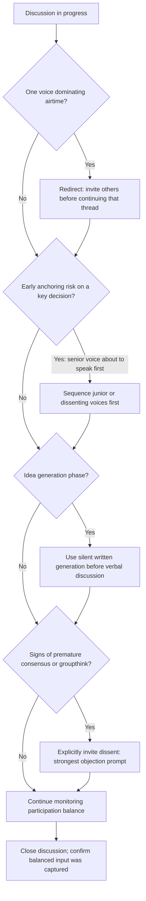

## Facilitating Balanced Discussion and Participation

### Definition and Scope

Facilitating balanced discussion and participation refers to the real-time practice of managing a meeting's conversational dynamics so that relevant perspectives are surfaced proportionate to their value rather than to the speaker's confidence, status, or verbal dominance. This is the live execution complement to meeting structure (addressed in the prior topic): structure designs the container in advance, while facilitation actively manages what happens within it as the conversation unfolds unpredictably. The facilitator's core function is to separate the value of a contribution from the volume, timing, or status with which it is delivered.

### Why Unfacilitated Discussion Skews

**Production blocking and airtime concentration**: absent active facilitation, research on group discussion dynamics consistently finds that a small number of participants — frequently the most senior, most extroverted, or first to speak — account for a disproportionate share of total airtime, while quieter or lower-status participants contribute substantially less regardless of the quality of their input.

**Anchoring effects**: the first substantive opinion expressed in a discussion exerts disproportionate influence on subsequent contributions (a documented anchoring bias in group judgment), meaning speaking order itself — not merely who speaks — shapes outcomes independent of argument quality.

**Groupthink and premature consensus**: Irving Janis's classic groupthink research identifies that cohesive groups under time pressure, particularly with a directive leader speaking early, tend toward premature convergence and suppressed dissent, producing lower-quality decisions than the same group would reach under conditions of structured, balanced input.

**Extraversion-competence conflation**: group members frequently (and inaccurately) infer competence from talkativeness, a documented bias in group perception research, meaning unfacilitated discussion systematically privileges confident delivery over content quality.

### Core Facilitation Techniques

**Key Points**

- **Structured turn-taking**: explicitly inviting input in a defined order (e.g., round-robin, or deliberately inviting quieter participants by name) rather than relying on organic volunteering, which counteracts airtime concentration directly.
- **Silencing the loudest voice tactically**: not through exclusion, but through explicit redirection ("let's hear from a few others before we go deeper on this") when one perspective is dominating disproportionately.
- **Sequencing to reduce anchoring**: in decision-relevant discussions, deliberately inviting junior, quieter, or dissenting voices before senior or majority voices speak, reversing the natural status-order default.
- **Written or silent input phases**: incorporating brief silent writing (individual idea generation before group discussion) counteracts both production blocking and anchoring, since ideas are captured before the group's collective framing takes hold.
- **Explicit invitation of dissent**: directly asking "who sees this differently" or "what's the strongest objection to this," which authorizes contribution that would otherwise be self-censored (connecting directly to psychological safety and hierarchy-aware listening).
- **Neutral process stance**: an effective facilitator manages the conversational process (who speaks, when, for how long) without simultaneously advocating for a particular content position, since combining the two roles compromises the facilitator's perceived neutrality and undermines balanced participation.

### The Brainwriting / Silent Generation Technique

A specific, well-evidenced technique for problem-solving and brainstorming meetings: participants individually and silently generate ideas in writing before any verbal discussion begins. This directly addresses two documented weaknesses of purely verbal brainstorming — production blocking (only one person can speak at a time, limiting total idea throughput) and evaluation apprehension (fear of judgment suppressing idea generation) — and has been shown in group creativity research to produce a greater volume and diversity of ideas than unstructured verbal brainstorming alone.

### Illustration: Airtime Distribution — Unfacilitated vs. Facilitated

(svg_diagram)

<svg xmlns="http://www.w3.org/2000/svg" viewBox="0 0 780 420" font-family="Helvetica, Arial, sans-serif">
<text x="390" y="28" text-anchor="middle" font-size="18" font-weight="bold" fill="#1a1a1a">Airtime Distribution: Unfacilitated vs. Facilitated (svg_diagram)</text>

<text x="190" y="60" text-anchor="middle" font-size="13" font-weight="bold" fill="#333">Unfacilitated Discussion</text>

<rect x="60" y="80" width="260" height="30" fill="`#b3541e`" />

<text x="330" y="100" font-size="11" fill="#333">Participant A (senior)</text>

<rect x="60" y="120" width="150" height="30" fill="`#c98a5e`" />

<text x="220" y="140" font-size="11" fill="#333">Participant B</text>

<rect x="60" y="160" width="40" height="30" fill="`#e0c4b0`" />

<text x="110" y="180" font-size="11" fill="#333">Participant C</text>

<rect x="60" y="200" width="15" height="30" fill="`#f0e0d5`" />

<text x="85" y="220" font-size="11" fill="#333">Participant D (silent)</text>

<text x="590" y="60" text-anchor="middle" font-size="13" font-weight="bold" fill="#333">Facilitated Discussion</text>

<rect x="460" y="80" width="130" height="30" fill="`#2f6f4f`" />

<text x="600" y="100" font-size="11" fill="#333">Participant A</text>

<rect x="460" y="120" width="120" height="30" fill="`#3f8a63`" />

<text x="590" y="140" font-size="11" fill="#333">Participant B</text>

<rect x="460" y="160" width="115" height="30" fill="`#4fa377`" />

<text x="585" y="180" font-size="11" fill="#333">Participant C</text>

<rect x="460" y="200" width="100" height="30" fill="`#6fbb90`" />

<text x="570" y="220" font-size="11" fill="#333">Participant D</text>

<rect x="40" y="280" width="700" height="110" rx="8" fill="#eef2f0" stroke="#333" stroke-width="1.5" />
<text x="390" y="305" text-anchor="middle" font-size="13" font-weight="bold" fill="#333">Facilitation Levers Used</text>
<text x="70" y="328" font-size="12" fill="#333">• Structured turn-taking / round-robin invitation</text>
<text x="70" y="348" font-size="12" fill="#333">• Deliberate sequencing: quieter voices before senior voices</text>
<text x="70" y="368" font-size="12" fill="#333">• Silent written idea generation before open discussion</text>
</svg>

### Illustration: Real-Time Facilitation Decision Flow

### Facilitator Role Design

- **Dedicated facilitator vs. facilitator-as-participant**: for high-stakes or contentious discussions, a facilitator who is not simultaneously the primary content stakeholder can maintain neutrality more credibly than a facilitator who is also advocating for an outcome.
- **Rotating facilitation**: distributing the facilitator role across team members over time can build broader organizational facilitation capability and reduce the perception that facilitation itself is a status-linked function.
- **Facilitator intervention calibration**: interventions should be proportionate — frequent, heavy-handed redirection can itself suppress natural conversational flow and organic dialogue quality, so facilitation technique requires judgment about when structure serves balance versus when it becomes an obstacle to it.

### Common Failure Modes

- **Facilitator-as-advocate**: a facilitator who uses the role to steer content toward their own preferred outcome, which undermines the perceived legitimacy of the entire facilitated process once recognized.
- **Over-reliance on volunteering**: assuming that participants who want to speak will do so, ignoring the well-documented tendency for quieter or lower-status voices to require explicit invitation.
- **Token invitation without genuine engagement**: asking a quiet participant "anything to add?" late in a discussion, after the group's framing has already solidified, which technically satisfies inclusion without materially affecting outcome (sometimes termed "contrived" participation).
- **Ignoring nonverbal signals of disengagement or suppressed dissent**: facilitation that manages only verbal turn-taking while missing visible signs (hesitation, body language, sidebar comments) that a participant has something unsaid.
- **False balance**: treating all viewpoints as equally weighted in the room regardless of relevant expertise, which can degrade decision quality even while achieving surface-level participatory balance.

### Relationship to Adjacent Skills

- **Structuring meetings for clarity and purpose** — facilitation technique executes live within the container that structure design establishes in advance; weak structure makes facilitation substantially harder regardless of in-the-moment skill.
- **Listening across hierarchy and power dynamics** — facilitation is one of the most direct behavioral levers for counteracting the status-based listening and speaking distortions covered in that topic.
- **Creating psychological safety in dialogue** — explicit invitation of dissent and protection of quieter voices are concrete facilitation behaviors that build the broader climate of safety over repeated instances.

**Conclusion**

Facilitating balanced discussion and participation requires actively counteracting the well-documented tendency of unstructured group discussion to concentrate airtime among the most senior, confident, or early-speaking participants, through deliberate techniques — structured turn-taking, reversed speaking-order sequencing, silent idea generation, and explicit invitation of dissent — applied with calibrated, non-advocacy-driven judgment. Facilitation converts group discussion from a default contest of verbal dominance into a process more likely to surface the full range of relevant perspective and expertise present in the room.

**Related Topics**

- Structuring Meetings for Clarity and Purpose
- Groupthink and Premature Consensus (Irving Janis)
- Brainwriting and Silent Idea Generation Techniques
- Anchoring Effects in Group Judgment and Decision-Making
- Listening Across Hierarchy and Power Dynamics
- Creating Psychological Safety in Dialogue
- Extraversion-Competence Bias in Group Perception
- Rotating Facilitation and Organizational Facilitation Capability