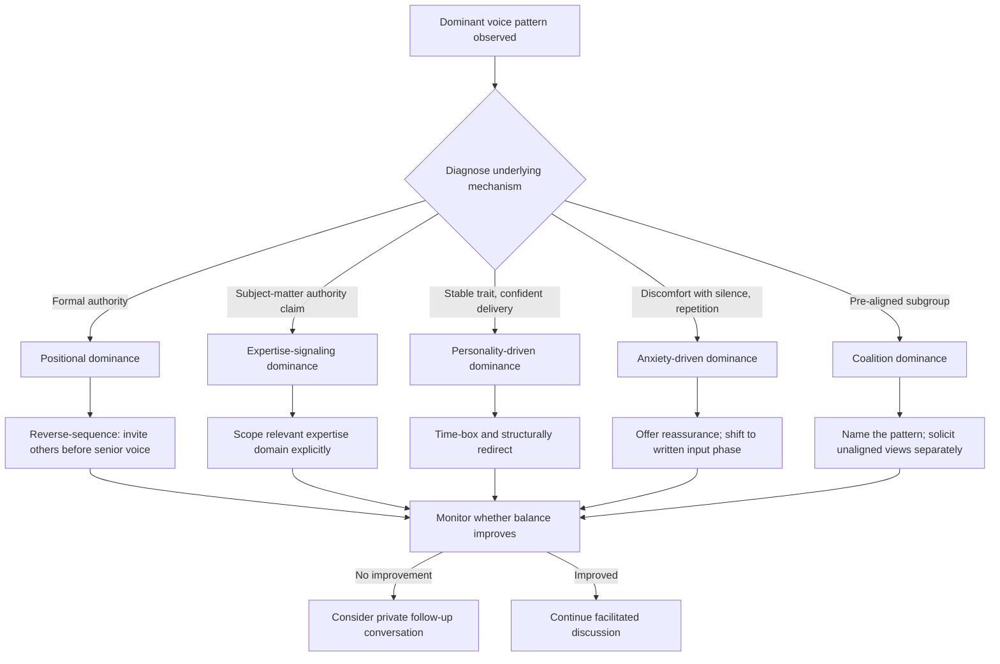

## Managing Dominant Voices and Group Dynamics

### Definition and Scope

Managing dominant voices and group dynamics refers to the specific facilitation competency of identifying and intervening on patterns of disproportionate influence within a group — whether from a single overtalking individual, a coalition-based subgroup, or a status-driven deference pattern — while preserving both the dominant participant's dignity and the group's overall functioning. This topic extends the general facilitation principles of the prior item to focus specifically on diagnosing *why* a voice has become dominant and selecting an intervention calibrated to that specific cause, since a technique effective against confident overtalking may be ineffective or counterproductive against status-based deference.

### Typology of Dominance Patterns

**Key Points**

Dominance in group settings arises from distinct underlying mechanisms, and effective intervention depends on correct diagnosis:

- **Positional dominance**: influence flowing from formal authority (the most senior person in the room), where group members defer regardless of content quality — the mechanism most closely tied to hierarchy and power dynamics.
- **Expertise-signaling dominance**: a participant with genuine or perceived subject-matter authority whose contributions are weighted more heavily, sometimes appropriately (genuine expertise) and sometimes disproportionately (perceived expertise exceeding actual relevance to the specific question).
- **Personality-driven dominance**: talkativeness or assertiveness as a stable individual trait, independent of formal authority or expertise, that consumes disproportionate airtime through sheer conversational volume and confidence.
- **Anxiety-driven dominance**: overtalking that stems from discomfort with silence or uncertainty rather than confidence, sometimes manifesting as filling pauses, repeating points, or pre-empting others' contributions.
- **Coalition dominance**: a subgroup with pre-existing alignment (prior conversations, shared interest) that amplifies a shared position through mutual reinforcement, making a minority-held view appear more broadly supported than it is.

### Diagnostic-to-Intervention Mapping

**Positional dominance** → structural sequencing (invite lower-status voices first, as covered in the prior facilitation topic), and where appropriate, direct private conversation with the senior individual about the pattern's effect on group input quality.

**Expertise-signaling dominance** → explicitly scoping the domain of relevant expertise for the current question ("this specific decision is more about customer experience than technical feasibility, so let's hear from that side first"), which recalibrates whose input is weighted heavily for this particular question rather than globally.

**Personality-driven dominance** → time-boxing individual contributions explicitly, structured turn-taking, and direct but respectful redirection in the moment ("let's pause there and bring in a couple of other views").

**Anxiety-driven dominance** → distinct from the above, this pattern often responds poorly to redirection alone (which can increase anxiety and overtalking) and better to explicit reassurance about pacing, or a structured written-input phase that reduces the real-time pressure driving the behavior.

**Coalition dominance** → explicitly naming the pattern ("it sounds like this view has been discussed before this meeting — let's hear from people encountering this for the first time"), and structurally separating individual input (private written or one-on-one) from group discussion to surface non-aligned views before coalition framing takes hold.

### Illustration: Dominance Pattern Diagnostic Matrix

(svg_diagram)

<svg xmlns="http://www.w3.org/2000/svg" viewBox="0 0 780 440" font-family="Helvetica, Arial, sans-serif">
<text x="390" y="28" text-anchor="middle" font-size="18" font-weight="bold" fill="#1a1a1a">Dominance Pattern Diagnosis and Intervention (svg_diagram)</text>
<rect x="30" y="55" width="220" height="30" fill="#2f4f6f" />
<text x="140" y="76" text-anchor="middle" font-size="12" fill="white" font-weight="bold">Pattern</text>
<rect x="260" y="55" width="490" height="30" fill="#2f4f6f" />
<text x="505" y="76" text-anchor="middle" font-size="12" fill="white" font-weight="bold">Primary Intervention</text>
<rect x="30" y="85" width="220" height="55" fill="#eef2f0" />
<text x="45" y="107" font-size="11" fill="#333">Positional (authority-based)</text>
<text x="45" y="124" font-size="10" fill="#666">senior voice deferred to regardless</text>
<rect x="260" y="85" width="490" height="55" fill="#f7f9f8" />
<text x="275" y="107" font-size="11" fill="#333">Reverse-sequence speaking order;</text>
<text x="275" y="124" font-size="11" fill="#333">private conversation on pattern effect</text>
<rect x="30" y="140" width="220" height="55" fill="#eef2f0" />
<text x="45" y="162" font-size="11" fill="#333">Expertise-signaling</text>
<text x="45" y="179" font-size="10" fill="#666">perceived authority exceeds relevance</text>
<rect x="260" y="140" width="490" height="55" fill="#f7f9f8" />
<text x="275" y="162" font-size="11" fill="#333">Explicitly scope relevant expertise</text>
<text x="275" y="179" font-size="11" fill="#333">domain for the specific question</text>
<rect x="30" y="195" width="220" height="55" fill="#eef2f0" />
<text x="45" y="217" font-size="11" fill="#333">Personality-driven</text>
<text x="45" y="234" font-size="10" fill="#666">stable trait, high verbal volume</text>
<rect x="260" y="195" width="490" height="55" fill="#f7f9f8" />
<text x="275" y="217" font-size="11" fill="#333">Time-box contributions;</text>
<text x="275" y="234" font-size="11" fill="#333">structured turn-taking, direct redirection</text>
<rect x="30" y="250" width="220" height="55" fill="#eef2f0" />
<text x="45" y="272" font-size="11" fill="#333">Anxiety-driven</text>
<text x="45" y="289" font-size="10" fill="#666">discomfort with silence or uncertainty</text>
<rect x="260" y="250" width="490" height="55" fill="#f7f9f8" />
<text x="275" y="272" font-size="11" fill="#333">Reassurance on pacing;</text>
<text x="275" y="289" font-size="11" fill="#333">written input phase over live redirection</text>
<rect x="30" y="305" width="220" height="55" fill="#eef2f0" />
<text x="45" y="327" font-size="11" fill="#333">Coalition-based</text>
<text x="45" y="344" font-size="10" fill="#666">pre-aligned subgroup amplification</text>
<rect x="260" y="305" width="490" height="55" fill="#f7f9f8" />
<text x="275" y="327" font-size="11" fill="#333">Name the pattern; separate individual</text>
<text x="275" y="344" font-size="11" fill="#333">input from group framing</text>

<text x="390" y="400" text-anchor="middle" font-size="12" fill="`#b3541e`" font-weight="bold">Misdiagnosis risk: redirecting anxiety-driven overtalking as if personality-driven</text>

<text x="390" y="418" text-anchor="middle" font-size="11" fill="#666">can increase rather than reduce the behavior</text>

</svg>

### Illustration: In-the-Moment Intervention Flow

### Worked Example: Distinguishing Two Similar-Looking Cases

**Example**

Case A: A senior engineer repeatedly answers questions directed at other team members before they can respond, citing extensive experience. Diagnosis: expertise-signaling dominance, likely with genuine underlying expertise but miscalibrated to the current question's actual domain. Intervention: "I want to hear how the product and support teams are seeing this specific issue first, since it's really a usage pattern question — we'll come back to the technical feasibility after." Case B: A newer team member speaks frequently, often restating points already made, and visibly tenses during pauses. Diagnosis: anxiety-driven dominance. Intervention (different from Case A despite superficially similar overtalking): "Let's take two minutes to jot down thoughts individually before we continue — no pressure to have it fully formed." Applying Case A's expertise-scoping technique to Case B would likely misdiagnose and fail to address the underlying driver.

### The Direct Private Conversation

For persistent dominance patterns — particularly positional dominance from a senior leader unaware of their effect — an in-meeting facilitation technique alone is often insufficient, and a direct, private conversation is frequently necessary. This conversation should apply the principles from **Delivering Critical Feedback Constructively**: specific, behavior-level observation ("in the last three meetings, you've responded to a question before the person it was addressed to could answer") and impact ("the team has told me they hold back because of this"), rather than a vague or trait-based characterization ("you talk too much").

### Common Failure Modes

- **Misdiagnosis leading to counterproductive intervention**: applying a redirection technique suited to confident overtalking against an anxiety-driven pattern, which can increase rather than reduce the behavior.
- **Public confrontation of positional dominance**: directly challenging a senior leader's dominance pattern in front of the group, which frequently damages the facilitator's own standing and can provoke defensive escalation rather than behavior change.
- **Treating all dominance as illegitimate**: some instances of concentrated airtime reflect genuine, relevant expertise appropriately weighted; the goal is proportionate influence, not mechanically equal airtime regardless of relevance.
- **Avoidance due to conflict aversion**: failing to intervene at all due to discomfort managing a senior or forceful personality, which allows the pattern to compound and can itself damage broader group trust in the facilitation process.
- **Coalition-blindness**: treating apparent group consensus as genuine when it reflects pre-meeting alignment among a subset of participants rather than independently formed views.

### Relationship to Adjacent Skills

- **Facilitating balanced discussion and participation** — this topic provides the diagnostic layer beneath the general facilitation techniques covered there; general techniques are more effective when matched to the correct underlying dominance mechanism.
- **Listening across hierarchy and power dynamics** — positional dominance is a direct manifestation of the hierarchy-driven listening and speaking distortions covered in that topic.
- **Delivering critical feedback constructively** — the private follow-up conversation for persistent dominance patterns applies the SBI structure and framing principles from that topic directly.
- **De-escalating tension and defensiveness** — direct redirection of a dominant voice, especially in the moment, carries some risk of provoking defensiveness and should be delivered with the tone-calibration techniques covered there.

**Conclusion**

Managing dominant voices effectively requires first correctly diagnosing the underlying mechanism — positional authority, expertise signaling, personality trait, anxiety, or coalition alignment — since these patterns look superficially similar but respond to different, sometimes opposite, interventions. Skilled facilitators pair real-time structural techniques (sequencing, time-boxing, explicit scoping) with, when necessary, direct private conversation grounded in specific behavioral feedback, always calibrated to preserve both the dominant participant's dignity and the group's capacity for balanced, high-quality input.

**Related Topics**

- Facilitating Balanced Discussion and Participation
- Listening Across Hierarchy and Power Dynamics
- Delivering Critical Feedback Constructively
- De-Escalating Tension and Defensiveness
- Groupthink and Premature Consensus (Irving Janis)
- Coalition Dynamics and Pre-Meeting Alignment Effects
- Status and Expertise Signaling in Group Judgment
- Structuring Meetings for Clarity and Purpose