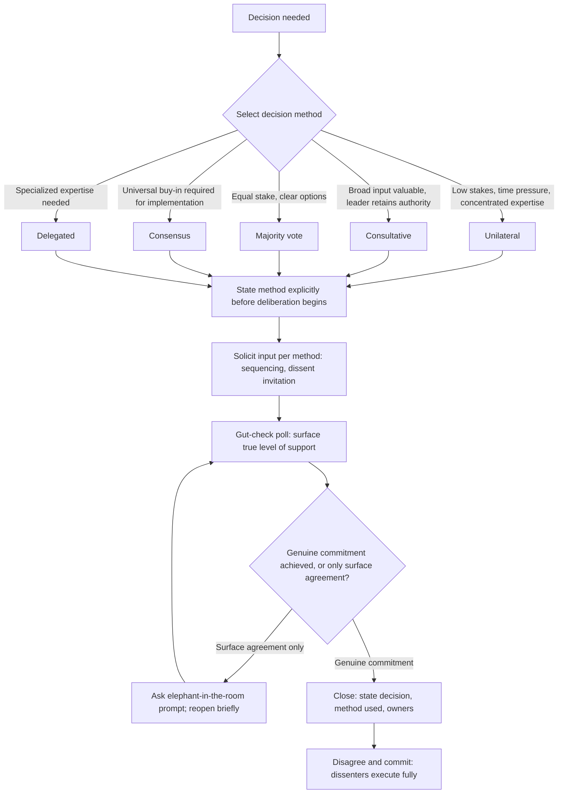

## Driving Decisions and Building Consensus

### Definition and Scope

Driving decisions and building consensus refers to the facilitation competency of moving a group from divergent input toward a committed outcome, selecting and applying a decision-making process appropriate to the situation, and securing genuine (not merely surface-level) buy-in from participants. This topic addresses the closing phase of group deliberation — where the prior facilitation topics (structuring meetings, balancing participation, managing dominant voices) create the conditions for good input, this topic addresses converting that input into action. A critical distinction underlies the entire topic: **consensus** (a specific decision-making process requiring broad agreement) is one of several legitimate decision methods, not a synonym for "good group decision-making," and misapplying consensus where it is not warranted is among the most common causes of decision paralysis in executive settings.

### Decision-Making Methods: A Taxonomy

**Key Points**

- **Unilateral decision (leader decides)**: fastest, appropriate when stakes are low, expertise is concentrated, or time pressure is high; risks lower buy-in and missed information if used where broader input would have added value.
- **Consultative decision (leader decides after input)**: the leader retains final authority but actively solicits and demonstrably considers input before deciding; balances speed with information quality and is often the best default for most executive decisions.
- **Democratic/majority vote**: appropriate when the group has genuinely equal stake and authority, and when a clear, binary or small set of options exists; risks a dissatisfied minority and can mask the intensity of disagreement (a 51-49 vote is treated identically to a 90-10 vote despite very different implications for implementation).
- **Consensus (full agreement)**: appropriate only when the decision requires universal buy-in for successful implementation (e.g., a shared operating norm the whole team must uphold) and when time permits extended deliberation; frequently misapplied to decisions that do not require unanimous commitment, causing unnecessary delay.
- **Delegated decision**: authority explicitly transferred to an individual or subgroup, useful for decisions requiring specialized expertise not held by the broader group.

**A note on "consensus" in common usage**: outside its technical meaning, "consensus" is frequently used loosely to mean simply "a decision most people are comfortable with," which is more accurately described as a consultative decision with broad support — using precise terminology in advance (stating explicitly which method will govern a given decision) prevents the common failure where participants believe they are being asked to reach consensus when the actual process is consultative.

### The "Disagree and Commit" Principle

Associated with executive decision-making practice (notably articulated by Andy Grove and adopted widely in technology and operational leadership), disagree and commit addresses a specific failure mode of consensus-seeking: waiting for full agreement before acting, even when time-sensitive decisions require movement. The principle holds that team members should have genuine opportunity to voice disagreement during deliberation, but once a decision is made by the appropriate authority, all members — including those who disagreed — commit fully to its execution rather than continuing to relitigate or passively undermine it. This requires the decision-maker to have genuinely heard dissenting views (distinguishing it from simply overriding objections) and requires dissenters to distinguish between having been heard and having gotten their preferred outcome.

### Building Genuine Buy-In

**Surface agreement vs. genuine commitment**: a group can appear to reach agreement in the room (often due to social pressure, fatigue, or deference to a senior voice — see prior topics on dominant voices and groupthink) while individual commitment to implementation remains low, a gap that surfaces later as passive resistance, slow execution, or renewed litigation of the decision. Techniques to surface true commitment before closing a decision include:

- **Explicit gut-check polling**: asking each participant directly (not just for a show of hands, but for a stated level of support, e.g., "on a scale of comfortable to strongly opposed") surfaces disagreement that silence or nodding would have masked.
- **The "elephant in the room" prompt**: explicitly asking "what hasn't been said yet" before closing, which creates a final, deliberate opportunity for suppressed dissent to surface.
- **Testing for compliance vs. commitment**: distinguishing participants who will execute minimally versus those who will actively advocate for the decision's success, since the former often signals unaddressed concern requiring further discussion before closing.

### Illustration: Decision Method Selection

(svg_diagram)

<svg xmlns="http://www.w3.org/2000/svg" viewBox="0 0 780 420" font-family="Helvetica, Arial, sans-serif">
<text x="390" y="28" text-anchor="middle" font-size="18" font-weight="bold" fill="#1a1a1a">Decision Method Selection Matrix (svg_diagram)</text>
<line x1="80" y1="360" x2="720" y2="360" stroke="#333" stroke-width="2" />
<line x1="80" y1="360" x2="80" y2="60" stroke="#333" stroke-width="2" />
<text x="400" y="395" text-anchor="middle" font-size="12" fill="#333">Need for Broad Buy-In →</text>
<text x="40" y="210" text-anchor="middle" font-size="12" fill="#333" transform="rotate(-90 40,210)">Time Available →</text>
<rect x="100" y="300" width="180" height="40" fill="#2f4f6f" />
<text x="190" y="325" text-anchor="middle" font-size="12" fill="white" font-weight="bold">Unilateral</text>
<rect x="300" y="230" width="180" height="40" fill="#3f6a8c" />
<text x="390" y="255" text-anchor="middle" font-size="12" fill="white" font-weight="bold">Consultative</text>
<rect x="500" y="150" width="180" height="40" fill="#2f6f4f" />
<text x="590" y="175" text-anchor="middle" font-size="12" fill="white" font-weight="bold">Consensus</text>
<rect x="300" y="150" width="150" height="40" fill="#7a3b8c" />
<text x="375" y="175" text-anchor="middle" font-size="12" fill="white" font-weight="bold">Majority Vote</text>
<rect x="100" y="150" width="150" height="40" fill="#b3541e" />
<text x="175" y="175" text-anchor="middle" font-size="12" fill="white" font-weight="bold">Delegated</text>
</svg>

### Illustration: Decision-Driving Process Flow

### Worked Example

**Example**

A product team must decide whether to delay a launch. The leader states explicitly at the outset: "I'll make this call after hearing everyone out — this is consultative, not a vote." After structured input (including deliberately sequencing the most junior engineer's concerns before the senior architect's, per prior facilitation technique), the leader polls for comfort level rather than assuming silence means agreement: two team members rate themselves "reluctantly comfortable" rather than "supportive." The leader asks what would move them to genuine support, surfaces a specific mitigation neither had voiced, and incorporates it into the final decision before closing: "We're delaying two weeks, with the added QA pass you both flagged. I heard the concern about morale from delay — that's real, and I'm making the call anyway because I think the risk of not delaying is higher. I need everyone fully behind this once we leave the room."

### Common Failure Modes

- **Consensus-seeking where unwarranted**: applying full-agreement consensus process to decisions that only required consultative input, causing unnecessary delay and enabling a single holdout to block otherwise sound decisions.
- **Silence mistaken for agreement**: closing a decision without actively polling, allowing unaddressed dissent to surface later as passive resistance (directly connecting to the hierarchy-aware listening principle that silence is frequently a product of filtering, not genuine consensus).
- **Announcing "consensus" for a decision that was actually unilateral**: framing a leader's predetermined decision as consensus-based to manufacture the appearance of buy-in, which is typically detected by participants and damages trust in future facilitated processes.
- **Commit without genuine hearing**: invoking "disagree and commit" prematurely, before dissenting views have been substantively heard and considered, which converts a legitimate decision-acceleration principle into a tool for suppressing dissent.
- **Relitigating after commitment**: team members who agreed to commit but continue to undermine or revisit the decision in subsequent settings, eroding the credibility of the decision process itself.

### Relationship to Adjacent Skills

- **Facilitating balanced discussion and participation** — the input-gathering techniques from that topic (sequencing, silent generation, dissent invitation) directly feed the quality of input available when driving toward decision.
- **Managing dominant voices and group dynamics** — unaddressed dominance patterns frequently produce false consensus, since a dominant voice can suppress the dissent that a genuine gut-check would otherwise surface.
- **Navigating disagreement without damaging relationships** — disagree and commit depends on the same interest-based, non-personalized disagreement handling covered there to ensure dissent is processed constructively rather than becoming relationship conflict.
- **Structuring meetings for clarity and purpose** — stating the decision method explicitly (unilateral, consultative, consensus) is itself a structural design choice that should be made before the meeting, not improvised during it.

**Conclusion**

Driving decisions and building consensus requires first selecting the decision-making method appropriate to the situation's stakes, time constraints, and buy-in requirements — rather than defaulting to full consensus regardless of fit — and then actively surfacing genuine commitment through explicit polling and dissent invitation rather than mistaking silence or social pressure for agreement. The disagree-and-commit principle allows time-sensitive decisions to proceed despite residual disagreement, but only functions legitimately when dissenting views have first been genuinely heard, distinguishing principled decision-acceleration from the suppression of dissent it can otherwise resemble.

**Related Topics**

- Decision Method Taxonomy (Unilateral, Consultative, Majority, Consensus, Delegated)
- Disagree and Commit Principle (Andy Grove)
- Facilitating Balanced Discussion and Participation
- Managing Dominant Voices and Group Dynamics
- Groupthink and Premature Consensus (Irving Janis)
- Navigating Disagreement Without Damaging Relationships
- RACI and Decision Rights Frameworks
- Listening Across Hierarchy and Power Dynamics