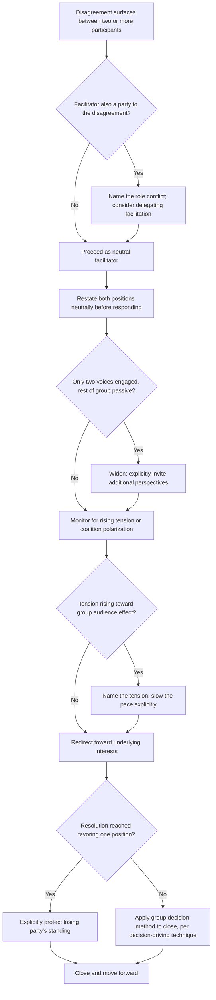

## Handling Disagreement in Group Settings

### Definition and Scope

Handling disagreement in group settings refers to the facilitation-specific competency of managing conflict that surfaces in a multi-party, real-time context — where the dynamics differ meaningfully from dyadic disagreement due to audience effects, coalition formation, and the facilitator's simultaneous responsibility to the disagreeing parties and to the group's collective progress. This topic sits at the intersection of the dyadic disagreement principles covered earlier in the course and the group-facilitation skills covered in this chapter: it addresses what changes when disagreement has witnesses, when it risks polarizing a group rather than two individuals, and when a facilitator (who may or may not be a party to the disagreement) must manage the exchange live.

### How Group Disagreement Differs from Dyadic Disagreement

**Audience and face effects**: disagreement conducted in front of others carries substantially higher face-threat than private disagreement (per politeness theory, covered in the boundary-setting topic), since both parties' positions are now public and reputational, increasing the likelihood of entrenchment and reducing the likelihood of graceful concession even when a party privately updates their view.

**Coalition polarization**: group disagreement risks triggering alignment effects where other participants implicitly or explicitly signal support for one side, converting a two-party disagreement into a group-polarized conflict — a documented pattern in group polarization research where group discussion tends to shift individual positions toward more extreme versions of the group's initial leaning.

**Spectator disengagement**: when two participants dominate a disagreement, the remainder of the group frequently disengages passively, watching rather than contributing, which both wastes the input of non-arguing participants and can allow the two most vocal positions to appear as the only relevant options.

**The facilitator's dual role tension**: a facilitator managing group disagreement must simultaneously support the substantive resolution of the disagreement and maintain the group's overall trust in the fairness of the process — a facilitator perceived as favoring one side loses credibility for the remainder of the meeting and potentially beyond it.

### Core Facilitation Techniques for Group Disagreement

**Key Points**

- **Widen before resolving**: rather than allowing two vocal parties to resolve a disagreement while the group watches, deliberately invite additional perspectives before attempting resolution, which surfaces whether the disagreement is genuinely binary or whether a wider group actually holds a more nuanced or different range of views.
- **Restate both positions neutrally before responding**: a facilitator (or a participant modeling good practice) paraphrasing both sides accurately signals fairness and often reveals that the positions are less opposed than the heated exchange suggested.
- **Separate the disagreement from the room's energy**: naming the rising tension explicitly ("I want to pause — this is clearly an important disagreement, let's slow down and make sure we're hearing both sides fully") applies de-escalation technique specifically calibrated to a group audience.
- **Redirect from position-defense to interest-surfacing**: applying the interest-based reframing from dyadic disagreement technique, but doing so publicly requires additional care, since asking "what's the underlying concern here" in front of a group can itself feel exposing; private follow-up may sometimes be more appropriate for sensitive underlying interests.
- **Explicitly protect the losing party's standing**: when a disagreement resolves in one direction, a facilitator can mitigate face-loss for the other party by naming the legitimate value in their position even as the group moves a different direction, preventing the disagreement from converting into relationship damage or public loss of standing.

### The Facilitator-as-Party Complication

When the facilitator is also a party to the disagreement (a common executive scenario — a leader facilitating a meeting where they also hold a strong view), the dual-role tension becomes acute. Techniques to manage this include:

- **Naming the role conflict explicitly**: "I have a view on this, and I also want to make sure I'm not steering the conversation unfairly — someone tell me if I'm doing that."
- **Deliberately inviting challenge to one's own position**: explicitly asking for the strongest counter-argument to the facilitator's own view, which signals genuine openness rather than performative neutrality.
- **Delegating facilitation of the specific disagreement**: temporarily handing the facilitator role to another participant for the duration of the contested discussion, then resuming general facilitation once resolved.

### Illustration: Group Disagreement Dynamics vs. Dyadic Disagreement

(svg_diagram)

<svg xmlns="http://www.w3.org/2000/svg" viewBox="0 0 780 400" font-family="Helvetica, Arial, sans-serif">
<text x="390" y="28" text-anchor="middle" font-size="18" font-weight="bold" fill="#1a1a1a">Group Disagreement: Additional Dynamics vs. Dyadic (svg_diagram)</text>
<circle cx="200" cy="120" r="35" fill="#2f4f6f" />
<text x="200" y="125" text-anchor="middle" font-size="11" fill="white">Party A</text>
<circle cx="380" cy="120" r="35" fill="#b3541e" />
<text x="380" y="125" text-anchor="middle" font-size="11" fill="white">Party B</text>
<line x1="235" y1="120" x2="345" y2="120" stroke="#333" stroke-width="2" stroke-dasharray="5,3" />
<text x="290" y="105" text-anchor="middle" font-size="11" fill="#333">disagreement</text>
<circle cx="560" cy="80" r="18" fill="#c9c9c9" />
<text x="560" y="85" text-anchor="middle" font-size="9" fill="#333">C</text>
<circle cx="610" cy="120" r="18" fill="#c9c9c9" />
<text x="610" y="125" text-anchor="middle" font-size="9" fill="#333">D</text>
<circle cx="560" cy="160" r="18" fill="#c9c9c9" />
<text x="560" y="165" text-anchor="middle" font-size="9" fill="#333">E</text>
<line x1="560" y1="98" x2="380" y2="110" stroke="#999" stroke-width="1" stroke-dasharray="3,3" />
<line x1="610" y1="120" x2="380" y2="120" stroke="#999" stroke-width="1" stroke-dasharray="3,3" />
<line x1="560" y1="142" x2="380" y2="130" stroke="#999" stroke-width="1" stroke-dasharray="3,3" />

<text x="590" y="200" text-anchor="middle" font-size="11" fill="#666">Spectators — risk of</text>

<text x="590" y="216" text-anchor="middle" font-size="11" fill="#666">passive coalition alignment</text>

<rect x="60" y="260" width="660" height="120" rx="8" fill="#eef2f0" stroke="#333" stroke-width="1.5" />
<text x="390" y="285" text-anchor="middle" font-size="13" font-weight="bold" fill="#333">Additional Group-Specific Risks</text>
<text x="90" y="308" font-size="12" fill="#333">• Higher face-threat from public disagreement (audience effect)</text>
<text x="90" y="328" font-size="12" fill="#333">• Group polarization: discussion shifts positions toward extremes</text>
<text x="90" y="348" font-size="12" fill="#333">• Spectator disengagement: non-arguing members go passive</text>
<text x="90" y="368" font-size="12" fill="#333">• Facilitator dual-role tension when facilitator holds a view</text>
</svg>

### Illustration: Group Disagreement Facilitation Flow

### Worked Example

**Example**

In a strategy meeting, two directors publicly disagree over market entry timing, with the exchange growing terse and the rest of the team visibly disengaging. A facilitator (a third party) intervenes: "Let me make sure I've got both views right — [Director A], you're saying we lose first-mover advantage if we wait, and [Director B], you're concerned we damage the brand with a rushed launch. Both real risks." The facilitator then widens: "Before we go further between the two of you, I want to hear from a couple of others — does anyone see this differently, or see a way to address both concerns?" This surfaces a compromise (a limited regional launch) from a previously silent participant, which neither original party had proposed, and the facilitator closes by naming that both original concerns shaped the final approach, protecting both directors' standing in front of the group.

### Common Failure Modes

- **Allowing two voices to monopolize resolution**: letting a disagreement resolve as a contest between the two most vocal parties while the broader group's input goes untapped.
- **Facilitator takes a visible side**: even subtle nonverbal cues (nodding more for one party, allocating more follow-up time to one position) can be read by the group as partiality, damaging trust in the process.
- **Ignoring coalition formation**: failing to notice when apparent group agreement reflects polarization dynamics or a vocal subgroup rather than genuinely independent views across the room.
- **Resolving too quickly to avoid discomfort**: closing a group disagreement prematurely to reduce the room's visible tension, which can leave the substantive issue unresolved and likely to resurface.
- **Failing to protect the "losing" party publicly**: allowing a disagreement to resolve without explicitly naming the value in the position not adopted, which can convert task disagreement into relationship damage and discourage future willingness to voice dissent in the group.

### Relationship to Adjacent Skills

- **Navigating disagreement without damaging relationships** — the dyadic principles (separating person from position, interest-based framing) remain foundational; this topic adds the audience, coalition, and facilitator-role dimensions specific to group settings.
- **De-escalating tension and defensiveness** — group disagreement de-escalation requires the same core techniques (pace, tone, acknowledgment) applied with additional awareness of the audience effect.
- **Managing dominant voices and group dynamics** — unmanaged dominant voices frequently are the parties to group disagreement, making accurate diagnosis of the dominance pattern relevant to how the disagreement itself should be facilitated.
- **Driving decisions and building consensus** — group disagreement often needs to conclude in an actual decision; the appropriate decision method (consultative, majority, consensus) should govern how the disagreement is ultimately closed.

**Conclusion**

Handling disagreement in group settings requires attention to dynamics absent from dyadic disagreement — audience-driven face-threat, coalition polarization, spectator disengagement, and the facilitator's own potential role as a party — addressed through deliberate widening of participation, neutral restatement of positions, tension-naming, and explicit protection of the non-prevailing party's standing. A facilitator's perceived fairness throughout the process is as consequential to the group's future functioning as the substantive resolution of the disagreement itself.

**Related Topics**

- Navigating Disagreement Without Damaging Relationships
- Group Polarization and Coalition Dynamics
- De-Escalating Tension and Defensiveness
- Managing Dominant Voices and Group Dynamics
- Driving Decisions and Building Consensus
- Facilitator Neutrality and Dual-Role Management
- Face Theory and Public vs. Private Face-Threat (Goffman)
- Facilitating Balanced Discussion and Participation