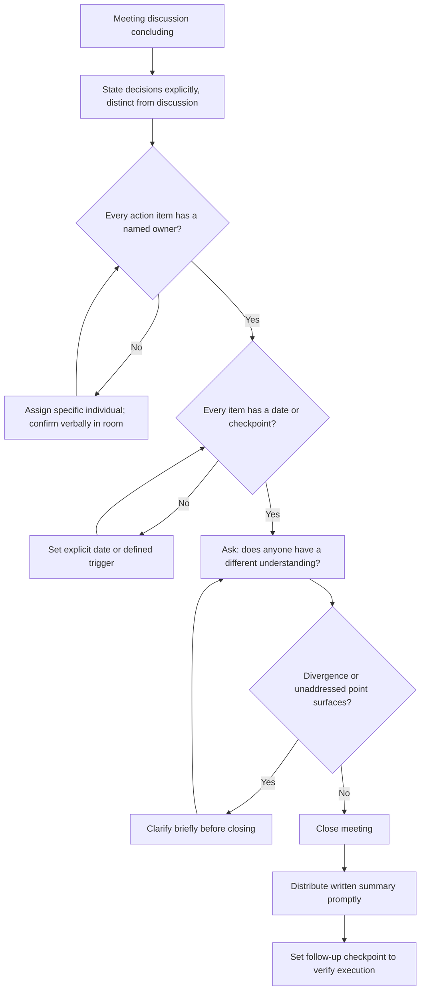

## Closing Meetings With Clear Ownership and Next Steps

### Definition and Scope

Closing meetings with clear ownership and next steps refers to the deliberate final phase of a meeting in which decisions, action items, and accountability are explicitly stated, confirmed, and recorded before participants disperse. This is the structural bookend to the opening-phase design covered under meeting structure: where purpose statements and pre-circulation set expectations before a meeting, the closing phase determines whether the meeting's output survives contact with participants' return to their independent, competing priorities. A substantial proportion of meeting value is lost not in the discussion itself but in the gap between what participants believe was decided and what actually gets executed — closing technique exists specifically to close that gap.

### Why Meeting Closure Is a Distinct Failure Point

**The recollection divergence problem**: without explicit restatement at close, individual participants frequently leave a meeting with materially different understandings of what was decided, who owns what, and by when — a well-documented pattern in organizational communication research on shared mental models, where groups substantially overestimate the degree to which they share a common understanding of outcomes discussed verbally.

**The ownership diffusion problem**: action items framed at the group level ("we should follow up on this") without a named individual owner are reliably less likely to be completed than identically-scoped items assigned to a specific person, a pattern consistent with the broader diffusion-of-responsibility effect in group settings — responsibility distributed across a group is, in practice, often responsibility held by no one.

**The momentum decay problem**: the clarity and motivation present at the end of a live discussion decays measurably as time passes; action items not captured and distributed promptly are more likely to be deprioritized once participants return to competing demands, making the speed of post-meeting follow-through a meaningful factor in whether decisions translate into action.

### Core Components of Effective Closure

**Key Points**

- **Explicit restatement of decisions made**: stating aloud, in the room, exactly what was decided — not what was discussed — since discussion and decision are frequently conflated in participants' memories without a clear verbal marker distinguishing them.
- **Named ownership for every action item**: each action assigned to a specific individual (never "the team" or "someone"), confirmed verbally with that person in the room rather than assumed.
- **Explicit deadlines or next checkpoints**: every action item paired with a date or a clearly defined trigger for follow-up, since unowned timing is as corrosive to execution as unowned responsibility.
- **Confirmation of decision rights exercised**: where a decision method was stated at the outset (per the decision-driving topic), explicitly confirming that the stated method was in fact used ("as agreed, this was my call after hearing everyone — here's what I've decided") reinforces process legitimacy.
- **Space for final dissent or clarification**: a brief, explicit final check ("does anyone have a different understanding of what we just agreed, or anything unsaid") catches recollection divergence before it hardens into separate narratives.

### The Closing Sequence

1. **Summarize decisions**: a concise, unambiguous restatement of what was decided (not re-opening discussion).
2. **Assign and confirm ownership**: each action item stated with a named owner, who verbally acknowledges the assignment in real time.
3. **Set dates or triggers**: explicit timing for each item, avoiding vague markers ("soon," "when you get a chance") in favor of specific dates or defined checkpoints.
4. **Check for divergent understanding**: a final, brief opportunity for clarification before the meeting ends.
5. **Distribute written record promptly**: a short written summary sent shortly after the meeting, functioning as the durable, shared reference against which the verbal closure is anchored.

### Illustration: Meeting Closure Structure

(svg_diagram)

<svg xmlns="http://www.w3.org/2000/svg" viewBox="0 0 780 400" font-family="Helvetica, Arial, sans-serif">
<text x="390" y="28" text-anchor="middle" font-size="18" font-weight="bold" fill="#1a1a1a">Meeting Closure Sequence (svg_diagram)</text>
<rect x="40" y="60" width="700" height="55" rx="8" fill="#2f4f6f" />
<text x="390" y="93" text-anchor="middle" font-size="13" fill="white" font-weight="bold">1. Summarize Decisions Made (Not Discussion)</text>
<rect x="40" y="130" width="700" height="55" rx="8" fill="#2f4f6f" />
<text x="390" y="163" text-anchor="middle" font-size="13" fill="white" font-weight="bold">2. Assign and Verbally Confirm Named Ownership</text>
<rect x="40" y="200" width="700" height="55" rx="8" fill="#2f4f6f" />
<text x="390" y="233" text-anchor="middle" font-size="13" fill="white" font-weight="bold">3. Set Explicit Dates or Checkpoints</text>
<rect x="40" y="270" width="700" height="55" rx="8" fill="#2f4f6f" />
<text x="390" y="303" text-anchor="middle" font-size="13" fill="white" font-weight="bold">4. Final Check for Divergent Understanding</text>
<rect x="40" y="340" width="700" height="55" rx="8" fill="#2f6f4f" />
<text x="390" y="373" text-anchor="middle" font-size="13" fill="white" font-weight="bold">5. Distribute Written Record Promptly</text>
<path d="M390,115 L390,130" stroke="#555" stroke-width="2" marker-end="url(#arrow5)" />
<path d="M390,185 L390,200" stroke="#555" stroke-width="2" marker-end="url(#arrow5)" />
<path d="M390,255 L390,270" stroke="#555" stroke-width="2" marker-end="url(#arrow5)" />
<path d="M390,325 L390,340" stroke="#555" stroke-width="2" marker-end="url(#arrow5)" />
</svg>

### Illustration: Closure Decision Flow

### Worked Example

**Example**

Weak close: "Okay, great discussion everyone, I think we're aligned — let's follow up on the action items." Strong close: "So to confirm: we're moving forward with the phased rollout, not the full launch — that's the decision. [Name], you'll finalize the phase-one scope document by Wednesday. [Name], you're reaching out to the pilot customers by end of week to confirm participation. [Name] and I will review the phase-one results together on the 15th before deciding on phase two. Does anyone have a different read on what we just agreed, or is there anything that didn't get said?" This version distinguishes decision from discussion, names two specific owners with dates, defines a concrete checkpoint for the next decision, and creates a final opportunity for divergence to surface before the group disperses.

### Handling Unresolved Items at Close

Not every agenda item reaches resolution within the allotted time, and forcing artificial closure to satisfy a clean ending is itself a failure mode. Effective practice distinguishes between:

- **Genuinely resolved items**: closed per the sequence above.
- **Deliberately deferred items**: explicitly named as unresolved, with an owner assigned to determine next steps (which may be "schedule follow-up discussion" rather than a substantive resolution) rather than left ambiguously open.
- **Items requiring escalation**: explicitly identified as exceeding the group's decision rights, with a named owner responsible for taking the item to the appropriate decision-maker.

Leaving an item's status ambiguous — neither clearly resolved nor clearly deferred with ownership — reproduces the same recollection-divergence risk that closure technique is designed to prevent.

### Common Failure Modes

- **Ending on time pressure rather than genuine closure**: rushing out of a meeting at the scheduled end time without executing the closing sequence, which is one of the most common causes of the recollection-divergence problem.
- **Group-level rather than named ownership**: assigning actions to "the team" or "marketing," which reliably produces lower completion rates than individually named ownership.
- **Vague timing**: using soft language ("soon," "when possible") instead of explicit dates, which removes the accountability mechanism that a deadline provides.
- **No written follow-up**: relying on verbal closure alone without a distributed record, losing the durable reference point once memory of the live discussion fades.
- **Silent departure from unresolved items**: allowing ambiguous items to simply not be mentioned again, rather than explicitly deferring or escalating them, which produces the appearance of resolution without its substance.
- **Closure that reopens discussion**: using the closing summary as an opportunity to introduce new points rather than confirming what was already decided, which undermines the sense of finality closure is meant to provide.

### Relationship to Adjacent Skills

- **Structuring meetings for clarity and purpose** — closure is the structural bookend to the purpose-framing and agenda design established at the outset; a well-structured opening makes a clean close substantially easier to execute.
- **Driving decisions and building consensus** — closure is where the decision method used (unilateral, consultative, consensus) should be explicitly confirmed, reinforcing the legitimacy of the process.
- **Handling disagreement in group settings** — where disagreement was resolved during the meeting, closure is the moment to explicitly protect the non-prevailing party's standing, as covered in that topic.
- **Listening across hierarchy and power dynamics** — the final divergence-check question is a direct, practical application of actively soliciting information that hierarchy might otherwise suppress before the group disperses.

**Conclusion**

Closing meetings with clear ownership and next steps requires a deliberate, non-optional final sequence — explicit restatement of decisions, named and verbally confirmed ownership, specific dates, a final check for divergent understanding, and prompt written follow-up — because without this sequence, groups reliably overestimate their shared understanding of outcomes and diffuse responsibility in ways that measurably reduce execution. The quality of a meeting's closure is frequently a stronger predictor of whether its decisions translate into action than the quality of the discussion that preceded it.

**Related Topics**

- Structuring Meetings for Clarity and Purpose
- Driving Decisions and Building Consensus
- Handling Disagreement in Group Settings
- Shared Mental Models and Recollection Divergence in Groups
- Diffusion of Responsibility and Ownership Assignment
- Action Item Tracking and Follow-Through Systems
- Listening Across Hierarchy and Power Dynamics
- Written Communication as a Durable Decision Record