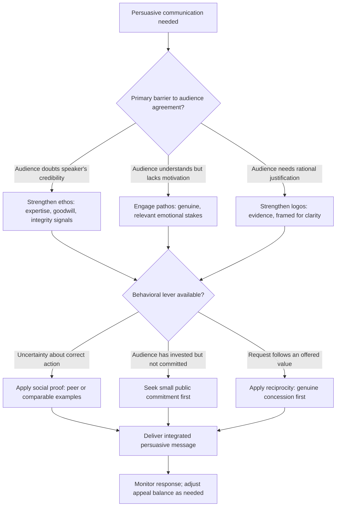

## Principles of Influence and Persuasion

### Definition and Scope

Principles of influence and persuasion refers to the documented psychological and rhetorical mechanisms by which one party shapes another's beliefs, attitudes, or behavior through communication, distinct from coercion (which relies on force or the removal of genuine choice) and distinct from manipulation (which relies on concealment or exploitation of the target's cognitive limitations against their own interests). In executive and rhetorical contexts, influence is treated as a core communicative competency: the ability to move others toward a conclusion or action through legitimate appeal to reason, emotion, credibility, and social dynamics. This topic surveys the foundational frameworks — classical rhetorical appeals and modern behavioral-science principles — that underlie effective, ethical persuasion in professional settings.

### Classical Foundations: The Rhetorical Triangle

Aristotle's *Rhetoric* identifies three modes of persuasive appeal, still foundational to contemporary persuasion frameworks:

- **Ethos (credibility)**: persuasion grounded in the speaker's perceived character, expertise, and trustworthiness — a message is weighed differently depending on who delivers it, independent of its content.
- **Pathos (emotion)**: persuasion grounded in the audience's emotional state, engaging feeling as a legitimate and often necessary channel for motivating action, not merely a manipulative add-on to rational argument.
- **Logos (logic)**: persuasion grounded in reasoning, evidence, and structured argument — the appeal to the audience's rational evaluation of the claim.

Effective executive persuasion typically integrates all three; over-reliance on logos alone ("just show them the data") is a common and consequential error in technical and analytical professions, since audiences act on a blend of credibility assessment and emotional resonance alongside logical evaluation, not on logic in isolation.

### Modern Behavioral Framework: Cialdini's Principles of Influence

Robert Cialdini's research (*Influence: The Psychology of Persuasion*) identifies seven empirically supported principles that predict compliance and persuasion outcomes across many contexts, widely applied in negotiation, sales, and executive communication training:

**Key Points**

- **Reciprocity**: people feel obligated to return favors or concessions; offering something of value first (information, flexibility, a concession) increases the likelihood of a favorable response in return.
- **Commitment and Consistency**: once people commit to a position, especially publicly or in writing, they experience psychological pressure to act consistently with that commitment going forward.
- **Social Proof**: people look to the behavior of similar others to determine appropriate action, particularly under uncertainty — evidence that peers or comparable organizations have already adopted a position increases its persuasive weight.
- **Authority**: perceived expertise or legitimate authority increases compliance, independent of the substantive strength of the argument itself, underscoring why credibility-building (ethos) is inseparable from persuasive effectiveness.
- **Liking**: people are more easily persuaded by those they like, with similarity, compliments, and cooperative history all increasing liking.
- **Scarcity**: perceived limited availability (of time, opportunity, or resource) increases perceived value and urgency to act.
- **Unity** (added in later work): shared identity — a sense of belonging to the same group or "we" — is a distinct and often stronger driver of influence than mere liking, since it engages identity rather than simple interpersonal affinity.

### Illustration: Rhetorical Triangle and Behavioral Principles Integration

(svg_diagram)

<svg xmlns="http://www.w3.org/2000/svg" viewBox="0 0 780 460" font-family="Helvetica, Arial, sans-serif">
<text x="390" y="28" text-anchor="middle" font-size="18" font-weight="bold" fill="#1a1a1a">Classical and Behavioral Persuasion Frameworks (svg_diagram)</text>
<polygon points="390,60 220,300 560,300" fill="none" stroke="#333" stroke-width="2" />
<circle cx="390" cy="60" r="45" fill="#2f4f6f" />
<text x="390" y="55" text-anchor="middle" font-size="12" fill="white" font-weight="bold">Ethos</text>
<text x="390" y="72" text-anchor="middle" font-size="10" fill="white">Credibility</text>
<circle cx="220" cy="300" r="45" fill="#b3541e" />
<text x="220" y="295" text-anchor="middle" font-size="12" fill="white" font-weight="bold">Pathos</text>
<text x="220" y="312" text-anchor="middle" font-size="10" fill="white">Emotion</text>
<circle cx="560" cy="300" r="45" fill="#2f6f4f" />
<text x="560" y="295" text-anchor="middle" font-size="12" fill="white" font-weight="bold">Logos</text>
<text x="560" y="312" text-anchor="middle" font-size="10" fill="white">Logic</text>
<rect x="60" y="370" width="660" height="75" rx="8" fill="#eef2f0" stroke="#333" stroke-width="1.5" />
<text x="390" y="393" text-anchor="middle" font-size="12" font-weight="bold" fill="#333">Cialdini's Seven Principles (Behavioral Layer)</text>
<text x="390" y="415" text-anchor="middle" font-size="11" fill="#333">Reciprocity · Commitment/Consistency · Social Proof · Authority</text>
<text x="390" y="433" text-anchor="middle" font-size="11" fill="#333">Liking · Scarcity · Unity</text>
</svg>

### Application in Executive Communication

**Ethos-building in practice**: demonstrated expertise (track record, credentials), demonstrated goodwill (visible concern for the audience's interests, not only one's own), and demonstrated integrity (consistency between stated values and observed behavior) each contribute independently to credibility, and a deficit in one cannot be fully compensated by strength in another.

**Pathos in professional contexts**: emotional appeal in executive settings is most effective and most ethically sound when it engages genuine, relevant stakes (risk to the team, opportunity for growth, alignment with stated organizational values) rather than manufactured urgency or fear disconnected from actual circumstances.

**Logos and evidence framing**: the persuasive weight of data depends heavily on framing — the same statistic presented as a loss ("20% of customers will churn") versus a gain ("80% of customers will remain") produces measurably different responses, a well-documented framing effect in behavioral decision research (Tversky and Kahneman's prospect theory), meaning technically identical information is not persuasively neutral in its presentation.

**Reciprocity in negotiation and requests**: offering a genuine concession or piece of valuable information before making a request increases the likelihood of a favorable response, though this principle requires genuine value exchange rather than a transactional or manipulative framing to remain ethically sound and sustainably effective.

**Social proof in organizational change**: citing comparable peer organizations or internal early adopters is frequently more persuasive in driving behavior change than abstract argument alone, particularly under the uncertainty characteristic of organizational change initiatives.

### Illustration: Persuasion Strategy Selection Flow

### Worked Example

**Example**

An executive seeking budget approval for a new initiative combines all three classical appeals with behavioral principles: opening with a brief, specific track record of past successful initiatives (ethos), citing that two comparable divisions have already piloted a similar approach with measurable results (social proof plus logos), framing the cost of inaction in terms of a specific, relevant risk to the team's stated priorities rather than generic urgency (pathos, ethically grounded), and offering a scoped pilot with a defined evaluation checkpoint rather than requesting full commitment upfront (reducing perceived risk, and creating a natural, non-manipulative point for consistency-based follow-through if the pilot succeeds).

### Distinguishing Ethical Persuasion from Manipulation

[Inference] The line between legitimate influence and manipulation is a matter of some debate in applied ethics, but a widely used practical distinction centers on transparency of intent and respect for the audience's genuine interests: ethical persuasion presents true information and genuine appeals that the audience could, in principle, evaluate and accept or reject with full information, while manipulation relies on concealment, false urgency, or exploiting cognitive biases against the audience's own interests. Applying principles like scarcity or social proof to false or exaggerated claims (manufactured scarcity, fabricated peer adoption) crosses this line even though the underlying psychological mechanism is identical to its ethical use.

### Common Failure Modes

- **Logos-only persuasion**: assuming data and logical argument alone will move a decision, underestimating the role credibility and emotional relevance play in actual audience response.
- **Borrowed or fabricated authority**: overstating credentials, expertise, or peer adoption, which risks severe credibility damage if discovered and undermines the integrity component of ethos specifically.
- **Manufactured scarcity or urgency**: applying the scarcity principle dishonestly (false deadlines, exaggerated limited availability), which functions in the short term but damages trust and future persuasive credibility once recognized.
- **Reciprocity as manipulation**: offering a concession explicitly to create obligation rather than genuine value exchange, which recipients frequently detect and can resent.
- **Ignoring audience-specific credibility gaps**: applying a persuasion strategy without first diagnosing which appeal (credibility, emotional relevance, or logical justification) is actually the binding constraint for that specific audience.

### Relationship to Adjacent Skills

- **Delivering critical feedback constructively** — ethos and framing principles directly inform how feedback is received, since the same content lands differently depending on perceived credibility and care.
- **Navigating disagreement without damaging relationships** — persuasion principles apply within disagreement, particularly the distinction between legitimate appeal and manipulative pressure.
- **Driving decisions and building consensus** — social proof and reciprocity are frequently operative (consciously or not) in how groups move toward decisions.
- **Negotiation tactics** (addressed in a related item) — this topic provides the underlying psychological principles that specific negotiation techniques operationalize in a bargaining context.

**Conclusion**

Principles of influence and persuasion combine the classical rhetorical appeals of ethos, pathos, and logos with empirically documented behavioral principles — reciprocity, commitment, social proof, authority, liking, scarcity, and unity — to describe the mechanisms by which communication shapes belief and action. Effective and ethical executive persuasion requires integrating multiple appeals rather than relying on logic alone, and requires maintaining transparency of intent and genuine regard for the audience's interests to distinguish legitimate influence from manipulation that exploits the same underlying psychological mechanisms.

**Related Topics**

- Aristotle's Rhetorical Triangle (Ethos, Pathos, Logos)
- Cialdini's Seven Principles of Influence
- Prospect Theory and Framing Effects (Tversky and Kahneman)
- Ethical Boundaries Between Persuasion and Manipulation
- Negotiation Tactics and Strategic Communication
- Credibility Building in Executive Communication
- Social Proof and Organizational Change Communication
- Driving Decisions and Building Consensus