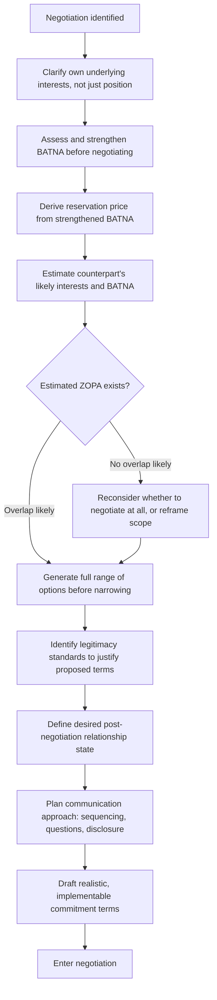

## Preparing a Negotiation Strategy and Best Alternative

### Definition and Scope

Preparing a negotiation strategy and best alternative refers to the systematic, pre-negotiation analytical process of clarifying interests, options, standards, alternatives, and communication approach before entering a bargaining exchange. This topic operationalizes the Harvard Negotiation Project's principled negotiation framework (Fisher, Ury, and Patton, *Getting to Yes*) into a concrete preparation methodology, extending the interest-based reframing introduced earlier in the course (under navigating disagreement) into the more structured, often higher-stakes context of formal negotiation. The central premise is that negotiation outcomes are substantially determined before the negotiation begins — by the quality of preparation — rather than by in-the-moment tactical skill alone.

### Core Preparation Framework: The Seven Elements

Derived from the Harvard Negotiation Project, seven elements provide a comprehensive preparation structure:

**Key Points**

- **Interests**: the underlying needs, concerns, and motivations driving each party's stated positions — the "why" behind the "what," and the foundation of principled negotiation.
- **Options**: the full range of possible agreements that could satisfy the interests involved, generated before narrowing to a specific proposal, to avoid prematurely limiting the solution space to the first framing considered.
- **Alternatives (BATNA)**: what each party will do if no agreement is reached — the standard against which any proposed agreement should be measured.
- **Legitimacy**: external standards, precedents, benchmarks, or criteria that can be used to justify a proposed outcome as fair, independent of either party's raw bargaining power.
- **Communication**: the planned approach to the exchange itself — tone, sequencing, questions to ask, and information to share or withhold.
- **Relationship**: the desired state of the working relationship after the negotiation concludes, which may constrain tactics that would otherwise maximize short-term gain at long-term relational cost.
- **Commitment**: the specific, realistic, and implementable terms that would constitute a viable final agreement, prepared in advance to avoid agreeing in principle to terms that cannot actually be executed.

### BATNA: Best Alternative to a Negotiated Agreement

BATNA is the single most consequential preparation element, since it functions as the negotiator's leverage floor: no rational agreement should be accepted that is worse than one's BATNA, and a well-understood BATNA provides confidence and clarity throughout the negotiation, independent of the counterpart's tactics or pressure.

**Distinguishing BATNA from related concepts**:

- **Reservation price / walk-away point**: the specific value at which the negotiator is indifferent between accepting a deal and pursuing the BATNA — a derived, quantified expression of the BATNA, not identical to it.
- **ZOPA (Zone of Possible Agreement)**: the range between each party's reservation price, within which a mutually acceptable agreement is possible; a negotiation with no ZOPA (each party's reservation price for the other exceeds what they're willing to offer) cannot produce a rational agreement, making its early identification critical.
- **Target point / aspiration**: the negotiator's ideal outcome, distinct from both BATNA and reservation price — aspiration should be ambitious but should not substitute for a clear-eyed assessment of the reservation price.

**Improving one's BATNA before negotiating**: because BATNA strength directly determines negotiating leverage, a substantial portion of effective preparation involves actively strengthening alternatives before the negotiation begins (securing a competing offer, developing an internal alternative, building relationships with alternative counterparts) rather than treating the current best alternative as fixed.

### Illustration: The Seven Elements Framework

(svg_diagram)

<svg xmlns="http://www.w3.org/2000/svg" viewBox="0 0 780 480" font-family="Helvetica, Arial, sans-serif">
<text x="390" y="28" text-anchor="middle" font-size="18" font-weight="bold" fill="#1a1a1a">Seven Elements of Negotiation Preparation (svg_diagram)</text>
<rect x="40" y="60" width="220" height="70" rx="8" fill="#2f4f6f" />
<text x="150" y="90" text-anchor="middle" font-size="12" fill="white" font-weight="bold">Interests</text>
<text x="150" y="108" text-anchor="middle" font-size="10" fill="white">Underlying needs and concerns</text>
<rect x="280" y="60" width="220" height="70" rx="8" fill="#2f4f6f" />
<text x="390" y="90" text-anchor="middle" font-size="12" fill="white" font-weight="bold">Options</text>
<text x="390" y="108" text-anchor="middle" font-size="10" fill="white">Full range of possible agreements</text>
<rect x="520" y="60" width="220" height="70" rx="8" fill="#2f4f6f" />
<text x="630" y="90" text-anchor="middle" font-size="12" fill="white" font-weight="bold">Alternatives (BATNA)</text>
<text x="630" y="108" text-anchor="middle" font-size="10" fill="white">Best path without agreement</text>
<rect x="40" y="150" width="220" height="70" rx="8" fill="#2f6f4f" />
<text x="150" y="180" text-anchor="middle" font-size="12" fill="white" font-weight="bold">Legitimacy</text>
<text x="150" y="198" text-anchor="middle" font-size="10" fill="white">External fairness standards</text>
<rect x="280" y="150" width="220" height="70" rx="8" fill="#2f6f4f" />
<text x="390" y="180" text-anchor="middle" font-size="12" fill="white" font-weight="bold">Communication</text>
<text x="390" y="198" text-anchor="middle" font-size="10" fill="white">Planned exchange approach</text>
<rect x="520" y="150" width="220" height="70" rx="8" fill="#2f6f4f" />
<text x="630" y="180" text-anchor="middle" font-size="12" fill="white" font-weight="bold">Relationship</text>
<text x="630" y="198" text-anchor="middle" font-size="10" fill="white">Desired post-deal state</text>
<rect x="280" y="240" width="220" height="70" rx="8" fill="#b3541e" />
<text x="390" y="270" text-anchor="middle" font-size="12" fill="white" font-weight="bold">Commitment</text>
<text x="390" y="288" text-anchor="middle" font-size="10" fill="white">Realistic, implementable terms</text>
<rect x="60" y="340" width="660" height="110" rx="8" fill="#eef2f0" stroke="#333" stroke-width="1.5" />
<text x="390" y="365" text-anchor="middle" font-size="13" font-weight="bold" fill="#333">BATNA Sub-Concepts</text>
<text x="90" y="388" font-size="11" fill="#333">Reservation price: quantified walk-away point derived from BATNA</text>
<text x="90" y="408" font-size="11" fill="#333">ZOPA: overlap between both parties' reservation prices (if any)</text>
<text x="90" y="428" font-size="11" fill="#333">Target point: ambitious aspiration, distinct from reservation price</text>
</svg>

### Illustration: Negotiation Preparation Decision Flow

### Worked Example

**Example**

A department head preparing to negotiate additional headcount with finance applies the framework: Interests — finance's actual concern is likely budget predictability and demonstrated ROI, not headcount itself as a fixed number. BATNA (own) — if the request is denied, the alternative is contractor support at higher unit cost but more flexibility; this is strengthened in advance by obtaining an actual contractor quote, converting an abstract alternative into a concrete, credible one. BATNA (counterpart's, estimated) — finance's alternative to granting the request is likely reallocating the budget elsewhere, which the department head factors into how the ask is framed. Legitimacy — benchmarking headcount ratios against comparable teams in the organization provides an external standard rather than a purely position-based ask. Options generated before the meeting include a phased hire, a contractor-to-hire conversion, and a shared role across two teams — giving the negotiation multiple viable paths rather than a single yes/no proposal.

### Common Preparation Failure Modes

- **Entering without a clear BATNA**: negotiating without a defined alternative leaves the negotiator vulnerable to accepting a worse-than-alternative deal under social or time pressure, since there is no clear internal benchmark against which to evaluate an offer.
- **Treating BATNA as fixed rather than improvable**: failing to invest preparation time in strengthening alternatives before negotiating, leaving leverage weaker than it could have been.
- **Position-only preparation**: preparing a single target number or outcome rather than the underlying interests, which produces brittle, single-path negotiation vulnerable to impasse if the specific position is rejected.
- **Ignoring the counterpart's interests and BATNA**: preparing exclusively from one's own perspective, missing opportunities to construct options that serve both parties' actual underlying needs.
- **Neglecting legitimacy**: relying purely on relative bargaining power or assertiveness rather than external standards, which tends to produce more contentious negotiations and less durable agreements.
- **No relationship consideration**: optimizing purely for immediate outcome without regard to the post-negotiation relationship, which can be costly in negotiations involving ongoing counterparts (colleagues, recurring vendors, internal stakeholders) as opposed to one-time transactions.

### Relationship to Adjacent Skills

- **Navigating disagreement without damaging relationships** — the interest-versus-position distinction introduced in that topic is the conceptual foundation this framework formalizes for negotiation contexts specifically.
- **Principles of influence and persuasion** — legitimacy and communication planning draw directly on ethos and framing principles from that topic.
- **Preparing for high-stakes conversations** — the fact-story-feeling preparation discipline complements this framework's interests analysis, particularly for negotiations with significant emotional or relational stakes.
- **Saying no and setting boundaries clearly** — a well-prepared BATNA and reservation price provide the clarity needed to decline an offer confidently rather than accepting a suboptimal deal under pressure.

**Conclusion**

Preparing a negotiation strategy requires systematic analysis across interests, options, alternatives, legitimacy, communication, relationship, and commitment, with particular emphasis on developing and, where possible, actively strengthening one's BATNA before entering the exchange, since alternatives — not positions — determine real negotiating leverage. This preparation converts negotiation from an improvised contest of assertiveness into a structured process aimed at identifying and capturing mutually beneficial value while maintaining clarity about the floor below which no agreement is acceptable.

**Related Topics**

- BATNA, Reservation Price, and ZOPA
- Principled Negotiation Framework (Fisher, Ury, Patton)
- Navigating Disagreement Without Damaging Relationships
- Principles of Influence and Persuasion
- Preparing for High-Stakes Conversations
- Saying No and Setting Boundaries Clearly
- Legitimacy and External Standards in Bargaining
- Interest-Based vs. Positional Bargaining