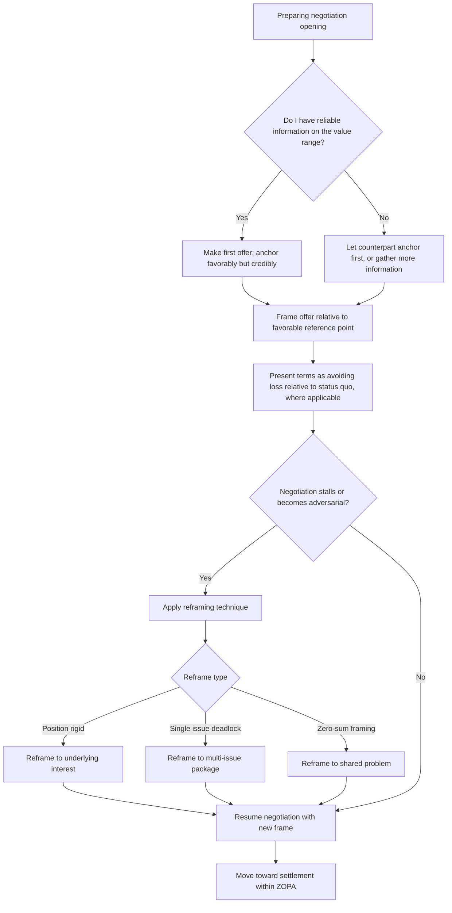

## Framing, Anchoring, and Reframing in Negotiation

### Definition and Scope

Framing, anchoring, and reframing refer to three related cognitive-rhetorical mechanisms by which the presentation and sequencing of information shape negotiation outcomes independent of the underlying substance being negotiated. **Framing** is how an offer, issue, or option is presented (as gain versus loss, as individual versus joint benefit); **anchoring** is the effect of an initial reference point on subsequent judgments and offers; **reframing** is the deliberate act of shifting an issue's frame mid-negotiation to change how it is perceived or evaluated. Together these mechanisms explain why identical substantive terms can produce markedly different negotiation outcomes depending on how and in what order they are presented — a well-established finding in behavioral decision research with direct, practical application to negotiation strategy.

### Theoretical Foundation: Prospect Theory and Framing Effects

**Prospect Theory** (Kahneman and Tversky) establishes that people evaluate outcomes relative to a reference point rather than in absolute terms, and that losses are weighted more heavily than equivalent gains (loss aversion) — meaning a negotiation party will fight harder to avoid a perceived loss than to secure an equivalent gain. This asymmetry underlies the practical importance of framing: presenting an outcome as avoiding a loss relative to the counterpart's reference point, versus achieving a gain, can produce different levels of resistance or acceptance even when the substantive terms are identical.

**Reference point manipulation**: because loss aversion depends on the reference point from which an outcome is evaluated, negotiators can influence perceived fairness or acceptability by shaping which reference point the counterpart uses — for example, presenting a reduced increase as still a gain relative to the status quo, versus allowing it to be evaluated as a loss relative to an initially anticipated higher figure.

### Anchoring in Negotiation

**The anchoring effect**: initial numbers or reference points exert a documented, persistent influence on subsequent judgments, even when the anchor is arbitrary or the evaluator consciously discounts it — a robust finding across behavioral decision research (Tversky and Kahneman's original anchoring-and-adjustment work). In negotiation specifically, this manifests as the first credible offer exerting disproportionate influence on the eventual settlement point, independent of either party's actual reservation price.

**Key Points**

- **First-mover advantage in anchoring**: making the first offer, when the negotiator has reasonable information about the value range, tends to anchor subsequent discussion around that figure, generally advantaging the party who anchors — a finding that complicates the traditional advice to "let the other side go first," particularly when the anchoring party has good information.
- **When to cede the first move**: first-offer advantage weakens or reverses when the anchoring party has poor information about the actual value range, since an uninformed anchor risks leaving value on the table or setting an anchor so unrealistic it damages credibility and invites early impasse.
- **Extreme anchors and credibility trade-offs**: a more extreme initial anchor generally pulls the eventual settlement further in the anchoring party's favor, but anchors perceived as unreasonable risk damaging credibility, provoking reciprocal extremity, or causing the counterpart to disengage rather than counter-anchor.
- **Multiple-issue anchoring**: in negotiations with several issues, anchoring can be applied to each dimension independently (price, timeline, scope), and skilled negotiators anchor advantageously across all relevant dimensions rather than only the most salient one.

### Reframing Techniques

Reframing is used to shift a stuck or unfavorable negotiation dynamic by changing the lens through which an issue is evaluated, without necessarily changing the substantive terms on the table:

- **Reframing position to interest**: shifting from "I want X" to "the underlying need is Y," which can reveal previously unconsidered options that satisfy the interest without requiring concession on the stated position (directly connecting to the interest-based negotiation preparation covered in the prior topic).
- **Reframing individual issue to package**: converting a single contested point into one element of a broader multi-issue trade, creating room for value-creating trades across issues with different priority weightings for each party.
- **Reframing short-term cost to long-term value**: presenting an outcome relative to a longer time horizon or broader relationship context, shifting the reference point used for evaluation.
- **Reframing competitive to collaborative**: explicitly naming a shared problem ("how do we both get what we need here") rather than allowing the negotiation to remain framed as zero-sum, which can unlock joint problem-solving where a purely distributive frame would not.

### Illustration: Anchoring's Effect on Settlement Range

(svg_diagram)

<svg xmlns="http://www.w3.org/2000/svg" viewBox="0 0 780 400" font-family="Helvetica, Arial, sans-serif">
<text x="390" y="28" text-anchor="middle" font-size="18" font-weight="bold" fill="#1a1a1a">Anchoring's Effect on Negotiation Settlement (svg_diagram)</text>
<line x1="80" y1="200" x2="700" y2="200" stroke="#333" stroke-width="2" />
<text x="80" y="225" font-size="11" fill="#333">Lower value</text>
<text x="650" y="225" font-size="11" fill="#333">Higher value</text>
<rect x="150" y="185" width="4" height="30" fill="#2f4f6f" />
<text x="150" y="170" text-anchor="middle" font-size="11" fill="#2f4f6f">Party A reservation</text>
<rect x="550" y="185" width="4" height="30" fill="#b3541e" />
<text x="550" y="170" text-anchor="middle" font-size="11" fill="#b3541e">Party B reservation</text>
<rect x="150" y="195" width="400" height="10" fill="#d9e8e0" />
<text x="350" y="250" text-anchor="middle" font-size="11" fill="#2f6f4f" font-weight="bold">ZOPA</text>
<circle cx="560" cy="200" r="8" fill="#7a3b8c" />
<text x="560" y="290" text-anchor="middle" font-size="11" fill="#7a3b8c" font-weight="bold">Anchor set near B's</text>
<text x="560" y="306" text-anchor="middle" font-size="11" fill="#7a3b8c" font-weight="bold">reservation point</text>
<circle cx="380" cy="200" r="8" fill="#2f6f4f" />
<text x="380" y="340" text-anchor="middle" font-size="11" fill="#2f6f4f" font-weight="bold">Likely settlement</text>
<text x="380" y="356" text-anchor="middle" font-size="11" fill="#2f6f4f" font-weight="bold">pulled toward anchor</text>
<circle cx="280" cy="200" r="8" fill="#999" opacity="0.6" />
<text x="220" y="340" text-anchor="middle" font-size="10" fill="#999">Midpoint settlement</text>
<text x="220" y="356" text-anchor="middle" font-size="10" fill="#999">(no anchor effect)</text>
</svg>

### Illustration: Framing and Anchoring Decision Flow

### Worked Example

**Example**

In a vendor contract renewal, the vendor initially anchors with a 15% price increase framed as "market-standard adjustment." The buyer, recognizing the anchor's pull, does not counter with a number near the current price (which would concede excessive ground to the anchor) but instead reframes: "Let's step back from the percentage frame — what we're really trying to solve is predictable cost alongside the expanded service scope we need this year. Can we look at this as a package: current price plus scope, versus a smaller increase for current scope only?" This reframe shifts the negotiation from a single-issue percentage anchor to a multi-issue trade, creating room to reach an outcome favorable to both parties that a direct counter-anchor on price alone would have made harder to access.

### Ethical Considerations in Framing and Anchoring

[Inference] As with the influence principles covered in the prior topic, the ethical use of framing and anchoring generally turns on whether the technique relies on true information presented strategically versus false or misleading information; presenting accurate terms in a favorable frame (e.g., emphasizing genuine gains) is broadly considered legitimate negotiation practice, whereas anchoring on fabricated market data or reference points crosses into deception, and this distinction — while widely used in negotiation ethics discussions — involves some genuine judgment calls in ambiguous cases (e.g., withholding unfavorable information versus actively misstating it).

### Common Failure Modes

- **Ceding the anchor unnecessarily**: allowing the counterpart to set the reference point when the negotiator had sufficient information to anchor favorably, an often-repeated tactical error stemming from overcorrected advice to "always let them go first."
- **Anchoring without credibility**: setting an anchor so extreme relative to legitimacy standards (see prior topic's legitimacy element) that it damages trust or provokes disengagement rather than productive counter-offering.
- **Failing to recognize being anchored**: accepting a counterpart's opening frame or figure as the reference point without deliberately resetting it, allowing the final settlement to be pulled disproportionately toward their anchor.
- **Single-frame rigidity**: continuing to argue within an unproductive frame (e.g., pure price competition) without attempting to reframe toward interests or package trades when the negotiation stalls.
- **Reframing perceived as evasive**: reframing executed without acknowledging the counterpart's original point first can appear as dismissal or avoidance rather than genuine reorientation, undermining trust in the process.

### Relationship to Adjacent Skills

- **Preparing a negotiation strategy and best alternative** — a well-prepared reservation price and legitimacy standard provide the reference points needed to recognize and resist unfavorable anchoring in real time.
- **Principles of influence and persuasion** — framing effects draw directly on the same behavioral-science foundation (prospect theory, cognitive bias) underlying the influence principles covered there.
- **Navigating disagreement without damaging relationships** — the position-to-interest reframe applies the same technique introduced in that topic within the specific context of active bargaining.

**Conclusion**

Framing, anchoring, and reframing are distinct but interlocking mechanisms — framing shapes how terms are evaluated relative to a reference point, anchoring establishes that reference point through initial offers, and reframing deliberately shifts a stuck or unfavorable dynamic to a more productive lens — each grounded in well-documented cognitive tendencies including loss aversion and anchoring bias. Skilled negotiators use these mechanisms deliberately and transparently to shape outcomes favorably while remaining attentive to the ethical line between strategic framing of true information and outright deception.

**Related Topics**

- Prospect Theory and Loss Aversion (Kahneman and Tversky)
- Anchoring and Adjustment Heuristic
- Preparing a Negotiation Strategy and Best Alternative
- Principles of Influence and Persuasion
- Navigating Disagreement Without Damaging Relationships
- Multi-Issue Package Negotiation and Value Creation
- Ethical Boundaries in Strategic Information Framing
- Zone of Possible Agreement (ZOPA) Dynamics