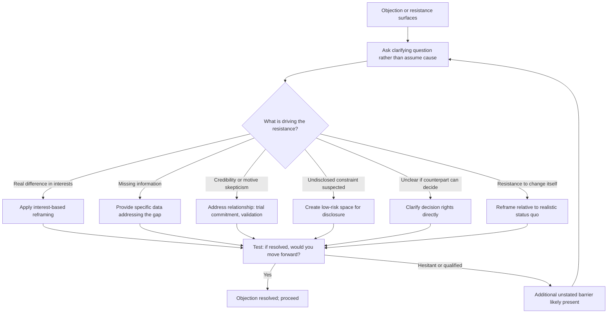

## Managing Objections and Resistance

### Definition and Scope

Managing objections and resistance refers to the negotiation and persuasion competency of diagnosing and responding to a counterpart's expressed or implicit reasons for declining, hesitating, or pushing back against a proposal. An **objection** is an explicit, stated reason for resistance ("the price is too high," "we don't have the resources"); **resistance** is the broader category that includes objections but also encompasses unstated hesitation, delay, or passive non-commitment that may never be articulated as a specific reason. Effective management of both requires distinguishing surface-level objections from underlying causes, since responding to the stated objection alone frequently fails to address the actual barrier to agreement.

### Theoretical Foundation: Surface Objections vs. Underlying Causes

**Key Points**

Objections in negotiation and persuasion contexts typically fall into a small number of underlying categories, and the stated objection often only partially reveals which category is operative:

- **Genuine substantive disagreement**: the counterpart has accurate information and a legitimate difference in evaluation or priority — the objection reflects a real, resolvable difference in interests or constraints.
- **Information gap**: the counterpart lacks information that, if provided, would resolve the objection — the stated concern is genuine but based on incomplete understanding.
- **Trust deficit**: the objection is a proxy for underlying skepticism about the proposer's credibility, motives, or track record, independent of the specific terms — connecting directly to ethos from the influence topic.
- **Unstated competing priority or constraint**: the real barrier is something the counterpart has not disclosed (a budget constraint, a competing internal priority, a political consideration), and the stated objection is a more comfortable or face-saving substitute.
- **Decision-authority limitation**: the counterpart is not actually authorized to agree, and the objection functions to defer a decision they cannot make rather than to reflect genuine disagreement with the proposal's substance.
- **Loss aversion / status quo bias**: resistance stemming from the psychological weight of a perceived loss (see prospect theory, prior topic) relative to maintaining the current state, even when the proposed change is objectively favorable.

Misdiagnosing the category — for example, responding to a trust-deficit objection with additional data (a logos-only response to what is actually an ethos problem) — is a common and largely ineffective pattern, since the response does not address the actual underlying barrier.

### Diagnostic Technique: Distinguishing Objection Types

**Asking, not assuming**: rather than inferring the underlying cause, directly and non-defensively asking a clarifying question ("help me understand what's driving the concern" or "is it the cost specifically, or something else") frequently surfaces the actual barrier more efficiently than responding to the surface-level statement.

**Listening for what's absent**: an objection stated with unusual specificity about one minor point while avoiding a larger, more consequential aspect of the proposal often signals that the stated objection is not the real barrier — the absence of expected pushback on the larger issue can be as diagnostically informative as the presence of pushback on the smaller one.

**Testing with a conditional question**: "if we resolved [the stated objection], would you be ready to move forward?" — a "yes" suggests the objection is genuine and resolvable; a hesitant or qualified response suggests an additional, unstated barrier remains.

### Response Techniques by Objection Type

**For genuine substantive disagreement**: apply the interest-based reframing and option-generation techniques from negotiation preparation — genuine disagreements are often resolvable through joint problem-solving once underlying interests are surfaced, rather than through repeated restatement of the original position.

**For information gaps**: providing the specific missing information directly resolves the objection; however, this requires accurately diagnosing an information gap rather than assuming one exists, since providing more data to a trust-deficit or unstated-constraint objection typically does not move the counterpart and can be perceived as not listening to the actual concern.

**For trust deficits**: address the relationship and credibility dimension directly, potentially through smaller trial commitments, third-party validation, or demonstrated reliability over time, rather than through additional argument on the substantive terms.

**For unstated constraints**: create explicit, low-risk space for disclosure ("is there something else at play here that would help me understand the full picture?"), since a counterpart may need to be invited into disclosure of a face-threatening constraint (see the boundary-setting topic's discussion of face-threat) before it will surface voluntarily.

**For decision-authority limitations**: clarify decision rights directly and, where appropriate, identify the actual decision-maker to include in further discussion, rather than continuing to negotiate substantively with someone unable to conclude the agreement.

**For loss aversion**: reframe the proposal relative to the counterpart's actual reference point (per the framing and anchoring topic), emphasizing what is preserved or gained relative to a realistic status quo trajectory rather than an idealized one.

### Illustration: Objection Diagnostic and Response Matrix

(svg_diagram)

<svg xmlns="http://www.w3.org/2000/svg" viewBox="0 0 780 460" font-family="Helvetica, Arial, sans-serif">
<text x="390" y="28" text-anchor="middle" font-size="18" font-weight="bold" fill="#1a1a1a">Objection Type and Response Fit (svg_diagram)</text>
<rect x="30" y="55" width="230" height="30" fill="#2f4f6f" />
<text x="145" y="76" text-anchor="middle" font-size="12" fill="white" font-weight="bold">Underlying Type</text>
<rect x="270" y="55" width="480" height="30" fill="#2f4f6f" />
<text x="510" y="76" text-anchor="middle" font-size="12" fill="white" font-weight="bold">Effective Response</text>
<rect x="30" y="85" width="230" height="55" fill="#eef2f0" />
<text x="45" y="107" font-size="11" fill="#333">Genuine substantive</text>
<text x="45" y="124" font-size="10" fill="#666">real difference in interests</text>
<rect x="270" y="85" width="480" height="55" fill="#f7f9f8" />
<text x="285" y="107" font-size="11" fill="#333">Interest-based reframing and</text>
<text x="285" y="124" font-size="11" fill="#333">joint option generation</text>
<rect x="30" y="140" width="230" height="55" fill="#eef2f0" />
<text x="45" y="162" font-size="11" fill="#333">Information gap</text>
<text x="45" y="179" font-size="10" fill="#666">genuine concern, incomplete data</text>
<rect x="270" y="140" width="480" height="55" fill="#f7f9f8" />
<text x="285" y="162" font-size="11" fill="#333">Provide specific missing</text>
<text x="285" y="179" font-size="11" fill="#333">information directly</text>
<rect x="30" y="195" width="230" height="55" fill="#eef2f0" />
<text x="45" y="217" font-size="11" fill="#333">Trust deficit</text>
<text x="45" y="234" font-size="10" fill="#666">skepticism of credibility/motive</text>
<rect x="270" y="195" width="480" height="55" fill="#f7f9f8" />
<text x="285" y="217" font-size="11" fill="#333">Address relationship directly;</text>
<text x="285" y="234" font-size="11" fill="#333">trial commitments, third-party validation</text>
<rect x="30" y="250" width="230" height="55" fill="#eef2f0" />
<text x="45" y="272" font-size="11" fill="#333">Unstated constraint</text>
<text x="45" y="289" font-size="10" fill="#666">undisclosed real barrier</text>
<rect x="270" y="250" width="480" height="55" fill="#f7f9f8" />
<text x="285" y="272" font-size="11" fill="#333">Create explicit, low-risk</text>
<text x="285" y="289" font-size="11" fill="#333">space for disclosure</text>
<rect x="30" y="305" width="230" height="55" fill="#eef2f0" />
<text x="45" y="327" font-size="11" fill="#333">Decision-authority limit</text>
<text x="45" y="344" font-size="10" fill="#666">counterpart cannot conclude</text>
<rect x="270" y="305" width="480" height="55" fill="#f7f9f8" />
<text x="285" y="327" font-size="11" fill="#333">Clarify decision rights;</text>
<text x="285" y="344" font-size="11" fill="#333">engage actual decision-maker</text>
<rect x="30" y="360" width="230" height="55" fill="#eef2f0" />
<text x="45" y="382" font-size="11" fill="#333">Loss aversion</text>
<text x="45" y="399" font-size="10" fill="#666">status quo bias</text>
<rect x="270" y="360" width="480" height="55" fill="#f7f9f8" />
<text x="285" y="382" font-size="11" fill="#333">Reframe relative to realistic</text>
<text x="285" y="399" font-size="11" fill="#333">status quo trajectory</text>

<text x="390" y="435" text-anchor="middle" font-size="12" fill="`#b3541e`" font-weight="bold">Misdiagnosis risk: offering data to a trust-deficit objection rarely resolves it</text>

</svg>

### Illustration: Objection Handling Decision Flow

### Worked Example

**Example**

A pitch for a new internal process is met with: "I don't think the team has bandwidth for this right now." A surface response (offering to reduce the scope) may not resolve it if the real issue is different. Applying the diagnostic question — "is it specifically the bandwidth, or is there something else about the approach that gives you pause?" — surfaces that the manager is actually concerned about how the change will be perceived by their own reports, given a recent, unrelated reorganization (an unstated constraint, face-threatening to state directly). Addressing the disclosed concern (offering to co-present the change with context about its unrelated origin, and a longer rollout timeline) resolves the actual barrier, whereas simply reducing scope in response to the stated "bandwidth" objection would likely have left the real concern unaddressed and produced continued, unexplained resistance.

### Common Failure Modes

- **Responding to the stated objection only**: providing a technically responsive answer to the literal objection without diagnosing whether it reflects the actual underlying barrier.
- **Over-persisting with data against a trust or relationship objection**: repeatedly presenting evidence or argument when the actual issue is credibility or relational, which can read as not listening and deepen resistance.
- **Failing to ask, defaulting to assumption**: inferring the objection's cause rather than directly and non-defensively asking, missing the efficiency and accuracy a direct diagnostic question provides.
- **Pressuring disclosure of a face-threatening constraint**: pushing too directly or publicly for an unstated reason, which can cause the counterpart to retreat further rather than disclose (connecting to face theory from the group disagreement topic).
- **Ignoring decision-authority mismatches**: continuing to negotiate substantively with a counterpart who cannot actually conclude the agreement, wasting effort on a party who structurally cannot resolve the objection regardless of how well it is addressed.
- **Treating all resistance as objection to be overcome**: failing to recognize when resistance reflects a legitimate, well-founded concern that should change the proposal itself rather than be persuaded away.

### Relationship to Adjacent Skills

- **Preparing a negotiation strategy and best alternative** — anticipating likely objections and their underlying category during preparation allows for planned, diagnosed responses rather than improvised ones.
- **Framing, anchoring, and reframing** — loss-aversion-driven resistance is directly addressed through the reference-point reframing techniques covered in that topic.
- **Principles of influence and persuasion** — trust-deficit objections connect directly to the ethos-building techniques from that topic.
- **Listening across hierarchy and power dynamics** — unstated constraints are often face-threatening precisely because of power dynamics, making hierarchy-aware listening technique directly applicable to surfacing them.

**Conclusion**

Managing objections and resistance effectively requires distinguishing the stated objection from its underlying cause — genuine disagreement, information gap, trust deficit, unstated constraint, decision-authority limitation, or loss aversion — since each category demands a materially different and often non-obvious response. Direct, non-defensive diagnostic questioning is frequently more efficient than inferring the cause, and responses matched accurately to the underlying barrier resolve resistance far more reliably than persistent argument directed at the objection as literally stated.

**Related Topics**

- Objection Diagnosis: Surface Statement vs. Underlying Cause
- Framing, Anchoring, and Reframing in Negotiation
- Principles of Influence and Persuasion
- Preparing a Negotiation Strategy and Best Alternative
- Listening Across Hierarchy and Power Dynamics
- Face Theory and Disclosure of Sensitive Constraints
- Loss Aversion and Status Quo Bias in Decision-Making
- Decision Rights and Authority Clarification in Negotiation