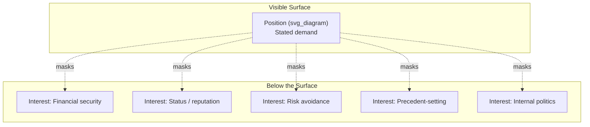
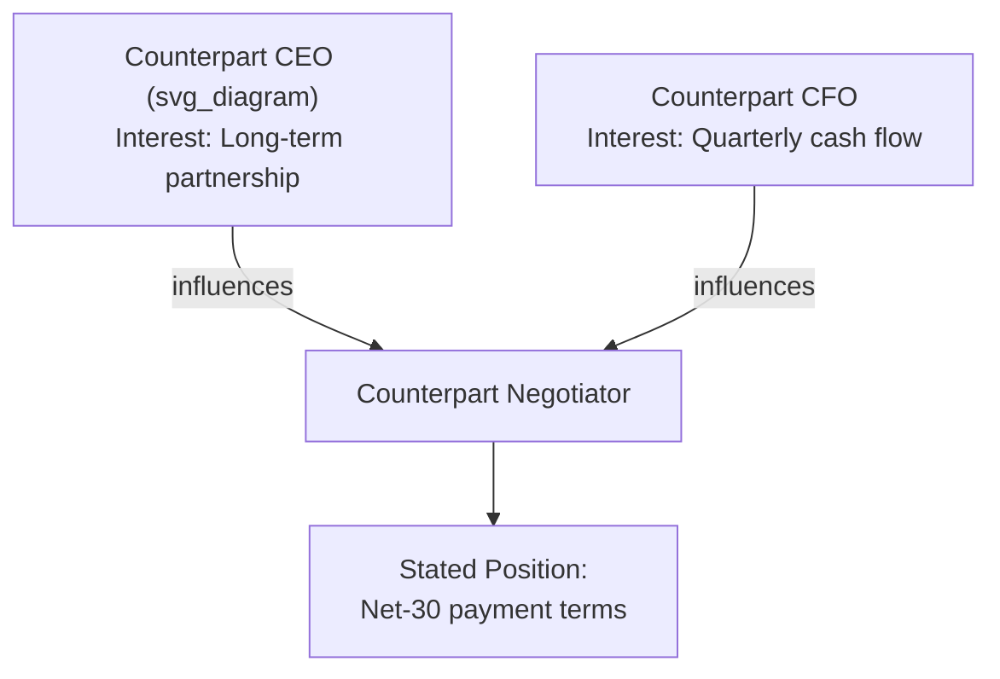

## Reading Counterpart Interests Versus Positions

### Definition and Conceptual Foundation

A **position** is a counterpart's stated demand or stance — the specific outcome they say they want. An **interest** is the underlying need, concern, fear, or motivation that the position is meant to satisfy. The distinction originates from principled negotiation theory (Fisher and Ury, *Getting to Yes*, Harvard Negotiation Project), which argues that negotiators who bargain over positions reach worse outcomes than those who diagnose and address interests.

The core insight: any given position is typically one of several possible solutions to an underlying interest. When two parties fight over positions, they narrow the negotiation to a single axis (usually price, timeline, or terms) and obscure the fact that multiple interests may be simultaneously satisfiable through a different configuration of terms.

**Key Points**

- Positions are surface-level, often the first thing stated in a negotiation ("I need this delivered by Friday")
- Interests are the reasons behind the position (career risk if a client deadline slips, personal travel plans, cash-flow timing)
- A single interest can generate multiple possible positions; a single position can mask multiple interests
- Interests are more stable across a negotiation than positions, which shift as tactics change

### Why Positional Bargaining Fails Executives

Positional bargaining produces predictable failure modes in executive contexts:

1. **Anchoring lock-in** — once a counterpart states a position publicly, they incur reputational cost in abandoning it, even when a mutually superior option exists.
2. **Zero-sum framing** — positions are usually expressed in terms that appear mutually exclusive (higher price vs. lower price), which suppresses discovery of non-competing interests (e.g., payment timing vs. total price).
3. **Efficiency loss** — negotiators spend rounds trading concessions on the stated position instead of restructuring the deal around what each side actually values.
4. **Relationship erosion** — repeated positional concessions read as weakness, which invites further extraction and damages trust needed for future negotiations.

[Inference] In multi-issue executive negotiations (M&A terms, vendor contracts, compensation packages), the gap between positional and interest-based outcomes tends to widen with the number of negotiable variables, since more variables create more opportunity for non-obvious trades — though the magnitude of this gap is not something that can be quantified in general and depends heavily on the specific parties and stakes involved.

### The Iceberg Model

The visible position is one expression of a larger set of latent drivers. Executive negotiators who only address the tip (the stated number or term) leave the submerged interests unaddressed, meaning even a "successful" positional close can unravel later if a core interest was never met.

### Categories of Interests

Interests are commonly grouped into four types, useful as a diagnostic checklist during preparation and live negotiation:

- **Substantive interests** — the tangible outcome (price, quantity, delivery date, equity stake)
- **Process interests** — how the negotiation itself is conducted (being consulted, having input, procedural fairness)
- **Relationship interests** — the ongoing working relationship, trust, and reputation between parties
- **Psychological/identity interests** — recognition, autonomy, status, feeling respected or not exploited

**Example**

A supplier states the position "we need a 15% price increase." Underlying interests might be:

- Substantive: rising input costs must be covered
- Process: they want to be seen as raising this proactively, not being caught
- Relationship: they don't want the increase to be read as opportunistic given a long partnership
- Identity: the account manager wants to demonstrate to their own leadership that they can hold margin

Addressing only the substantive number (countering with 7%) ignores three of the four interest categories and may produce an agreement that the supplier's team internally resents.

### Diagnostic Technique: The "Why" Ladder

A structured technique for surfacing interests is iterative questioning that moves from position toward motive:

Each "why" should be reframed conversationally to avoid sounding interrogative — direct executive language such as "Help me understand what's driving that number" or "What would need to be true for a different structure to work for you?" performs the same diagnostic function without triggering defensiveness.

### Signals That Distinguish Position From Interest

| Signal | Position-Language | Interest-Language |
| --- | --- | --- |
| Specificity | Precise, numeric ("$2M," "30 days") | Vague, values-based ("fair," "sustainable," "predictable") |
| Flexibility when questioned | Repeats the same number | Reveals a range or trade-off ("if X, then Y is fine") |
| Emotional charge | Defensive when challenged directly | More open when asked about underlying goals |
| Timing in conversation | Stated early, often as an opener | Emerges later, often unprompted, during rapport-building |

**Key Points**

- A counterpart who cannot articulate *why* a number matters is often anchoring rather than expressing a genuine interest
- Sudden willingness to discuss structure (timing, contingencies, non-price terms) usually signals that the stated position was not the only acceptable path

### Practical Extraction Methods

1. **Open-ended probing** — "What's driving the timeline on your end?" rather than "Can you move the deadline?"
2. **Active listening with paraphrase-checks** — reflecting back a hypothesized interest ("It sounds like predictability matters more than the absolute number — is that right?") invites correction, which sharpens the read.
3. **Silence after disclosure** — allowing a pause after a counterpart reveals partial information often prompts further elaboration, since unfilled silence creates social pressure to continue speaking.
4. **Multi-issue proposals** — presenting two or three packages with different trade-offs (rather than a single counter) reveals interest priority by observing which package the counterpart gravitates toward.
5. **Third-party and pre-negotiation research** — for executive deals, background research (public statements, prior deal history, org structure, incentive schemes) can surface likely interests before the room, particularly organizational incentives such as a counterpart's compensation being tied to volume rather than margin.

**Example**

In a compensation negotiation, a candidate states the position "I need a $180K base." Probing reveals the interest is not the specific number but matching a competing offer to justify the move to their spouse. The employer can then satisfy the interest with a $170K base plus a signing bonus that brings first-year total compensation to $185K — a structure the candidate accepts, because the underlying interest (justifiable, comparable total comp) was met without matching the stated positional number.

### Common Failure Patterns

- **Mirroring positions** — responding to a position with a counter-position, which escalates anchoring on both sides instead of opening interest discovery
- **Assuming interests without verification** — projecting an interest based on stereotype or incomplete information and building a solution around an incorrect guess
- **Interest tunnel vision** — over-focusing on one interest category (usually substantive/financial) while ignoring process or identity interests that may be equally load-bearing
- **Premature packaging** — proposing a "creative" multi-issue solution before sufficiently diagnosing interests, which can appear manipulative if it misses the actual driver

[Inference] Negotiators under time pressure are more likely to revert to positional bargaining because interest discovery requires additional conversational turns; this is a plausible mechanism consistent with negotiation research on cognitive load and time constraints, though the specific effect size varies by individual and context.

### Interests in Multi-Party and Multi-Issue Negotiations

In executive settings involving multiple stakeholders (e.g., a board, a joint venture, cross-functional deal teams), interests frequently diverge *within* a single counterpart organization. The person across the table may hold a position mandated by their own internal stakeholders whose interests differ from the negotiator's personal interests.

Effective interest-reading in this context requires mapping which internal interest is currently dominant in shaping the stated position, since the position may satisfy one internal stakeholder while creating friction for another — an opening that can sometimes be used constructively in deal design.

### Distinguishing Genuine Interests From Tactical Claims

Not all "interest" disclosures are genuine; sophisticated counterparts may fabricate an interest to extract concessions (a tactic sometimes called false interest signaling). Cross-checking techniques include:

- Testing consistency: does the claimed interest hold up across multiple points in the conversation, or does it shift when convenient?
- Testing cost: would satisfying this "interest" actually cost the counterpart something if it were false (a genuine interest usually has a corroborating cost elsewhere)?
- External verification: does independent information (market data, public filings, prior behavior) support the claimed interest?

**Key Points**

- Trust but verify — interest-based negotiation does not mean accepting all disclosed motivations at face value
- A pattern of interest claims that consistently favor the counterpart's position without any accompanying trade-off is a signal of tactical fabrication rather than genuine interest

### Application to Executive Communication

For executives specifically, interest-reading intersects with communication discipline:

- **Framing questions to invite disclosure** — the way a question is phrased affects whether a counterpart feels safe revealing an interest; accusatory or leading phrasing shuts down disclosure
- **Managing one's own positional language** — executives should also self-audit their own stated positions to ensure they are communicating interests clearly enough for the counterpart to problem-solve *with* them, not just against them
- **Written communication (term sheets, RFPs, memos)** — these documents often encode positions without stated rationale; adding a brief "why" alongside each term can reduce the other side's need to guess or assume the worst

### Related Topics

- BATNA (Best Alternative to a Negotiated Agreement) and its interaction with interest strength
- Integrative vs. distributive bargaining strategies
- Anchoring and framing effects in opening offers
- Active listening and paraphrasing techniques in high-stakes dialogue
- Multi-party negotiation and internal stakeholder mapping
- Constructing multi-issue package proposals
- Detecting and countering tactical misrepresentation in negotiation