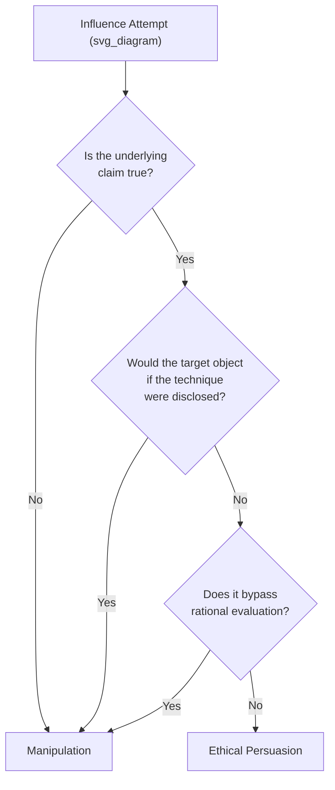
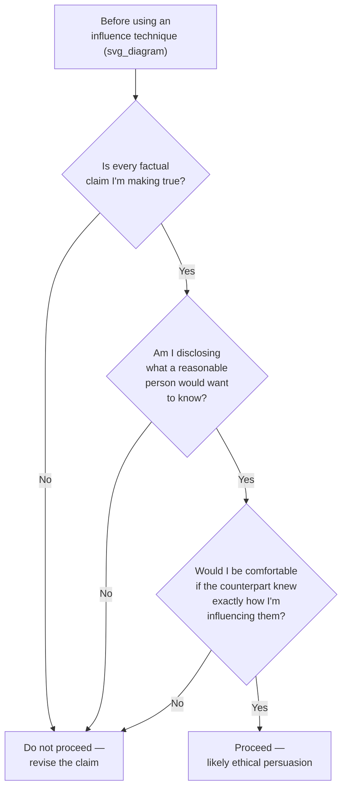

## Ethical Persuasion Versus Manipulation

### Definition and Conceptual Boundary

**Persuasion** is the process of influencing another person's beliefs, attitudes, or actions through appeals that the target can evaluate, verify, and rationally accept or reject. **Manipulation** is influence that works by exploiting cognitive biases, concealing information, or bypassing the target's rational agency in ways they would object to if aware of them.

The distinguishing test used across ethics and persuasion literature is not the *outcome* (both can produce the same behavior change) but the **process**: does the influence attempt respect the target's capacity to reason and choose freely, or does it circumvent that capacity?

**Key Points**

- Persuasion appeals to reasons the target can inspect (evidence, logic, legitimate emotional relevance)
- Manipulation appeals to psychological vulnerabilities the target cannot easily inspect or would reject if made visible
- The same technique (e.g., scarcity framing) can be ethical or manipulative depending on whether the underlying claim is true and whether it is disclosed transparently
- Intent matters, but process and transparency are more reliably observable and actionable than intent

### The Transparency Test

A widely used operational heuristic: **if the counterpart would object to the technique upon learning about it, it is likely manipulation; if they would find it unobjectionable or even helpful, it is likely persuasion.**

**Example**

Telling a client "only two units remain at this price" when true, and disclosed as a real inventory constraint, is legitimate scarcity framing — the client can verify or ask follow-up questions. Fabricating scarcity ("only two units remain") when supply is unconstrained is manipulation: it exploits loss aversion using a false premise the target cannot verify in the moment.

### Core Dimensions That Separate the Two

| Dimension | Ethical Persuasion | Manipulation |
| --- | --- | --- |
| Information | Full, accurate, relevant information disclosed | Information withheld, distorted, or fabricated |
| Target's agency | Preserved — target can say no without penalty | Undermined — pressure, guilt, or artificial urgency reduce real choice |
| Reversibility | Target can reconsider later with the same facts | Decision is rushed to prevent reconsideration |
| Reciprocity | Would work the same if roles were reversed | Relies on an asymmetry the influencer would resent if used on them |
| Beneficiary | Can produce mutual benefit | Structured to benefit the influencer at the target's expense |

### Classical Rhetorical Foundations

Aristotle's three modes of persuasive appeal remain the foundational framework, and each has both a legitimate and a manipulative expression:

- **Ethos** (credibility) — Legitimate: citing genuine expertise or track record. Manipulative: fabricating credentials or borrowing unearned authority ("appeal to false authority").
- **Pathos** (emotion) — Legitimate: connecting a decision to its real human stakes. Manipulative: manufacturing fear, guilt, or urgency disconnected from actual risk.
- **Logos** (logic) — Legitimate: sound argument from true premises. Manipulative: fallacious reasoning presented as valid (false dichotomies, cherry-picked data, motivated statistics).

**Key Points**

- The three appeals are not inherently manipulative — the manipulation lies in the misrepresentation or fabrication layered onto them
- Executive communicators frequently blend all three (data plus credibility plus stakes); the ethical line is whether each component would survive scrutiny

### Common Manipulative Techniques and Their Ethical Counterparts

1. **Artificial urgency vs. genuine urgency** — inventing a deadline pressures a decision before due diligence; disclosing a real deadline (board vote, funding round closing) informs decision-making without distortion.
2. **Selective disclosure vs. complete disclosure** — omitting known risks that a reasonable counterpart would want to know is manipulative by omission, even without an explicit lie.
3. **Anchoring with false reference points vs. anchoring with real reference points** — quoting a fabricated "original price" to make a discount appear larger versus quoting an actual prior price or market comparable.
4. **Social proof fabrication vs. genuine social proof** — implying broader adoption or endorsement than exists versus citing real, verifiable adopters or endorsements.
5. **Emotional exploitation vs. emotional resonance** — deliberately inducing fear or guilt disproportionate to actual stakes versus honestly connecting a choice to its real consequences.
6. **Gaslighting or reframing objections as irrational vs. addressing objections on their merits** — dismissing a legitimate concern by questioning the target's judgment rather than engaging the substance of the concern.

[Inference] In executive settings, subtle omission (technique 2) is more common and harder to detect than outright fabrication, because withholding information leaves no false statement to later contradict — though the prevalence of this compared to other techniques cannot be precisely benchmarked and varies by industry and individual.

### Ethical Persuasion Frameworks for Executive Contexts

**Cialdini's Principles of Influence**, when applied ethically, require that each principle correspond to a genuine underlying fact:

- **Reciprocity** — ethical when a real favor or value was extended first; manipulative when a token gesture is used purely to trigger obligation
- **Commitment/consistency** — ethical when helping someone act in line with values they've genuinely expressed; manipulative when engineering a small "yes" specifically to trap someone into a larger, unrelated commitment
- **Social proof** — ethical when citing accurate peer behavior; manipulative when the data is cherry-picked or invented
- **Authority** — ethical when authority is genuine and relevant; manipulative when borrowed, irrelevant, or exaggerated
- **Liking** — ethical when rapport is genuine; manipulative when feigned specifically to lower defenses
- **Scarcity** — ethical when real; manipulative when fabricated

**Key Points**

- Cialdini's own later work (*Pre-Suasion*) explicitly warns that the same principles that build trust when used honestly destroy long-term trust and reputation when discovered to be false
- Executive reputational risk scales with discovery: manipulative tactics that are found out damage credibility far more than the short-term gain they produced

### A Decision Framework for Practitioners

### Organizational and Reputational Consequences

- **Trust depreciation** — manipulation that is discovered tends to have compounding effects on future negotiations with the same counterpart, since they will apply increased skepticism to all future claims, not just the one found false
- **Legal exposure** — certain manipulative techniques cross into legally actionable territory (fraudulent misrepresentation, deceptive trade practices), particularly in contract negotiations, sales, and investor communications
- **Cultural spillover** — leaders who model manipulative persuasion internally tend to normalize it within their teams, creating downstream compliance and ethics risk
- **Asymmetric recovery cost** — rebuilding trust after a discovered manipulation typically requires substantially more relationship investment than was saved by the manipulative shortcut

[Speculation] The reputational cost of discovered manipulation may scale non-linearly with seniority — a senior executive's manipulative behavior likely draws more scrutiny and generates more organizational fallout than the same behavior from a junior employee — though this is a plausible pattern rather than a measured finding.

### Practical Guidelines for Executive Communicators

1. **Lead with accurate framing, not favorable framing** — present data and terms in ways that are favorable *and* verifiable, not favorable *because* they obscure something
2. **Disclose material information proactively** — if a reasonable counterpart would change their decision upon learning a fact, disclose it before being asked
3. **Preserve exit options** — genuine persuasion allows the counterpart a real, undamaged path to declining
4. **Separate urgency from pressure** — communicate real deadlines clearly without manufacturing false ones
5. **Audit emotional appeals for proportionality** — ask whether the emotional weight of an appeal matches the actual stakes involved
6. **Invite scrutiny rather than avoid it** — a persuasive case that improves under scrutiny is more durable than one that depends on the counterpart not looking closely

**Example**

An executive pitching an internal reorg to the board can ethically use loss-framing ("if we don't act, we risk losing three key accounts this quarter") if the risk is real and documented. The same pitch becomes manipulative if the executive exaggerates the probability or fabricates account-loss risk to force urgency, especially if follow-up questions about the underlying data are deflected rather than answered.

### Edge Cases and Gray Areas

- **Strategic ambiguity** — deliberately vague language in negotiations (common in early-stage deal talks) occupies a gray zone; it is generally distinguished from manipulation when it withholds a *position* (not yet decided) rather than a *fact* (already known and material)
- **Optimistic framing** — presenting a genuinely uncertain outcome in its best honest light is persuasion; presenting a near-certain negative outcome as merely uncertain is manipulation by distortion
- **Negotiation tactics vs. manipulation** — techniques like anchoring high or expressing feigned reluctance are widely normalized within competitive negotiation and are typically treated as an accepted convention rather than manipulation, provided no factual claims are falsified — though this normalization itself is a matter of some ethical debate rather than a settled consensus

### Related Topics

- Aristotle's rhetorical triad (ethos, pathos, logos) in depth
- Cialdini's six principles of influence and their ethical applications
- Cognitive biases exploited in manipulative persuasion (anchoring, loss aversion, framing effects)
- Corporate crisis communication and disclosure ethics
- Legal boundaries of persuasion in sales and investor relations (fraud, misrepresentation)
- Building durable trust in long-term negotiation relationships
- Detecting manipulation as a counterpart (defensive literacy)