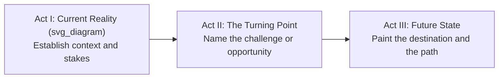
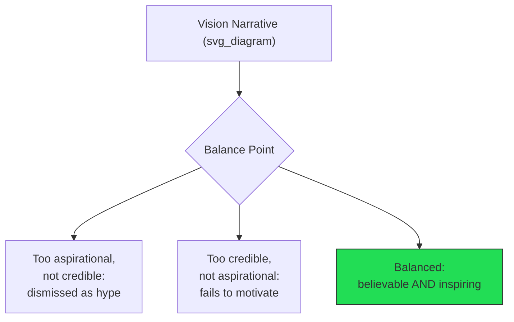

## Crafting a Compelling Vision Narrative

### Definition and Purpose

A **vision narrative** is a structured communication artifact that translates an organization's future-state ambition into a story-form message designed to generate shared understanding, emotional buy-in, and coordinated action. Unlike a vision *statement* (a condensed declarative sentence), a vision *narrative* is longer-form: it establishes context, conflict, resolution, and stakes in a sequence that mirrors classical storytelling structure, applied to organizational change.

The functional purpose of a vision narrative in executive communication is to solve a coordination problem: large groups of people cannot act in concert around an abstract strategic goal unless that goal is translated into a memorable, emotionally resonant, and repeatable story that individuals can internalize and retell in their own words.

**Key Points**

- A vision statement answers "what is the future state?"; a vision narrative answers "why does this future state matter, and what is the journey to get there?"
- Narratives are retained and retransmitted by listeners far more reliably than lists of goals or metrics, because narrative structure aligns with how human memory encodes and recalls information
- The narrative must be simultaneously aspirational (motivating) and credible (grounded in facts the audience can verify)

### Foundational Structure: The Three-Act Framework

Executive vision narratives commonly adapt the three-act dramatic structure to organizational change contexts.

- **Act I — Current Reality**: Establishes a shared, factual understanding of where the organization stands, including honest acknowledgment of problems or competitive threats. This builds credibility and creates the tension the narrative will resolve.
- **Act II — The Turning Point**: Names the pivotal choice or challenge facing the organization — the moment that makes the status quo untenable and change necessary. This is where urgency is established.
- **Act III — Future State**: Describes the destination in vivid, sensory, and specific terms, along with a plausible path connecting the present to that future.

### Kotter's Change Vision Criteria

John Kotter's organizational change research (*Leading Change*) identifies six characteristics an effective change vision narrative must satisfy simultaneously:

1. **Imaginable** — conveys a clear picture of what the future will look like
2. **Desirable** — appeals to the long-term interests of employees, customers, and stakeholders
3. **Feasible** — comprises realistic, attainable goals
4. **Focused** — clear enough to guide decision-making without excessive detail
5. **Flexible** — general enough to allow individual initiative and adaptation to changing conditions
6. **Communicable** — easy to explain, in a form that can be conveyed in minutes, not hours

[Inference] Of these six, "communicable" and "focused" are the criteria most often violated in practice, since executives with deep subject-matter expertise tend to over-specify detail that undermines memorability — this is a commonly cited failure pattern in change-management literature rather than a measured statistic.

### Narrative Components Checklist

| Component | Function | Example Prompt for Drafting |
| --- | --- | --- |
| Protagonist | Who the story centers on (often the customer, the employee, or the organization itself) | "Whose experience does this change ultimately serve?" |
| Stakes | What is lost if the vision is not pursued | "What happens if we stay on our current path?" |
| Conflict/tension | The obstacle or competitive pressure driving urgency | "What is the specific force we are responding to?" |
| Turning point | The decision or moment of commitment | "What did we decide, and why now?" |
| Destination | The vivid future state | "What does success look like, concretely, in three years?" |
| Path | The plausible bridge from present to future | "What are the two or three moves that get us there?" |
| Call to action | What each listener is asked to do | "What does this mean for what you do on Monday?" |

### The Credibility-Aspiration Balance

A vision narrative fails in one of two directions if it is not carefully balanced:

- **Over-aspirational narratives** ("we will become the undisputed global leader within 18 months" with no supporting evidence) are dismissed by sophisticated internal audiences as corporate rhetoric, which damages the communicator's credibility for future messages.
- **Over-credible, under-aspirational narratives** (heavily hedged, data-dense, risk-qualified) fail to generate the emotional commitment needed to sustain effort through difficulty.
- The balance point requires anchoring aspirational claims to specific, verifiable evidence (early wins, market data, comparable case studies) while still using narrative techniques (imagery, stakes, protagonist framing) to make the future state emotionally vivid.

**Example**

Rather than stating "we will double revenue by 2028" (aspirational, unanchored), an effective narrative might state: "Our last two product launches each grew their category by double digits within a year — if we apply that same playbook to the three markets we're entering next, doubling revenue by 2028 is not a guess, it's a continuation of a pattern we've already proven." This grounds the aspiration in demonstrated capability.

### Linguistic and Rhetorical Techniques

- **Concrete imagery over abstraction** — "a factory floor where every worker can see the impact of their shift in real time" is more retainable than "improved operational visibility"
- **Second person and inclusive pronouns** — "we" and "you" framing increases perceived shared ownership over "the company" or "leadership," which reads as distancing
- **Repetition of a core phrase** — a short, repeatable phrase (sometimes called a "narrative anchor") that recurs throughout the narrative and subsequent communications reinforces retention (e.g., a phrase used consistently in town halls, emails, and internal documents)
- **Contrast structure** — "we used to X; now we Y" constructions clarify the magnitude of change more effectively than static description
- **Present-tense future framing** — describing the future state in present tense ("in this future, customers do not have to...") increases the sense of the future's plausibility and immediacy compared to conditional or future-tense phrasing

### Common Failure Patterns

1. **Jargon substitution for imagery** — replacing vivid stakes and outcomes with buzzwords ("synergy," "paradigm shift," "world-class") that carry no concrete meaning and are widely recognized by audiences as empty
2. **Missing Act I** — jumping directly to the future state without establishing the current reality removes the tension that makes the future state feel necessary
3. **Universal narrative, no role clarity** — a compelling story that never translates into what a specific team or individual should do differently fails to convert inspiration into action
4. **Single-telling assumption** — treating the narrative as a one-time announcement (a single all-hands or memo) rather than a message that must be repeated, in evolving form, across many channels and over an extended period
5. **Leader-centric protagonist** — framing the narrative around the executive's own vision or legacy rather than the employees' or customers' experience, which reduces audience identification with the story

[Inference] Narratives that are only communicated once, even if well-crafted, tend to be forgotten or distorted as they propagate through informal channels — this is a widely cited concern in change-communication practice, though the specific decay rate is not something that can be generalized across organizations.

### Delivery and Reinforcement Considerations

A vision narrative's effectiveness depends heavily on its distribution pattern, not just its content:

- **Repetition across multiple formats** — the same core narrative should appear in town halls, written communications, one-on-ones, and embedded in decision-making rationale, adapted in length and tone to each format without changing its core structure
- **Cascading through middle management** — because direct managers are often more trusted messengers than senior executives for day-to-day relevance, equipping managers to retell the narrative in their own words (rather than reading a script) improves both credibility and retention
- **Consistency under pressure** — the narrative must remain stable even when short-term results are mixed; abandoning or significantly altering the narrative at the first sign of difficulty undermines the credibility of the original story

**Key Points**

- A vision narrative is a communication system, not a single document — its half-life depends on ongoing reinforcement
- Middle-manager retelling ability is often a better predictor of organizational uptake than the polish of the original executive delivery

### Measuring Narrative Effectiveness

Because vision narratives are qualitative artifacts, effectiveness is typically assessed through proxy indicators rather than direct measurement:

- **Recall testing** — can employees, several weeks later, restate the core narrative and its stakes in their own words?
- **Behavioral alignment** — are day-to-day decisions being justified with reference to the narrative's language and priorities?
- **Retelling fidelity** — when middle managers or employees retell the story to others, does the core structure (stakes, destination, path) survive, or has it degraded into a slogan?
- **Objection patterns** — do questions from the audience engage with the substance of the narrative (a sign of genuine consideration) or dismiss it as generic messaging (a sign of failure to land)?

### Related Topics

- Kotter's eight-step model for leading organizational change
- Distinguishing vision statements, mission statements, and strategic narratives
- Storytelling frameworks in executive communication (hero's journey adaptations, Pixar's story spine)
- Cascading communication strategy and middle-manager enablement
- Measuring employee sentiment and narrative recall
- Handling narrative credibility during setbacks or mixed results
- Cross-cultural adaptation of vision narratives in global organizations