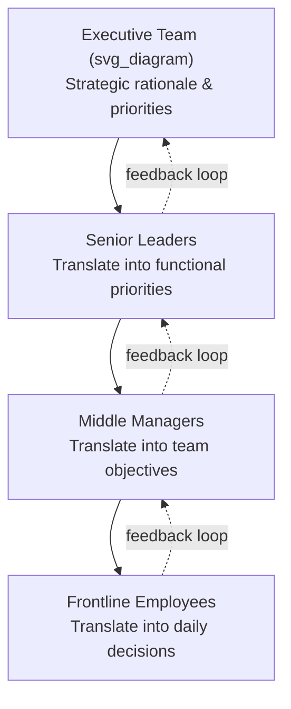
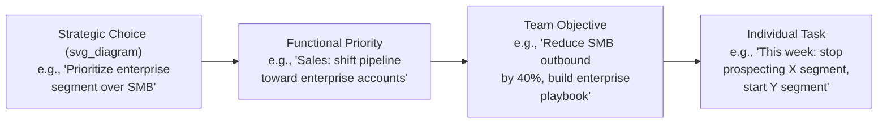

## Communicating Strategy Across an Organization

### Definition and Core Challenge

**Strategy communication** is the deliberate, systematic process of translating an organization's strategic choices — where to compete, how to win, what capabilities to build — into messages that produce shared understanding and aligned action across every level and function. The core challenge is a translation and propagation problem: a strategy formulated by a small group of senior leaders must be understood, internalized, and correctly applied to daily decisions by people who were not present when the strategy was formed and who often sit many organizational layers, functions, and geographies away from that original context.

Research on strategy execution consistently identifies a **strategy comprehension gap**: the percentage of employees who can accurately articulate their organization's strategy is typically far lower than the percentage of executives who believe the strategy has been successfully communicated. This gap is the central problem strategy communication practice exists to close.

**Key Points**

- Strategy formulation and strategy communication are distinct disciplines requiring different skills; a well-formulated strategy communicated poorly fails in execution regardless of its analytical quality
- The goal is not mere awareness ("I heard about the new strategy") but operational translation ("I know what this means for what I do differently")
- Communication must occur at multiple altitudes simultaneously: the abstract rationale (for buy-in) and the concrete implication (for action)

### The Cascade Model

Strategy communication in large organizations typically flows through a cascading structure rather than a single broadcast:

- Each layer of the cascade must perform genuine translation, not verbatim repetition — a frontline team does not need the competitive analysis behind a strategic choice, but does need to know what that choice means for their specific priorities
- The feedback loop is structurally as important as the downward cascade: without it, executives cannot detect where translation broke down or where the strategy meets on-the-ground obstacles that weren't visible during formulation
- Cascade failure most commonly occurs at the middle-manager layer, where managers either lack the context to translate accurately or lack the incentive to prioritize communication over operational delivery

### Distinguishing Strategy Communication From Vision Communication

| Dimension | Vision Communication | Strategy Communication |
| --- | --- | --- |
| Time horizon | Long-term, aspirational future state | Medium-term, specific choices and trade-offs |
| Primary function | Emotional alignment and motivation | Operational clarity and prioritization |
| Content | Narrative, imagery, purpose | Choices, trade-offs, resource allocation, metrics |
| Success measure | Recall and emotional buy-in | Behavioral alignment and correct prioritization |
| Failure mode | Feels empty or unmemorable | Feels abstract or disconnected from daily work |

[Inference] In practice these two communication types are often blended in a single message (e.g., a strategy announcement wrapped in narrative framing), which can help engagement but risks obscuring the specific operational choices the strategy requires if the narrative elements dominate the concrete ones.

### The "Translation Chain" Problem

A strategic choice loses fidelity at each translation point unless deliberately managed. This is analogous to information loss in any multi-hop communication chain.

At each stage, the risk is either **over-abstraction** (the translation stays too close to the original strategic language and the recipient cannot connect it to their actual work) or **distortion** (the translator introduces their own interpretation that diverges from the original intent, often to make the message locally more palatable).

**Example**

A strategic choice to "prioritize profitability over growth" can be correctly translated at the sales-team level into "prioritize renewal and expansion revenue from existing accounts over net-new logo acquisition, since retention has a materially lower cost-to-serve." An incorrect translation ("just close fewer deals") preserves surface language but loses the actual operational intent, which will produce misaligned behavior even though the manager believes they communicated the strategy accurately.

### Framework: The Strategy Communication Stack

A layered framework for constructing organization-wide strategy communication:

1. **Context** — why this strategy, why now (competitive, market, or internal drivers)
2. **Choice** — what specifically the organization has decided to do, and, critically, what it has decided *not* to do (trade-offs are often the most information-dense and most frequently omitted part of strategy communication)
3. **Rationale** — the logic connecting the choice to the desired outcome
4. **Implication** — what changes, function by function, as a result of the choice
5. **Metric** — how progress and success will be measured, so employees can self-assess alignment without waiting for top-down correction
6. **Role** — what is being asked of each audience segment specifically

**Key Points**

- Trade-offs (what the organization will *not* do) are strategically as important as stated priorities, because ambiguity about what has been deprioritized causes employees to continue investing effort in activities the strategy has implicitly abandoned
- Metrics closing the loop allow distributed self-correction, reducing the volume of clarifying communication required from the center

### Channel Strategy

Effective strategy communication uses differentiated channels matched to message type and audience need, rather than a single broadcast mechanism:

| Channel | Best Suited For | Limitation |
| --- | --- | --- |
| All-hands / town hall | Initial announcement, context and rationale, visible leadership commitment | One-way, low retention without reinforcement |
| Manager cascade sessions | Function-specific translation, two-way dialogue, addressing local concerns | Quality depends heavily on manager skill and preparation |
| Written strategy memo/FAQ | Reference document, precise language, searchable detail | Passive; requires active seeking-out by the reader |
| Team-level workshops | Translating strategy into specific team objectives and plans | Resource-intensive to run consistently at scale |
| Ongoing reinforcement (metrics dashboards, recurring updates) | Sustaining attention and demonstrating strategy is not a one-time announcement | Requires sustained executive discipline to maintain |

[Inference] Reliance on a single channel — most commonly a single all-hands announcement — is a frequently cited root cause of comprehension-gap failures in organizational communication research, since one-time, one-way broadcasts do not provide the repetition or two-way clarification that complex strategic content typically requires.

### Manager Enablement

Because middle managers are usually the most trusted and most locally relevant messengers, strategy communication programs typically invest specifically in manager enablement rather than relying on managers to translate strategy unaided:

- **Manager briefing materials** — providing managers with the underlying rationale (not just the headline message) so they can answer follow-up questions credibly rather than reading a script
- **Structured cascade toolkits** — talking points, anticipated objections and responses, and discussion prompts that managers can adapt to their team's specific context
- **Manager-to-manager rehearsal** — having managers first discuss the strategy with peers before cascading to their own teams, which surfaces translation errors and unanswered questions before they reach frontline employees
- **Two-way feedback capture** — explicit mechanisms (surveys, structured team discussions, skip-level sessions) for managers to relay team reactions and obstacles back up the chain

### Common Failure Patterns

1. **Announcement without reinforcement** — treating a single town hall or memo as sufficient, with no planned follow-up communication over the following weeks and months
2. **Omitting trade-offs** — communicating new priorities without explicitly stating what is being deprioritized, leaving employees to continue prior-priority work indefinitely
3. **Uniform messaging across highly differentiated audiences** — using identical language for functions with very different implications (e.g., telling both engineering and sales the same abstract priority without function-specific translation)
4. **Metric-free communication** — describing a strategic direction without operational metrics, leaving employees unable to self-assess whether their daily decisions are aligned
5. **Executive-only narration** — concentrating all delivery in senior leadership without equipping middle managers, which produces comprehension without local relevance
6. **No feedback channel** — a purely top-down cascade with no mechanism to surface confusion, disagreement, or on-the-ground obstacles back to the strategy owners

### Measuring Strategy Communication Effectiveness

- **Comprehension surveys** — can employees, in their own words, state the strategy's core choices and what it means for their role?
- **Alignment audits** — sampling actual decisions or resource-allocation choices at the team level to check consistency with stated strategic priorities
- **Cascade completion tracking** — verifying that manager-led cascade sessions actually occurred at each layer, rather than assuming cascade completion
- **Behavioral metrics tied to strategy** — the operational metrics defined in the "Metric" layer of the communication stack (e.g., pipeline mix shift, resource reallocation) serve as lagging indicators of whether communication translated into action

**Key Points**

- Comprehension and behavioral alignment are distinct measures — an employee can accurately restate a strategy without their daily decisions reflecting it, which signals a motivation or capability gap rather than a communication gap
- Regular, lightweight pulse measurement is generally more useful than a single large post-launch survey, since it can detect decay in comprehension or alignment over time

### Related Topics

- Kotter's eight-step model for leading organizational change
- Balanced Scorecard and strategy-to-metric translation frameworks
- Middle-manager enablement and cascade communication design
- Cross-functional alignment and resolving competing functional priorities
- Distinguishing strategy communication from vision narrative communication
- Employee comprehension surveys and organizational alignment audits
- Communicating strategic pivots and managing credibility during course corrections