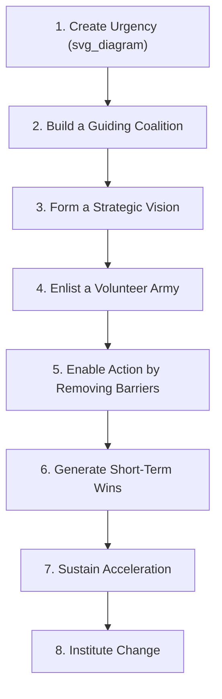
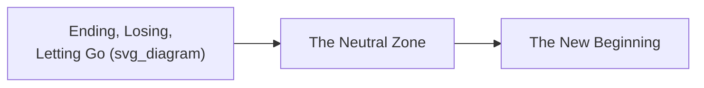
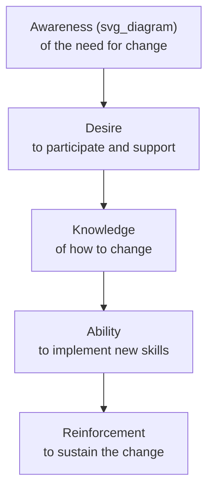
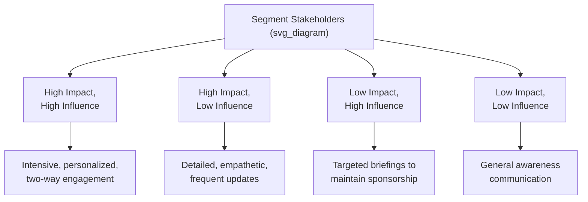

## Frameworks for Change Communication

### Definition and Scope

**Change communication frameworks** are structured models that guide how leaders sequence, time, and shape messages during organizational transitions (restructurings, mergers, new strategic direction, technology adoption, culture shifts). Unlike general strategy or vision communication, change communication frameworks specifically address the psychological and organizational dynamics of *transition* — the period of uncertainty, resistance, and adjustment between an old state and a new one.

These frameworks share a common premise: organizational change fails more often due to inadequate communication and insufficient attention to the human experience of transition than due to flawed strategic logic. Communication is treated not as a downstream activity that follows change decisions, but as a core mechanism through which change is enacted.

**Key Points**

- Change communication frameworks differ from vision or strategy communication frameworks in their explicit focus on managing resistance, uncertainty, and emotional transition
- Most major frameworks treat communication as continuous and adaptive across a defined timeline, not as a single announcement event
- Frameworks are often combined in practice (e.g., using Kotter's stages for sequencing while using Bridges' Transition Model to address the emotional experience within each stage)

### Kotter's Eight-Step Model and Its Communication Requirements

John Kotter's model is the most widely referenced sequencing framework for organizational change, and each step carries a distinct communication task.

| Step | Communication Task |
| --- | --- |
| 1. Create urgency | Present honest, factual evidence of why the status quo is untenable |
| 2. Build a guiding coalition | Visibly align senior leaders so the organization sees a unified front |
| 3. Form a strategic vision | Articulate the future state clearly (see vision narrative frameworks) |
| 4. Enlist a volunteer army | Recruit and equip informal influencers, not just formal hierarchy, to spread the message |
| 5. Enable action | Communicate explicit permission and removal of specific obstacles (policies, approval chains) |
| 6. Generate short-term wins | Publicize early, visible successes to sustain credibility and momentum |
| 7. Sustain acceleration | Maintain urgency messaging without allowing premature declarations of victory |
| 8. Institute change | Embed the change into stated culture, onboarding, and formal processes so it survives beyond initial champions |

[Inference] Step 8 is the step most often communicated too briefly relative to its actual importance, since institutionalization often relies on updating unglamorous back-office material (onboarding documents, policy manuals, performance criteria) that receives less executive attention than the launch-phase messaging.

### Bridges' Transition Model

William Bridges' model distinguishes organizational *change* (the external, situational shift) from *transition* (the internal, psychological process people go through in adapting to it). It identifies three phases, each requiring different communication emphasis.

- **Ending, Losing, Letting Go**: Communication must explicitly acknowledge what is being lost (roles, processes, relationships, identity) rather than only emphasizing the future gain. Skipping this phase is a common failure — leaders eager to sell the future often fail to acknowledge the legitimate loss employees are experiencing, which breeds resentment and covert resistance.
- **The Neutral Zone**: The ambiguous, often uncomfortable middle period where the old way is gone but the new way is not yet fully functional. Communication here must tolerate and normalize uncertainty rather than prematurely claiming resolution, while providing frequent, honest updates to reduce anxiety.
- **The New Beginning**: Communication reinforces new identity, new behaviors, and early evidence that the new state is working, helping to consolidate the transition.

**Key Points**

- Bridges' model is primarily psychological, complementing Kotter's more operational sequencing — the two are frequently used together
- Failure to communicate through the "ending" phase is one of the most cited reasons for employee disengagement during change initiatives, since unacknowledged loss tends to surface later as resistance rather than being resolved

### The ADKAR Model

Developed by Prosci, ADKAR is an individual-level framework describing the sequential building blocks a person needs to successfully change, with distinct communication requirements at each stage.

| Stage | Communication Focus | Common Communication Failure |
| --- | --- | --- |
| Awareness | Why the change is happening (business case, risk of inaction) | Assuming awareness exists without explicit confirmation |
| Desire | What's in it for the individual, addressing WIIFM (what's in it for me) concerns | Focusing only on organizational benefit, ignoring personal impact |
| Knowledge | Training, specific how-to guidance | Providing knowledge before desire is established, leading to compliance without commitment |
| Ability | Coaching, practice opportunities, feedback loops | Treating knowledge transfer as sufficient without practice support |
| Reinforcement | Recognition, embedding into performance systems, addressing relapse | Declaring success too early and withdrawing reinforcement communication |

**Example**

An organization rolling out a new CRM system often invests heavily in Knowledge (training sessions) while skipping Awareness and Desire — employees are shown *how* to use the new tool without first being convinced *why* the old one was inadequate or what personally improves for them. The result is technically competent but reluctantly used systems, since the ADKAR sequence was compressed rather than followed in order.

### The PCI (Perceived Change Impact) / Stakeholder Segmentation Approach

Effective change communication frameworks typically require differentiated messaging based on how significantly a given stakeholder group is affected, rather than uniform broadcast.

- **High impact / high influence** stakeholders (e.g., senior managers whose teams are directly restructured) require the most intensive, individualized communication and early involvement
- **High impact / low influence** stakeholders (e.g., frontline employees whose roles change significantly but who have limited organizational power) require particularly careful, empathetic communication since they bear significant change consequences without commensurate control
- **Low impact / high influence** stakeholders (e.g., adjacent department heads) require enough information to maintain their support and prevent them from inadvertently undermining the change
- **Low impact / low influence** stakeholders require general awareness-level communication without the intensity applied to more affected groups

### Comparing the Major Frameworks

| Framework | Primary Lens | Best Used For |
| --- | --- | --- |
| Kotter's 8 Steps | Organizational sequencing and momentum | Structuring the overall change communication timeline |
| Bridges' Transition Model | Individual psychological experience | Addressing emotional resistance and the sense of loss |
| ADKAR | Individual behavior-change mechanics | Designing training and adoption-focused communication |
| Stakeholder Segmentation | Differentiated audience targeting | Allocating communication intensity and resources efficiently |

**Key Points**

- These frameworks are complementary rather than competing — a mature change communication plan often layers Kotter's sequencing, Bridges' psychological phases, ADKAR's individual mechanics, and stakeholder segmentation into a single integrated plan
- No single framework fully addresses both the organizational and individual dimensions of change; combining frameworks compensates for each one's blind spots

### Common Cross-Framework Failure Patterns

1. **Treating communication as a launch event** — all frameworks above assume sustained, phased communication; compressing them into a single announcement undermines each one's core mechanism
2. **Skipping the loss/ending acknowledgment** — moving directly to future-state messaging without validating what is ending, a failure specifically named in Bridges' model but relevant across all frameworks
3. **Uniform messaging across differentiated stakeholders** — applying the same message and intensity to all audiences regardless of impact level
4. **Confusing awareness with commitment** — assuming that employees who have heard about the change (Awareness in ADKAR terms) have also internalized the need for it (Desire), and proceeding to training or execution prematurely
5. **Premature declaration of success** — celebrating early wins (Kotter step 6) in a way that signals the change process is complete, undermining sustained reinforcement (Kotter step 7, ADKAR's Reinforcement stage)

[Inference] Organizations that skip the psychological/emotional dimension entirely (relying solely on operational sequencing frameworks like Kotter without a complementary model like Bridges) are commonly observed in change-management practice to experience higher covert resistance, though this is a pattern described in practitioner literature rather than a controlled measurement.

### Practical Integration Approach

A layered application combining the frameworks above for an executive-level change communication plan:

1. Use **Kotter** to define the overall timeline and sequence of communication milestones
2. Use **stakeholder segmentation** to determine which groups need which intensity and format of communication at each Kotter stage
3. Use **Bridges' Transition Model** to ensure each phase of communication explicitly addresses the emotional and psychological state of the audience (acknowledging loss early, tolerating ambiguity in the middle, reinforcing identity at the end)
4. Use **ADKAR** at the individual and team level to ensure communication sequencing (awareness before desire before knowledge before ability before reinforcement) is respected within each stakeholder segment's journey

### Related Topics

- Crafting a compelling vision narrative
- Communicating strategy across an organization
- Managing resistance to change and addressing covert versus overt resistance
- Stakeholder mapping and influence analysis
- Change readiness assessment and communication timing
- Reinforcement and sustainment communication post-launch
- Cross-cultural considerations in global change communication