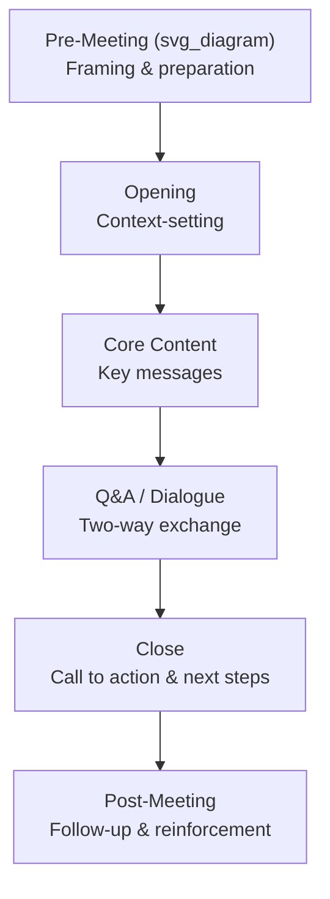

## Leading Town Halls and All-Hands Meetings

### Definition and Purpose

A **town hall** or **all-hands meeting** is a large-scale, typically synchronous communication forum in which organizational leadership addresses the broader employee population directly, combining one-to-many broadcast communication with structured opportunities for two-way exchange (Q&A, polls, discussion). Its function differs from smaller team meetings or one-on-ones: it exists specifically to establish shared organizational context, demonstrate leadership visibility and accountability, and create a common reference point that the entire organization can point back to.

Town halls serve several distinct communication functions simultaneously, and effective leaders are explicit about which function a given session is primarily serving:

**Key Points**

- **Informational function**: disseminating facts (results, strategic updates, organizational changes) efficiently to a large audience at once
- **Symbolic function**: signaling what leadership considers important enough to address the whole organization directly, and demonstrating leadership accessibility and accountability
- **Relational function**: creating a sense of shared identity and direct connection between senior leadership and the broader employee base
- **Feedback function**: surfacing questions, concerns, and sentiment that might not otherwise reach senior leadership through normal reporting lines

### Structural Framework

- **Pre-meeting**: Setting audience expectations (agenda, purpose, how questions will be handled), and often soliciting questions in advance to allow leaders to prepare substantive answers rather than being caught off guard
- **Opening**: Establishing why this session matters now, and briefly framing what will and will not be covered, to calibrate audience expectations
- **Core content**: Delivering the primary message(s) — results, strategic updates, change announcements — using clear, non-jargon language appropriate for a broad, non-specialist audience
- **Q&A/dialogue**: The section most responsible for the forum's credibility; how leaders handle difficult or unscripted questions here disproportionately shapes the audience's overall trust in the session
- **Close**: Explicit statement of what happens next and what, if anything, is being asked of the audience
- **Post-meeting**: Distributing a recording or summary, following up on unanswered questions, and reinforcing key messages in subsequent smaller-group communications

### Preparing for Q&A: The Highest-Risk Segment

Because Q&A is unscripted, it carries the highest reputational risk and the highest credibility-building potential of any part of a town hall. Preparation techniques include:

1. **Anticipated question mapping** — drafting likely difficult questions in advance and rehearsing direct, honest responses, including for questions leadership would prefer not to be asked
2. **Pre-submitted question triage** — collecting questions beforehand (survey, chat tool, anonymous submission) to identify themes, allowing leaders to address common concerns proactively even if the literal question isn't read aloud
3. **"I don't know" protocols** — establishing in advance how to handle questions leadership genuinely cannot answer (e.g., due to incomplete information, legal constraints, or pending decisions), since a fumbled non-answer damages credibility more than a clear, honest "I don't have that information yet, and here's when I expect to"
4. **Bridge and redirect techniques** — for sensitive questions, transitioning from what cannot be discussed to what can be, without appearing evasive (explicitly naming the constraint, e.g., "I can't comment on the legal specifics of that, but I can tell you our overall approach is...")

**Example**

Asked directly "are there more layoffs coming," a leader who says "I can't predict the future" without further context reads as evasive. A more effective response names the real constraint and offers what can be said: "I can't make a permanent guarantee about the future — no leader honestly can — but I can tell you there is no current plan for further reductions, and if that changes, you will hear it from us directly and early, not through rumor."

### Handling Difficult and Hostile Questions

| Question Type | Recommended Approach | Approach to Avoid |
| --- | --- | --- |
| Genuinely unknown answer | Acknowledge directly, commit to a follow-up timeline | Guessing or fabricating certainty |
| Hostile or accusatory framing | Acknowledge the underlying concern before responding to the content | Becoming defensive or attacking the question's framing |
| Off-topic or individual-specific | Redirect to the appropriate channel (HR, manager) while validating the question is reasonable | Publicly dismissing the question as inappropriate |
| Repeated/previously answered | Briefly restate the prior answer and note where more detail exists | Expressing visible frustration at repetition |
| Legally or competitively sensitive | Explicitly name the constraint, then share what can be shared | Silence or a non-answer with no explanation |

[Inference] Visible defensiveness or irritation in response to hostile questions tends to generate more reputational damage than the original question itself, since the audience's takeaway often becomes "leadership can't handle scrutiny" rather than the substance of the original concern — this is a widely observed pattern in executive communication coaching rather than a measured statistic.

### Delivering Difficult News in a Town Hall Setting

Town halls are frequently the venue for delivering organizationally significant and potentially unwelcome news (restructurings, missed targets, strategic pivots). Specific considerations apply:

- **Lead with the substance, not euphemism** — burying difficult news under extended preamble or softened language increases anxiety and reduces perceived trustworthiness; audiences generally detect evasive framing quickly
- **Acknowledge impact before pivoting to rationale** — stating the human impact of the news before explaining the business logic behind it signals that leadership understands the personal stakes, rather than appearing to prioritize the rationale over the people affected
- **Separate the announcement from the full Q&A when scale requires it** — for major, sensitive announcements, some organizations deliver the core news in a shorter, more controlled format and hold a follow-up, better-prepared Q&A session once initial reactions and questions have been gathered
- **Consistency with smaller-group communications** — a town hall message should not contradict what managers are separately telling their direct reports; discrepancies are quickly noticed and severely undermine trust in both channels

### Facilitation Techniques for Live Delivery

- **Pacing and pause** — deliberately pausing after key statements allows the message to register and signals confidence rather than a desire to rush past a difficult point
- **Reading the room in hybrid/virtual formats** — since visual feedback cues (audience body language, murmurs) are diminished or absent in virtual town halls, facilitators often rely more heavily on live chat monitoring, poll results, and a co-host or moderator specifically tasked with surfacing sentiment
- **Moderator role** — a skilled moderator distinct from the primary speaker can filter, sequence, and rephrase questions, allowing the speaker to focus on substantive answers rather than managing the mechanics of the Q&A queue
- **Managing time constraints transparently** — explicitly stating time boundaries and how unanswered questions will be handled afterward reduces perceived unfairness when not all questions can be addressed live

### Format Considerations: In-Person, Virtual, and Hybrid

| Format | Advantage | Specific Risk |
| --- | --- | --- |
| In-person | Strongest non-verbal connection, easier to read audience sentiment | Excludes remote or distributed employees unless recorded/streamed |
| Fully virtual | Scales to distributed, global workforces easily | Reduced engagement, easier for attendees to disengage (multitasking) |
| Hybrid | Combines reach with some in-person connection | Risk of a two-tier experience where virtual attendees feel like second-class participants |

**Key Points**

- Hybrid formats require deliberate design (e.g., ensuring virtual questions receive equal visibility and response time to in-room questions) to avoid an implicit hierarchy between attendee types
- Recording and asynchronous distribution is essential for global organizations spanning multiple time zones, but a recording-only option loses the real-time Q&A function unless a separate asynchronous question-submission mechanism is provided

### Common Failure Patterns

1. **One-way broadcast disguised as a town hall** — allocating minimal or token time to Q&A, which undermines the forum's distinguishing two-way function and reads as performative rather than genuine engagement
2. **Scripted, evasive answers to real questions** — visibly reading from prepared talking points that don't directly address what was asked, which damages credibility more than a shorter, more direct answer would
3. **Inconsistency with parallel communications** — town hall messaging that conflicts with what managers or other channels are simultaneously communicating
4. **No follow-through on unanswered questions** — failing to circle back on questions that could not be addressed live, which signals that the forum's feedback function was not taken seriously
5. **Overloaded agendas** — attempting to cover too many topics in a single session, which dilutes retention of the most important messages
6. **Ignoring virtual/hybrid equity** — designing the session primarily for in-room attendees while treating remote participation as an afterthought

### Post-Meeting Reinforcement

- **Distributing a summary or recording promptly** — delay reduces both utility and signals lower organizational priority
- **Publishing answers to unaddressed questions** — closing the loop on questions raised but not answered live, ideally attributed to a specific owner and timeline
- **Reinforcing key messages through manager cascades** — town hall content is more durable when managers reinforce and discuss it in smaller team settings shortly afterward, rather than treating the town hall as a stand-alone, self-sufficient communication event
- **Sentiment and effectiveness tracking** — brief post-session pulse surveys can indicate whether the core messages landed as intended, informing adjustments to subsequent sessions

**Key Points**

- A town hall's communicative effect is significantly shaped by what happens in the days immediately following it, not solely by the session's live delivery quality
- Treating the town hall as one node within a broader communication cascade (rather than a self-contained event) is a recurring theme across effective change and strategy communication practice

### Related Topics

- Communicating strategy across an organization
- Frameworks for change communication
- Crisis communication and delivering difficult organizational news
- Facilitation skills for large-group dialogue
- Manager cascade communication and reinforcement techniques
- Measuring internal communication effectiveness (sentiment, recall, alignment)
- Hybrid and distributed workforce communication design