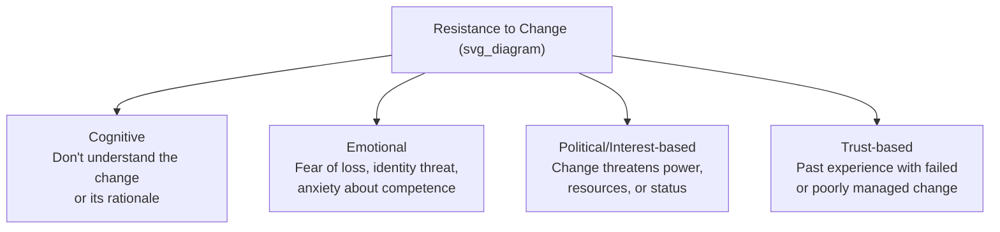
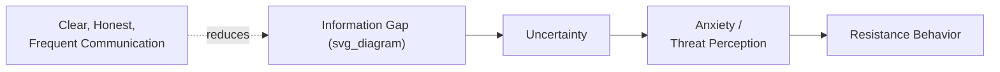
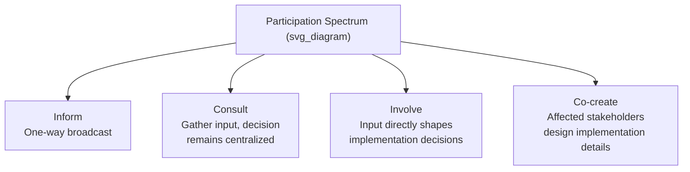

## Addressing Resistance and Uncertainty

### Definition and Distinction

**Resistance** refers to active or passive opposition to a proposed change, manifesting as behavior (delay, non-compliance, criticism, disengagement) that impedes adoption. **Uncertainty** refers to a cognitive and emotional state arising from insufficient or ambiguous information about the future, which precedes and often drives resistance but is distinct from it — a person can be highly uncertain without resisting, and can resist for reasons unrelated to uncertainty (e.g., genuine disagreement with the change's merits).

Effective communication treats these as related but separately diagnosable problems: uncertainty is addressed primarily through information and predictability, while resistance is addressed through a combination of information, involvement, and addressing underlying interests or losses.

**Key Points**

- Resistance is often a rational response to legitimate concerns, not simply an emotional or irrational obstacle to be overcome — treating all resistance as irrational tends to escalate it
- Overt resistance (vocal objection) is generally easier to address than covert resistance (passive non-compliance, quiet disengagement), because overt resistance at least surfaces the underlying concern
- Uncertainty tends to be more corrosive to morale and performance than clearly communicated bad news, because the human mind tends to fill information gaps with worst-case assumptions

### Sources of Resistance: A Diagnostic Framework

- **Cognitive resistance**: the person genuinely does not understand why the change is happening or how it benefits the organization or themselves — addressed through clearer rationale and information, not persuasion tactics
- **Emotional resistance**: rooted in loss (of identity, relationships, competence, status) rather than logic — addressed through acknowledgment and processing time, not additional facts (see Bridges' Transition Model)
- **Political/interest-based resistance**: the change genuinely threatens someone's resources, authority, or position — addressed through honest negotiation of interests, not persuasion that ignores the real stakes involved
- **Trust-based resistance**: skepticism rooted in the organization's own track record of poorly executed prior changes — addressed through consistency, transparency, and visibly different execution this time, which takes longer to establish than the other three sources

[Inference] Misdiagnosing the source of resistance is a common failure — for example, applying additional information (a cognitive-resistance remedy) to what is actually emotional or trust-based resistance tends to be ineffective and can be perceived as dismissive of the underlying concern, since more facts do not address an unprocessed sense of loss or a credibility deficit.

### The Uncertainty-Resistance Relationship

Uncertainty reduction theory suggests that people are motivated to reduce ambiguity about consequential situations, and in the absence of credible information from official channels, they will construct their own explanations — frequently more negative than reality — through informal channels (rumor, speculation). This makes proactive, frequent communication a direct intervention on the causal chain leading to resistance, even when the full picture is not yet finalized.

**Key Points**

- Silence during a period of organizational uncertainty is rarely neutral; it is typically filled with negative speculation rather than patient waiting
- Frequent "here's what we know and don't yet know" updates are generally more effective at reducing anxiety than withholding communication until a complete, polished answer is available
- The rumor mill fills information vacuums faster than most formal communication channels can respond, making early and honest partial disclosure a competitive necessity against informal channels

### Communication Techniques for Managing Uncertainty

1. **Explicit acknowledgment of what is unknown** — stating directly "we don't yet know X, and here's when we expect to" is more trust-building than vague reassurance or silence on unresolved points
2. **Committing to a communication cadence** — establishing and honoring a predictable rhythm of updates (even "no new update" messages) reduces anxiety by making the *process* predictable even when the *outcome* is not
3. **Distinguishing decided from undecided elements** — clearly separating what has been finalized from what remains under consideration prevents people from treating provisional information as settled fact, or settled information as still negotiable
4. **Providing decision-making timelines** — even an approximate timeline for when uncertainty will resolve gives people a temporal anchor that reduces indefinite anxiety

**Example**

During a pending reorganization, a leader who says "I can't share final team structures yet because they're still being finalized with HR and legal, but I can commit to communicating them by [specific date], and I will tell you immediately if that date changes" manages uncertainty more effectively than one who either stays silent or prematurely shares unconfirmed details that may later change.

### Techniques for Addressing Resistance Directly

**For cognitive resistance:**

- Provide the underlying rationale and data, not just the conclusion, so the audience can evaluate the reasoning rather than simply being told the answer
- Use multiple explanatory formats (data, narrative, direct Q&A) since comprehension gaps often stem from a mismatch between how information was presented and how a given audience processes information

**For emotional resistance:**

- Explicitly acknowledge loss before pivoting to future benefit (see Bridges' Transition Model, "Ending, Losing, Letting Go")
- Allow processing time and multiple touchpoints rather than expecting acceptance after a single communication
- Validate the emotional response as reasonable, rather than treating it as an obstacle to be corrected

**For political/interest-based resistance:**

- Engage directly with the underlying interest rather than only the surface objection (see interest-based negotiation frameworks)
- Where possible, involve affected stakeholders in shaping implementation details, which can convert some resistance into ownership without altering the core decision
- Be honest about genuine trade-offs and losses rather than implying the change is costless to everyone

**For trust-based resistance:**

- Acknowledge past communication or execution failures directly rather than ignoring the organizational memory of them
- Demonstrate consistency between words and subsequent actions over time, since trust-based resistance responds to behavior more than to messaging
- Identify and empower credible internal messengers (respected peers, not just senior leadership) who can vouch for the process based on their own direct involvement

### The Role of Involvement and Participation

Resistance is frequently reduced not by better one-way messaging but by genuine two-way involvement in shaping how (though not necessarily whether) a change is implemented:

- Moving along this spectrum generally increases ownership and reduces resistance, but also increases time and coordination cost, and is not appropriate for every decision (e.g., strategic direction set at the board level is rarely appropriate for co-creation, whereas implementation logistics often are)
- A common failure is offering "consult" while implying "co-create" — soliciting input that is not genuinely considered breeds more cynicism than not soliciting input at all, since it signals the process was performative

[Inference] The credibility cost of performative consultation (asking for input that visibly does not influence the outcome) likely exceeds the credibility cost of transparently not consulting at all, since the former demonstrates a gap between stated process and actual practice — this is a reasonable inference from trust and consistency research rather than a directly measured comparison.

### Distinguishing Legitimate Objection From Obstructive Resistance

Not all resistance should be "overcome" — some resistance surfaces genuine flaws in the change plan that leadership should act on. A diagnostic distinction:

| Signal | Legitimate Objection | Obstructive Resistance |
| --- | --- | --- |
| Specificity | Points to a concrete flaw or risk in the plan | Vague, generalized opposition without specific concerns |
| Consistency | Persists even when addressed with good information | Shifts to a new objection once the prior one is answered |
| Engagement | Willing to engage in problem-solving dialogue | Avoids direct engagement, relies on indirect undermining |
| Scope | Focused on the specific change | Extends to unrelated grievances |

**Key Points**

- Treating legitimate objections as mere "resistance to be managed" rather than valid input can cause leadership to miss real implementation flaws
- A pattern of shifting objections (each addressed concern replaced by a new one) is a stronger signal of underlying resistance not yet fully surfaced (often emotional or political) than of a genuine, addressable cognitive gap

### Common Failure Patterns

1. **Treating all resistance as irrational** — dismissing objections without diagnosing their source, which escalates rather than resolves the underlying concern
2. **Over-reassurance without substance** — repeating "everything will be fine" without addressing specific, named concerns, which reduces credibility rather than anxiety
3. **Filling uncertainty with false certainty** — providing confident answers to genuinely unresolved questions to seem in control, which backfires when the situation later changes
4. **One-time acknowledgment of loss** — mentioning loss briefly once and then moving on, rather than allowing sustained space for it to be processed
5. **Performative participation** — soliciting input without genuine intent to incorporate it, which is often detected and damages trust more than not asking at all
6. **Silence as a strategy** — withholding communication until a complete answer exists, ceding the information space to informal, typically more negative, speculation

### Related Topics

- Frameworks for change communication (Kotter, Bridges' Transition Model, ADKAR)
- Reading counterpart interests versus positions
- Crafting a compelling vision narrative
- Leading town halls and all-hands meetings under uncertainty
- Trust repair and credibility rebuilding after failed change initiatives
- Stakeholder segmentation and differentiated communication intensity
- Psychological safety and its role in surfacing resistance early