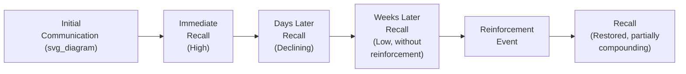
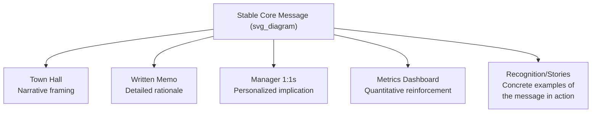

## Sustaining Momentum Through Repeated Messaging

### Definition and Rationale

**Sustaining momentum through repeated messaging** refers to the deliberate, sustained repetition and reinforcement of a core organizational message across time, channels, and messengers, in order to counteract the natural decay of attention, recall, and commitment that follows any single communication event. It rests on a well-established observation in communication practice: a message heard once, however well-crafted, decays in memory and priority far faster than leaders typically assume, while the audience's felt sense of "we've already covered this" is usually reached long before the message has actually achieved organizational saturation.

This creates what is often called the **communicator's curse**: because leaders live with a message continuously from its formulation, they experience it as repetitive and even tiresome long before most of the organization has genuinely internalized it. The practical implication is that leaders must consciously repeat messages well past the point where doing so feels personally redundant.

**Key Points**

- A single communication event, regardless of quality, is rarely sufficient to produce durable behavioral or attitudinal change across a large organization
- The gap between how many times leadership has said something and how many times the average employee has genuinely absorbed it is typically far larger than leaders intuitively estimate
- Repetition is not mere redundancy; each repetition should reinforce the same underlying message while varying format, channel, and specific framing to avoid the message being dismissed as rote

### The Message Decay Curve

Communication research on message retention generally shows recall dropping sharply within days of a single exposure, absent reinforcement. Each subsequent, well-timed reinforcement partially restores recall and, over multiple cycles, tends to build a more durable baseline than any single exposure could achieve alone. [Inference] The specific decay rate varies substantially by message complexity, audience relevance, and organizational context, so the shape of this curve should be treated as illustrative rather than a precise, universal quantitative model.

### Why Leaders Systematically Under-Repeat

1. **Proximity bias** — leaders are exposed to the message from its earliest formulation and through every internal discussion, making it feel exhausted to them long before the broader organization has heard it even once in a fully absorbed way
2. **Fear of sounding repetitive** — concern about appearing to lack new material or being perceived as out of touch with what has "already been covered"
3. **Mistaking distribution for absorption** — treating the fact that a message was *sent* (email, memo, slide) as equivalent to the message being *received and internalized*
4. **Underestimating organizational noise** — failing to account for the volume of competing messages, daily operational demands, and general organizational noise that crowds out any single communication

**Key Points**

- The "rule of seven" (a marketing heuristic suggesting a message typically needs multiple exposures before it drives action) is frequently cited in internal communication practice as a directional reminder that a single exposure is structurally insufficient, though the specific number is a heuristic rather than a precise organizational constant
- Leaders should expect to feel that they are over-communicating a message well before the organization would describe it as over-communicated

### Framework: Varying Form While Preserving Core Message

Effective repetition is not verbatim repetition; it varies format and framing while preserving a stable underlying message, to avoid the audience experiencing pure redundancy.

| Reinforcement Vehicle | Function |
| --- | --- |
| Recurring leadership updates | Maintains visible executive commitment over time, signaling the message is not a one-time announcement |
| Manager-led team discussions | Personalizes the message to specific, local relevance |
| Metrics and dashboards | Provides ongoing, concrete evidence connecting the message to observable progress |
| Storytelling and recognition | Makes the abstract message tangible through specific examples of people or teams enacting it |
| Onboarding and process documentation | Embeds the message into materials new employees encounter, extending its life beyond the original announcement cycle |

**Example**

A strategic priority to "become customer-obsessed" loses effectiveness if repeated only as a verbatim phrase in every all-hands. It sustains momentum more effectively when the same underlying priority appears as: a metric on a shared dashboard (customer satisfaction trend), a recurring segment in team meetings (customer story of the week), a criterion referenced in decision rationale ("we chose this option because it reduces customer friction"), and a recognition category in performance reviews — each reinforcing the same core priority through a different, non-redundant vehicle.

### Cadence Design

Determining how often to repeat a message involves balancing decay against fatigue:

- **High-stakes, high-change-magnitude messages** (major reorganizations, mergers) typically warrant a higher initial cadence (weekly or more frequent updates) during the most uncertain period, tapering as the situation stabilizes
- **Steady-state strategic priorities** (an ongoing cultural or strategic emphasis) typically warrant a lower, sustained cadence (monthly or quarterly reinforcement) intended to maintain baseline salience rather than respond to acute uncertainty
- **Milestone-triggered reinforcement** — tying reinforcement moments to natural organizational rhythms (quarterly business reviews, annual planning, onboarding cycles) embeds repetition into existing structures rather than requiring entirely separate communication events

[Inference] Excessive cadence without variation in content or format risks the opposite failure — message fatigue, where the audience begins to tune out due to perceived redundancy rather than absorbing reinforced content; the appropriate cadence is therefore a balance point that depends on message complexity and organizational context rather than a fixed formula.

### Distinguishing Reinforcement From Repetition Fatigue

| Signal of Effective Reinforcement | Signal of Repetition Fatigue |
| --- | --- |
| Audience references the message unprompted in their own work | Visible eye-rolling or dismissive reactions when the topic is raised |
| Message appears in decision rationale without leadership prompting | Declining engagement/attendance at recurring update sessions |
| Employees can articulate the message in their own words, with some variation | Verbatim repetition of leadership's exact phrasing without evidence of internalization |
| Manager-level cascade continues without central prompting | Managers deprioritizing or skipping cascade sessions |

**Key Points**

- The presence of the message appearing organically in employee-generated communication (without being prompted) is one of the strongest indicators that reinforcement has succeeded rather than merely accumulated
- Fatigue is generally a signal to vary the *format* and *messenger* of reinforcement, not necessarily to stop reinforcing the underlying message altogether

### The Role of Multiple Messengers

Repetition from a single messenger (even the CEO) has diminishing returns compared to the same core message being reinforced by multiple, credible sources across the organization:

- **Executive repetition** establishes and signals organizational priority
- **Middle-manager repetition** provides local relevance and personalized translation (see cascade communication)
- **Peer-to-peer reinforcement** (employees discussing the message informally, recognition among colleagues) is often the most durable form of reinforcement, since it reflects genuine internalization rather than top-down mandate
- **Systemic reinforcement** (the message embedded in metrics, performance criteria, or decision frameworks) sustains the message even when active verbal repetition tapers off, because the organizational system itself continues to enforce the underlying priority

### Common Failure Patterns

1. **Single-channel reliance** — repeating the message only through the same channel (e.g., only in all-hands meetings) rather than distributing reinforcement across multiple channels and messengers
2. **Verbatim repetition without variation** — reusing identical phrasing and format repeatedly, which reads as rote and disengages the audience rather than reinforcing genuine understanding
3. **Premature cessation** — stopping reinforcement once leadership personally feels the message has been adequately covered, well before organizational absorption has actually occurred
4. **Confusing distribution metrics with absorption** — treating email open rates, meeting attendance, or document views as evidence of internalized understanding rather than mere exposure
5. **No systemic embedding** — relying entirely on active communication (talks, memos) without embedding the message into structural reinforcement (metrics, performance criteria, onboarding), causing the message to fade once active communication tapers
6. **Ignoring fatigue signals** — continuing an unchanged cadence and format despite visible disengagement, rather than adjusting the reinforcement approach

### Measuring Sustained Momentum

- **Longitudinal recall testing** — periodically checking, well after initial launch, whether employees can still articulate the core message in their own words
- **Organic usage tracking** — monitoring whether the message's language and logic appear unprompted in internal documents, decisions, and communications
- **Cascade persistence** — verifying that manager-level reinforcement continues over time rather than being a one-time launch activity
- **Behavioral consistency over time** — assessing whether decisions and resource allocation remain aligned with the message months after its introduction, not just immediately following launch

### Related Topics

- Frameworks for change communication (Kotter's sustain-acceleration and institutionalization stages)
- Communicating strategy across an organization
- Leading town halls and all-hands meetings
- Addressing resistance and uncertainty
- Manager cascade communication and enablement
- Embedding cultural priorities into performance and recognition systems
- Measuring internal communication effectiveness over time