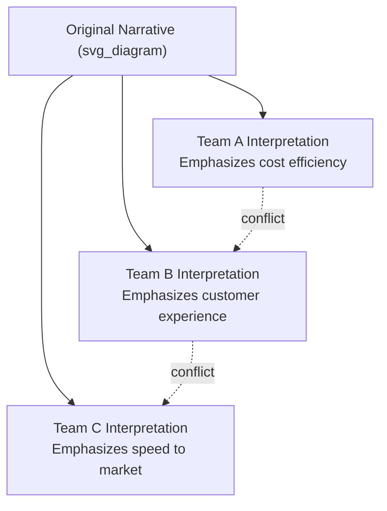
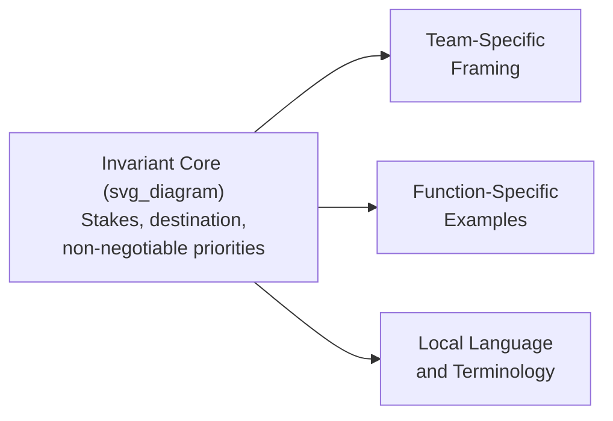
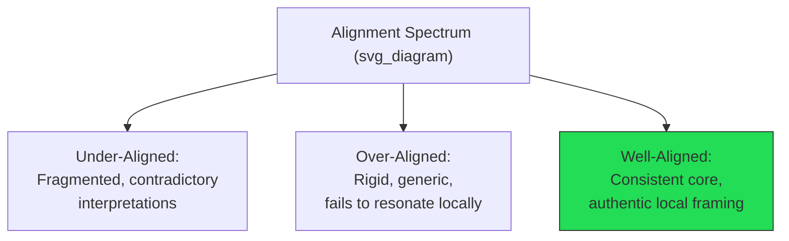

## Aligning Teams Around a Shared Narrative

### Definition and Purpose

**Aligning teams around a shared narrative** refers to the process of ensuring that distinct teams, functions, and individuals across an organization interpret, articulate, and act upon a common organizational story in a mutually consistent way, even as each group translates that story into locally relevant terms. It sits downstream of narrative *creation* (see vision narrative frameworks) and addresses a distinct problem: a well-crafted narrative created at the top can still fragment, diverge, or contradict itself as it moves through different teams, each of which may unconsciously reshape it to fit local priorities, incentives, or prior assumptions.

The core risk being managed is **narrative fragmentation**: without deliberate alignment work, different teams often end up telling meaningfully different versions of "why we're doing this," which undermines cross-functional coordination even when each team's individual version sounds internally coherent.

**Key Points**

- Narrative *creation* (crafting the story) and narrative *alignment* (ensuring consistent interpretation and retelling across groups) are distinct activities requiring different techniques
- Fragmentation is often invisible until cross-functional friction surfaces it — two teams can each believe they are executing the "same" strategy while operating from subtly incompatible interpretations
- Alignment does not mean verbatim uniformity; it means a consistent *core* (stakes, destination, priorities) with legitimate local variation in framing and application

### The Narrative Fragmentation Problem

Each team's interpretation may be individually defensible and even partially correct, but without alignment work, teams can end up making locally optimal decisions that are mutually inconsistent — for example, one team cutting costs in a way that degrades the customer experience another team is simultaneously being asked to prioritize. The narrative was not wrong; it was insufficiently aligned across the groups responsible for enacting different parts of it.

[Inference] Fragmentation risk tends to increase with organizational size and functional specialization, since more distinct functional cultures and incentive structures create more surfaces along which a shared narrative can be selectively emphasized or reinterpreted — though the specific relationship is not something that can be precisely quantified across organizations.

### Framework: Core-and-Adaptation Model

A widely used approach separates a narrative into an invariant core and a set of adaptable elements, giving teams explicit latitude to localize without permitting drift from the essential story.

- **Invariant core**: the elements that must remain identical across every team's retelling — the fundamental stakes, the destination, and any explicitly stated priority trade-offs (what matters more than what)
- **Adaptable elements**: framing, examples, terminology, and emphasis that can and should shift to be locally relevant, provided they do not contradict the invariant core

**Key Points**

- Explicitly documenting which elements are invariant and which are adaptable prevents both under-adaptation (rigid, generic messaging that fails to land locally) and over-adaptation (drift that produces genuine fragmentation)
- Without this explicit separation, teams often default to guessing which parts of a narrative are flexible, guessing inconsistently across the organization

### Techniques for Building Cross-Team Alignment

1. **Joint narrative workshops** — bringing leaders from different functions together to jointly work through how the shared narrative applies to their respective areas, surfacing potential contradictions before they propagate independently
2. **Cross-functional narrative review** — having representative teams review each other's localized versions of the narrative before broad distribution, catching drift or contradiction early
3. **Shared vocabulary and reference documents** — establishing a small set of common terms and reference phrases that all teams are expected to use consistently for the invariant elements, reducing unintentional linguistic drift
4. **Boundary-spanning roles** — individuals or small groups (often in strategy, communications, or program management functions) tasked specifically with monitoring for narrative consistency across teams and flagging emerging divergence
5. **Recurring cross-functional forums** — regular touchpoints (leadership syncs, cross-team reviews) where narrative application can be compared and reconciled on an ongoing basis rather than only at initial launch

**Example**

A company narrative centers on "winning through superior reliability, not lowest price." Engineering, sales, and customer support each need to localize this differently: engineering translates it into uptime and defect-rate priorities, sales translates it into how to position against cheaper competitors, and support translates it into response-time and resolution-quality standards. A joint workshop surfaces that sales' draft messaging ("we're also the most affordable option") directly contradicts the invariant core, allowing correction before it reaches customers and creates an inconsistent external narrative.

### Diagnosing Existing Fragmentation

| Diagnostic Method | What It Reveals |
| --- | --- |
| Cross-team language audit | Comparing how different teams describe the same strategic narrative in their internal materials, surfacing divergent emphasis or contradiction |
| Cross-functional decision review | Examining whether decisions made by different teams, each citing the "same" narrative, are actually mutually consistent |
| Employee narrative recall by team | Asking employees across different teams to articulate the core narrative, comparing consistency of the invariant elements specifically |
| Friction-point analysis | Investigating cross-team conflicts to determine whether they stem from genuinely different interpretations of shared strategic priorities |

**Key Points**

- Divergence in adaptable elements (framing, examples) is expected and healthy; divergence in the invariant core (stakes, destination, non-negotiable trade-offs) signals genuine fragmentation requiring correction
- Friction between teams is often diagnosed as a personality or process conflict when its root cause is actually narrative fragmentation — each team is executing a locally coherent but organizationally inconsistent version of the strategy

### The Role of Middle Management in Alignment

Because middle managers are the primary translators of narrative into team-specific terms (see cascade communication), they are also the primary point at which fragmentation is either prevented or introduced:

- **Manager alignment sessions prior to cascade** — bringing managers together to align on interpretation *before* each independently communicates to their own team reduces the risk of independently-generated, inconsistent translations
- **Shared manager toolkits** — providing common materials, talking points, and explicitly marked invariant elements reduces reliance on each manager's independent interpretation
- **Manager-to-manager peer review** — having managers preview each other's planned framing before delivery, particularly across functions with historically different priorities or cultures

[Inference] Without structured pre-cascade alignment, managers translating the same narrative independently and in parallel are likely to introduce meaningfully different emphases even with good intent, simply because each manager's prior context, function, and audience shape which parts of a complex narrative they naturally foreground — this is a reasonable inference from how information transmission generally degrades across independent channels, rather than a specific measured finding.

### Balancing Consistency With Legitimate Local Adaptation

Excessive enforcement of narrative uniformity carries its own risk: it can produce generic, disengaged retellings that fail to resonate locally, defeating the purpose of using narrative in the first place.

- **Under-alignment** produces the fragmentation problem described above — inconsistent, sometimes contradictory, versions of the narrative operating across the organization
- **Over-alignment** produces narratives that feel imposed and generic, since teams are not permitted to translate the story into genuinely relevant local terms, which reduces engagement and retelling fidelity
- The well-aligned middle ground requires clear articulation of what specifically must remain constant, paired with genuine trust and latitude for teams to adapt everything else

### Common Failure Patterns

1. **Assuming a single narrative launch achieves organization-wide alignment** — treating initial communication (e.g., a single town hall) as sufficient without follow-up alignment work across functions
2. **No explicit invariant-core definition** — failing to specify which elements of the narrative cannot be altered, leaving teams to guess and inconsistently interpret the boundaries of acceptable adaptation
3. **Parallel, uncoordinated manager translation** — allowing managers to independently interpret and cascade the narrative without any cross-manager alignment step
4. **Treating cross-team friction as a personality issue** — investigating conflicts as interpersonal or process problems without checking whether underlying narrative interpretation is actually the root cause
5. **Over-standardizing to the point of disengagement** — enforcing verbatim consistency across all elements, eliminating the local relevance that made narrative communication valuable in the first place
6. **No ongoing reconciliation mechanism** — establishing alignment once at launch without recurring forums to catch and correct drift that naturally accumulates over time

### Related Topics

- Crafting a compelling vision narrative
- Communicating strategy across an organization
- Sustaining momentum through repeated messaging
- Frameworks for change communication
- Cross-functional alignment and resolving competing functional priorities
- Manager cascade communication and enablement
- Organizational culture consistency across distributed teams