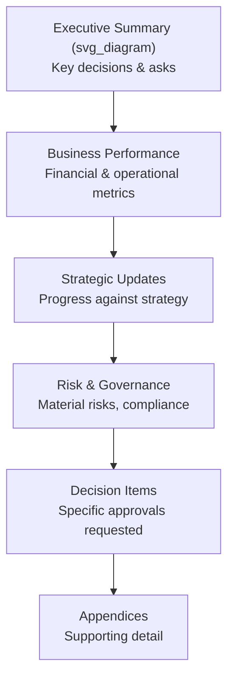

## Preparing Board Presentations and Briefing Materials

### Definition and Purpose

**Board presentations and briefing materials** are the formal written and visual artifacts prepared by executive teams to inform board-level governance and decision-making. Unlike internal operational communication, board materials serve a distinct function: they exist to enable the board to fulfill its fiduciary and oversight responsibilities, which requires a different standard of completeness, framing, and independence from management's preferred narrative than typical internal or external communication.

The governing principle distinguishing effective board communication from other executive communication is that the board's role is oversight and judgment, not implementation — materials must give directors sufficient, balanced information to exercise independent judgment, rather than being optimized to secure a predetermined approval.

**Key Points**

- Board materials are legal and governance artifacts, not marketing materials; they are frequently referenced in later scrutiny (audits, litigation, regulatory review) and must be able to withstand that scrutiny
- The audience holds a fiduciary duty of care, meaning materials should support genuine, informed deliberation rather than rapid rubber-stamping
- Materials typically serve two distinct sub-functions: the **board deck** (delivered live, discussion-oriented) and the **board book/briefing package** (comprehensive written material sent in advance for independent review)

### Distinguishing the Board Book From the Live Deck

| Dimension | Board Book (Advance Materials) | Live Presentation Deck |
| --- | --- | --- |
| Timing | Sent days in advance (commonly one week) | Presented live during the meeting |
| Density | Comprehensive, detailed, fully self-contained | Condensed, highlights key decisions and discussion points |
| Purpose | Enables independent director preparation and deep review | Facilitates live discussion, decision-making, and Q&A |
| Format | Narrative memos, detailed financials, appendices | Slides emphasizing visuals, summary data, and key questions |

[Inference] Sending only a live-deck-style presentation without a more detailed advance book is a commonly cited governance weakness, since it does not give directors sufficient time or material to prepare substantive questions or independently assess management's framing before the meeting — though the appropriate level of advance detail varies by company stage, board sophistication, and topic complexity.

### Structural Framework for Board Materials

- **Executive summary**: A concise, upfront statement of what the board needs to know and, critically, what decisions or approvals are being requested — directors should be able to grasp the core content and required actions without reading the full document
- **Business performance**: Financial and operational results presented against relevant benchmarks (budget, prior period, industry comparables), with variance clearly explained rather than merely reported
- **Strategic updates**: Progress against previously communicated strategic priorities, framed honestly against original commitments rather than reframed to appear more favorable in hindsight
- **Risk and governance**: Material risks, compliance matters, and governance items that fall within the board's oversight responsibility, including risks that reflect unfavorably on management's own performance
- **Decision items**: Specific matters requiring board approval, clearly separated from informational items, with the decision options and management's recommendation clearly stated
- **Appendices**: Detailed supporting data referenced but not embedded in the main narrative, preserving readability of the core document while providing depth for directors who want it

### The Executive Summary / "Ask" Framework

Every board material addressing a specific decision should make the request for action explicit and unambiguous, typically structured as:

1. **Context** — the situation requiring board attention
2. **Options considered** — the alternatives management evaluated, including options that were rejected and why
3. **Recommendation** — management's specific recommended course of action
4. **Rationale** — why this option was chosen over alternatives
5. **Risks and mitigations** — what could go wrong and how it will be managed
6. **The specific ask** — precisely what approval, resource, or decision is being requested from the board

**Key Points**

- Presenting only the recommended option without genuinely presenting alternatives considered can appear to the board as management attempting to foreclose independent judgment, even when unintentional
- An ambiguous or implicit "ask" (board members unsure whether a formal vote, informal sign-off, or purely informational update is intended) creates governance risk and should always be made explicit

### Balancing Transparency and Framing

Board materials sit at a distinct point on the transparency spectrum compared to most other executive communication, because the board's oversight function specifically requires visibility into unfavorable information that other audiences might not need.

- **Under-synthesis** (raw, unprioritized data dumps) burdens directors with the task of independently identifying what matters, reducing the quality of governance discussion
- **Over-curation** (selectively favorable framing, omission of unfavorable developments) can constitute a governance failure and, in serious cases, a breach of the duty to inform the board adequately
- The appropriate middle ground synthesizes and prioritizes information for clarity while explicitly surfacing unfavorable or uncertain developments rather than omitting or minimizing them

[Inference] Because board members typically rely heavily on management-prepared materials as their primary information source (absent independent investigation), the framing choices embedded in those materials likely carry outsized influence on board judgment relative to their apparent neutrality — this is a structural feature widely discussed in governance literature rather than a specific measured effect.

### Financial and Data Presentation Standards

- **Consistency across reporting periods** — using the same metrics, definitions, and formats meeting over meeting allows directors to track trends rather than re-orienting to new formats each cycle
- **Variance explanation, not just variance reporting** — a number that differs from budget or forecast should be accompanied by a clear, honest explanation of the driver, rather than left for directors to infer or ask about
- **Leading and lagging indicators together** — presenting only lagging financial results (e.g., quarterly revenue) without leading operational indicators (e.g., pipeline, churn signals) limits the board's ability to anticipate rather than merely react to results
- **Comparability and benchmarking** — where relevant and available, presenting company performance against industry or peer benchmarks gives directors external context that internal-only trend data cannot provide

### Common Failure Patterns

1. **Materials arriving too close to the meeting** — insufficient lead time prevents genuine independent director preparation, reducing board meetings to management presentations rather than informed deliberation
2. **Burying unfavorable information in appendices** — technically disclosing a material issue while structurally minimizing its visibility, which can be perceived (and in serious cases treated) as inadequate disclosure
3. **Presenting only management's preferred option** — omitting genuine alternatives considered, which limits the board's ability to exercise independent judgment
4. **Ambiguous decision requests** — failing to clearly state what specific approval or action is being requested, causing confusion about whether formal board action is required
5. **Inconsistent metrics across meetings** — changing key performance indicators or definitions between meetings in ways that obscure genuine trend analysis, whether intentional or not
6. **Overloading with volume rather than synthesis** — providing excessive raw detail without executive-level synthesis, shifting the burden of prioritization onto directors rather than management

### Presentation Delivery Considerations

- **Anticipating director questions** — board members, particularly independent directors with relevant domain expertise, often ask pointed questions; materials and live delivery should anticipate likely areas of scrutiny rather than being caught unprepared
- **Managing time allocation** — allocating board meeting time in proportion to strategic importance and decision urgency, rather than defaulting to routine operational updates consuming disproportionate discussion time
- **Distinguishing information items from discussion items from decision items** — explicit labeling in the agenda and materials helps the board allocate its attention appropriately across a typically time-constrained meeting
- **Consistency between written materials and live narrative** — the live presentation should reinforce, not contradict or significantly reframe, what was provided in advance written materials, since discrepancies raise credibility concerns

### Related Topics

- Reporting bad news and setbacks to stakeholders
- Investor relations and earnings call communication
- Governance and fiduciary duty fundamentals for executive teams
- Risk disclosure and material information standards
- Building trust and credibility with independent directors
- Structuring executive summaries for high-stakes audiences
- Crisis communication involving board-level oversight