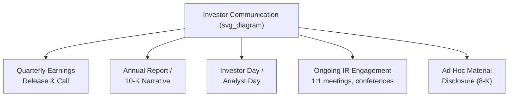
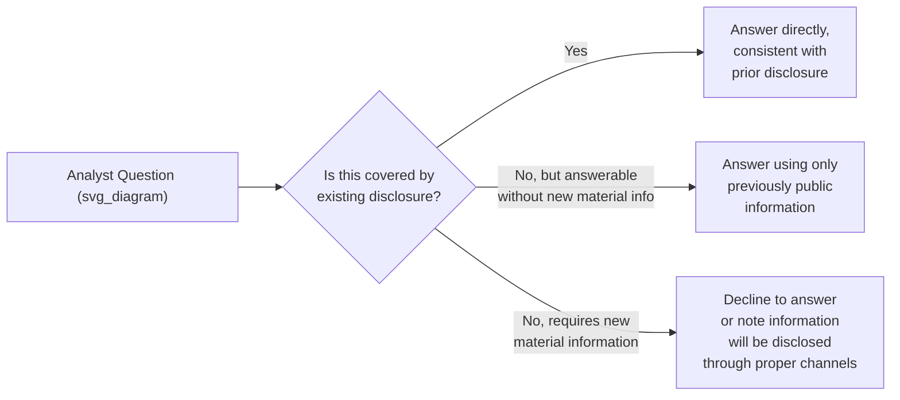

## Communicating With Investors and Analysts

### Definition and Regulatory Context

**Investor and analyst communication** encompasses the structured, often formally regulated disclosure of financial and operational information to shareholders, prospective investors, and the sell-side and buy-side analysts who cover a company. Unlike internal or general stakeholder communication, this domain operates under specific legal and regulatory frameworks (in the U.S., principally Regulation Fair Disclosure and SEC reporting requirements) that constrain both *what* can be said and, critically, *to whom* and *when*.

The foundational compliance principle is **fair disclosure**: material, non-public information cannot be selectively shared with certain investors or analysts (e.g., in a private call) without simultaneous broad public disclosure. This legal constraint shapes nearly every aspect of investor communication practice, distinguishing it sharply from other executive communication domains where selective, audience-tailored messaging is normal and expected.

**Key Points**

- Regulation FD (in U.S. public markets) prohibits selective disclosure of material non-public information; private conversations with analysts or large investors cannot reveal information not already available to the general public
- "Material" information is generally understood as information a reasonable investor would consider important to an investment decision — a legal standard rather than a purely communication judgment
- Non-compliance carries direct legal and regulatory risk, distinguishing investor communication from domains where the primary risk is reputational

### Core Communication Vehicles

| Vehicle | Purpose | Key Characteristic |
| --- | --- | --- |
| Earnings release & call | Regular (typically quarterly) results disclosure and management commentary | Highly structured, scripted prepared remarks plus live Q&A |
| Annual report narrative | Comprehensive, formal annual disclosure | Longest-form, most legally reviewed communication vehicle |
| Investor/analyst day | Deeper strategic and operational disclosure, less frequent | Allows more context and narrative depth than quarterly cadence permits |
| Ongoing IR engagement | Relationship-building, clarification of previously disclosed information | Must strictly avoid introducing new material information selectively |
| Ad hoc material disclosure | Timely disclosure of significant unscheduled events | Governed by specific regulatory timing requirements |

### Structuring the Earnings Call

The earnings call is the highest-frequency, highest-scrutiny investor communication vehicle and follows a well-established structure:

1. **Safe harbor statement** — a standard legal disclaimer regarding forward-looking statements, read or referenced at the outset to establish the legal framing for subsequent commentary
2. **Prepared remarks** — typically delivered by the CEO (strategic and qualitative narrative) and CFO (detailed financial results), read from carefully reviewed scripts to ensure precision and legal compliance
3. **Q&A session** — live, less scripted engagement with covering analysts, generally considered the highest-risk and highest-information-value portion of the call

**Key Points**

- Prepared remarks are typically drafted collaboratively across finance, legal, investor relations, and executive leadership specifically to ensure both message consistency and regulatory compliance
- The Q&A segment carries elevated risk precisely because it is less scripted; executives must internalize disclosed information and its boundaries well enough to respond accurately and consistently without deviating into undisclosed territory

### Managing the Earnings Call Q&A

- **Consistency with prior disclosure** is paramount — an answer that subtly contradicts or extends beyond previously released information can itself constitute a disclosure event, triggering compliance obligations
- **Declining to answer** is a legitimate and common response to a question that would require revealing undisclosed material information; a well-practiced, non-evasive way of declining ("we don't provide guidance at that level of granularity" or "we'll address that in our next scheduled disclosure") preserves both compliance and credibility
- **Pre-call preparation** typically includes anticipating likely analyst questions (informed by known analyst models, prior questions, and current market concerns) and rehearsing responses that are both substantively useful and compliant

[Inference] Analysts often probe specifically at the boundary of what has been disclosed, since the incremental information gained from a slight overextension in a live answer can be valuable to their models — this creates persistent pressure on executives to maintain discipline in live Q&A, though the intensity of this pressure varies by company visibility and analyst coverage depth.

### Guidance and Forward-Looking Statements

Providing "guidance" — forward-looking estimates of future financial performance — is a distinct and consequential category of investor communication:

- **Guidance range framing** — presenting a range rather than a single point estimate is standard practice, communicating appropriate uncertainty while still giving analysts a usable basis for their models
- **Consistency and credibility over time** — a pattern of significantly missing previously issued guidance erodes market trust more than the specific miss itself, since it signals either poor forecasting discipline or overly promotional prior guidance
- **Withdrawing or suspending guidance** — during periods of unusual uncertainty (major disruption, pending transaction), companies may formally withdraw guidance rather than issue an unreliable estimate; this itself is a significant disclosure requiring careful communication of the rationale
- **Safe harbor protections** — forward-looking statements are typically accompanied by legal safe harbor language, but this protects against certain liability rather than eliminating the reputational consequence of a significantly missed forecast

**Example**

A company facing unexpected supply chain disruption faces a choice between maintaining existing guidance (risking a later, more damaging miss), narrowing the guidance range downward, or withdrawing guidance entirely. Communicating a downward revision promptly, with clear rationale tied to a specific, verifiable cause (rather than vague "macro headwinds" language when a more specific cause is known), is generally more credibility-preserving than either an unexplained miss or an overly optimistic maintained range that the company privately doubts.

### Framing Performance: Balancing Optimism and Credibility

Investor communication requires a distinct balance compared to internal vision communication: analysts and sophisticated investors actively discount excessive promotional framing, making overly optimistic presentation counterproductive to long-term credibility even when short-term market reaction might reward it.

| Approach | Short-Term Effect | Long-Term Credibility Effect |
| --- | --- | --- |
| Balanced, evidence-based framing | May be less immediately exciting | Builds durable analyst trust and more stable valuation multiples over time |
| Excessive promotional framing | May produce a short-term positive reaction | Erodes credibility when subsequent results diverge from the framing, increasing scrutiny of future disclosures |
| Excessive conservatism/sandbagging | May depress near-term valuation | Can also erode trust if perceived as deliberately managing expectations rather than genuine uncertainty |

**Key Points**

- Analysts build models that are specifically designed to detect and adjust for promotional bias in management commentary, meaning consistently optimistic framing tends to be discounted rather than taken at face value over time
- The goal of investor communication credibility is not to avoid ever disappointing the market, but to ensure that when results diverge from expectations, the market trusts management's explanation of why

### Common Failure Patterns

1. **Selective disclosure in private settings** — sharing additional color or specifics with a subset of analysts or large investors in one-on-one settings beyond what has been publicly disclosed, creating Regulation FD exposure
2. **Inconsistent messaging across vehicles** — earnings call commentary that subtly diverges from the formal written release or prior disclosures, creating confusion about which statement is authoritative
3. **Evasive non-answers without acknowledgment** — deflecting a question without clearly framing it as a compliance-driven limitation, which can read as evasiveness rather than appropriate discipline
4. **Overpromising in guidance** — issuing guidance calibrated to please the market in the near term rather than reflecting genuine internal forecasting confidence, setting up a future credibility-damaging miss
5. **Burying unfavorable results in favorable framing** — technically disclosing a negative development while structurally minimizing its visibility relative to positive results, inviting analyst skepticism about the completeness of disclosure
6. **Under-preparing executives for live Q&A** — insufficient rehearsal of likely difficult questions, increasing the risk of an inadvertent disclosure or an inconsistent, credibility-damaging answer

### Cross-Functional Preparation Process

Effective investor communication typically involves a structured, cross-functional review process prior to any public disclosure event:

- **Legal and compliance review** — ensuring prepared remarks and anticipated Q&A responses comply with disclosure regulations and do not introduce selective disclosure risk
- **Finance/IR collaboration** — aligning the qualitative narrative (from executives) with the precise quantitative disclosure (from finance), ensuring no contradiction
- **Mock Q&A sessions** — rehearsing likely analyst questions, including deliberately difficult or adversarial ones, to build executive fluency and identify any risk of inadvertent overextension into undisclosed territory
- **Message consistency check** — confirming that the current disclosure is consistent with prior public statements, or, where a genuine change has occurred, ensuring the change itself is clearly and appropriately communicated as such

### Related Topics

- Preparing board presentations and briefing materials
- Reporting bad news and setbacks to stakeholders
- Regulation Fair Disclosure and securities communication compliance fundamentals
- Crisis communication in publicly traded companies
- Framing financial results: variance explanation and benchmarking
- Building long-term credibility with financial market audiences
- Managing guidance revisions and expectation-setting