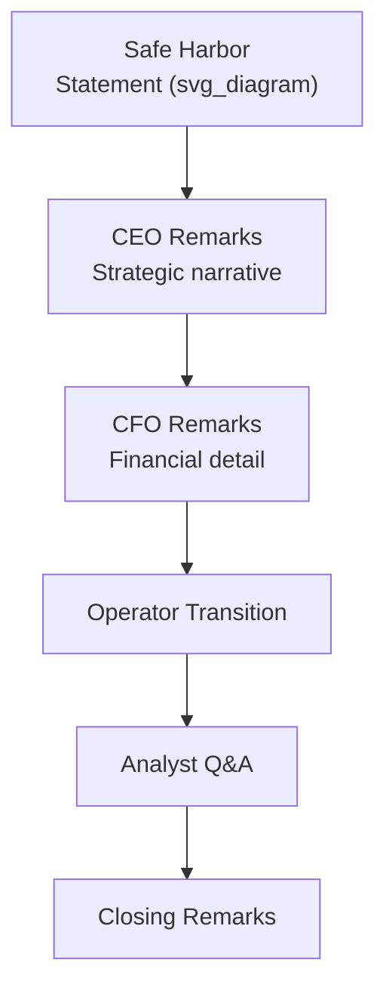
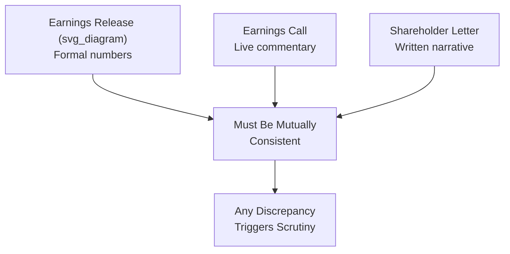

## Structuring Earnings Calls and Shareholder Letters

### Definition and Distinction Between the Two Vehicles

**Earnings calls** and **shareholder letters** are two distinct but complementary investor communication vehicles that typically accompany the same quarterly or annual disclosure event. The earnings call is a live, spoken, interactive format built around structured prepared remarks and unscripted Q&A. The shareholder letter is a written, asynchronous, typically longer-form narrative document that allows for more deliberate framing, context, and voice than the more clipped, compliance-constrained live call permits.

While both vehicles must adhere to the same underlying disclosure and accuracy standards, they serve different communicative functions and are structured according to different logics: the call is optimized for real-time credibility and analyst engagement, while the letter is optimized for durable, referenceable narrative framing that shapes how investors interpret results over a longer period.

**Key Points**

- The two vehicles should be factually and narratively consistent with each other, since analysts and investors routinely cross-reference both
- The letter typically has a longer effective "shelf life" — it is quoted, referenced, and re-read in ways a live call transcript rarely is
- Both vehicles must comply with the same disclosure regulations (see Regulation FD), but the letter's written, reviewed nature generally allows for more precise, deliberate language than live Q&A

### Structuring the Earnings Call

1. **Safe harbor statement**: Standard legal framing establishing that forward-looking statements are subject to risks and uncertainties, typically read verbatim by an operator or investor relations representative at the outset
2. **CEO remarks**: Qualitative narrative connecting the quarter's results to the broader strategic story — typically covers key achievements, challenges, and forward context, written to reinforce the ongoing investor narrative rather than simply restating numbers
3. **CFO remarks**: Detailed financial walk-through — revenue, margin, key metrics, and guidance, typically more numerically dense and precise than the CEO's more narrative-driven section
4. **Operator transition**: A structured handoff to the Q&A portion, often including instructions for how analysts queue questions
5. **Analyst Q&A**: The unscripted, highest-scrutiny portion (see investor and analyst communication for detailed Q&A management techniques)
6. **Closing remarks**: A brief, deliberate closing statement, often reinforcing the single most important takeaway management wants retained after the call ends

**Key Points**

- The CEO/CFO division of labor (narrative versus numbers) is a widely used convention, though some companies blend the roles differently depending on executive strengths and company stage
- The closing statement is disproportionately memorable relative to its length, since it is the last thing analysts hear before moving to write their notes — it should be deliberately crafted, not an improvised sign-off

### The Prepared Remarks Drafting Process

Earnings call prepared remarks typically undergo a structured, cross-functional drafting and review cycle given their compliance sensitivity and market impact:

1. **Initial draft** — typically produced collaboratively by investor relations and finance, incorporating the quarter's actual results and previously agreed strategic themes
2. **Executive input and voice alignment** — CEO and CFO review and adjust language to match their authentic communication style while preserving factual precision
3. **Legal and compliance review** — checking for consistency with prior disclosures, appropriate forward-looking statement qualification, and absence of selective or premature disclosure
4. **Rehearsal** — live read-throughs, often multiple times, to ensure pacing, clarity, and comfort with the material under the added pressure of a live, recorded setting

[Inference] The gap between an executive's natural conversational style and the necessarily precise, legally reviewed language of prepared remarks is a commonly cited tension in earnings call preparation, since overly stilted delivery can undermine perceived authenticity even when every word is accurate — this is a practitioner observation rather than a measured finding.

### Structuring the Shareholder Letter

Shareholder letters vary in format across companies but commonly follow a structure that balances narrative continuity with disclosure completeness:

- **Opening narrative**: Sets the frame for how the period should be interpreted — often the section that receives the most deliberate crafting, since it establishes the lens through which subsequent detail is read
- **Performance summary**: Key financial and operational results, generally written with more narrative context and less pure tabular density than a financial statement, though it must remain fully consistent with formally reported figures
- **Strategic context**: Connects the period's results to longer-term strategic priorities, reinforcing continuity of narrative across reporting periods (see sustaining momentum through repeated messaging)
- **Challenges and risks**: Honest treatment of what did not go as planned; letters perceived as overly promotional and free of any acknowledged difficulty tend to be discounted by sophisticated readers
- **Forward outlook**: Framing of what lies ahead, calibrated against the same credibility considerations governing formal guidance (see communicating with investors and analysts)

**Example**

A shareholder letter addressing a quarter with a significant miss against a previously stated target is more credibility-preserving when it explicitly names the miss, its specific cause, and the corrective action being taken, rather than reframing results in a way that technically discloses the number but narratively minimizes its significance. Long-term investor trust research and market practice both suggest that a demonstrated pattern of direct, honest treatment of setbacks increases the credibility afforded to a company's positive claims over time.

### Voice and Tone Considerations in Shareholder Letters

Unlike the more formally structured earnings call, shareholder letters afford more latitude for a distinctive executive voice, which several well-known long-form letters have used deliberately to build durable investor relationships:

- **Consistency of voice over time** — a recognizable, consistent authorial voice across multiple years' letters builds a cumulative sense of trust and continuity that a single well-written letter cannot achieve alone
- **Directness over euphemism** — precise, plain language describing both successes and setbacks is generally received more credibly by sophisticated institutional readers than heavily qualified or euphemistic language
- **Appropriate informality within compliance bounds** — some latitude for a more personal, first-person narrative voice is common, but this must not come at the expense of the same disclosure precision required of any investor communication

**Key Points**

- The letter's format allows for more explicit articulation of *why* certain decisions were made (capital allocation logic, strategic trade-offs) than the more compressed earnings call format typically permits
- Because letters are archived and compared year-over-year by analysts and investors, internal consistency of stated philosophy (e.g., consistent capital allocation principles) across multiple years' letters is itself a credibility signal

### Consistency Requirements Across Vehicles

- Any material inconsistency between the numbers in the formal release, the framing on the live call, and the narrative in the shareholder letter is likely to be identified by analysts and can itself become a disclosure or credibility issue independent of the underlying results
- A structured internal review process cross-checking all three (or more) disclosure vehicles against each other prior to release is standard practice at companies with mature investor relations functions

### Common Failure Patterns

1. **Letter and call narrative divergence** — a shareholder letter framing results more positively (or differently) than the live call commentary, creating an inconsistency analysts are likely to notice and question
2. **Overloading the call with letter-appropriate detail** — attempting to convey the full narrative depth appropriate to a written letter within the time-constrained, live call format, diluting the call's focus and pacing
3. **Under-using the letter's narrative latitude** — treating the shareholder letter as a mere restatement of the earnings release numbers, forfeiting the opportunity for the deeper strategic framing the format uniquely allows
4. **Inconsistent voice year over year** — significant shifts in tone, structure, or philosophy across successive letters without explanation, undermining the cumulative trust-building value of a consistent authorial voice
5. **Insufficient rehearsal of live call delivery** — under-preparing for the pacing and pressure of live delivery, resulting in stumbling or inconsistent phrasing that can be misread as uncertainty about the underlying substance
6. **Omitting the "why" in written narrative** — providing performance data in the letter without the strategic rationale that gives investors confidence the leadership team understands and controls the underlying drivers

### Related Topics

- Communicating with investors and analysts
- Preparing board presentations and briefing materials
- Reporting bad news and setbacks to stakeholders
- Regulation Fair Disclosure and securities communication compliance
- Sustaining momentum through repeated messaging
- Capital allocation philosophy communication
- Building long-term credibility with financial market audiences