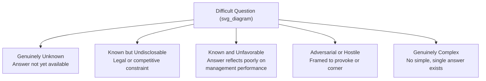
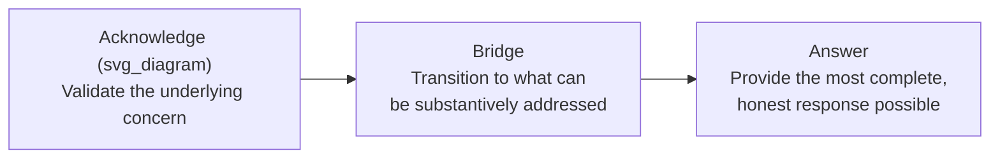

## Managing Difficult Board and Stakeholder Questions

### Definition and Stakes

**Managing difficult board and stakeholder questions** refers to the executive skill of responding, in live and often unscripted settings, to challenging, adversarial, or high-stakes inquiries from directors, investors, analysts, regulators, or other stakeholders with governance or oversight authority. This differs from general Q&A handling (see town halls) primarily in stakes and consequence: board and stakeholder questions frequently carry legal, fiduciary, regulatory, or material financial implications, meaning the standard for accuracy, consistency, and disclosure discipline is substantially higher than in internal-facing settings.

The defining tension in this domain is between two legitimate but competing pressures: the need to be forthcoming and substantively responsive (satisfying fiduciary and disclosure obligations, and building trust) and the need to remain precise, accurate, and appropriately bounded (avoiding overstatement, premature disclosure, or commitments the organization cannot honor).

**Key Points**

- Board and stakeholder questions are disproportionately remembered and referenced relative to their share of total meeting time, since they often surface exactly the issues of greatest concern or uncertainty
- A poorly handled difficult question can do more reputational and trust damage than the underlying issue itself, since the response is interpreted as a signal of executive competence and candor more broadly
- Unlike marketing or general internal communication, responses in this domain may be referenced later in audits, litigation, or regulatory review, requiring a standard of precision beyond typical conversational communication

### Categorizing Difficult Questions

Each category requires a distinct response strategy; misapplying the wrong strategy (e.g., treating a genuinely unfavorable-but-known answer as though it were undisclosable) is a common source of credibility damage.

**Key Points**

- Correctly diagnosing which category a question falls into, in the moment, is itself a critical skill — executives who default to a single response pattern regardless of question type (e.g., always deflecting) erode trust over time
- Adversarial framing does not change the underlying category of information being sought; the response strategy should be determined by what is actually being asked, not by the tone in which it is asked

### Response Frameworks by Question Category

| Category | Recommended Response Strategy | Approach to Avoid |
| --- | --- | --- |
| Genuinely unknown | Acknowledge directly, commit to a specific follow-up timeline and owner | Guessing or projecting false confidence |
| Known but undisclosable | Name the specific constraint explicitly, then share what can be shared | Vague non-answers with no stated reason |
| Known and unfavorable | Answer directly and completely, paired with context on corrective action | Minimizing, burying, or reframing away from the substance |
| Adversarial/hostile | Acknowledge the legitimate concern beneath the framing before answering the substance | Matching hostility or becoming visibly defensive |
| Genuinely complex | Break the answer into clearly labeled components rather than forcing a false simple answer | Oversimplifying in a way that is technically inaccurate |

**Example**

A board member asks pointedly, "Why should we believe this turnaround plan will work when the last one didn't?" This is adversarial in framing but contains a legitimate underlying question (known and unfavorable: the prior plan's failure, plus a forward-looking claim requiring justification). An effective response acknowledges the prior failure specifically and honestly, states concretely what is different this time (not merely asserting confidence), and invites continued scrutiny — rather than becoming defensive about the framing or dismissing the comparison.

### The Acknowledge-Bridge-Answer Structure

A widely used structure for handling difficult questions, adapted from media training and applied to board/stakeholder contexts:

1. **Acknowledge**: Explicitly validating that the question raises a legitimate concern, even if the framing is adversarial or the answer is difficult — this reduces the questioner's need to escalate tone to be heard
2. **Bridge**: A brief, honest transition connecting the acknowledgment to the substantive response, avoiding language that reads as evasive deflection
3. **Answer**: The most complete and accurate response possible given genuine constraints, with those constraints named explicitly rather than implied

[Inference] Skipping the acknowledgment step and moving directly to a defensive or deflective answer is a commonly observed failure pattern, since it can read as dismissing the legitimacy of the concern even when the substantive answer that follows is accurate — this is a widely taught principle in executive communication coaching rather than a directly measured finding.

### Handling "I Don't Know" Credibly

Executives frequently under-use direct acknowledgment of genuine uncertainty out of a mistaken belief that it signals weakness. In board and stakeholder contexts specifically, credible uncertainty acknowledgment is generally more trust-building than false certainty that is later proven wrong.

- **Name the specific gap** — "we don't yet have final data on X" is more credible than a vague "we're still looking into it"
- **Commit to a resolution path** — pairing the acknowledgment with a concrete next step and timeline converts an admission of uncertainty into a demonstration of process discipline
- **Distinguish "don't know" from "can't say"** — these require different framing; conflating them (using vague language when the real constraint is legal or competitive, or vice versa) creates confusion about what kind of gap is actually present

**Key Points**

- A pattern of overconfident answers that are later revealed to be wrong causes more durable credibility damage than a pattern of honest, well-managed uncertainty acknowledgments
- Boards and sophisticated stakeholders generally have enough pattern-recognition to detect false confidence over time, even if a single instance is not immediately challenged

### Managing Hostile or Adversarial Questioning

- **Separate tone from content** — responding to the underlying substantive question rather than reacting to the adversarial delivery prevents the exchange from escalating into a personal conflict that obscures the actual issue
- **Maintain composure as a credibility signal** — visible defensiveness or irritation is generally interpreted by observers (other board members, stakeholders in the room) as a sign of discomfort with scrutiny, independent of the actual merits of the answer given
- **Avoid over-explaining or over-justifying** — a long, defensive answer to a pointed question can read as protesting too much; a direct, appropriately concise answer is often more credible than an extended justification
- **Know when to take it offline** — for questions requiring extensive detail beyond what a live session can accommodate, explicitly offering a structured follow-up (rather than an extended live response) can preserve both meeting time and answer quality

### Preparation Techniques

1. **Pre-mortem question mapping** — before a board meeting or major stakeholder engagement, systematically drafting the most difficult, uncomfortable questions that could plausibly be asked, including ones executives would prefer not to be asked
2. **Cross-functional input on anticipated questions** — involving legal, finance, and operational leaders in identifying likely difficult questions from their respective vantage points, since a single executive's blind spots may not surface all likely lines of inquiry
3. **Mock Q&A / rehearsal sessions** — live practice under time pressure and adversarial questioning, ideally from someone specifically tasked with playing a skeptical or hostile questioner
4. **Establishing response boundaries in advance** — pre-agreeing, particularly with legal and compliance input, on what can and cannot be disclosed for a given topic, so that live judgment calls are minimized under pressure

**Key Points**

- The value of mock Q&A preparation lies less in memorizing specific answers and more in building comfort with the acknowledge-bridge-answer pattern under realistic pressure
- Pre-agreeing on disclosure boundaries with legal counsel in advance of a session substantially reduces the risk of an inadvertent overextension in the heat of live questioning

### Common Failure Patterns

1. **Defaulting to deflection regardless of question type** — using the same evasive response pattern for genuinely unknown, undisclosable, and unfavorable-but-answerable questions alike, which erodes trust across all three categories
2. **Visible defensiveness** — reacting to adversarial tone rather than engaging with the substance, which shifts the audience's attention from the issue to the executive's composure
3. **False certainty under pressure** — providing a confident-sounding answer to a genuinely unresolved question to avoid appearing unprepared, creating a credibility risk if the situation later diverges from the stated answer
4. **Over-justifying unfavorable answers** — an unusually long or elaborate explanation for a difficult result, which can read as protesting too much rather than as thorough transparency
5. **Inconsistency with prior statements** — an answer that contradicts or is difficult to reconcile with previous board or stakeholder communications, raising concerns about either the current or prior statement's accuracy
6. **Treating every hostile question as illegitimate** — dismissing the underlying concern because of adversarial framing, missing genuine substance that may warrant real attention

### Related Topics

- Preparing board presentations and briefing materials
- Communicating with investors and analysts
- Reporting bad news and setbacks to stakeholders
- Leading town halls and all-hands meetings
- Crisis communication and reputational risk management
- Media training and adversarial interview techniques
- Building and sustaining trust with governance and oversight bodies