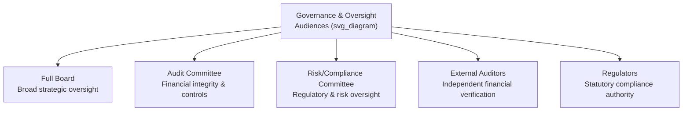
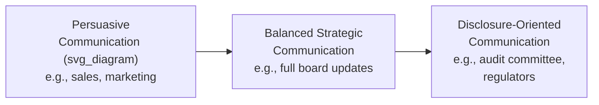

## Tailoring Messages for Governance and Oversight Audiences

### Definition and Core Distinction

**Tailoring messages for governance and oversight audiences** refers to the practice of adapting communication content, framing, and level of detail specifically for audiences whose formal role is to oversee, evaluate, or hold accountable an organization's leadership — including boards of directors, audit committees, regulators, compliance bodies, and external auditors. This differs fundamentally from tailoring for operational, customer, or general stakeholder audiences: oversight audiences are not being persuaded toward a preferred outcome but are being equipped to exercise independent judgment, often specifically about the performance of the very people communicating with them.

The defining structural feature of this audience category is a built-in tension: the communicator (management) is both the primary source of information for the audience and, simultaneously, the subject the audience is evaluating. This creates an inherent asymmetry that governance-appropriate communication must explicitly account for, rather than treating oversight audiences as simply another stakeholder group to be persuaded.

**Key Points**

- Oversight audiences typically hold formal authority (fiduciary duty, statutory power, regulatory mandate) that most other communication audiences lack, changing both the stakes and the legal standards applicable to the communication
- Communication to these audiences is more likely to be scrutinized retrospectively (in audits, investigations, or litigation) than communication to most other audiences, requiring durability and defensibility as design criteria
- Different oversight bodies (board, audit committee, regulator) have distinct mandates and require correspondingly distinct framing, even when covering overlapping subject matter

### Segmenting Governance and Oversight Audiences

| Audience | Primary Mandate | Communication Emphasis |
| --- | --- | --- |
| Full board | Overall strategic and fiduciary oversight | Synthesized strategic and performance narrative, explicit decision requests |
| Audit committee | Financial statement integrity, internal controls | Detailed, precise financial and control-related disclosure, no strategic gloss |
| Risk/compliance committee | Regulatory adherence, enterprise risk | Explicit risk identification and mitigation status, unfiltered by optimism |
| External auditors | Independent verification of financial representations | Complete, unmanaged access to underlying data and documentation |
| Regulators | Statutory and legal compliance | Precise, legally accurate language; no promotional framing whatsoever |

**Key Points**

- A single underlying issue (e.g., a control weakness) may require distinctly different framing across these audiences: strategic context for the full board, granular technical detail for the audit committee, and precise legal characterization for a regulator
- Treating all oversight audiences with a uniform communication style tends to either over-simplify for technically mandated audiences (audit committee, regulators) or over-burden broader strategic audiences (full board) with excessive technical detail

### The Persuasion-to-Disclosure Spectrum

Governance communication sits at a distinct point on a spectrum from persuasive to purely disclosure-oriented communication, and effective tailoring requires recognizing where a given audience and topic sit on this spectrum.

- **Persuasive communication** (appropriate for customers, general employees) legitimately emphasizes favorable framing within the bounds of honesty
- **Balanced strategic communication** (appropriate for the full board on most matters) synthesizes and prioritizes information while still requiring explicit surfacing of unfavorable developments
- **Disclosure-oriented communication** (required for audit committees, regulators, and matters of financial or legal compliance) minimizes framing and interpretive gloss almost entirely, prioritizing completeness and precision over narrative coherence

[Inference] A common failure in governance communication is applying persuasive-communication instincts (developed through years of practice in marketing, sales, or general leadership communication) to disclosure-oriented contexts where those instincts are actively counterproductive — this is a frequently cited transition challenge for experienced executives moving into more heavily regulated or oversight-intensive roles, rather than a measured statistic.

### Calibrating Detail and Framing by Mandate

- **For strategic oversight (full board)**: synthesis is expected and valuable; the board relies on management to prioritize what matters most, provided unfavorable information is not thereby minimized or omitted
- **For financial and control oversight (audit committee)**: synthesis without full access to underlying detail is generally inappropriate; this audience specifically exists to independently verify what management represents, requiring more granular, less pre-interpreted information
- **For regulatory communication**: language must be legally precise rather than optimized for narrative flow or persuasive impact; regulatory audiences typically parse specific terminology with legal weight that differs from ordinary business usage, making word choice a compliance matter rather than merely a stylistic one

**Example**

A cybersecurity incident might be communicated to the full board as a strategic narrative (what happened, business impact, remediation plan, and implications for the broader security strategy), to the audit committee with a much more granular account of what specific controls failed and why, and to a relevant regulator with precise, legally reviewed language regarding the nature and timing of the incident and the organization's disclosure obligations — each framing accurate and consistent with the others, but calibrated to a different mandate and level of technical specificity.

### Handling Information That Reflects on Management's Own Performance

A distinguishing feature of governance communication is that the information being communicated frequently bears directly on the performance of the people communicating it — creating a structural incentive toward self-protective framing that must be actively counteracted.

- **Explicit self-critical disclosure norms** — establishing organizational expectations (often codified in governance policy) that management is expected to proactively surface issues reflecting unfavorably on its own performance, rather than waiting to be asked
- **Independent verification channels** — internal audit functions, whistleblower mechanisms, and direct access between the board and levels of the organization below the executive team exist specifically to counteract the structural bias inherent in management-filtered communication
- **Board and committee executive sessions** — meetings or portions of meetings held without management present allow oversight bodies to discuss management's performance and any concerns without the communication dynamics that management's presence inherently introduces

**Key Points**

- The existence of independent verification channels does not reduce management's own disclosure obligations; rather, it reflects a governance design assumption that management-filtered communication alone is structurally insufficient for effective oversight
- A pattern of oversight bodies later discovering material information through independent channels rather than through management disclosure is a significant governance red flag, regardless of whether any individual instance involved active concealment

### Legal and Fiduciary Considerations Specific to This Audience Category

- **Standard of care** — communication to fiduciary bodies (boards, certain committees) is subject to legal standards regarding completeness and accuracy that exceed ordinary business communication norms
- **Documentation and record-keeping** — governance communications are more likely to be preserved, reviewed, and referenced in later legal or regulatory contexts, making precision and internal consistency across time a practical necessity, not merely good practice
- **Privilege considerations** — certain governance communications (particularly those involving legal counsel) may carry attorney-client privilege implications that affect both how they are drafted and how they are later treated in disclosure or litigation contexts, typically requiring legal guidance on format and framing

[Speculation] Executives without governance-specific communication training may underestimate how differently their governance communications could be interpreted in a later legal or regulatory review compared to how they were intended in the original context — this is a plausible risk given the general gap between ordinary business communication training and governance-specific standards, though it is not a claim that can be generalized to any specific individual or organization without direct evidence.

### Common Failure Patterns

1. **Uniform messaging across distinct oversight bodies** — using the same level of synthesis and framing for the full board, audit committee, and regulators, which under-serves technically mandated audiences and over-burdens strategic ones
2. **Applying persuasive framing to disclosure-oriented contexts** — carrying over favorable-framing instincts appropriate to customer or general stakeholder communication into audit committee or regulatory contexts where they are inappropriate and potentially non-compliant
3. **Self-protective omission** — under-disclosing information that reflects unfavorably on management's own performance, whether through active omission or unconscious minimization
4. **Inconsistent terminology across audiences** — using imprecise or shifting language for the same underlying issue across different oversight communications, creating apparent (even if unintended) inconsistency upon later cross-referencing
5. **Treating independent verification channels as adversarial** — viewing internal audit, whistleblower mechanisms, or board executive sessions as threats to be managed rather than as legitimate and expected components of effective governance
6. **Insufficient legal review for regulator-facing communication** — treating regulatory communication with the same drafting process as internal or board communication, missing legally significant terminology distinctions

### Related Topics

- Preparing board presentations and briefing materials
- Managing difficult board and stakeholder questions
- Communicating with investors and analysts
- Reporting bad news and setbacks to stakeholders
- Governance and fiduciary duty fundamentals for executive teams
- Internal audit and whistleblower communication channels
- Regulatory disclosure and compliance communication standards