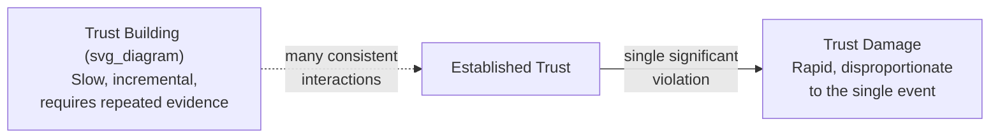
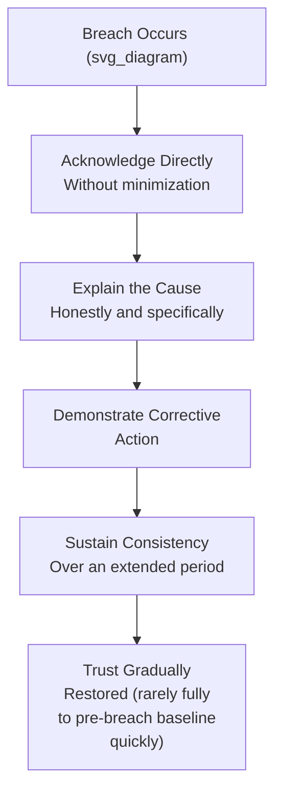

## Building Lasting Stakeholder Trust

### Definition and Foundational Model

**Stakeholder trust** is the accumulated confidence that boards, investors, employees, regulators, customers, and other constituencies place in an organization's leadership to act competently, honestly, and in alignment with stated commitments over time. Unlike single-interaction credibility (whether a specific statement is believed in the moment), lasting trust is a longitudinal property built through repeated, consistent demonstration across many interactions, and it is disproportionately vulnerable to being damaged faster than it is built.

A widely used academic model, the **trust equation** (developed by Maister, Green, and Galford), decomposes trust into four components, providing a diagnostic framework for identifying specifically where trust-building efforts should be focused:

$$\text{Trust} = \frac{\text{Credibility} + \text{Reliability} + \text{Intimacy}}{\text{Self-Orientation}}$$

**Key Points**

- **Credibility**: the perceived accuracy and expertise of what is communicated — do the words hold up to scrutiny
- **Reliability**: consistency between stated intentions and actual follow-through over time
- **Intimacy**: the degree of psychological safety stakeholders feel in raising concerns or disagreements
- **Self-orientation** (the denominator): the perceived degree to which the communicator is prioritizing their own interests over the stakeholder's — critically, this term divides the other three, meaning high self-orientation can undermine trust even when credibility, reliability, and intimacy are all otherwise strong

### The Asymmetry of Trust Building and Trust Destruction

Trust research across organizational and relationship contexts consistently identifies an asymmetry: trust accumulates gradually through repeated positive evidence but can be substantially damaged by a single significant violation, particularly one involving perceived dishonesty rather than mere error. This asymmetry has direct implications for executive communication practice: a strong historical trust reserve is a valuable but not infinite buffer, and its depletion through a single serious breach is disproportionate to the effort required to build it.

[Inference] The specific severity of trust damage from a given violation likely depends on whether stakeholders interpret it as an honest mistake versus deliberate concealment, since the latter directly implicates the credibility and self-orientation components of the trust equation simultaneously — this is consistent with general trust research patterns, though the precise magnitude varies by relationship history and violation type.

### Core Practices for Building Credibility

- **Consistency between claims and verifiable outcomes** — a demonstrated track record of accurate prior statements (forecasts that proved reasonably accurate, claims that held up to later scrutiny) is the primary evidentiary basis stakeholders use to calibrate how much weight to give current statements
- **Precision over vague reassurance** — specific, falsifiable claims ("we expect X by Y date") build more credibility over time than vague, unfalsifiable reassurance, precisely because specific claims can be verified and thereby accumulate a track record
- **Transparent acknowledgment of uncertainty** — explicitly distinguishing what is known with confidence from what remains uncertain, rather than presenting uniform confidence across all claims, tends to increase credibility for the claims that are made with genuine confidence

### Core Practices for Building Reliability

- **Following through on stated commitments** — the single most direct lever for the reliability component; a pattern of unmet commitments erodes reliability regardless of how well those commitments were communicated at the time they were made
- **Consistent cadence and format over time** — predictable communication rhythms (regular updates, consistent reporting structures) build reliability partly through the meta-signal that the organization can be counted on to communicate predictably, independent of the content of any single communication
- **Proactive disclosure of missed commitments** — when a commitment will not be met, disclosing this proactively and explaining why is more reliability-preserving than allowing the stakeholder to discover the miss independently

**Example**

An executive who previously committed to a specific product launch timeline and, upon recognizing a delay, proactively communicates the revised timeline along with a clear explanation of the cause, generally preserves more reliability trust than one who remains silent until directly asked, even though the underlying delay is identical in both cases — the difference lies in whether the stakeholder experienced the miss as something disclosed or something discovered.

### Core Practices for Building Intimacy (Psychological Safety)

- **Genuinely welcoming dissent and difficult questions** — visibly responding well to challenge (rather than becoming defensive) signals that future concerns will also be received constructively, encouraging continued open communication rather than self-censorship
- **Demonstrating vulnerability appropriately** — acknowledging genuine uncertainty, mistakes, or limitations (calibrated to the audience and context) tends to increase rather than decrease trust, provided it is not excessive or performative
- **Consistent behavior across formal and informal settings** — stakeholders calibrate trust partly by observing whether an executive's demeanor and honesty are consistent between high-visibility formal settings and lower-visibility informal ones

**Key Points**

- Intimacy in this context refers to psychological safety and openness, not personal closeness — it is entirely applicable to formal, professional relationships such as board or investor relationships
- A stakeholder who perceives that raising a concern will be met with defensiveness or retaliation will tend to withhold future concerns, depriving the organization of exactly the early-warning information trust-based relationships are meant to surface

### Managing Self-Orientation

Because self-orientation divides the other three components in the trust equation, managing perceived self-interest is disproportionately impactful:

- **Explicitly acknowledging trade-offs that favor the stakeholder over the organization** — visibly prioritizing a stakeholder's interest in at least some observable instances builds evidence against a purely self-interested framing
- **Avoiding communication that reads as primarily defensive of the communicator's own position** — stakeholders are generally attentive to whether communication seems oriented toward genuinely informing them versus protecting the executive's reputation or position
- **Consistency of principle over convenience** — applying stated values or commitments consistently, including in situations where doing so is costly or inconvenient to the organization, is a strong signal against high self-orientation

[Inference] Because self-orientation is often inferred by stakeholders from subtle cues (tone, what is emphasized versus minimized, willingness to accept unfavorable trade-offs) rather than from explicit statements, it may be one of the harder trust components to deliberately manage through communication technique alone, since stakeholders are likely responding to a broader pattern of behavior rather than any single message.

### Trust Repair After a Breach

When trust has been damaged, repair generally requires a distinct process rather than simply resuming pre-breach communication practices:

- **Direct, non-minimizing acknowledgment** — attempts to reframe or minimize a breach are typically detected and compound the original damage with a perceived second violation (of credibility, this time)
- **Specific causal explanation** — a genuine, specific account of what went wrong is more repair-effective than a general apology without substantive explanation
- **Visible corrective action** — concrete changes (not merely stated intentions) that address the root cause provide the evidentiary basis stakeholders need to begin recalibrating trust
- **Sustained consistency over time** — trust repair is not a single communication event; it requires a demonstrated pattern of restored reliability and credibility sustained over a period generally longer than the time it would have taken to build initial trust in an undamaged relationship

**Key Points**

- Rushing trust repair (expecting a single strong apology or explanation to fully restore pre-breach trust) generally underestimates the asymmetry between trust-building and trust-damage timelines
- Stakeholders often specifically watch for whether corrective action is sustained past the period of immediate scrutiny, since actions taken only during active attention and later abandoned are themselves interpreted as a further credibility signal

### Common Failure Patterns

1. **Treating trust as a single-dimension property** — focusing exclusively on credibility (being factually accurate) while neglecting reliability, intimacy, or self-orientation, missing that all four components independently affect overall trust
2. **Underestimating the trust-damage asymmetry** — assuming that a strong historical trust reserve provides more protection against a single serious breach than it typically does
3. **Minimizing or reframing breaches during repair attempts** — compounding an original trust violation with a credibility violation by appearing to manage perception rather than directly acknowledge what occurred
4. **Inconsistency between formal and informal behavior** — presenting a curated, trustworthy persona in formal settings while behaving inconsistently in less visible contexts, which stakeholders often eventually detect through informal channels
5. **Treating trust repair as a single event** — issuing one strong corrective communication and assuming the matter is resolved, rather than sustaining demonstrated change over an extended period
6. **High visible self-orientation** — communication that consistently reads as primarily protective of the executive's own position, undermining the numerator components of the trust equation regardless of their individual strength

### Related Topics

- Reporting bad news and setbacks to stakeholders
- Managing difficult board and stakeholder questions
- Communicating with investors and analysts
- Ethical persuasion versus manipulation
- Crisis communication and reputational risk management
- Addressing resistance and uncertainty
- Sustaining momentum through repeated messaging