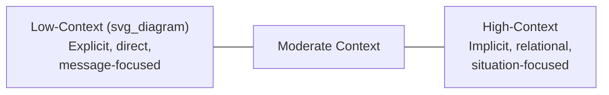
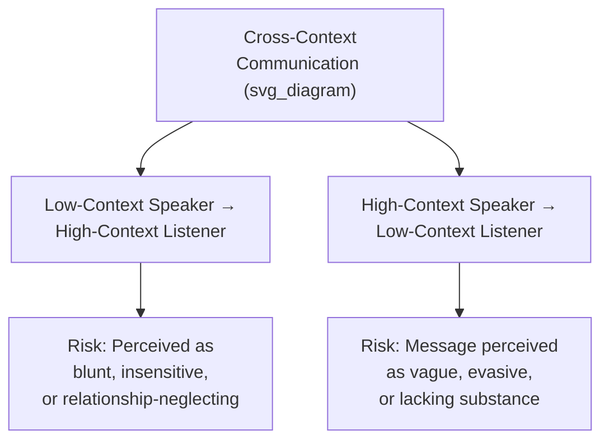

## High-Context Versus Low-Context Communication Styles

### Definition and Theoretical Origin

**High-context** and **low-context communication** are complementary concepts developed by anthropologist Edward T. Hall (*Beyond Culture*, 1976) describing how much of a message's meaning is carried by explicit verbal content versus implicit contextual cues (shared background, relationship history, nonverbal signals, situational understanding). The framework remains a foundational reference point in cross-cultural business and executive communication.

In a **low-context** communication style, meaning is conveyed primarily through explicit, direct verbal statements; the message is expected to be self-sufficient and interpretable largely without reliance on shared background knowledge. In a **high-context** communication style, meaning is conveyed substantially through implication, shared context, relationship history, and nonverbal cues; explicit statements are only part of the intended message, and listeners are expected to infer additional meaning from context.

**Key Points**

- The distinction describes a spectrum, not a strict binary — most cultures and individuals fall somewhere along a continuum rather than at a pure endpoint
- Both styles are internally coherent and effective within their originating context; neither is inherently superior, though miscommunication is common when the two styles interact without mutual awareness
- The framework applies at both the national/cultural level (commonly cited) and at the organizational or individual level (less commonly discussed but equally relevant in executive settings)

### The Context Spectrum

Hall's original cultural classifications, widely cited in cross-cultural business literature, generally position cultures such as Germany, the United States, and Scandinavian countries toward the lower-context end, and cultures such as Japan, China, and many Arab and Latin American cultures toward the higher-context end. [Inference] These national-level classifications should be treated as broad generalizations useful for initial orientation rather than deterministic predictions about any specific individual, since substantial within-country variation exists based on organizational culture, individual communication style, generational factors, and professional context.

### Core Behavioral Differences

| Dimension | Low-Context Style | High-Context Style |
| --- | --- | --- |
| Directness | Explicit statements of intent, disagreement, or refusal | Implication, indirect signaling, reading between the lines |
| Written communication | Detailed, explicit contracts and documentation | Relies more on relationship and mutual understanding; documents may be less exhaustively explicit |
| Silence | Often perceived as absence of information or awkwardness | Often carries meaning (consideration, disagreement, respect) |
| Feedback | Direct, specific verbal feedback | Feedback often conveyed indirectly, through tone, third parties, or context |
| Relationship-building | Often secondary to task efficiency in initial interactions | Often a prerequisite before substantive business discussion |
| Meaning location | Primarily in the words themselves | Distributed across words, relationship, setting, and nonverbal cues |

### Implications for Executive Communication Across Contexts

- **Low-context speaker to high-context listener**: Direct statements (particularly direct disagreement, criticism, or refusal) intended as straightforward and efficient may be received as blunt, disrespectful, or relationship-damaging
- **High-context speaker to low-context listener**: Indirect signals intended to convey disagreement, hesitation, or refusal (e.g., a vague "we will consider it" meant to signal decline) may be entirely missed by a listener expecting explicit statements, leading to false assumptions about agreement or interest

**Example**

A U.S.-based (lower-context) executive proposes a partnership term directly and asks a Japanese (higher-context) counterpart, "Do you agree to these terms?" A response of "this will be difficult" may be intended and understood within a high-context framework as a polite decline, while the low-context listener may interpret it literally as an obstacle to be solved rather than a refusal, leading to continued negotiation on a matter the counterpart considers settled.

### Written Communication and Documentation Differences

- **Contract and agreement style**: Low-context business cultures often favor exhaustively detailed, explicit contracts intended to be self-sufficient and enforceable independent of the ongoing relationship. High-context cultures may favor comparatively less exhaustive documentation, with the expectation that the ongoing relationship and mutual understanding will govern situations not explicitly addressed in the document
- **Email and written correspondence**: Low-context style typically favors directness, explicit requests, and clear action items. High-context style may embed requests within more elaborate relational framing, indirect language, and greater reliance on the reader inferring the actual ask from surrounding context
- **Meeting minutes and follow-up communication**: Low-context practice tends to favor explicit written summaries of decisions and action items; high-context practice may rely more on shared understanding developed during the meeting itself, with less emphasis on exhaustive written codification

[Inference] Executives operating across both styles in written communication often find it useful to increase explicitness beyond their own natural style when writing to lower-context audiences, and to invest more deliberately in relationship-establishing framing when writing to higher-context audiences — though the appropriate calibration depends heavily on the specific relationship, industry norms, and individual communication preferences of the counterpart.

### Handling Silence and Non-Verbal Signals

- **In low-context settings**: Silence during a conversation or negotiation is frequently interpreted as discomfort, disagreement requiring resolution, or an information gap to be filled, and participants may feel a stronger urge to fill silence
- **In high-context settings**: Silence can be a meaningful and intentional communicative act — signaling consideration, respect, discomfort with a request, or even disagreement — and interrupting it prematurely can be perceived as impatience or disrespect
- **Practical implication**: Executives negotiating or communicating across this divide benefit from calibrating their tolerance for silence to the counterpart's style rather than defaulting to their own cultural instinct to fill or interpret silence

### Adapting Communication Strategy Across Contexts

1. **Increasing explicitness for lower-context audiences** — when communicating with predominantly low-context audiences, favor direct statements of intent, explicit requests, and clearly stated expectations, even if this feels more blunt than one's own natural style
2. **Increasing contextual and relational investment for higher-context audiences** — when communicating with predominantly high-context audiences, invest more deliberately in relationship-building context, indirect framing for sensitive topics, and attentiveness to nonverbal and situational cues
3. **Explicit meta-communication about style** — in some cross-cultural executive relationships, directly acknowledging style differences ("I tend to communicate very directly — please let me know if anything I say comes across as too blunt") can pre-empt misunderstanding without requiring either party to fully adopt the other's native style
4. **Verification and paraphrase-checking** — particularly important across this divide, explicitly checking understanding ("just to confirm, does this mean...") can surface misinterpretations before they become costly, since the risk of miscommunication is structurally higher when the two parties are extracting meaning through different mechanisms

**Key Points**

- Neither adapting fully to the other party's style nor remaining rigidly within one's own native style is universally correct; effective cross-context communicators typically develop the capacity to shift flexibly based on the specific audience and stakes
- Explicit meta-communication about style differences is a comparatively low-cost, high-value technique that can be used even by executives who are not deeply versed in a counterpart's specific cultural background

### Common Failure Patterns

1. **Assuming universal directness norms** — a low-context communicator assuming that direct disagreement or refusal will be understood the same way universally, missing genuine (non-verbal or indirect) signals of disagreement from a high-context counterpart
2. **Assuming universal indirectness comprehension** — a high-context communicator assuming a counterpart will correctly infer an intended meaning from indirect signals, when the counterpart's low-context framework leads them to take statements at face value
3. **Misreading silence** — a low-context communicator interpreting a high-context counterpart's meaningful silence as mere absence of an answer, or a high-context communicator misreading a low-context counterpart's comfortable silence as unusual discomfort
4. **Over-generalizing national stereotypes** — applying broad national-level context classifications rigidly to specific individuals without accounting for substantial individual, organizational, and generational variation
5. **One-sided adaptation expectations** — expecting the other party to fully adapt to one's own native communication style rather than recognizing cross-context communication as a shared responsibility
6. **Documentation mismatches in agreements** — one party assuming a contract is fully self-sufficient (low-context expectation) while the other assumes ongoing relationship and mutual understanding will govern unaddressed situations (high-context expectation), creating later disputes rooted in differing foundational assumptions about the document's role

### Related Topics

- Adapting negotiation style across cultures
- Nonverbal communication and its cultural variation
- Building trust across cultural and organizational boundaries
- Cross-cultural feedback and conflict-resolution norms
- Localization versus standardization in global corporate communication
- Reading counterpart interests versus positions
- Managing multicultural and distributed executive teams