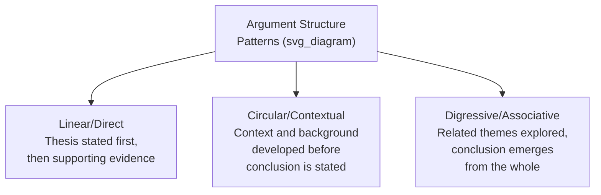
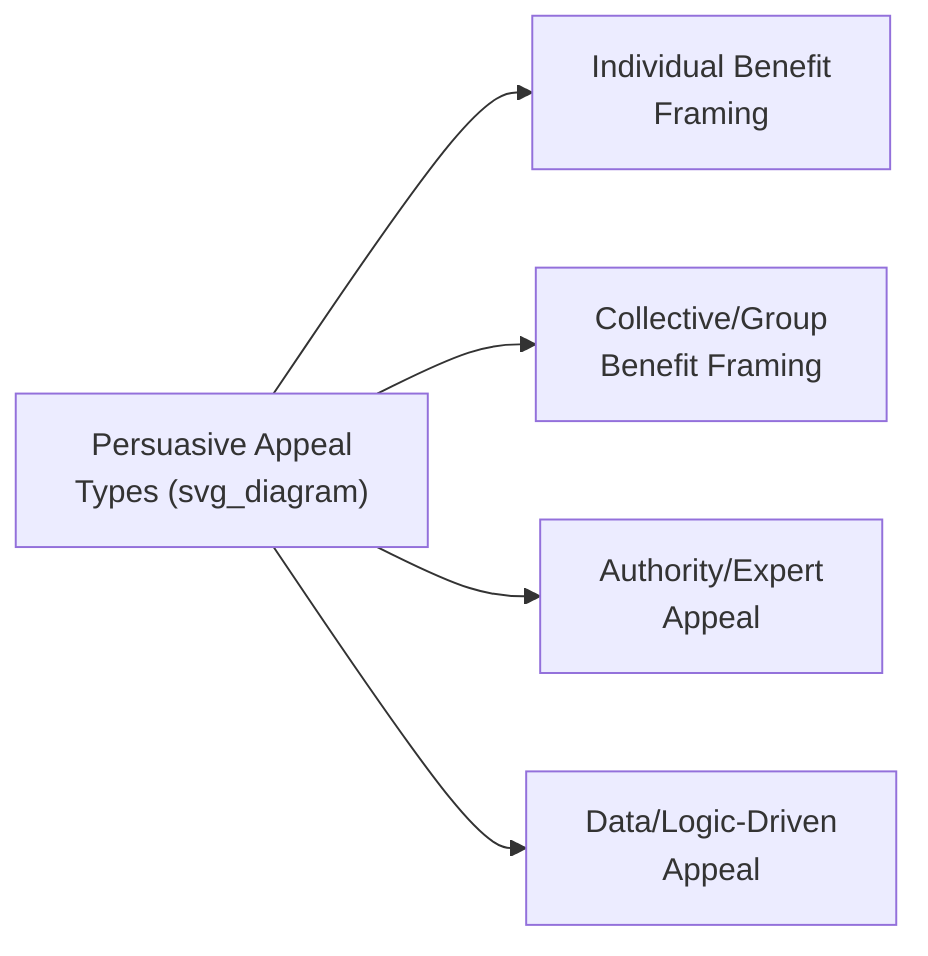

## Adapting Rhetoric and Tone Across Cultures

### Definition and Scope

**Adapting rhetoric and tone across cultures** refers to the deliberate adjustment of persuasive structure, argumentative style, emotional register, and formality level when communicating across cultural boundaries, so that a message achieves its intended effect with a given audience rather than relying on rhetorical conventions native only to the speaker's own culture. This extends beyond the high-context/low-context distinction (which concerns how explicitly meaning is conveyed) to address how arguments are structured, how emotion and formality are calibrated, and how persuasive appeals are culturally received.

The foundational premise is that rhetorical effectiveness is not culturally universal: argument structures, emotional displays, and formality norms that persuade effectively within one cultural context can actively undermine credibility or persuasive impact in another, even when the underlying substantive content is identical.

**Key Points**

- Rhetorical adaptation is not about diluting or compromising the substance of a message, but about restructuring its presentation to achieve equivalent persuasive effect across different cultural expectations
- Effective adaptation requires distinguishing which elements of a message are substance (which should remain constant) and which are cultural packaging (which should be adapted)
- Over-adaptation (excessive stylistic accommodation that obscures substance) and under-adaptation (rigid adherence to native rhetorical style regardless of audience) are both common failure modes

### Argument Structure: Linear Versus Circular/Contextual Patterns

Cross-cultural rhetoric research, building on contrastive rhetoric studies pioneered by Robert Kaplan, identifies differing culturally-associated patterns in how arguments are typically structured and sequenced.

- **Linear/direct structure**, commonly associated with Western business rhetoric (particularly U.S. and Northern European), typically states the main conclusion or recommendation early, followed by supporting evidence in a structured sequence
- **Circular/contextual structure**, associated with some East Asian rhetorical traditions, typically builds context and background extensively before arriving at a conclusion, which may be stated more subtly or left partially for the audience to infer
- **Digressive/associative structure**, associated with some Middle Eastern and Latin rhetorical traditions, may explore related themes and context more expansively, with the core argument emerging cumulatively rather than through a single direct line

[Inference] These structural classifications, like Hall's context spectrum, are generalizations useful for initial cross-cultural orientation rather than deterministic rules; individual communicators, organizational norms, and professional training (particularly in globalized business contexts) introduce substantial variation that can diverge significantly from broad national or regional patterns.

### Practical Implications for Executive Presentations

| Native Style | Adapting For | Adjustment |
| --- | --- | --- |
| Linear/direct | Circular/contextual audience | Introduce more context and background before the core recommendation; avoid appearing to rush to a conclusion |
| Circular/contextual | Linear/direct audience | State the core conclusion or recommendation earlier; avoid extended context that may read as evasive or unfocused |
| Either | Mixed/international audience | Use an executive-summary-first structure with full context immediately following, allowing each audience segment to engage at their preferred entry point |

**Example**

An executive accustomed to a direct, thesis-first presentation style delivering a strategic recommendation to a board with several members from a more contextual rhetorical tradition may find the recommendation is received as presumptuous or insufficiently considered if delivered without adequate context. Restructuring the same substantive recommendation to first establish shared understanding of the situation and stakes before stating the conclusion can achieve the same persuasive goal while aligning with the audience's expectations for how a well-reasoned argument should unfold.

### Emotional Register and Expressiveness

Cultures vary substantially in the degree of emotional expressiveness considered appropriate and persuasive in professional and executive communication:

- **Restrained/neutral cultures** (commonly associated with Northern European, and East Asian business contexts) tend to favor measured, controlled emotional expression in professional settings; visible enthusiasm, frustration, or emotional intensity may be perceived as unprofessional or as undermining substantive credibility
- **Expressive/affective cultures** (commonly associated with many Latin American, Southern European, and Middle Eastern business contexts) tend to view appropriate emotional expressiveness as a sign of genuine engagement and sincerity; excessive restraint may be perceived as disinterest, coldness, or insufficient investment in the relationship or outcome

**Key Points**

- Neither register is inherently more persuasive; each is calibrated to what the receiving culture interprets as genuine, credible engagement
- Executives operating across these registers benefit from consciously adjusting emotional expressiveness rather than assuming their native register will be universally read as intended
- Written communication (email, memos) generally carries lower emotional-register risk than live, in-person delivery, where tone, facial expression, and vocal intensity are more directly on display

### Formality and Hierarchy Signaling

- **Address and titles** — some cultures place strong emphasis on formal titles, honorifics, and hierarchical address, where their absence can be read as disrespectful; other cultures favor a flatter, more informal address style even across significant hierarchical distance, where excessive formality can be read as distancing or overly rigid
- **Directness toward senior figures** — norms around whether and how directly a more junior person may challenge or question a senior figure vary substantially; direct, model-agnostic challenge that is normalized in some executive cultures may be considered inappropriate or face-threatening in others
- **Self-promotion versus modesty** — cultural norms differ regarding how directly an individual or team's achievements should be presented; direct self-promotion valued in some business cultures may be perceived as boastful or immodest in others that favor understated presentation of accomplishment, with achievement expected to be recognized by others rather than self-asserted

[Inference] Executives leading multicultural or globally distributed teams likely benefit from establishing explicit, negotiated team norms around formality and hierarchy-related communication (rather than assuming a single default), since relying on any single cultural default risks systematically disadvantaging team members from differing cultural backgrounds — this is a reasonable extension of cross-cultural management principles rather than a specific measured finding.

### Persuasive Appeals and Their Cultural Reception

- **Individual versus collective benefit framing**: cultures with stronger individualist orientations often respond more readily to appeals emphasizing individual achievement, autonomy, or personal advancement; cultures with stronger collectivist orientations often respond more readily to appeals emphasizing group harmony, collective benefit, or organizational/family reputation
- **Authority appeals**: the persuasive weight given to hierarchical authority, credentials, or seniority varies; some cultures grant substantial deference to stated authority, while others expect authority claims to be substantiated with independently verifiable evidence regardless of the source's seniority
- **Data/logic-driven appeals**: while data and logical argumentation carry weight broadly across professional and executive contexts globally, the relative weight given to quantitative data versus relational, narrative, or experiential evidence varies by cultural and organizational context

**Key Points**

- Effective cross-cultural rhetorical adaptation often blends multiple appeal types rather than relying exclusively on the appeal type most natural to the communicator's own background
- Testing and adjusting based on observed audience response, where feasible, is generally more reliable than applying a rigid a priori formula, since organizational and individual variation within any broad cultural category can be substantial

### Common Failure Patterns

1. **Rigid adherence to native rhetorical structure** — presenting in one's habitual argument structure (e.g., always thesis-first) regardless of audience, without recognizing when this reduces persuasive effectiveness for a differently-oriented audience
2. **Misreading restrained expressiveness as disengagement** — an expressive-culture communicator interpreting a restrained-culture counterpart's measured tone as lack of interest or enthusiasm, when it reflects a different professional norm rather than genuine disengagement
3. **Over-adapting to the point of diluting substance** — excessive stylistic accommodation that softens or obscures the actual recommendation or conclusion, reducing clarity in pursuit of cultural sensitivity
4. **Assuming formality norms are universal** — applying one's own culture's default formality level (either overly formal or overly casual) without adjusting for a counterpart's differing expectations around hierarchy and address
5. **Single-appeal reliance** — relying exclusively on one type of persuasive appeal (e.g., pure data-driven argumentation) across all cultural contexts, missing opportunities to strengthen persuasive impact through appeals more resonant with a given audience
6. **Overcorrecting based on broad stereotypes** — applying cultural generalizations rigidly to specific individuals without accounting for substantial individual and organizational variation within any broad cultural category

### Related Topics

- High-context versus low-context communication styles
- Reading counterpart interests versus positions
- Nonverbal communication and its cultural variation
- Localization versus standardization in global corporate communication
- Managing multicultural and distributed executive teams
- Ethical persuasion versus manipulation
- Cross-cultural negotiation strategy adaptation