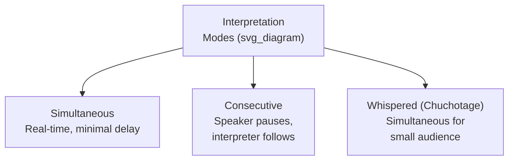
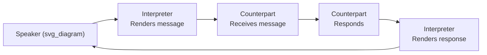

## Communicating Through Interpreters and Translation

### Definition and Scope

**Communicating through interpreters and translation** encompasses the specific skills and processes required for effective executive communication when a message must pass through a linguistic intermediary — a live interpreter for spoken communication, or a translator for written materials. This differs fundamentally from other cross-cultural communication challenges: even a perfectly culturally calibrated message can fail entirely if the mechanics of interpretation or translation are not properly managed, since meaning must survive an additional transformation step that introduces its own distinct risks.

The core distinction between **interpretation** (real-time, spoken) and **translation** (written, typically with more time for review and refinement) shapes substantially different practices, risks, and preparation requirements, and executives should not treat them as interchangeable skills or processes.

**Key Points**

- Interpretation and translation are performed by differently trained specialists with different skill sets; fluency in a language does not automatically confer either the specific real-time interpretation or the precision-translation skill required
- The quality of interpretation or translation directly affects the fidelity of the executive's intended message; poor interpretation can distort or misrepresent the message despite flawless original delivery
- Both processes introduce a structural delay and a third party into the communication, requiring adjustments to pacing, structure, and expectations that differ from direct communication

### Modes of Interpretation

| Mode | Best Suited For | Key Consideration |
| --- | --- | --- |
| Simultaneous | Large conferences, formal multi-party events | Requires specialized equipment (booths, headsets) and highly trained interpreters; minimal disruption to natural pacing |
| Consecutive | Smaller meetings, negotiations, one-on-one executive discussions | Speaker must pause periodically for interpretation, roughly doubling the effective duration of the conversation |
| Whispered (chuchotage) | Small groups within a larger predominantly single-language setting | Less formal infrastructure required, but can be physically and cognitively demanding for the interpreter over extended periods |

**Key Points**

- Consecutive interpretation is the most common mode in executive one-on-one or small-group settings, and its pacing implications (doubled time, natural pause points) should be planned into meeting scheduling
- Simultaneous interpretation requires greater advance logistical planning (equipment, qualified interpreters) but preserves more natural conversational flow for larger or more formal settings

### Preparing to Work With an Interpreter

1. **Briefing the interpreter in advance** — providing context on subject matter, key terminology, acronyms, sensitive topics, and desired tone allows the interpreter to prepare rather than improvising unfamiliar technical or organizational vocabulary in real time
2. **Sharing materials ahead of time** — presentation slides, technical terms, or names of individuals who will be discussed should be shared in advance so the interpreter can prepare accurate renderings, particularly for specialized or company-specific terminology
3. **Establishing communication signals** — agreeing in advance on how the interpreter will signal a need for clarification, repetition, or a pause, reduces disruption during the actual session
4. **Clarifying the interpreter's role boundaries** — establishing whether the interpreter is expected to interpret literally or to also provide brief cultural context when a direct linguistic equivalent does not exist, since these are different services requiring explicit agreement

[Inference] Executives who treat interpreter briefing as an unnecessary formality, assuming a skilled interpreter can adequately handle any subject matter without preparation, likely increase the risk of terminology errors or delays during the actual session — this is a reasonable inference from the specialized nature of technical vocabulary, though the specific risk level depends on the interpreter's subject-matter familiarity and the complexity of the material.

### Speaking Practices for Effective Interpretation

- **Shorter, clearer sentence structures** — complex, multi-clause sentences are more difficult to interpret accurately in real time; breaking ideas into shorter, more discrete units improves interpretation accuracy
- **Avoiding idioms, humor, and culturally specific references** — figurative language, wordplay, and culturally specific humor often do not translate directly and can either fail to land or be misinterpreted; direct, literal language is generally more reliably interpreted
- **Natural pacing with deliberate pauses** — speaking at a measured pace with clear pause points (particularly for consecutive interpretation) allows the interpreter to process and render accurately, rather than attempting to interpret an uninterrupted, rapid stream of speech
- **Addressing the counterpart, not the interpreter** — maintaining eye contact and direct address toward the actual audience (rather than the interpreter) preserves the relational and nonverbal dimension of the communication, even though the interpreter is the immediate recipient of the spoken words

**Example**

An executive accustomed to using idiomatic phrases ("let's not put the cart before the horse," "this is a game-changer") in native-language presentations should replace these with direct equivalents ("let's not act before we have the full plan," "this will substantially change our approach") when working through an interpreter, since idiomatic phrases often either fail to translate meaningfully or require the interpreter to improvise an equivalent that may not preserve the intended nuance or tone.

### Managing the Rhythm and Dynamics of Interpreted Conversations

- **Time expectations**: interpreted meetings generally take substantially longer than direct-language meetings for equivalent content; failing to plan for this can create pressure to rush, which increases interpretation error risk
- **Reduced spontaneity**: the natural back-and-forth rhythm of direct conversation is inherently altered by the interpretation cycle; executives should adjust expectations regarding conversational spontaneity and avoid interpreting the altered rhythm itself as a signal about the counterpart's engagement or interest
- **Building rapport indirectly**: relationship-building cues (tone, warmth, humor) are harder to convey through an intermediary; deliberate attention to nonverbal warmth (tone of voice, body language, direct eye contact with the counterpart) can partially compensate for the reduced immediacy of interpreted spoken exchange

**Key Points**

- Underestimating the time required for interpreted meetings is one of the most common planning errors, leading to rushed sessions that increase both interpretation error risk and participant fatigue
- Executives should resist the instinct to fill the interpretation pause with additional speech, since this creates a backlog for the interpreter and increases the risk of content being dropped or compressed

### Written Translation Considerations

Unlike live interpretation, written translation allows more time for precision and review, but introduces its own distinct risks:

- **Terminology consistency** — establishing a glossary of key organizational, technical, or legal terms in advance ensures consistent translation across multiple documents, avoiding confusion from inconsistent renderings of the same underlying concept
- **Back-translation verification** — for high-stakes documents (legal agreements, regulatory filings, board materials), translating the translated document back into the original language by an independent translator can surface drift or error introduced during the initial translation
- **Cultural and legal adaptation, not just linguistic conversion** — a legally or culturally precise translation may require more than word-for-word conversion; certain legal, financial, or technical concepts may require adapted phrasing to convey an equivalent meaning within the target legal or business framework
- **Native-speaker review** — having a native speaker of the target language (ideally with relevant subject-matter expertise) review the final translation before use in high-stakes contexts reduces the risk of subtle errors or unnatural phrasing that a non-native reviewer might miss

[Inference] For legal or regulatory documents specifically, the risk of a translation introducing an unintended substantive change (rather than a merely stylistic one) is elevated, since legal language often relies on precise terms of art that may not have exact equivalents across legal systems — this is a widely recognized risk in legal translation practice, and such documents typically warrant qualified legal translation specialists rather than general-purpose translators.

### Common Failure Patterns

1. **Insufficient interpreter briefing** — failing to provide advance context, materials, or terminology guidance, increasing the risk of real-time errors or delays
2. **Using idiomatic or culturally specific language** — relying on humor, idioms, or references that do not translate directly, risking either lost meaning or unintended misinterpretation
3. **Underestimating time requirements** — scheduling interpreted meetings as though they will take the same duration as direct-language equivalents, creating pressure that increases error risk
4. **Addressing the interpreter instead of the counterpart** — losing the relational and nonverbal dimension of communication by directing attention to the interpreter rather than the actual audience
5. **Treating translation as purely mechanical word substitution** — failing to account for cultural, legal, or conceptual adaptation needs beyond literal linguistic conversion, particularly for legal or technical documents
6. **No terminology consistency management** — allowing key terms to be translated inconsistently across related documents, creating confusion or apparent contradiction that does not exist in the source material
7. **Skipping native-speaker or back-translation review for high-stakes documents** — relying solely on the initial translator's output for legally or financially consequential materials without independent verification

### Related Topics

- High-context versus low-context communication styles
- Adapting rhetoric and tone across cultures
- Preparing board presentations and briefing materials
- Managing multicultural and distributed executive teams
- Cross-cultural negotiation strategy adaptation
- Localization versus standardization in global corporate communication
- Legal and regulatory considerations in international business communication