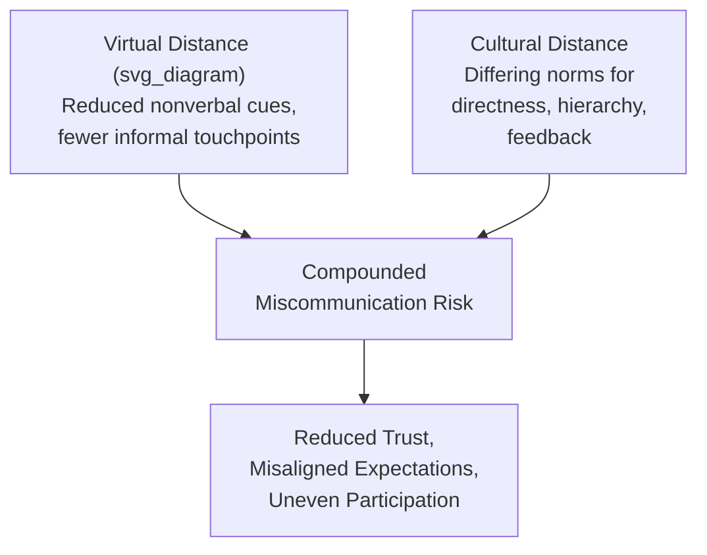
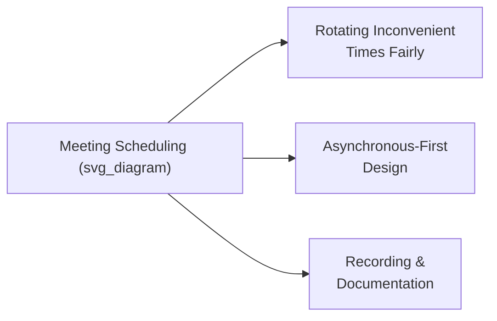

## Leading Multicultural and Global Virtual Teams

### Definition and Compounding Complexity

**Leading multicultural and global virtual teams** refers to the executive and managerial communication practices required to coordinate, motivate, and align teams that are simultaneously distributed across geographies and time zones (virtual) and composed of members from differing cultural, linguistic, and communication-norm backgrounds (multicultural). This context is distinguished from either challenge in isolation: cross-cultural communication difficulties are compounded by the absence of the in-person cues, spontaneous interaction, and informal relationship-building opportunities that typically help teams navigate cultural difference, while virtual-team coordination challenges are compounded by the differing cultural expectations team members bring to communication style, hierarchy, and feedback.

**Key Points**

- The combination of virtuality and multiculturality is not merely additive — each dimension amplifies the risks of the other, since reduced-bandwidth virtual channels provide fewer opportunities to detect and correct cross-cultural misunderstanding
- Teams that are both distributed and multicultural require more deliberate, explicit communication infrastructure than teams facing only one of these two conditions
- Effective leadership in this context requires simultaneously managing technical/logistical coordination (time zones, tools, cadence) and interpersonal/cultural coordination (communication norms, trust-building, inclusion)

### The Compounding Risk Model

Both virtual distance and cultural distance independently reduce the redundancy and richness of communication signals available to detect misunderstanding; when combined, teams have fewer opportunities to recognize that a misunderstanding has even occurred, let alone correct it before it affects trust or coordination.

[Inference] This compounding effect is a reasonable extension of established findings in both virtual-team and cross-cultural communication research, though a precise, generalized measure of the combined effect across arbitrary teams is not established and would depend heavily on the specific cultural mix, tools used, and team maturity.

### Establishing Explicit Communication Norms

Because informal, ambient learning of team norms (common in co-located, culturally homogeneous teams) is substantially reduced in distributed multicultural settings, effective leaders typically establish norms explicitly rather than allowing them to emerge organically:

1. **Meeting norms** — explicit agreement on turn-taking, how disagreement will be expressed, whether cameras are expected on, and how silence should be interpreted (see high-context versus low-context styles)
2. **Response-time expectations** — explicit norms for expected response times to messages, accounting for time zone differences and varying cultural norms around availability and after-hours communication
3. **Feedback norms** — explicit discussion of how direct or indirect feedback will be given and received, since cultural defaults on this dimension vary substantially and mismatched expectations are a common source of team friction
4. **Escalation and disagreement norms** — explicit guidance on how and to whom disagreement or concerns should be raised, particularly important given cultural variation in norms around challenging authority or expressing dissent directly

**Key Points**

- Making norms explicit does not mean imposing a single cultural default; effective norm-setting typically involves genuine team discussion and negotiated agreement rather than the leader unilaterally selecting norms based on their own cultural background
- Revisiting norms periodically as team composition changes (new members joining from different backgrounds) is more effective than treating an initial norm-setting exercise as permanent

### Time Zone and Scheduling Equity

- **Rotating inconvenient meeting times** — rather than consistently scheduling around the convenience of headquarters or the leader's own time zone, rotating the burden of early-morning or late-evening meetings across regions signals equitable treatment and prevents any single region from bearing disproportionate cost
- **Asynchronous-first design** — structuring core information sharing and decision documentation to not depend on synchronous meetings reduces the disadvantage faced by team members whose time zones make live participation difficult or impossible
- **Recording and thorough documentation** — ensuring team members who cannot attend live sessions (due to time zone) have full access to what was discussed and decided prevents the emergence of an in-group/out-of-group dynamic based purely on time zone convenience

[Inference] Persistent scheduling inequity — where the same regional group consistently bears the burden of inconvenient meeting times — is likely to correlate with reduced engagement and sense of inclusion from that group over time, though the specific magnitude of this effect depends on team-specific factors including how explicitly the inequity is acknowledged and mitigated through other means.

### Building Trust Without Physical Co-Presence

Trust-building in co-located teams often relies heavily on informal, unplanned interaction (hallway conversations, shared meals) that distributed multicultural teams generally lack. Deliberate substitutes include:

- **Structured informal time** — intentionally allocating time within or adjacent to formal meetings for non-task-related conversation, since this does not occur organically in purely virtual settings the way it does in physical proximity
- **Explicit relationship investment for high-context team members** — recognizing that team members from higher-context cultural backgrounds may place greater importance on relationship-building before substantive task collaboration, and allocating deliberate time for this rather than moving directly to task-focused interaction
- **Visible, consistent follow-through** — because virtual, cross-cultural relationships have fewer redundant trust signals available, consistent follow-through on commitments carries proportionally greater weight in establishing trust than it might in a richer-context relationship
- **Periodic in-person gathering where feasible** — many organizations find that even infrequent in-person gatherings (offsites, periodic travel) disproportionately strengthen trust relative to their frequency, providing a foundation that subsequent virtual interaction can then draw upon

### Managing Uneven Participation

A commonly observed failure pattern in multicultural virtual teams is uneven participation, where certain team members (often from lower-context, more individually assertive cultural backgrounds, or those more comfortable in the dominant meeting language) dominate discussion while others (often from higher-context backgrounds, non-native speakers of the dominant language, or those from cultures with stronger norms against interrupting or self-promoting) participate less, independent of the actual quality or value of their input.

| Technique | Function |
| --- | --- |
| Structured turn-taking | Explicitly inviting specific individuals to contribute, rather than relying on open floor dynamics that favor more assertive communication styles |
| Pre-meeting written input | Allowing team members to submit thoughts in writing before a live discussion, benefiting non-native speakers and those who prefer more processing time before speaking |
| Small-group breakouts | Reducing group size can lower the barrier to participation for team members less comfortable speaking in larger, more diverse groups |
| Explicit invitation without singling out | Creating structured opportunities for quieter members to contribute without spotlighting them in a way that increases pressure or discomfort |

**Key Points**

- Uneven participation is frequently misread by leaders as a difference in engagement or competence rather than a difference in communication style or language comfort, leading to inaccurate performance perceptions
- Deliberately structuring participation opportunities (rather than relying on open, unstructured discussion) tends to surface a more representative range of team input

### Language and Linguistic Considerations

- **Working in a non-native language** — team members operating in a shared working language that is not their native language typically expend additional cognitive effort relative to native speakers, which can affect apparent fluency of contribution independent of the underlying quality of their thinking
- **Simplifying language for a multilingual team** — using clear, direct language, avoiding idioms and culturally specific references (see adapting rhetoric across cultures), and writing with an international audience in mind improves comprehension for non-native speakers without requiring them to work harder to parse native-speaker idiomatic style
- **Written follow-up after verbal discussion** — providing written summaries after live discussions benefits non-native speakers who may have had more difficulty processing rapid verbal exchange in real time, giving them an opportunity to fully absorb and respond to content they may have partially missed live

### Common Failure Patterns

1. **Assuming co-located team norms transfer directly** — applying communication and coordination practices developed for co-located, culturally homogeneous teams without adapting them for the compounded challenges of distributed multicultural collaboration
2. **Consistent scheduling inequity** — repeatedly disadvantaging the same regional group with inconvenient meeting times without rotation or acknowledgment
3. **Misreading quiet participation as disengagement** — attributing lower participation to lack of interest or competence rather than considering cultural or linguistic factors affecting comfort with open, unstructured discussion
4. **Relying entirely on synchronous, unstructured meetings** — failing to provide asynchronous or structured alternatives that better accommodate time zone constraints and varying comfort levels with live, spontaneous discussion
5. **Underinvesting in relationship-building** — treating virtual meetings as purely transactional/task-focused, missing the deliberate relationship investment that higher-context team members in particular may expect before effective task collaboration
6. **Idiomatic, culturally dense language use** — using language, humor, or references that assume shared cultural context not present across a linguistically and culturally diverse team

### Related Topics

- High-context versus low-context communication styles
- Adapting rhetoric and tone across cultures
- Communicating through interpreters and translation
- Addressing resistance and uncertainty
- Building lasting stakeholder trust
- Psychological safety and inclusive team communication
- Localization versus standardization in global corporate communication