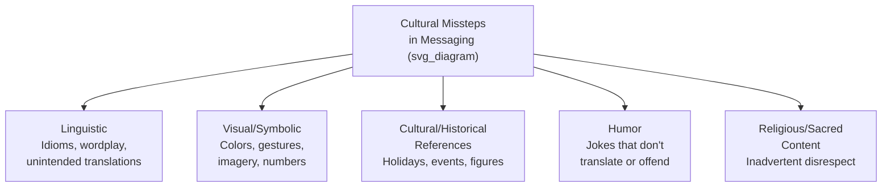
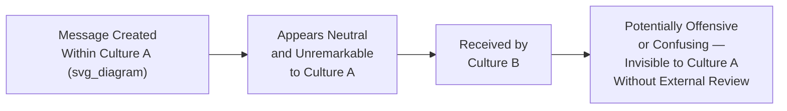
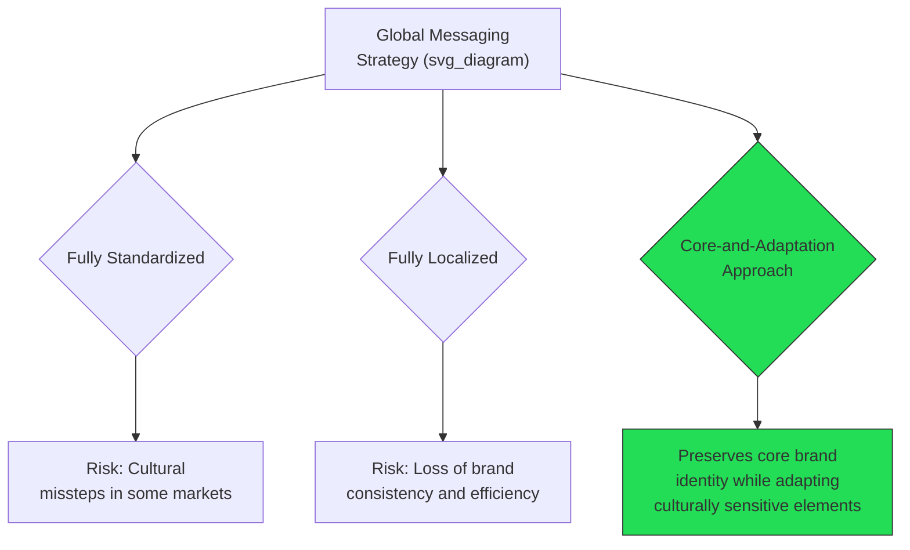

## Avoiding Cultural Missteps in Messaging

### Definition and Scope

**Avoiding cultural missteps in messaging** refers to the systematic practices executives and organizations use to identify and prevent communication content — language, imagery, symbolism, humor, references — from causing unintended offense, misunderstanding, or reputational harm when a message crosses cultural, national, or linguistic boundaries. This is distinct from the broader adaptation of rhetorical style or argument structure (see adapting rhetoric across cultures); it focuses specifically on avoidable content-level errors that can undermine a message regardless of how well its structure or tone is otherwise calibrated.

The central challenge is that cultural missteps are often invisible to the originating culture precisely because the problematic element is unremarkable or unnoticed within that culture's own frame of reference — the error is rarely a failure of care but a failure of visibility, since a message crafted entirely within one cultural lens cannot self-diagnose meanings that only become apparent from outside that lens.

**Key Points**

- Cultural missteps frequently occur despite good intentions, because default assumptions about "neutral" language, imagery, or symbolism are themselves culturally specific rather than universal
- The risk is not limited to unfamiliar or distant cultures; missteps commonly occur between closely related or seemingly similar cultures precisely because the assumption of similarity reduces the perceived need for verification
- Systematic review processes are generally more reliable than relying on any single individual's cultural knowledge, since no individual can be expected to anticipate every relevant cultural sensitivity across a global audience

### Categories of Cultural Missteps

| Category | Common Failure Pattern | Example Risk |
| --- | --- | --- |
| Linguistic | Direct translation of idioms or brand names producing unintended meaning | A slogan that translates literally into an awkward or offensive phrase in the target language |
| Visual/symbolic | Colors, numbers, or gestures carrying different associations across cultures | A color associated with celebration in one culture associated with mourning in another |
| Cultural/historical references | Assuming universal familiarity with holidays, historical events, or public figures | Referencing a holiday or event unfamiliar or differently significant outside the originating culture |
| Humor | Jokes relying on cultural context, wordplay, or shared assumptions | Humor that fails to translate, or that inadvertently mocks a group or practice |
| Religious/sacred content | Using religious imagery, symbols, or references without adequate awareness of their significance | Casual or commercial use of imagery considered sacred in a particular tradition |

### The Invisibility Problem

The defining structural challenge is that the originating team is generally the least equipped to detect the misstep, precisely because the problematic element does not register as noteworthy within their own cultural frame. This is why systematic external review — rather than reliance on the good intentions or general cultural awareness of the creating team — is the primary structural safeguard against this category of error.

[Inference] Teams that are more culturally homogeneous in composition likely face a higher baseline risk of undetected cultural missteps prior to external review, since internal review by a similarly composed team is less likely to surface issues invisible within that shared cultural frame — this is a reasonable inference from the diversity-of-perspective literature on error detection generally, rather than a specific measured finding for cultural messaging specifically.

### Systematic Review Processes

1. **Local market review** — having native speakers and cultural insiders from each target market review messaging before release, ideally individuals with both linguistic fluency and genuine familiarity with current cultural context (since cultural knowledge can become outdated even among native speakers who have been away from the culture for extended periods)
2. **Back-translation checks** — for written and translated content, translating the target-language version back into the original language by an independent translator can surface drift, unintended meaning, or awkwardness introduced during translation
3. **Symbol and imagery audits** — systematically reviewing visual elements (colors, numbers, gestures, imagery) against known cultural associations for each target market, rather than assuming visual content is culturally neutral
4. **Historical and current-events screening** — checking references, dates, and events against each target market's specific historical and current context, since seemingly neutral references can carry unintended significance in a specific local context
5. **Staged or limited release testing** — where feasible, testing messaging with a smaller representative audience in a target market before full release, surfacing issues before they reach a broad audience

**Key Points**

- Effective review processes are structured and systematic rather than ad hoc, since relying on any single reviewer's memory of "things to check" is less reliable than a defined checklist or process applied consistently
- Native-speaker review should be paired with cultural currency (recent, active familiarity with the culture) rather than relying solely on native language ability, since language fluency and current cultural fluency are related but distinct competencies

### Specific High-Risk Content Areas

- **Numbers**: certain numbers carry culturally specific positive or negative associations in some markets (e.g., particular numbers associated with luck or its absence in various East Asian contexts) that can affect pricing, packaging, or quantity-related messaging
- **Colors**: color associations with celebration, mourning, danger, prosperity, or other meanings vary substantially across cultures, and color choices in visual communication should be verified against target-market associations rather than assumed universal
- **Gestures and imagery in visual media**: hand gestures, imagery of body parts (e.g., the sole of a foot), or depictions considered innocuous in one culture can be offensive in another
- **Religious and sacred symbolism**: even unintentional or purely aesthetic use of religious symbols, texts, or imagery can cause significant offense if the originating team lacks awareness of the symbol's sacred status
- **National and political sensitivities**: territorial disputes, historical conflicts, and politically sensitive topics require particular care, since seemingly neutral map depictions, historical references, or geographic labels can carry significant political weight in specific regions

**Example**

A marketing campaign using a specific color scheme chosen purely for aesthetic brand consistency may inadvertently align with a color strongly associated with mourning or a specific political movement in a target market, transforming an intended celebratory message into one perceived as somber or as an unintended political statement. Systematic pre-release review by market-specific reviewers is designed specifically to catch this category of error before it reaches the target audience.

### Balancing Universal Brand Consistency With Local Sensitivity

- **Fully standardized messaging** across all markets minimizes production cost and preserves brand consistency but carries elevated risk of cultural missteps in markets whose norms differ from the originating culture
- **Fully localized messaging** for each market reduces cultural-misstep risk but increases cost, complexity, and risk of diluting core brand identity across markets
- The **core-and-adaptation approach** (see also aligning teams around a shared narrative for the analogous organizational communication concept) preserves an invariant brand core while allowing systematic, reviewed adaptation of culturally sensitive elements — generally regarded as the most practical balance for global organizations

### Common Failure Patterns

1. **Assuming good intent is sufficient** — believing that genuine care and good intentions alone will prevent cultural missteps, without implementing systematic review processes to catch invisible blind spots
2. **Relying on a single internal reviewer's cultural knowledge** — treating one team member's general familiarity with a culture as equivalent to a systematic, current, and specific review process
3. **Direct translation without cultural adaptation review** — treating translation as purely linguistic conversion (see communicating through interpreters and translation) without separately reviewing for cultural appropriateness of content, imagery, and references
4. **Outdated cultural knowledge** — relying on cultural associations or sensitivities that were accurate at some point but have since evolved, without verifying current relevance
5. **Assuming similarity reduces risk** — under-scrutinizing messaging intended for culturally similar or historically related markets, based on an assumption of similarity that does not account for meaningful differences
6. **Skipping review for internal or "low-stakes" content** — applying rigorous review only to major external campaigns while neglecting internal communications, smaller markets, or seemingly minor content that can still cause significant reputational harm if mishandled

### Related Topics

- Adapting rhetoric and tone across cultures
- High-context versus low-context communication styles
- Communicating through interpreters and translation
- Localization versus standardization in global corporate communication
- Crisis communication and reputational risk management
- Leading multicultural and global virtual teams
- Building lasting stakeholder trust