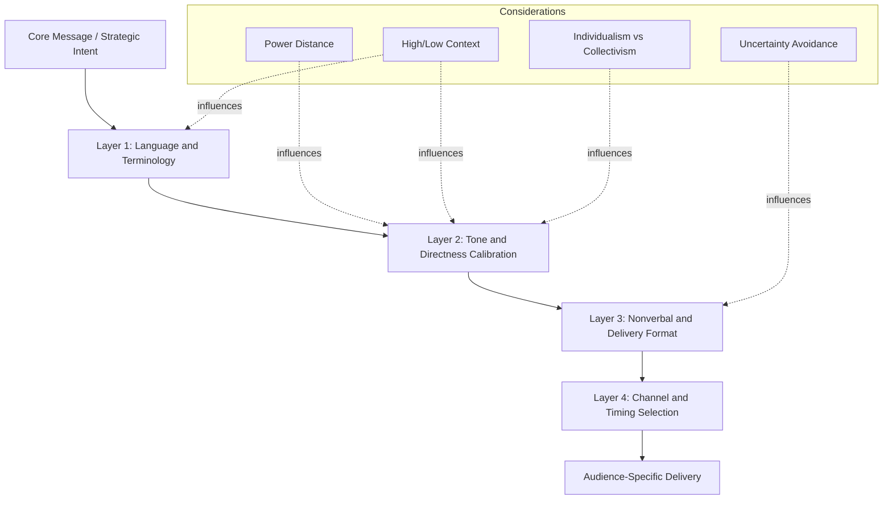

## Building Inclusive, Culturally Aware Communication

### Definition and Scope

Culturally aware communication is the deliberate practice of adapting message content, delivery style, and interpersonal conduct to account for the values, norms, and expectations of audiences from different cultural backgrounds. Inclusive communication extends this by ensuring messages do not marginalize, stereotype, or exclude individuals based on culture, language proficiency, gender, disability, age, or other identity dimensions. For executive communicators, this competency governs how strategy, policy, and leadership messages are received across geographically distributed, multicultural workforces, boards, and markets.

### Why This Matters for Executive Communication

**Key Points**

- Miscommunication rooted in cultural blind spots can undermine deal negotiations, cross-border mergers, and global team cohesion.
- Executives who fail to adapt communication style risk being perceived as tone-deaf, authoritarian, or untrustworthy in cultures with different power-distance or context norms.
- Inclusive language reduces legal and reputational risk (e.g., discrimination claims, PR crises).
- Global investor and stakeholder relations increasingly require cultural fluency, particularly in earnings calls, town halls, and crisis communication reaching multinational audiences.

### Core Theoretical Frameworks

#### Hofstede's Cultural Dimensions Theory

Geert Hofstede's model identifies six dimensions along which national cultures vary. This is a well-established, widely taught framework in cross-cultural management.

| Dimension | Low Score Tendency | High Score Tendency |
| --- | --- | --- |
| Power Distance | Flat hierarchies, egalitarian address | Deference to authority, formal titles |
| Individualism vs. Collectivism | Group loyalty, consensus-driven | Personal achievement, direct opinions |
| Masculinity vs. Femininity | Cooperation, quality of life emphasis | Competition, assertiveness emphasis |
| Uncertainty Avoidance | Comfort with ambiguity, flexible plans | Preference for rules, detailed plans |
| Long-Term vs. Short-Term Orientation | Tradition, quick results | Pragmatism, perseverance |
| Indulgence vs. Restraint | Free gratification of desires | Suppression via social norms |

**Example**: A leader briefing a high power-distance team (e.g., many East and Southeast Asian corporate contexts) may need to issue directives with more formal framing and avoid public disagreement in group settings, reserving open debate for smaller, private forums.

#### Hall's High-Context vs. Low-Context Communication

Edward T. Hall distinguished cultures by how much meaning is embedded in explicit words versus context, relationship, and nonverbal cues.

- **Low-context cultures** (e.g., Germany, U.S., Scandinavia): Communication is explicit, direct, and literal. Ambiguity is viewed as a failure of the speaker.
- **High-context cultures** (e.g., Japan, China, many Middle Eastern and Latin American cultures): Meaning relies heavily on shared context, relationship history, tone, and nonverbal signals. Directness can be perceived as rude or aggressive.

**Example**: A Western executive saying "This proposal won't work" in a high-context negotiation may cause loss of face. A more contextually appropriate phrasing: "This is an interesting direction — let's also explore how it might be strengthened further."

#### Trompenaars and Hampden-Turner's Seven Dimensions

Extends Hofstede with additional axes relevant to business communication, notably **universalism vs. particularism** (rule-based vs. relationship-based decision-making) and **specific vs. diffuse** (compartmentalized vs. holistic relationships between business and personal life).

#### GLOBE Study (House et al.)

A large-scale cross-national study of leadership and organizational culture across 62 societies, adding dimensions like performance orientation, humane orientation, and gender egalitarianism, and correlating them with preferred leadership communication styles.

### Diagram: Layers of Cultural Adaptation in Executive Messaging

### Practical Techniques for Inclusive Language

#### Terminology Auditing

- Replace idioms, sports metaphors, and culturally specific references ("home run," "hail mary") with plain, universally comprehensible language, since idioms rarely translate and can confuse non-native speakers.
- Avoid gendered defaults (e.g., "chairman" → "chair" or "chairperson"; "manpower" → "workforce").
- Use person-first or identity-first language per the preferences of the specific community being referenced (varies by context and region — verify current guidance rather than assuming a universal standard).

#### Direct vs. Indirect Framing Calibration

**Example** — Same message, two cultural framings:

- Direct (low-context, individualist): "Q3 revenue missed target by 12%. We need corrective action by Friday."
- Indirect (high-context, collectivist): "Q3 results came in below where we'd hoped, and I believe that together we can identify a path forward before the week is out."

Both convey the same operational reality; the second preserves relational harmony and group face while still communicating urgency.

#### Nonverbal and Visual Considerations

- Eye contact, gesture, and personal space norms vary significantly; scripted guidance in slide decks or talking points should avoid universal assumptions about "confident body language."
- Color and imagery in presentation design carry different connotations across cultures (e.g., white signifies mourning in some East Asian traditions but purity in Western contexts) — verify symbolism relevant to the specific audience before finalizing visual assets.

### Structural Model: The CQ (Cultural Intelligence) Framework

Developed by Earley and Ang, Cultural Intelligence comprises four capability dimensions relevant to communicative competence:

1. **CQ Drive** — Motivation to engage across cultural differences.
2. **CQ Knowledge** — Understanding of cultural systems, norms, and frameworks (e.g., Hofstede, Hall).
3. **CQ Strategy** — Metacognitive planning: interpreting cues and adjusting approach before and during interaction.
4. **CQ Action** — Behavioral flexibility: adapting verbal and nonverbal conduct in real time.

**Next Steps** for applying CQ in executive settings: conduct a pre-briefing cultural scan of the audience, rehearse key messages with a native-context advisor, and build in real-time feedback checkpoints (e.g., pause for translated Q&A) during delivery.

### Inclusive Communication Checklist for Executive Messaging

- [ ] Message reviewed for idioms, jargon, and culturally specific references
- [ ] Terminology checked against current inclusive-language guidance for the target regions
- [ ] Tone calibrated to audience's position on the direct/indirect spectrum
- [ ] Visual assets checked for cultural symbolism (color, imagery, gesture depictions)
- [ ] Translation/localization reviewed by native speakers, not machine translation alone
- [ ] Time zones and religious/cultural calendars considered for scheduling and delivery
- [ ] Q&A format allows for both direct challenge (low-context audiences) and private follow-up (high-context audiences)
- [ ] Accessibility considerations included (captions, plain-language summaries, alt text)

### Common Pitfalls

- **Overgeneralization [Inference]**: Applying national cultural averages (e.g., Hofstede scores) to every individual within that culture risks stereotyping; individual variation within any culture is substantial, and frameworks describe population tendencies, not individual guarantees.
- **False Universalism**: Assuming a "neutral" communication style exists; most default corporate communication norms are themselves culturally specific (often reflecting Anglo-American low-context, individualist norms).
- **Translation Without Localization**: Literal translation preserves words but often loses idiomatic meaning, tone, and cultural appropriateness; effective localization adapts examples, humor, and framing, not just vocabulary.
- **Performative Inclusion**: Inclusive language without substantive changes to decision-making access or representation can be perceived as superficial [Inference — perception varies by organizational context and audience].

### Applying This in Crisis and High-Stakes Communication

In crisis communication specifically, cultural miscalibration is high-risk: apology norms differ significantly (some cultures expect immediate, personal apology from leadership; others expect measured, institutional statements separating personal and organizational accountability). Executive communicators should pre-map likely audience expectations for accountability framing before a crisis occurs, not during one.

### Related Topics

- Hofstede's Cultural Dimensions Theory (deep dive)
- High-Context vs. Low-Context Communication Styles
- Localization vs. Translation in Global Corporate Messaging
- Cross-Cultural Negotiation Tactics
- Global Crisis Communication and Apology Norms
- Cultural Intelligence (CQ) Assessment and Development
- Inclusive Language Style Guides for Multinational Organizations
- Nonverbal Communication Across Cultures
- Leading Multicultural and Distributed Teams
- Accessibility and Plain Language in Executive Communication