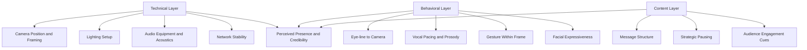

## Presence and Delivery on Video Calls

### Definition and Scope

Presence on video calls refers to the perceived sense that a speaker is engaged, credible, and attentive despite the mediating layer of a camera, microphone, and screen. Delivery refers to the technical and behavioral execution of verbal and nonverbal communication optimized for the video medium. For executive communicators, video calls (one-on-ones, town halls, board meetings, investor briefings, media interviews) increasingly serve as the primary channel for leadership visibility, making mastery of this medium a core competency rather than a soft skill.

### Why Video Presence Differs from In-Person Presence

**Key Points**

- The camera compresses nonverbal bandwidth: peripheral body language, spatial dynamics, and subtle group reactions are largely lost.
- Eye contact is technically impossible in standard webcam setups without deliberate technique, since looking at a screen and looking at a camera lens are physically different actions.
- Audio quality has an outsized effect on perceived competence; poor audio is processed by listeners as a proxy for lower credibility [Inference — effect size varies by context and audience expectations].
- "Zoom fatigue" research indicates video calls impose higher cognitive load than audio-only or in-person interaction due to sustained self-monitoring (seeing one's own image) and unnatural eye-gaze patterns.

### The Mehrabian Framework — Correct and Incorrect Application

Albert Mehrabian's often-cited 7%-38%-55% rule (words–tone–body language) is frequently misapplied as a general communication law. The original research specifically concerned communication of feelings and attitudes when verbal and nonverbal signals conflict, not communication in general. [Unverified as a general-purpose rule; widely over-generalized in business communication training.] Applied correctly to video: when a speaker's words and tone/expression are congruent, verbal content carries substantial weight; when they conflict (e.g., saying "I'm confident" with a flat tone and averted eyes), nonverbal and vocal cues dominate audience interpretation.

### Core Components of Video Delivery

#### 1. Camera and Framing

- **Eye-line technique**: Position the camera lens at or slightly above eye level; place notes or the speaker view as close to the lens as possible to minimize the gaze gap.
- **Headroom and framing**: Standard broadcast framing places eyes roughly in the upper third of the frame, with shoulders and upper chest visible (a "chest-up" shot), following conventional video framing norms.
- **Background**: A neutral, uncluttered background reduces visual competition for attention; virtual backgrounds can introduce distracting edge artifacts and are generally avoided in high-stakes executive contexts.

#### 2. Lighting

- Light source should be in front of the speaker's face, not behind (backlighting silhouettes the speaker).
- Soft, diffused front lighting (e.g., a ring light or window light with sheer curtain) reduces harsh shadows.
- Avoid mixed color temperatures (e.g., daylight window plus warm incandescent lamp) as it produces unnatural skin tones on camera.

#### 3. Audio

- A dedicated external microphone (lavalier, USB condenser, or headset mic) outperforms built-in laptop microphones in clarity and noise rejection.
- Room acoustics matter: hard, parallel surfaces (glass, bare walls) cause echo; soft furnishings (rugs, curtains, upholstery) dampen reflections.
- Wired connections reduce the risk of dropouts and compression artifacts compared to unstable Wi-Fi during high-stakes calls.

#### 4. Vocal Delivery

- **Pacing**: Slightly slower pacing than in-person speech compensates for compression artifacts, latency, and the added cognitive load of screen-based listening.
- **Vocal variety (prosody)**: Pitch, pace, and volume variation prevent monotone delivery, which reads as disengagement on camera even more than in person, since the medium strips away compensating physical energy cues.
- **Strategic pausing**: Deliberate pauses after key points allow for network latency and give remote audiences processing time; unlike in-room settings, there is no ambient feedback (nodding, murmurs) to gauge comprehension in real time.

#### 5. Eye Contact via Camera

**Example** technique: When speaking to a single interviewer or small group, place their video tile directly beneath the camera lens (not centered on a secondary monitor) so the eye-line to camera stays within a few degrees. When reading from notes or a teleprompter, keep text directly under the lens and use large font sizes to minimize downward eye movement.

### Diagram: Video Presence Delivery Stack

### Gesture and Body Language on Camera

- Keep gestures within the frame boundaries; gestures cut off by the frame edge appear jarring and distracting.
- Slightly larger, more deliberate gestures than in-person compensate for the flattening effect of 2D video.
- Micro-expressions and facial engagement (eyebrow movement, smiling with eyes) read more clearly on close-framed video than broad body language, making facial expressiveness a higher-leverage channel than it is in person.

### Structural Techniques for High-Stakes Video Delivery

#### The "Anchor and Scan" Technique for Multi-Participant Calls

For town halls or panels with many visible tiles: anchor primary eye contact at the camera when speaking (not scanning the gallery view, which breaks the eye-line for viewers), and reserve gallery scanning for listening segments when not on camera focus.

#### Pre-Call Technical Checklist

- [ ] Camera positioned at eye level, framed chest-up with adequate headroom
- [ ] Front-facing light source tested, no strong backlight
- [ ] External microphone connected and tested for level and background noise
- [ ] Wired network connection where possible; bandwidth tested
- [ ] Background checked for clutter, distracting motion, or branding conflicts
- [ ] Notes/teleprompter positioned directly beneath camera lens
- [ ] Platform-specific features tested (virtual backgrounds, screen share, mute controls) prior to the actual call

#### Delivery Rehearsal Checklist

- [ ] Opening 30 seconds rehearsed for energy calibration (video tends to flatten perceived energy, so slightly elevated baseline energy compensates)
- [ ] Key messages tested for pacing against video latency
- [ ] Transitions between speaking and listening modes practiced (e.g., muting/unmuting cues, camera engagement during Q&A)

### Common Pitfalls

- **Screen-reading posture**: Looking down at a second monitor or notes rather than the camera, which reads as disengagement or evasiveness to viewers even when the speaker is fully attentive.
- **Static framing fatigue**: Remaining perfectly still for an entire call can appear flat on camera; natural micro-movements (head tilts, hand gestures within frame) sustain perceived engagement.
- **Overcompensating energy**: Excessive enthusiasm or exaggerated expressions can appear performative on close-up video; calibration should match the platform's intimacy, not stage-presentation scale.
- **Ignoring latency**: Speaking in rapid, uninterrupted streams without pauses can cause talk-over collisions when there is network delay between participants.

### Platform-Specific Considerations

Different platforms (Zoom, Microsoft Teams, Google Meet, Webex) vary in compression algorithms, gallery layout defaults, and virtual background handling — behavior can change with platform updates, so specific UI features and settings should be verified against current platform documentation before high-stakes use. [Unverified — platform feature sets change frequently and were not verified against live documentation for this response.]

### Related Topics

- Executive Presence in Virtual Town Halls
- Vocal Delivery and Prosody Training
- Managing Q&A and Live Audience Interaction Remotely
- Lighting and Home Studio Setup for Executive Communication
- Hybrid Meeting Facilitation (In-Room + Remote Audiences)
- Media Training for Video Interviews
- Reducing Zoom Fatigue in Distributed Teams
- Nonverbal Communication Fundamentals