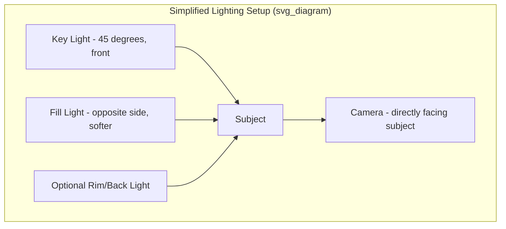

## Camera Framing, Lighting, and Virtual Setup

### Definition and Scope

This topic covers the technical configuration of camera positioning, lighting design, and supporting hardware/software that together determine visual and audio quality for executive video communication. Unlike presence and delivery (behavioral execution), this is the equipment and physical-environment layer that makes strong delivery possible — poor technical setup can undermine even excellent vocal and behavioral technique.

### Camera Framing

#### Composition Standards

- **The Rule of Headroom**: Leave a small margin of space above the head — too much creates a distant, diminished appearance; too little (or cropped head) feels claustrophobic. Standard practice places the eyes approximately in the upper third of the frame.
- **Chest-up framing**: The conventional executive/broadcast framing includes head, shoulders, and upper chest, allowing for natural gesture visibility without excessive background exposure.
- **Camera height**: Lens at or slightly above eye level. A camera positioned below eye level creates an unflattering upward angle and an unintended power dynamic (looking up at the viewer, or the viewer looking down a nostril-line at the speaker); a common fix is stacking the laptop on books or using an adjustable monitor arm/tripod.
- **Camera distance**: Positioned roughly an arm's length to two arm's lengths away — too close distorts facial proportions (wide-angle lens distortion enlarges features nearest the lens), too far reduces visible expressiveness.

#### Technical Setup for Framing

| Element | Recommendation | Rationale |
| --- | --- | --- |
| Lens height | Eye level or 2-3 inches above | Avoids upward-angle distortion, maintains eye-line |
| Lens distance | 2-3 feet from face | Reduces wide-angle facial distortion |
| Frame fill | Head + shoulders + upper chest | Standard broadcast/executive framing |
| Orientation | Camera perpendicular to face, not angled | Avoids asymmetric shadowing and off-axis look |

**Example**: For a laptop built-in webcam, place the laptop on a stand or stack of books so the lens sits at eye level, then tilt the screen slightly back to maintain a perpendicular angle to the face rather than looking down into the camera.

### Lighting Design

#### Three-Point Lighting Fundamentals

Adapted from film/broadcast lighting, the three-point model uses:

1. **Key light**: The primary, brightest light source, placed at roughly 45 degrees to one side of the face, providing the main illumination and modeling the face's contours.
2. **Fill light**: A softer, dimmer light on the opposite side, reducing harsh shadows cast by the key light without eliminating all dimensionality.
3. **Back/rim light**: Positioned behind and above the subject, separating the subject from the background and adding depth.

For most executive video setups, a simplified two-point approach (key + fill, or a single large soft key light) is sufficient given practical constraints of home/office environments.

#### Lighting Technique Details

- **Light temperature**: Consistent color temperature across all sources (measured in Kelvin) prevents mismatched skin-tone rendering; mixing daylight (~5600K) with tungsten (~3200K) sources produces visible color casts unless corrected with gels or software white balance.
- **Diffusion**: Direct light from an uncovered bulb or window creates harsh, hard-edged shadows; passing light through a diffuser (softbox, umbrella, sheer curtain, or even printer paper) softens shadow edges and is generally more flattering.
- **Avoiding backlighting**: A window or light source behind the speaker causes the camera's auto-exposure to darken the face into silhouette; the fix is either facing toward the window or adding front fill light to balance exposure.
- **Avoiding overhead-only lighting**: Ceiling fixtures alone cast shadows under the eyes, nose, and chin ("racoon eyes" / "ghoul lighting"); supplementing with front-facing light corrects this.

#### Practical Equipment Tiers

**Key Points**

- **Budget tier**: Position a desk facing a window for natural front light; use a desk lamp with a diffuser (paper/cloth) as fill for evening calls.
- **Mid tier**: A dedicated ring light or LED panel with adjustable color temperature and brightness, mounted at eye level behind or beside the camera.
- **Executive/broadcast tier**: Multi-point LED panel kit with softboxes, adjustable color temperature, and a dedicated background light, often paired with a professional webcam or DSLR/mirrorless camera as a webcam source.

### Virtual/Background Setup

#### Physical Background Considerations

- A neutral, uncluttered, professionally curated background (bookshelf, plain wall, tasteful decor) signals preparation and reduces viewer distraction.
- Avoid backgrounds with movement (hallway traffic, screens playing video) or visually competing patterns.
- Consider what's visible in frame from the audience's perspective, not just the speaker's — checking the actual camera preview rather than assuming.

#### Virtual Backgrounds and Background Blur

- Virtual backgrounds use real-time segmentation (foreground/background separation via machine learning models) to replace or blur the background; edge artifacts (flickering around hair, glasses, or fast movement) are a known limitation of consumer-grade implementations.
- For high-stakes executive contexts (board meetings, investor calls, media appearances), a real, physically staged background is generally preferred over virtual backgrounds, since artifacts can appear unpolished or distracting. [Inference — preference varies by organizational culture and platform quality.]
- Green screens eliminate most segmentation artifacts by providing a uniform chroma-key background but require more setup (even, shadow-free green lighting) and additional space.

### Software and Hardware Integration

#### Webcam vs. DSLR/Mirrorless as Webcam

- Standard webcams (built-in or USB) offer simplicity and adequate quality for routine calls.
- Higher-end setups use a DSLR/mirrorless camera connected via HDMI capture card or manufacturer webcam software, providing larger sensors, better low-light performance, and shallower depth of field (background blur) for a more polished, "broadcast" look.

#### Common Platform Settings to Verify

- Camera and microphone selection in platform settings (many platforms default to the system's built-in devices rather than externally connected ones).
- HD video toggle (where available) — sends higher bitrate video, which requires adequate upload bandwidth.
- Auto-framing/auto-zoom features on some webcams and platforms, which can behave unpredictably if the setup guidance above isn't confirmed against current platform documentation, since these features change across software versions. [Unverified — platform-specific auto-framing behavior should be checked against current documentation before relying on it for high-stakes calls.]

### Full Setup Checklist

- [ ] Camera at eye level, framed chest-up with correct headroom
- [ ] Camera lens 2-3 feet from face, perpendicular angle
- [ ] Key light positioned front/45-degrees, diffused
- [ ] Fill light or secondary light source balances shadows
- [ ] No direct backlighting (windows behind subject corrected or avoided)
- [ ] Consistent color temperature across all light sources
- [ ] Background checked in live camera preview, decluttered
- [ ] Virtual background/blur tested for edge artifacts if used
- [ ] Correct camera and microphone selected in platform settings
- [ ] Bandwidth and wired connection tested for HD video stability

### Common Pitfalls

- **Auto-exposure washout**: Bright windows in frame cause cameras to underexpose the face; solved by repositioning or manually locking exposure where the platform/camera allows.
- **Fluorescent flicker**: Some fluorescent or cheap LED lighting can cause visible flicker on camera due to frequency mismatches with the camera's shutter/refresh rate; using flicker-free LED sources avoids this.
- **Reflections and glare**: Glasses can reflect screen light or overhead fixtures; adjusting light angle or slightly tilting the screen down can reduce glare.
- **Over-reliance on ring lights**: A ring light placed too close and centered can create a flat, shadowless look and a visible circular catchlight in the eyes that some viewers find artificial in formal executive contexts.

### Related Topics

- Presence and Delivery on Video Calls
- Audio Setup and Microphone Selection for Executive Communication
- Media Training for Video Interviews
- Hybrid Meeting Facilitation (In-Room + Remote Audiences)
- Platform-Specific Configuration for Town Halls and Webinars
- Visual Branding Consistency in Executive Video Communication