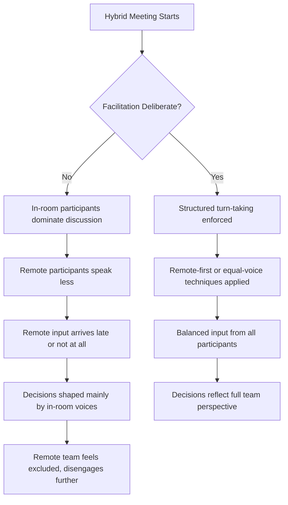

## Facilitating Engagement in Hybrid Meetings

### Definition and Scope

Hybrid meeting facilitation is the practice of leading meetings where some participants are physically co-located in a room and others join remotely via video/audio. This format introduces structural asymmetries not present in fully in-person or fully remote meetings, requiring deliberate facilitation techniques to prevent remote participants from becoming passive observers rather than active contributors.

### The Core Problem: Proximity Bias

**Key Points**

- Proximity bias (also called "in-room bias") is the tendency for in-room participants to dominate discussion, receive more eye contact and follow-up, and be perceived as more engaged than remote participants, purely as an artifact of physical presence.
- Remote participants face a compounded disadvantage: reduced ability to read room dynamics, delayed opportunities to jump into conversation (turn-taking cues like leaning forward are invisible on video), and audio/video quality issues that can marginalize their contributions.
- Left unaddressed, hybrid meetings can systematically disadvantage remote employees in visibility, influence, and career advancement — a documented organizational risk in distributed-workforce research. [Inference — magnitude varies by organizational culture and facilitation quality.]

### Diagram: Hybrid Meeting Engagement Failure Points

### Structural Techniques for Balanced Participation

#### 1. Remote-First Facilitation

- Address remote participants first when opening discussion or asking for input, reversing the default in-room-first pattern.
- Explicitly invite remote voices by name after any in-room comment ("Before we move on, [remote participant], any reaction to that?") rather than waiting for them to interject over latency and audio competition.

#### 2. One-Screen-Per-Person Principle

Where feasible, each in-room participant also joins the video call individually on their own device rather than clustering around a single conference-room camera. This equalizes the visual field — every participant, in-room or remote, appears as one equally sized tile — removing the "wall of faces vs. individual" visual hierarchy that reinforces in-room dominance. [Standard recommendation in distributed-team facilitation literature; effectiveness depends on room setup and bandwidth.]

#### 3. Structured Turn-Taking

- Use explicit facilitation techniques (round-robin, raise-hand features, numbered speaking order) rather than open-floor discussion, which structurally favors those who can physically read and interrupt room dynamics.
- Platform-native "raise hand" and chat-queue features give remote participants a lower-friction way to signal intent to speak compared to competing for a verbal opening.

#### 4. Chat and Backchannel Integration

- Assign a dedicated notetaker or co-facilitator to actively monitor the chat/Q&A channel and surface remote comments aloud to the room, since remote participants often use chat as their primary engagement channel and it is easily missed by an in-room-focused facilitator.
- Explicitly close the loop on chat contributions ("Someone in the chat raised X — let's address that") so remote input visibly shapes the conversation rather than being silently absorbed.

### Room and Technology Setup Considerations

| Element | In-Room-Only Meeting | Hybrid Meeting Requirement |
| --- | --- | --- |
| Camera | Optional | Wide-angle or tracking camera capturing all in-room speakers |
| Microphone | Optional | Ceiling/table array mic or individual mics to capture all voices clearly |
| Display | Optional | Remote participants visible on a prominent screen, not a side monitor |
| Whiteboard/content | Physical whiteboard acceptable | Digital collaborative tool (shared doc, virtual whiteboard) so remote participants can see and edit content equally |

**Example**: A common hybrid meeting failure is an in-room team using a physical whiteboard for brainstorming while remote participants watch a blurry, angled camera view with no ability to contribute directly — replacing this with a shared digital whiteboard (e.g., a collaborative canvas tool) that both room and remote participants can edit live resolves the asymmetry.

### Facilitation Techniques by Meeting Type

#### Brainstorming/Ideation Sessions

- Use asynchronous or simultaneous input methods (shared documents, digital sticky notes) where everyone contributes in parallel rather than sequential verbal turns, which naturally favors confident in-room speakers.
- Silent generation phases (everyone writes ideas independently before discussion) reduce the anchoring effect of whoever speaks first in the room.

#### Decision-Making Meetings

- Explicit polling (platform poll features, digital voting tools) ensures every participant's input is captured with equal visibility, rather than relying on verbal consensus-sensing that favors in-room body language reading.
- State decisions explicitly and confirm understanding with both room and remote participants separately before closing.

#### Status Updates/Standups

- Structured round-robin format (each person, room or remote, gets an equal, timed turn) prevents the meeting from defaulting to whoever is physically positioned to speak first.

### Facilitator Checklist

- [ ] Remote participants greeted and included from the meeting's opening moment
- [ ] Camera/audio setup tested to ensure all in-room speakers are clearly audible and visible to remote participants
- [ ] Shared digital workspace used for any collaborative content (not physical-only whiteboards)
- [ ] Explicit facilitation technique chosen (round-robin, remote-first, structured Q&A) rather than open floor
- [ ] Dedicated chat/backchannel monitor assigned if group is large
- [ ] Remote participants explicitly invited to comment before moving to next topic
- [ ] Meeting notes/decisions shared equally and promptly with both room and remote participants

### Common Pitfalls

- **The "afterthought" pattern**: Conducting the substantive discussion in-room and only turning to the camera for a brief "any questions?" at the end, which signals remote participants are secondary.
- **Audio asymmetry**: Room participants can hear each other clearly but a poor room microphone makes remote participants inaudible or muffled to the room, silently degrading their contributions' impact.
- **Sidebar conversations**: In-room side comments and body language (nodding, whispered asides) that shape group sentiment but are invisible and unavailable to remote participants, creating an information asymmetry in the room's collective sense-making.
- **Uneven screen real estate**: Remote participants relegated to a small corner tile while the room dominates the main display reinforces a visual hierarchy that maps onto participatory hierarchy.

### Related Topics

- Presence and Delivery on Video Calls
- Camera Framing, Lighting, and Virtual Setup
- Managing Q&A and Live Audience Interaction Remotely
- Asynchronous Communication Strategies for Distributed Teams
- Meeting Design and Facilitation Fundamentals
- Building Inclusive, Culturally Aware Communication