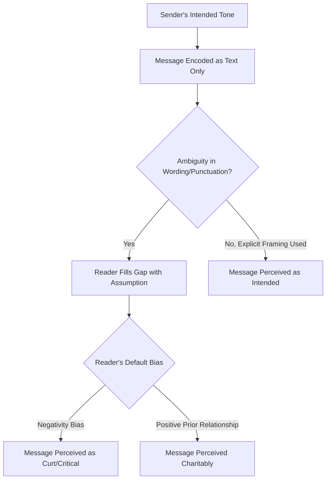

## Written Digital Communication and Tone in Chat

### Definition and Scope

Written digital communication and tone in chat concerns how leaders and professionals convey intent, emotional register, and clarity through text-based channels (Slack, Microsoft Teams, email, SMS) that lack vocal inflection and body language. Because text strips away the paralinguistic cues (tone of voice, facial expression, timing) that normally disambiguate meaning, this channel carries elevated risk of misinterpretation and requires deliberate technique to convey intended tone accurately.

### Why Tone Is Harder to Convey in Text

**Key Points**

- Absent vocal and facial cues, readers fill interpretive gaps with assumptions, and research on text-based communication (e.g., studies on email tone perception) has repeatedly shown senders overestimate how accurately their intended tone is perceived by readers. [Inference — general finding; specific effect sizes vary by study and context.]
- Ambiguous text tends to be interpreted negatively by default in professional contexts — a phenomenon sometimes called the "negativity bias" in written communication, where neutral messages are read as curt or critical absent other signals.
- Power dynamics amplify this effect: a terse message from a senior leader is more likely to be read as displeasure or urgency than the same message between peers.

### Core Techniques for Conveying Tone in Text

#### 1. Explicit Framing Over Implicit Inference

Rather than relying on brevity or punctuation to imply tone, state the intended register directly when it matters for high-stakes messages.

**Example**:

- Ambiguous: "We need to talk about the report."
- Explicit: "I have a few questions about the report — nothing urgent, happy to grab 15 minutes whenever works this week."

#### 2. Punctuation and Formatting as Tone Signals

| Element | Effect | Consideration |
| --- | --- | --- |
| Period at end of short message | Can read as curt/serious in casual chat contexts | Context-dependent; less true in formal email |
| Exclamation point | Signals warmth/enthusiasm | Overuse dilutes sincerity |
| ALL CAPS | Reads as shouting/urgency | Avoid except for genuine emphasis on a single word |
| Ellipsis (...) | Can signal hesitation, trailing thought, or passive-aggression | High ambiguity; often best avoided in professional chat |
| Emoji | Softens tone, signals informality | Appropriateness varies by organizational culture and seniority context |

[Inference — the punctuation effects above reflect commonly observed patterns in workplace chat research and style guides; individual and generational interpretation varies significantly.]

#### 3. Channel-Appropriate Register Calibration

- **Chat (Slack/Teams)**: Generally more casual, conversational, real-time; shorter messages, informal punctuation more acceptable.
- **Email**: More formal, asynchronous, often archived/referenced later; warrants fuller sentences, clear subject lines, and more deliberate structure.
- **SMS/Text**: Highest informality expectation, but for executive communication (e.g., urgent updates to a board member), brevity and clarity should still be prioritized over casualness.

### Diagram: Tone Interpretation Risk in Text Channels

### Structural Best Practices

#### Message Clarity Structure

For substantive written communication, a clear structure reduces reliance on tone entirely by making intent unambiguous through content organization:

1. **Context** — brief framing of why the message is being sent.
2. **Core content** — the actual information, request, or decision.
3. **Explicit ask** — what response or action is needed, if any, and by when.

**Example**:

"Quick context: finance flagged a discrepancy in the Q3 numbers. Core issue: the marketing spend line is off by roughly $40K from what was reported. Ask: can you confirm the correct figure by end of day tomorrow so we can update the board deck?"

#### Handling Disagreement or Critical Feedback in Writing

- Written disagreement is more likely to escalate than spoken disagreement because tone-softening cues are absent; for genuinely sensitive feedback, switching to a call or video is often more effective than attempting to convey nuance in text.
- When written critical feedback is necessary, leading with the specific, observable issue (rather than a general evaluative statement) reduces perceived personal attack: "The deck's Q3 section doesn't match the numbers we discussed" reads more neutrally than "This deck isn't ready."

#### Asynchronous Communication Considerations

- Response-time expectations should be stated explicitly where they matter ("no rush, end of week is fine" vs. "need this in the next hour") since asynchronous channels remove the implicit urgency cues present in real-time conversation.
- Time zone and working-hours awareness matters for distributed teams; a late-night message timestamp can itself convey unintended urgency or pressure to a recipient, regardless of content.

### Executive-Specific Considerations

- **Amplified authority effect**: Messages from senior leaders carry disproportionate interpretive weight; a casually phrased question from a CEO can be read by a junior employee as a directive or a signal of concern, even when not intended that way.
- **Written record permanence**: Chat and email messages are more easily archived, forwarded, or screenshotted than spoken communication, raising the stakes for precision and tone in written leadership communication, particularly around sensitive topics (restructuring, performance, legal matters).
- **Public vs. private channel awareness**: Tone calibration differs for messages posted in shared/public channels (visible to a broader audience, higher formality expectation) versus direct messages (more personal, can be more informal).

### Common Pitfalls

- **Over-reliance on brevity**: Extremely short responses ("K." "Fine." "Noted.") from leadership can be misread as displeasure even when simply reflecting time constraints; adding minimal context avoids this ("Got it, thanks — will follow up Thursday.").
- **Sarcasm and humor risk**: Sarcasm rarely translates well in text without strong existing rapport and shared context; what reads as playful in person can read as genuinely critical in chat.
- **Rapid-fire fragmented messages**: Sending many single-line messages in quick succession can create a sense of urgency or agitation not necessarily intended by the sender, compared to a single, composed message.
- **Ignoring platform norms**: Different teams and organizations develop their own chat culture norms (emoji use, thread vs. channel posting, response-time expectations); communicating without awareness of local norms can misfire regardless of technique.

### Related Topics

- Email Etiquette and Structure for Executive Communication
- Crisis Communication in Written and Digital Channels
- Building Inclusive, Culturally Aware Communication
- Asynchronous Communication Strategies for Distributed Teams
- Giving and Receiving Feedback Across Digital Channels
- Presence and Delivery on Video Calls