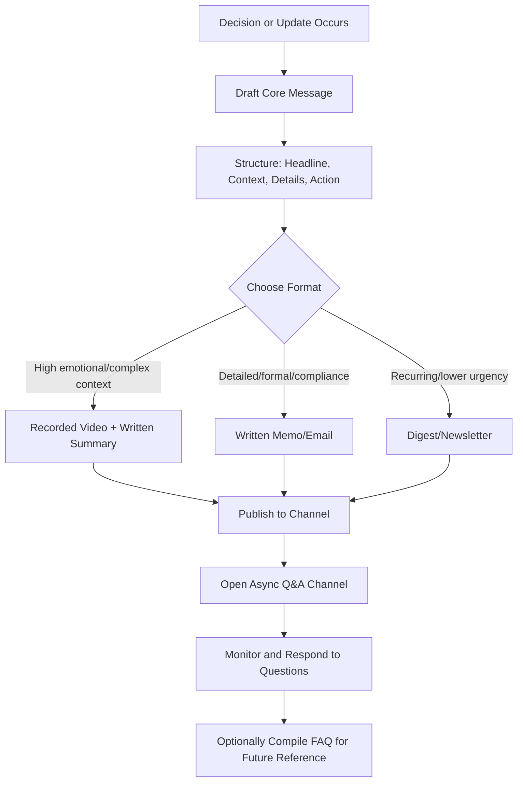

## Managing Asynchronous Updates and Announcements

### Definition and Scope

Asynchronous updates and announcements refer to one-to-many or one-to-few communications delivered without requiring real-time simultaneous presence from sender and recipients — recorded videos, written memos, email digests, recorded town halls, and posted channel updates. This is distinct from synchronous channels (live meetings, calls) and from one-on-one async chat; it specifically concerns broadcast-style communication designed to be consumed on the recipient's own schedule.

### Why Asynchronous Communication Matters for Executive Communication

**Key Points**

- Distributed and globally dispersed teams across time zones make synchronous all-hands meetings logistically impossible to schedule at a convenient time for everyone; asynchronous formats ensure equitable access regardless of geography.
- Well-designed async updates reduce meeting load, a widely cited driver of employee fatigue and productivity loss in distributed organizations. [Inference — magnitude varies by organization and role.]
- Asynchronous formats create a durable, referenceable record that synchronous meetings do not, supporting onboarding, compliance, and institutional memory.
- Poorly executed async communication (unclear, buried, or excessive in volume) can produce the opposite effect: information overload and disengagement.

### Core Formats for Asynchronous Executive Communication

| Format | Best For | Key Characteristics |
| --- | --- | --- |
| Written memo/email | Detailed policy changes, formal announcements | Precise, archivable, searchable |
| Recorded video update | Personal/emotional register, complex context | Conveys tone and nonverbal cues text cannot |
| Recorded town hall + Q&A doc | Large-scale organizational updates | Combines broadcast delivery with async-collected questions |
| Async Q&A thread | Ongoing clarification after an announcement | Allows follow-up without a live meeting |
| Digest/newsletter | Recurring periodic updates (weekly/monthly) | Aggregates lower-urgency items into a predictable cadence |

### Structural Model: The Async Announcement Framework

#### 1. Lead With the Core Message (Inverted Pyramid)

Unlike synchronous speech, which can build toward a conclusion, asynchronous written and video communication should front-load the most important information, since readers/viewers frequently skim, skip ahead, or stop partway through.

**Example structure**:

- **Headline**: The single most important fact or decision, in one sentence.
- **Context**: Why this matters / what led to this.
- **Details**: Specifics, data, supporting reasoning.
- **Action/Next steps**: What the recipient needs to do, if anything, and by when.
- **Where to ask questions**: Explicit channel for follow-up.

#### 2. Design for Skimmability

- Use headers, bullet points, and bold key terms so recipients can extract the core message even from a partial read.
- Front-load video updates with a brief spoken summary before elaborating, since viewers may not watch to completion.
- Include a brief written summary alongside any recorded video, since not all recipients will have audio/video access at the time of consumption (e.g., reading during a commute).

#### 3. Anticipate and Preempt Questions

Since there's no live opportunity for immediate clarification, anticipating likely questions and answering them proactively (e.g., an embedded FAQ section) reduces confusion and the volume of follow-up requests.

### Diagram: Asynchronous Announcement Workflow

### Timing and Cadence Considerations

- **Time zone equity**: Publishing at a time that doesn't systematically disadvantage any region (e.g., always publishing during one region's business hours and another's late night) supports fairness in distributed teams; staggered or "any time within a window" framing helps.
- **Predictable cadence**: Establishing a consistent schedule for recurring updates (e.g., "leadership updates go out every other Friday") sets expectations and reduces anxiety about missed communications, compared to irregular, unpredictable announcement timing.
- **Urgency signaling**: Since async messages lack the implicit urgency of a live meeting, time-sensitive announcements should state explicit deadlines and, where appropriate, escalate to a synchronous or higher-visibility channel if truly urgent.

### Handling Sensitive or High-Stakes Announcements Asynchronously

- **Layoffs, restructuring, and other high-emotion announcements**: Best practice generally favors synchronous or high-touch delivery (live meeting, direct manager conversation) for the initial announcement, with asynchronous follow-up (FAQ, detailed policy documents) for supporting detail — pure async delivery of highly sensitive news can be perceived as impersonal or evasive. [Inference — specific approach should be calibrated to organizational context, legal requirements, and the nature of the news.]
- **Policy and process changes**: Generally well-suited to async written format given their referenceable, precise nature, provided a clear channel exists for questions.

### Measuring Effectiveness

- **Engagement metrics**: View/read rates, completion rates on video content, and Q&A volume indicate whether the message reached and resonated with the audience, though these are lagging and indirect signals.
- **Feedback loops**: Brief async pulse surveys or reaction/acknowledgment features (e.g., "mark as read," emoji reactions) provide lightweight signals of receipt without requiring a full synchronous discussion.

### Checklist for Asynchronous Announcements

- [ ] Core message stated in the first sentence/paragraph or first 15 seconds of video
- [ ] Structure includes context, details, and explicit next steps
- [ ] Format matches content type (video for emotional/complex, written for detailed/formal)
- [ ] Publishing time considers time zone equity across the audience
- [ ] Explicit Q&A channel or follow-up mechanism provided
- [ ] Written summary included alongside any video content
- [ ] High-sensitivity content evaluated for whether synchronous delivery is more appropriate
- [ ] Cadence and timing consistent with prior communications to build predictability

### Common Pitfalls

- **Burying the lede**: Starting with extensive context or thanks before stating the actual news, causing skimming recipients to miss the core message entirely.
- **Announcement overload**: Excessive frequency or volume of async updates leads to lower attention and engagement per message, sometimes called "announcement fatigue."
- **No feedback mechanism**: Purely broadcast, one-way announcements with no path for questions can leave recipients with unresolved concerns that surface as rumor or informal channels instead.
- **Format mismatch**: Using a lengthy written memo for content that carries significant emotional weight (where tone and empathy matter) when a brief video would convey intent more accurately, or vice versa — an overly casual video for content requiring precise, quotable language.

### Related Topics

- Written Digital Communication and Tone in Chat
- Facilitating Engagement in Hybrid Meetings
- Crisis Communication and Sensitive Announcements
- Presence and Delivery on Video Calls
- Change Management Communication Strategies
- Building Inclusive, Culturally Aware Communication