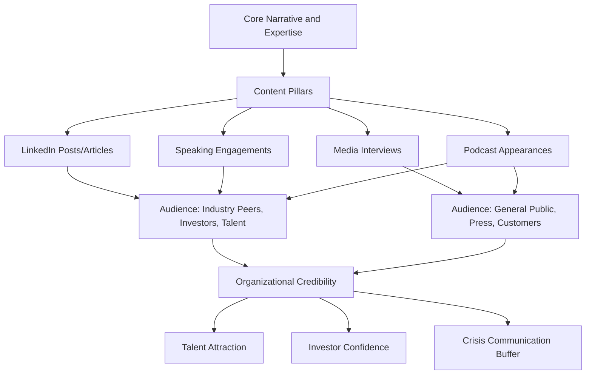

## Personal Brand and Visibility on Professional Platforms

### Definition and Scope

Personal brand and visibility on professional platforms refers to the deliberate cultivation of a consistent, credible public professional identity across channels such as LinkedIn, professional speaking engagements, published articles/thought leadership, podcasts, and industry panels. For executives, this extends beyond personal career management into organizational impact: leadership visibility affects investor confidence, talent attraction, media narrative control, and organizational credibility.

### Why Executive Personal Brand Matters

**Key Points**

- Executive visibility increasingly functions as a proxy for organizational credibility; stakeholders (investors, customers, talent) form impressions of a company partly through its leaders' public presence. [Inference — relative weight varies by industry and company stage.]
- A well-managed personal brand provides a buffer and amplification channel during crisis communication — an executive with established credibility and an existing audience can communicate directly rather than relying solely on formal press channels.
- Poorly managed or inconsistent public presence (contradictory messaging, tone-deaf posts, inactive profiles that appear neglected) can actively undermine perceived competence and trustworthiness.
- Talent recruitment is increasingly influenced by visible leadership presence — prospective employees and partners often research leadership's public profile as part of due diligence.

### Core Components of Executive Personal Brand

#### 1. Positioning and Narrative Consistency

- **Core narrative**: A clear, consistent through-line connecting professional expertise, values, and vision across all platforms and formats, avoiding contradictory positioning between, for example, a LinkedIn profile and public interview statements.
- **Differentiation**: Identifying a specific area of expertise or perspective distinct from generic industry commentary, since audiences and algorithms both favor distinctive, consistent voices over generic content.

#### 2. Platform-Specific Strategy

| Platform | Primary Use Case | Content Style |
| --- | --- | --- |
| LinkedIn | Professional network, thought leadership, company updates | Longer-form posts, articles, professional tone with personal voice |
| X/Twitter | Real-time commentary, industry conversation, rapid response | Short-form, timely, higher risk of misinterpretation given brevity |
| Industry publications/bylines | Deep thought leadership, credibility building | Long-form, researched, positions the executive as a subject authority |
| Speaking engagements/panels | Live authority-building, networking | Verbal delivery skills, Q&A handling, audience-specific framing |
| Podcasts (as guest or host) | Long-form personality and expertise display | Conversational, allows nuance not possible in short-form text |

#### 3. Content Pillars

Establishing 3-5 recurring themes ("content pillars") that align with the executive's expertise and the organization's strategic narrative provides consistency and makes content creation more sustainable than ad hoc posting.

**Example** content pillars for a CTO: (1) engineering culture and hiring, (2) emerging technology perspectives, (3) lessons from scaling technical teams, (4) industry commentary on relevant trends.

### Diagram: Executive Visibility Ecosystem

### Building a Sustainable Visibility Practice

#### Content Development Workflow

1. **Source material identification**: Drawing from actual work — decisions made, lessons learned, internal talks — rather than generic industry commentary, since authentic, specific insight differentiates from generic content.
2. **Repurposing**: A single substantive idea (e.g., from an internal talk or strategic memo) can be adapted across formats — a LinkedIn post, an expanded article, talking points for a panel — rather than generating entirely new content for each channel.
3. **Consistency over intensity**: A regular, sustainable cadence (even modest, like one substantive post every two weeks) tends to build audience trust more effectively than sporadic bursts of high-volume activity followed by silence. [Inference — general pattern observed in professional content strategy; optimal cadence varies by platform algorithm and audience.]

#### Delegation and Support Structures

- Many executives work with communications teams or ghostwriters for drafting, while maintaining final voice approval and authenticity — a common practice in executive communications, though it requires the executive to still convincingly "own" the resulting voice in live settings (interviews, Q&A) where they can't rely on prepared text.
- Executive support for personal brand often includes media training, message-house development (core talking points), and coordination with corporate communications/PR to ensure alignment between personal and organizational messaging.

### Risk Management and Governance

#### Legal and Compliance Considerations

- Public company executives face securities disclosure considerations (e.g., Regulation FD in the U.S. context) that constrain what can be shared publicly about material nonpublic information — coordination with legal/investor relations is standard practice before publishing content that touches financial performance or strategic plans. [Verify current regulatory requirements with legal counsel, as this varies by jurisdiction and company status.]
- Statements made in a personal capacity can still be attributed to and reflect on the organization; many companies maintain social media policies specifically addressing executive public communication.

#### Reputational Risk Considerations

- Political, social, or controversial commentary carries elevated risk for executives specifically because their statements are read as representing organizational position even when framed as personal opinion.
- A documented crisis-response protocol for public missteps (deleted posts, clarifications, correction statements) is a standard component of executive communications planning.

### Measuring Impact

- **Engagement metrics**: Views, shares, comments, and follower growth provide surface-level signal but do not directly measure business impact.
- **Qualitative indicators**: Media citation/quote requests, speaking invitation volume, inbound talent interest referencing the executive's public content, and investor/analyst feedback provide more direct signals of visibility translating into organizational value.
- **Narrative tracking**: Monitoring how the executive and organization are characterized in press and social commentary over time helps assess whether personal brand efforts are shifting external perception in the intended direction.

### Checklist for Executive Visibility Strategy

- [ ] Core narrative and 3-5 content pillars defined and aligned with organizational strategy
- [ ] Platform-specific strategy established (which platforms, what content types, what cadence)
- [ ] Legal/compliance review process established for public content, particularly for public companies
- [ ] Media training and message-house development completed for live/unscripted settings
- [ ] Crisis response protocol for public communication missteps documented
- [ ] Consistency check between personal brand messaging and organizational messaging
- [ ] Sustainable content workflow established (repurposing, delegation, realistic cadence)

### Common Pitfalls

- **Inauthentic ghostwriting**: Content voice so polished or generic it fails to convincingly represent the executive when they speak live, creating a credibility gap between written and spoken presence.
- **Inconsistent narrative**: Contradicting prior public statements or shifting positioning frequently, which undermines perceived reliability.
- **Neglected profiles**: An inactive or outdated public profile can appear worse than no presence at all, particularly for senior leaders where an active public profile is now often expected.
- **Overexposure on controversial topics**: Commenting on unrelated political or social issues without clear connection to expertise or organizational values, inviting reputational risk disproportionate to the communicative benefit.
- **Neglecting the live-delivery gap**: Strong written content without corresponding preparation for live Q&A, interviews, or panels, where the absence of scripted support exposes gaps in message consistency.

### Related Topics

- Media Training for Video Interviews
- Crisis Communication and Sensitive Announcements
- Written Digital Communication and Tone in Chat
- Executive Presence in Virtual Town Halls
- Thought Leadership Content Strategy
- Managing Reputational Risk in Public Statements