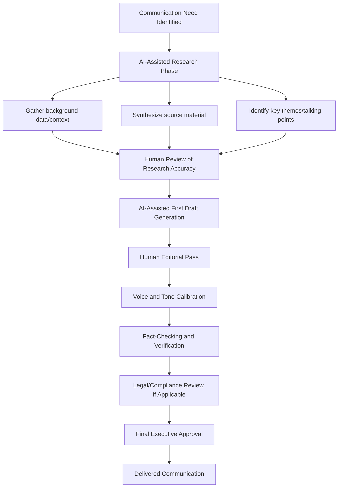

## Using AI for Research and First Drafts

### Definition and Scope

This topic covers the practical application of AI language models and research tools to accelerate the early stages of executive communication development — gathering background information, synthesizing source material, and generating initial drafts of speeches, memos, reports, and presentations. It focuses on workflow integration, quality control, and the governance considerations specific to executive-level output rather than general AI tool usage.

### The Role of AI in the Communication Development Lifecycle

**Key Points**

- AI tools are best positioned at the research and first-draft stages of communication development, where speed and breadth of synthesis provide the greatest leverage, rather than at final delivery stages where nuance, accountability, and voice authenticity matter most.
- AI-generated drafts function as a starting point for human refinement, not a finished deliverable — this distinction is central to responsible use in executive contexts where output carries organizational and legal weight.
- The value proposition is primarily time compression (reducing blank-page time, accelerating research synthesis) rather than replacing the judgment, strategic framing, and voice that define executive communication quality.

### Diagram: AI-Assisted Communication Development Workflow

### Research Applications

#### Background Synthesis

- AI tools can rapidly summarize and structure large volumes of source material (reports, prior communications, meeting notes) into organized briefing points, reducing manual synthesis time.
- Effective for identifying patterns across multiple documents (e.g., recurring themes across quarterly reports) that would take significant manual effort to surface.

#### Competitive and Market Context

- AI-assisted research can help draft initial competitive landscape summaries or industry context sections, though current, time-sensitive facts (recent events, current figures, live data) require verification against live sources rather than reliance on a model's training data, since language models have a training cutoff and can produce outdated or fabricated specifics.
- For any AI-generated claim involving current events, statistics, or specific attributions, independent verification against primary sources is a required step before inclusion in executive communication, given the well-documented tendency of language models to generate plausible-sounding but incorrect details (a failure mode often called "hallucination").

#### Stakeholder and Audience Analysis

- AI tools can help structure audience analysis frameworks (e.g., organizing known stakeholder concerns, prior objections, or historical context) but cannot substitute for direct knowledge of specific relationships, organizational politics, or nonpublic context that shapes executive judgment.

### First-Draft Generation Applications

#### Structural Scaffolding

- Generating an initial outline or structural skeleton (e.g., a speech's opening/body/close, a memo's sections) is a high-value, lower-risk use case, since structure is easier to verify and adjust than substantive content.
- **Example prompt pattern**: "Draft a structural outline for a 10-minute town hall address announcing [topic], covering context, key changes, employee impact, and next steps — do not include specific figures or commitments, structure only."

#### Tone and Register Drafting

- AI can generate multiple tonal variants of the same core content (formal vs. conversational, direct vs. diplomatic) as a starting point for the executive or speechwriter to select and refine, useful for rapidly exploring framing options before committing to one direction.

#### Iterative Refinement Workflow

**Example** iterative process:

1. Generate initial draft with AI based on approved talking points.
2. Human editor identifies gaps, inaccuracies, or voice mismatches.
3. Refine via targeted prompts (e.g., "make this paragraph more concise," "adjust tone to be less formal") rather than wholesale regeneration.
4. Apply final human voice pass to ensure the output authentically reflects the executive's actual speaking/writing style.

### Governance and Risk Considerations

#### Accuracy and Verification Requirements

- Every factual claim, statistic, quote, or attribution in an AI-assisted draft requires independent verification before use in executive communication — treating AI output with the same scrutiny as an unverified source, not as a fact-checked reference.
- AI models can produce confident-sounding but fabricated citations, quotes, or statistics; this is a well-documented limitation across current-generation language models. [Well-established limitation; specific frequency varies by model and topic.]

#### Confidentiality and Data Handling

- Inputting confidential, material nonpublic, or sensitive strategic information into third-party AI tools raises data governance considerations; organizations typically establish policies on which tools are approved for what sensitivity levels of content, and enterprise/private deployment options (vs. consumer-facing tools) often provide different data handling guarantees. [Verify current data handling and retention policies with the specific tool provider and organizational IT/legal guidance, as these vary by product and change over time.]
- Legal, HR, and other regulated communications (e.g., disclosures subject to securities law) typically require additional review layers beyond standard AI-assisted drafting workflows.

#### Voice Authenticity

- Overreliance on AI-generated phrasing without sufficient human revision risks producing communication that reads as generic or inconsistent with the executive's established voice, which audiences (especially internal audiences familiar with the leader's usual style) may notice.
- A documented executive "voice guide" (characteristic phrasing, typical structure, tone preferences) can improve the quality and reduce the revision burden of AI-assisted drafts by giving the tool a clearer target style to approximate.

### Practical Workflow Checklist

- [ ] Confidentiality classification of source material checked against approved AI tool policy before input
- [ ] AI used for structure/research synthesis/first-draft generation, not final unreviewed output
- [ ] All factual claims, statistics, and quotes independently verified against primary sources
- [ ] Current events or time-sensitive data checked against live sources, not assumed from AI training data
- [ ] Draft reviewed and revised for voice authenticity before executive use
- [ ] Legal/compliance review applied where content touches regulated disclosures
- [ ] Final human accountability maintained — AI-assisted status does not diminish standard review rigor

### Common Pitfalls

- **Treating AI output as fact-checked**: Using AI-generated statistics or claims without verification, given the model's tendency to produce plausible but incorrect specifics.
- **Skipping the voice pass**: Publishing AI-drafted content with minimal editing, resulting in communication that reads as generic or misaligned with the executive's established public voice.
- **Confidentiality exposure**: Inputting sensitive strategic or material nonpublic information into consumer-grade AI tools without confirming organizational data policy.
- **Over-automation of high-stakes content**: Applying the same lightweight AI-drafting workflow to routine internal updates and to high-stakes communications (crisis statements, investor disclosures) without adjusting review rigor to match stakes.
- **Losing structural judgment**: Accepting AI-generated structure or framing uncritically, when strategic sequencing and emphasis decisions should reflect deliberate executive judgment about audience and objectives, not default model output patterns.

### Related Topics

- AI Tools for Presentation Design and Visual Communication
- Fact-Checking and Verification Workflows for Executive Communication
- Crisis Communication and Sensitive Announcements
- Written Digital Communication and Tone in Chat
- Data Governance and Confidentiality in AI Tool Adoption
- Speechwriting Fundamentals and Structure